# 0.Analyze IoT Weather Station Data via Connected Data Architecture

## Introduction

Over the past two years, San Jose has experienced a shift in weather conditions from having the hottest temperature back in 2016 to having multiple floods occur just within 2017. You have been hired by the City of San Jose as a Data Scientist to build Internet of Things (IoT) and Big Data project, which involves analyzing the data coming in from several weather stations using a data-in-motion framework and data-at-rest framework to improve monitoring the weather. You will be using Hortonworks Connected Data Architecture(Hortonworks Data Flow (HDF), Hortonworks Data Platform (HDP)) and the MiNiFi subproject of Apache NiFi to build this product.

As a Data Scientist, you will create a proof of concept in which you use the Raspberry Pi and Sense HAT to replicate the weather station data, HDF Sandbox and HDP Sandbox on Docker to analyze the weather data. By the end of the project, you will be able to show meaningful insights on temperature, humidity and pressure readings.

In the tutorial series, you will build an Internet of Things (IoT) Weather Station using Hortonworks Connected Data Architecture, which incorporates open source frameworks: MiNiFi, Hortonworks DataFlow (HDF) and Hortonworks Data Platform (HDP). In addition you will work with the Raspberry Pi and Sense HAT. You will use a MiNiFi agent to route the weather data from the Raspberry Pi to HDF Docker Sandbox via Site-to-Site protocol, then you will connect the NiFi service running on HDF Docker Sandbox to HBase running on HDP Docker Sandbox. From within HDP, you will learn to visually monitor weather data in HBase using Zeppelin’s Phoenix Interpreter.


**Figure 1:** IoT Weather Station and Connected Data Architecture Integration

### Big Data Technologies used to develop the Application:

- [Raspberry Pi Sense Hat](https://projects.raspberrypi.org/en/projects/getting-started-with-the-sense-hat)
- [HDF Sandbox](https://hortonworks.com/products/data-platforms/hdf/)
    - [Apache Ambari](https://ambari.apache.org/)
    - [Apache NiFi](https://nifi.apache.org/)
    - [Apache Kafka](http://kafka.apache.org/)
- [HDP Sandbox](https://hortonworks.com/products/data-platforms/hdp/)
    - [Apache Ambari](https://ambari.apache.org/)
    - [Apache Hadoop - HDFS](https://hadoop.apache.org/docs/r3.1.1/)
    - [Apache HBase](https://hbase.apache.org/)
    - [Apache Spark](https://spark.apache.org/)
    - [Apache Kafka](http://kafka.apache.org/)
    - [Apache Zeppelin](https://zeppelin.apache.org/)

## Goals And Objectives

By the end of this tutorial series, you will acquire the fundamental knowledge to build IoT related applications of your own. You will be able to connect MiNiFi, HDF Sandbox and HDP Sandbox. You will learn to transport data across remote systems, and visualize data to bring meaningful insight to your customers. You will need to have a background in the fundamental concepts of programming (any language is adequate) to enrich your experience in this tutorial.

**The learning objectives of this tutorial series include:**

- Deploy IoT Weather Station and Connected Data Architecture
- Become familiar with Raspberry Pi IoT Projects
- Understand Barometric Pressure/Temperature/Altitude Sensor’s Functionality
- Implement a Python Script to Control Sense HAT to Generate Weather Data
- Create HBase Table to hold Sensor Readings
- Build a MiNiFi flow to Transport the Sensor Data from Raspberry Pi to Remote NiFi located on HDF running on your computer
- Build a NiFi flow on HDF Sandbox that preprocesses the data and geographically enriches the sensor dataset, and stores the data into HBase on HDP Sandbox
- Visualize the Sensor Data with Apache Zeppelin Phoenix Interpreter

## Bill of Materials:

- Raspberry Pi 3 Essentials Kit - On-board WiFi and Bluetooth Connectivity
- Raspberry Pi Sense Hat

## Prerequisites

- Downloaded and deployed the [Hortonworks Data Platform (HDP)](https://www.cloudera.com/downloads/hortonworks-sandbox/hdp.html?utm_source=mktg-tutorial) Sandbox
- Read through [Learning the Ropes of the HDP Sandbox](https://hortonworks.com/tutorial/learning-the-ropes-of-the-hortonworks-sandbox/) to setup hostname mapping to IP address
- If you don't have 32GB of dedicated RAM for HDP Sandbox, then refer to [Deploying Hortonworks Sandbox on Microsoft Azure](https://hortonworks.com/tutorial/sandbox-deployment-and-install-guide/section/4/)
- Enabled Connected Data Architecture:
  - [Enable CDA for VirtualBox](https://hortonworks.com/tutorial/sandbox-deployment-and-install-guide/section/1/#enable-connected-data-architecture-cda---advanced-topic)
  - [Enable CDA for VMware](https://hortonworks.com/tutorial/sandbox-deployment-and-install-guide/section/2/#enable-connected-data-architecture-cda---advanced-topic)
  - [Enable CDA for Docker](https://hortonworks.com/tutorial/sandbox-deployment-and-install-guide/section/3/#enable-connected-data-architecture-cda---advanced-topic)

## Tutorial Series Overview

In this tutorial, we work with barometric pressure, temperature and humidity sensor data gathered from a Raspberry Pi using Apache MiNiFi. We transport the MiNiFi data to NiFi using Site-To-Site, then we upload the data with NiFi into HBase to perform data analytics.

<!--

This tutorial consists of two tracks, one track in which users have the IoT Weather Station Hardware Kit and the other in which users do not have the kit, so they use simulated data:

| IoT Weather Station Hardware Kit | Track Path |
| :------------- | :------------- |
| Yes I have it     | Follow Track 1  |
| No I don't     | Follow Track 2  |


### Track 1: Tutorial Using IoT Weather Station Hardware

-->

1\. **[IoT and Connected Data Architecture Concepts](https://hortonworks.com/tutorial/analyze-iot-weather-station-data-via-connected-data-architecture/section/1/)** - Familiarize yourself with Raspberry Pi, Sense HAT Sensor Functionality, HDF and HDP Docker Sandbox Container Communication, NiFi, MiNiFi, Zookeeper, HBase, Phoenix and Zeppelin.

2\. **[Deploy IoT Weather Station and Connected Data Architecture](https://hortonworks.com/tutorial/analyze-iot-weather-station-data-via-connected-data-architecture/section/2/)** - Set up the IoT Weather Station for processing the sensor data. You will install Raspbian OS and MiNiFi on the Raspberry Pi, HDF Sandbox and HDP Sandbox on your local machine.

3\. **[Collect Sense HAT Weather Data on CDA](https://hortonworks.com/tutorial/analyze-iot-weather-station-data-via-connected-data-architecture/section/3/)** - Program the Raspberry Pi to retrieve the sensor data from the Sense HAT Sensor. Embed a MiNiFi Agent onto the Raspberry Pi to collect sensor data and transport it to NiFi on HDF via Site-to-Site. Store the Raw sensor readings into HDFS on HDP using NiFi.

4\. **[Populate HDP HBase with HDF NiFi Flow](https://hortonworks.com/tutorial/analyze-iot-weather-station-data-via-connected-data-architecture/section/4/)** - Enhance the NiFi flow by adding on geographic location attributes to the sensor data and converting it to JSON format for easy storage into HBase.

5\. **[Visualize Weather Data with Zeppelin's Phoenix Interpreter](https://hortonworks.com/tutorial/analyze-iot-weather-station-data-via-connected-data-architecture/section/5/)** - Monitor the weather data with Phoenix and create visualizations of those readings using Zeppelin's Phoenix Interpreter.

<!--

### Track 2: Tutorial using Simulated Data

**Visualize IoT Weather Data from Multiple Stations]**(https://hortonworks.com/tutorial/analyze-iot-weather-station-data-via-connected-data-architecture/section/1/) - Deploy multiple Docker MiNiFi containers in your Guest VM Docker Network, which pull their own data seeds, simulating the sensor data that would be pulled in from the Sense HAT and route the data from those edge node containers to the remote HDF container where NiFi is running. You will import a NiFi flow, this template has multiple input ports it listens in on incoming data coming from the MiNiFi Weather Station agents and then preprocesses the data, adding geographic location insights, converting the data to JSON and storing it into HBase. You will create a Phoenix table in Zeppelin and visualize the data.

-->

The tutorial series is broken into multiple tutorials that provide step by step instructions, so that you can complete the learning objectives and tasks associated with it. You are also provided with a dataflow template for each tutorial that you can use for verification. Each tutorial builds on the previous tutorial.


---
title: IoT Weather Station Concepts
---

# 1.IoT Weather Station Concepts

## Introduction

In the concepts tutorial, the goal is to provide you with enough background information on each hardware/software tool used to build this IoT Weather Station System.

## Prerequisites

-   Read "Analyze IoT Weather Station Data via Connected Data Architecture" Overview

## Outline

-   Raspberry Pi
-   HDP + HDF Services
-   IoT Weather Station powered by Connected Data Architecture
-   Summary
-   Further Reading

## Raspberry Pi

### What is a Raspberry Pi?

The Raspberry Pi 3 is a microprocessor or computer with an open-source platform commonly used for beginners learning to code to practitioners building Internet of Things (IoT) related Applications. This embedded device has a 1.2 GHz ARMv8 CPU, 1GB of memory, integrated Wi-Fi and Bluetooth. The Raspberry Pi comes with various General-Purpose Input/Output (GPIO) pins, input/output ports for connecting the device to external peripherals, such as sensors, keyboards, mouse devices and other peripherals. As can be seen in Figure 1, the Raspberry Pi is connected to the internet via Ethernet port, a monitor via HDMI port, keyboard and mouse via USB port and powered by 12V power supply. Embedded Linux flavors have been made for the Raspberry Pi, such as Raspbian, Yocto, etc. The Raspberry Pi's small footprint is a perfect candidate for us to learn to build a MiNiFi dataflow, do some simple processing in Java or C/C++ and route the data to the remote NiFi cluster. Thus, we can leverage this open source Apache tool to gather data at the source of where it is being created.


**Figure 1:** Raspberry Pi

### Internet of Things on Raspberry Pi

The Raspberry Pi is not just a platform for building IoT projects, it is a super platform for learning about IoT. Raspberry Pi is a great way to gain practical experience with IoT. According to [IBM Watson Internet of Things](http://www.ibm.com/internet-of-things/partners/raspberry-pi/), the Raspberry Pi IoT platform can be used in the following cases: a factory, environment, sports, vehicles, buildings, home and retail. All these Raspberry Pi IoT platform use cases have in common that data is processed, which can result in augmented productivity in factories, enhanced environmental stewardship initiatives, provided winning strategies in sports, enhanced driving experience, better decision making, enhanced resident safety and security and customized and improved shopping experience in retail.

### Sense HAT Functionality


**Figure 2:** Sense HAT

The Sense HAT is a board that connects to the Raspberry Pi. It comes with an 8x8 LED Matrix, five-button joystick and the following sensors: gyroscope, accelerometer, magnetometer, temperature, barometric pressure and humidity.

### What exactly does the Sense HAT Sensor Measure?

The Sense HAT sensors enable users to measure orientation via an 3D accelerometer, 3D gyroscope and 3D magnetometer combined into one chip LSM9DS1. The Sense HAT also functions to measure air pressure and temperature via barometric pressure and temperature combined into the LPS25H chip. The HAT can monitor the percentage of humidity in correlation with temperature in the air via humidity and temperature sensor HTS221. All three of the these sensors are I2C.

### How does the Sense HAT Sensor Transfer Data to the Raspberry Pi?

The Sense HAT sensor uses I2C, a communication protocol, to transfer data to the Raspberry Pi and other devices. I2C requires two shared lines: serial clock signal (SCL) and bidirectional data transfers (SDA). Every I2C device uses a 7-bit address, which allows for more than 120 devices sharing the bus, and freely communicate with them one at a time on as-needed basis.

### What is an Advantage of I2C Sensors?

I2C makes it possible to have multiple devices in connection with the Raspberry Pi, each having a unique address and can be set by updating the settings on the Pi. It will be easier to verify everything is working because one can see all the devices connected to the Pi.

## HDP + HDF Services

### Apache MiNiFi

MiNiFi was built to live on the edge for ingesting data at the central location of where it is born, then before that data becomes too large for processing on the edge, it is transported to your data center where a distributed NiFi cluster can continue further processing the data from all these IoT Raspberry Pi devices. MiNiFi comes in two flavors Java or C++ agent. These agents access data from Microcontrollers and Microprocessors, such as Raspberry Pi's and other IoT level devices. The idea behind MiNiFi is to be able to get as close to the data as possible from any particular location no matter how small the footprint on a particular embedded device.

### Apache NiFi

NiFi is a robust and secure framework for ingesting data from various sources, performing simple transformations on that data and transporting it across a multitude of systems. The NiFi UI provides flexibility to allow teams to simultaneously change flows on the same machine. NiFi uses SAN or RAID storage for the data it ingests and the provenance data manipulation events it generates. Provenance is a record of events in the NiFi UI that shows how data manipulation occurs while data flows throughout the components, known as processors, in the NiFi flow. NiFi, program sized at approximately 1.2GB, has over 250 processors for custom integration with various systems and operations.

### Visualization of MiNiFi and NiFi Place in IoT


**Figure 3:** MiNiFi to NiFi

### Apache Zookeeper

**Overview**

Zookeeper is an open-source coordination service designed for distributed applications. It uses a data model similar to the tree structure of file systems. With these apps, a set of primitives are exposed to implement higher level services for cases of synchronization, configuration maintenance, groups and naming. Typically building coordination services are difficult and prone to errors like race conditions and deadlocks. The goal with Zookeeper is to prevent developers from having to build coordination services from scratch across distributed applications.

**Design Goals**

Zookeeper is designed to be simple, replicated, ordered and fast. Ideal read/write ratio is close to 10:1 resulting in fast execution against workloads. Transaction records are maintained and can be incorporated for higher-level abstractions. To reflect the order of all transactions, every update is stamped with a number.

**How the Zookeeper Service Works**

In a Zookeeper cluster, you will usually have servers or nodes that make up the Zookeeper service that all know each other exist. They hold in-memory image of the state, transaction logs and snapshots in the persistent store. The Zookeeper service remains available as long as the servers are up and running. The process between client and Zookeeper involves the client making a connection to a Zookeeper server. The client maintains the TCP connection and sends requests, heart beats along with obtaining responses and watch events. Once Zookeeper crashes, clients will connect to another server.

### Apache HBase

Apache HBase is a noSQL database programmed in Java, but unlike other noSQL databases, it provides strong data consistency on reads and writes. HBase is a column-oriented key/value data store implemented to run on top of Hadoop Distributed File System (HDFS). HBase scales out horizontally in distributed compute clusters and supports rapid table-update rates. HBase focuses on scale, which enables it to handle very large database tables. Common scenarios include HBase tables that hold billions of rows and millions of columns. Another example is Facebook utilizes HBase as a structured data handler for its messaging infrastructure.

Critical part of the HBase architecture is utilization of the master nodes to manage region servers that distribute and process parts of data tables. HBase is part of the Hadoop ecosystem along with other services such as Zookeeper, Phoenix, Zeppelin.

### Apache Phoenix

Apache Phoenix provides the flexibility of late-bound, schema-on-read capabilities from NoSQL technology by leveraging HBase as its backing store. Phoenix has the power of standard SQL and JDBC APIs with full ACID transaction capabilities. Phoenix also enables online transaction processing (OLTP) and operational analytics in Hadoop specifically for low latency applications. Phoenix comes fully integrated to work with other products in the Hadoop ecosystem, such as Spark and Hive.

### Apache Zeppelin

Apache Zeppelin is a data science notebook that allows users to use interpreters to visualize their data with line, bar, pie, scatter charts and various other visualizations. The interpreter Phoenix will be used to visualized our weather data.

## IoT Weather Station powered by Connected Data Architecture

We have talked about each component within the project individually, now let's discuss at high level how each component connects to each other.


**Figure 4:** IoT Weather Station and Connected Data Architecture Integration

**IoT Weather Station at the Raspberry Pi + Sense HAT + MiNiFi**

The IoT Weather Station is based at the Raspberry Pi and Sense HAT. At this location, the Raspberry Pi executes a python script that controls the Sense HAT sensors to generate weather data. MiNiFi is agent software that resides on the Raspberry Pi and acts as an edge node that ingests the raw data from the sensor.

**Connected Data Architecture at HDF + HDP Sandbox Nodes**

The combination of HDF and HDP create Connected Data Architecture. For prototyping purposes, you will be running a single node HDF sandbox container and a single node HDP sandbox container inside a docker containerized network that is running in the Guest VM or natively on your host machine. The way that sensor data gets into the Connected Data Architecture is through MiNiFi's connection to HDF NiFi via Site-To-Site. This protocol allows external agents to connect to NiFi by exposing IP address of its host and opening a socket port. NiFi will be used to preprocess the sensor data and add geographic enrichment. NiFi is located in the HDF Sandbox Container, which then makes connection to HBase via NiFi's HBase Client Service Controller. This Controller Service enables NiFi to connect to a remote HBase located on the HDP Sandbox Container by way of an "hbase-site.xml" configuration file that tells NiFi where HBase lives. Zookeeper handles the requests NiFi makes when it tries to connect and transfer data to HBase, if Zookeeper sends NiFi a response that it can connect to HBase, then data is stored in an HBase table. Once the data is stored in HBase, Phoenix is used to map to the HBase table. Visualization is performed using Zeppelin's Phoenix interpreter.

## Summary

Congratulations, you've finished the concepts tutorial! Now you are familiar with the technologies you will be utilizing to build the IoT Weather Station.

## Further Reading

- [Docker Overview](https://docs.docker.com/engine/docker-overview/)
- [Docker Engine Documentation](https://docs.docker.com/engine/)
- [Hortonworks DataFlow](https://hortonworks.com/products/data-center/hdf/)
- [Hortonworks Data Platform](https://hortonworks.com/products/data-center/hdp/)
- [Raspberry Pi Overview](https://www.raspberrypi.org/documentation/)
- [Internet of Things 101: Getting Started w/ Raspberry Pi](https://www.pubnub.com/blog/2015-05-27-internet-of-things-101-getting-started-w-raspberry-pi/)
- [Sense HAT Documentation](https://www.raspberrypi.org/documentation/hardware/sense-hat/)
- [Apache NiFi Overview](https://hortonworks.com/apache/nifi/)
- [MiNiFi Overview](https://hortonworks.com/blog/edge-intelligence-iot-apache-minifi/)
- [Apache HBase Overview](https://hortonworks.com/apache/hbase/)
- [Apache Phoenix Overview](https://hortonworks.com/apache/phoenix/)
- [Apache Zeppelin Overview](https://hortonworks.com/apache/zeppelin/)


---
title: Deploy IoT Weather Station and Connected Data Architecture
---

# 2.Deploy IoT Weather Station and Connected Data Architecture

## Introduction

You'll make an IoT Weather Station with a Raspberry Pi and Sense HAT. Additionally, you'll add on data analytics to this IoT Weather Station Platform with Connected Data Architecture communication between the MiNiFi, HDF Sandbox and HDP Sandbox.

## Prerequisites

- Enabled Connected Data Architecture

## Outline

- [Step 1: Setup Raspberry Pi Weather Station Node](#step-1-setup-raspberry-pi-weather-station-node)
- [Step 2: Configure Bridged Adapter Network for VirtualBox](#step-2-configure-bridged-adapter-network-for-virtualbox)
- [Step 3: Map Bridged IP to Desired Hostname in hosts file](#step-3-map-bridged-ip-to-desired-hostname-in-hosts-file)
- [Step 4: Verify Prerequisites Have Been Covered](#step-4-verify-prerequisites-have-been-covered)
- [Step 5: Start HDF Sandbox and Setup NiFi Site-To-Site](#step-5-start-hdf-setup-site-to-site)
- [Summary](#summary)
- [Further Reading](#further-reading)
- [Appendix A: Install Raspbian OS onto Raspberry Pi](#appendix-a-install-raspbian)
- [Appendix B: Reset Raspberry Pi Time and Date for your Region](#reset-rpi-time-date)

### Step 1: Setup Raspberry Pi Weather Station Node

### 1.1: Connect Sense HAT Hardware to Raspberry Pi

1\. Connect the Sense HAT's 40 female pins to the Raspberry Pi's 40 male pins.


**Figure 1:** Sense HAT 40 female pin headers


**Figure 2:** Raspberry Pi 40 male pin headers

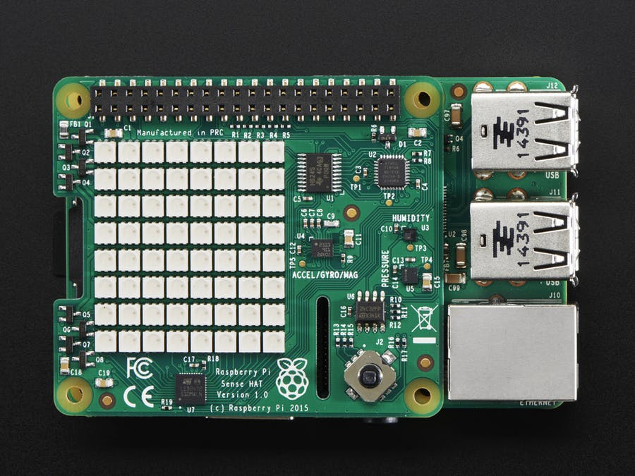

**Figure 3:** Sense HAT female pins connected to Raspberry Pi male pins

> Note: If you haven't installed Raspbian OS on your Raspberry Pi, refer to **Appendix A**.

### 1.2: Power the Raspberry Pi and Establish Internet Connection

Plug into the Raspberry Pi a micro USB (could be phone charger) connector to provide power and ethernet to provide internet access.

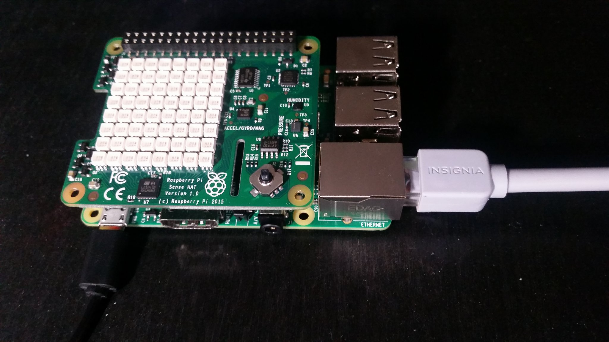

**Figure 4:** Raspberry Pi Ethernet Cable Connected for Internet Access

### 1.3: SSH into the Raspberry Pi

You'll use **Adafruit's Pi Finder** to discover your Raspberry Pi's IP address, so you can access it remotely, this approach works best in a home network.

1\. Download **Adafruit's Pi Finder** for your appropriate OS at [Adafruit-Pi-Finder Latest Releases](https://github.com/adafruit/Adafruit-Pi-Finder/releases/tag/3.0.0)

2\. Open Raspberry **Pi Finder** and **Click Find My Pi!**:


**Figure 5:** Pi Finder GUI

**Pi Finder** - used to detect _Raspberry Pi IP address_ in a home setting

3\. Results include the **IP address**, **SSH User** and **SSH Password** of your Raspberry Pi:


**Figure 6:** Pi Finder Found My Pi

4\. SSH into the Pi from your laptop by pressing the **Terminal** button.

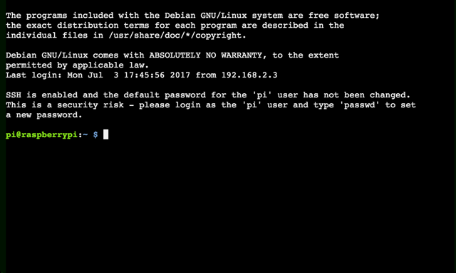

**Figure 7:** Pi Raspbian OS CLI

### 1.4: Install the Sense HAT Software onto Raspberry Pi

Download and install the Sense HAT Software using the following command:

```bash
sudo apt-get update
sudo apt-get install sense-hat
sudo pip3 install pillow
```

Now you have the Sense HAT software library, so you can create a program to retrieve sensor readings, you will utilize it in the next tutorial.

### 1.5: Install MiNiFi Java Agent onto Raspberry Pi

In this section, you install Java 8 and JDK 1.8 onto the Raspberry Pi because it is required to run MiNiFi.

Download and Install Java 8 and JDK1.8:

```bash
sudo apt-get update && sudo apt-get install oracle-java8-jdk
```

> Note: the install will take approximately 10 minutes depending on Raspbian OS resources being used.

1\. Download MiNiFi Java Agent from [Apache nifi minifi Downloads](http://nifi.apache.org/minifi/download.html) under section **Releases -> MiNiFi (Java) -> Binaries**.

2\. Click on **minifi-[latest-version]-bin.zip**, then download MiNiFi from any of the links provided onto your computer.


**Figure 8:** Downloading MiNiFi

3\. Use Pi Finder's **Upload** button to transport MiNiFi application onto your
Raspberry Pi. Select **minifi-[latest-version]-bin.zip** and click **Open**.


**Figure 9:** Uploading MiNiFi to Raspberry Pi

4\. Use the Pi Finder's **Terminal** button to enter the Raspberry Pi and then Unzip the MiNiFi project.

```bash
unzip minifi-[latest-version]-bin.zip
```

A MiNiFi Agent is installed onto the Raspberry Pi. We'll explain more about the MiNiFi Agent in the next tutorial.

### 1.6: Download MiNiFi Toolkit onto your Computer

In this section, you download MiNiFi toolkit onto your computer because it is needed to convert NiFi flow to MiNiFi flow format. In the next tutorial, you will build the MiNiFi flow in NiFi.

1\. Download MiNiFi Toolkit from [Apache nifi minifi Downloads](http://nifi.apache.org/minifi/download.html) under section **Releases -> MiNiFi Toolkit Binaries -> [latest-version] - Compatible with MiNiFi Java [latest-version]**.

2\. Click on **minifi-toolkit-[latest-version]-bin.zip** then download MiNiFi Toolkit from any of the links provided onto your computer.

3\. Go to the location where MiNiFi was downloaded and Unzip MiNiFi Toolkit
using your favorite decompression software:


**Figure 10:** Extracting MiNiFi Toolkit

Now MiNiFi Toolkit is available for use in the next tutorial.

### 1.7: Calibrate Raspberry Pi Timezone

Why is it important to calibrate the timezone on the Raspberry Pi?

In order for your system to have the correct time and date, the timezone needs to be calibrated. An area where this configuration is important is in the next tutorial when you create the Python script that draws timestamp for each sensor readings.

SSH into the Raspberry Pi using Adafruit's Pi Finder **Terminal** button.

1\. Type `sudo raspi-config`

- **raspi-config** is used for changing OS configurations and will be used to recalibrate the current date/time for your timezone


**Figure 11:** raspi-config main menu

2\. Select **4. Internationalisation Options**. Press "Enter" on keyboard.

3\. Select **I2 Change Timezone**.


**Figure 12:** Internationalisation Options Menu

4\. Select your appropriate **Geographic area**.

- Ex: US


**Figure 13:** Geographic area Selection Items

5\. Select your appropriate **Time zone**.

- Ex: Pacific Ocean


**Figure 14:** Time Zone Selection Items

6\. You are brought back to the menu. Select **<Finish>**. Your new calibrated time should display:


**Figure 15:** Time Zone Calibrated

### Step 2: Configure Bridged Adapter Network For VirtuaBox

### VirtualBox User

Open VirtualBox Manager. If your Guest VM is running, it will need to be stopped.

1\. Click the Settings gear.

2\. In the window that opens, navigate to the **Network** tab.

3\. In the **Attached to** field, select from the dropdown menu, **Bridged Adapter**.

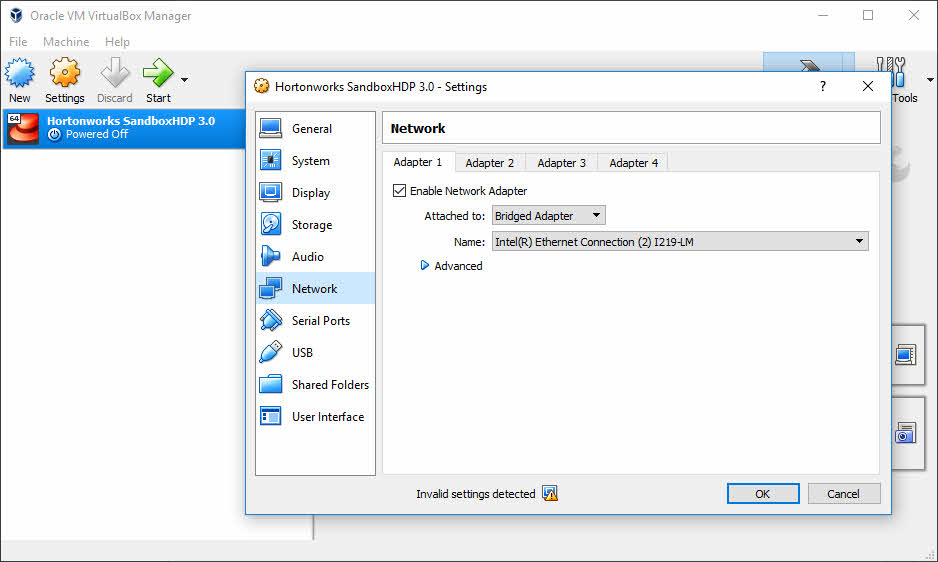

**Figure 16:** Setting VirtualBox Guest VM to Bridged Adapter

> Note: You can keep the default setting for the Name of the Bridged Network.

4\. Make sure in **System** tab that the Base Memory is set to **32GB of RAM**.

Since we are using VirtualBox, both the welcome screen and ssh
that are under both header sections are for VirtualBox. You will see you can
access the web applications from the hostname, ex: **localhost**, or the
explicit **IP address**.


**Figure 17:** VirtualBox Sandbox Welcome

### Step 3: Map Bridged IP to Desired Hostname in hosts file

### Windows User

Click your search bar, type **notepad**, right click on it and select **Run as administrator**. When the popup window appears, click **yes**.

In **notepad**, click **file**, **open...**, navigate path **This PC -> WINDOWS(C:) -> Windows -> System32 -> drivers -> etc** and next to **File name**, click on the dropdown with **Text Documents (*.txt)** and choose **All Files**.

Select **hosts** file and **open** it.


**Figure 18:** hosts file

Copy the line with the current IP address mapped to the sandbox hostnames. Comment out that line. Now paste the line below the commented out line.

Earlier when we turn on the sandbox, we were able to get the IP address from the
virtual machine window.

For example on VirtualBox, the IP address **10.14.2.223** is the one generated for this current session in an office space, but your IP will probably be different.


**Figure 19:** modify hosts file

Save the modified file, **ctrl + s**.

### Mac User

Similar to windows, open the **hosts** file at path **/private/etc/hosts**. Modify the file with your Bridged IP mapped to the sandbox hostnames.

For example, **10.14.2.223** is the VirtualBox IP generated for this current session in an office space, but your IP will be different.

```bash
##
# Host Database
#         
# localhost is used to configure the loopback interface
# when the system is booting.  Do not change this entry.
##       
# 127.0.0.1       localhost sandbox-hdp.hortonworks.com sandbox-hdf.hortonworks.com sandbox-host
10.14.2.223       localhost sandbox.hortonworks.com sandbox-hdp.hortonworks.com sandbox-hdf.hortonworks.com
255.255.255.255 broadcasthost
::1             localhost
```

Save the modified file.

### Linux User

Similar to windows, open the **hosts** file at path **/etc/hosts**. Modify the file with your Bridged IP mapped to the sandbox hostnames.

For example, **10.14.2.223** is the VirtualBox Guest VM IP generated for this current session in an office space, but your IP will be different.

```bash
# File is generated from /sandbox/gen-hosts.sh
# Do not remove the following line, or various programs
# that require network functionality will fail.
127.0.0.1         localhost.localdomain localhost sandbox-hdp.hortonworks.com sandbox-hdf.hortonworks.com sandbox-host
10.14.2.223       localhost sandbox.hortonworks.com sandbox-hdp.hortonworks.com sandbox-hdf.hortonworks.com
```

Save the modified file.

## Step 4: Verify Prerequisites Have Been Covered

**Setup Ambari admin password for "HDF" and "HDP"**

If you need help setting the Ambari admin password,

- for HDP, reference **Admin Password Reset** in [Learning the Ropes of HDP Sandbox](https://hortonworks.com/tutorial/learning-the-ropes-of-the-hortonworks-sandbox/)
- for HDF, reference **Admin Password Reset** in [Learning the Ropes of HDF Sandbox](https://hortonworks.com/tutorial/getting-started-with-hdf-sandbox/)

**Started up all required services for "HDF" and "HDP"**

If unsure, login to Ambari **admin** Dashboard

- for HDF at http://sandbox-hdf.hortonworks.com:8080 and verify **NiFi** starts up, else start it.
- for HDP at http://sandbox-hdp.hortonworks.com:8080 and verify **HDFS**, **HBase** and **Zeppelin** starts up, else start them.

### Step 5: Configure NiFi via HDF's Ambari

1\. Login to Ambari at http://sandbox-hdf.hortonworks.com:8080:

> Note: The user/password is **admin** and the password you set.

You will configure NiFi Site-To-Site protocol by exposing an IP address and a socket port, so external NiFi nodes or MiNiFi agents can connect to NiFi master node.

Head to **Advanced NiFi-Properties** in Ambari Config Settings for NiFi. Update the following configurations similar to the image below:

1\. Enter **NiFi Service** in Ambari Stack

2\. Enter **NiFi Configs**

3\. Filter search for `nifi.remote`

4\. Insert `<your-guest-vm-bridged-ip-address>` in **nifi.remote.input.host**. For example, we inserted `10.14.2.223`.

5\. Verify **nifi.remote.input.http.enabled** checked

6\. Insert `15500` in **nifi.remote.input.socket.port**.

7\. Save the configuration. Write in Notes `Configured NiFi for Socket Site-To-Site`


**Figure 20:** Update NiFi Config for Site-to-Site

Now NiFi is configured for Socket Site-To-Site protocol. If you encounter issues deploying MiNiFi to NiFi flow, it could be because the value **nifi.remote.iput.host** changed or **nifi.remote.input.socket.port** you chose is already being used. Of course there are other reasons for issues, but these two are ones to be mindful of.

> Note: Now that you know where to find the Guest VM Sandbox IP address, set the mapping for it to the hostnames: "[ip-adr] sandbox-hdf.hortonworks.com sandbox-hdp.hortonworks.com". Refer to "[Learning the Ropes of HDP Sandbox](https://hortonworks.com/tutorial/learning-the-ropes-of-the-hortonworks-sandbox/#environment-setup)".

### 5.1: Restart NiFi

Restart NiFi from Ambari with the **orange restart button** for the changes to take effect.

### 5.2: Add GeoLite2 database to HDF Sandbox CentOS

Add the GeoLite2 to HDF Sandbox CentOS, which is a database filled with Public IP Addresses mapped to geographic insights.

1\. Access HDF Web Shell Client at http://sandbox-hdf.hortonworks.com:4200. User/Password is `root/hadoop`.


**Figure 21:** HDF Web Shell

> Note: You will be prompted to change the password if this is your first time logging into the Sandbox.


2\. Create directory for GeoFile. Change permissions of the directory to ensure NiFi has access.

```
mkdir -p /sandbox/tutorial-files/820/nifi/input/GeoFile
chmod 777 -R /sandbox/tutorial-files/820/nifi/
```

3\. Download GeoLite2-City.mmdb to specified location GeoEnrichIP looks:

```
cd /sandbox/tutorial-files/820/nifi/input/GeoFile
wget http://geolite.maxmind.com/download/geoip/database/GeoLite2-City.tar.gz
tar -zxvf GeoLite2-City.tar.gz
```

4\. Get the full pathname to GeoLite2-City.mmdb:

```
cd GeoLite2-City_[date-updated]
ls
pwd
```


**Figure 22:** Path to Geolite DB Lookup Table "GeoLite2-City.mmdb"

Note down the folder name that GeoLite2-City.mmdb is located in on your system. According to the image above, the full pathname is: `/sandbox/tutorial-files/820/nifi/input/GeoFile/GeoLite2-City_20180605/GeoLite2-City.mmdb`

> Note: GeoLite2-City_[date-updated] according to the image above is GeoLite2-City_20170704. However, at the time you download the GeoLite DB file, your [date-updated] will most likely be different than 20170704, so if needed, update the full pathname.

This full pathname will be used in a later tutorial when you extend the NiFi Flow to pull in geographic insights.

## Summary

Congratulations! You know how to setup your own IoT Weather Station using the Raspberry Pi, Sense HAT, MiNiFi, HDF Sandbox and HDP Sandbox. You are also familiar with how to install MiNiFi onto the Raspberry Pi. You also have begun setting up Connected Data Architecture between HDF and HDP SB nodes in a Docker Network. In the next tutorials, you'll focus on data preprocessing, data storing into a noSQL datastore and analyzing the data in real-time as it saves to the datastore.


## Further Reading

- Learn to Install Raspbian OS through the official [Raspberry Pi Software Guide](https://www.raspberrypi.org/learning/software-guide/quickstart/)
- Learn to explore the Pi Finder through [The Adafruit Raspberry Pi Finder Guide](https://learn.adafruit.com/the-adafruit-raspberry-pi-finder/overview)
- Explore the functionality of each pin through [Raspberry Pi Pinout Diagram](http://www.jameco.com/Jameco/workshop/circuitnotes/raspberry_pi_circuit_note_fig2a.jpg)

### Appendix A: Install Raspbian OS onto Raspberry Pi

For users who need help installing Raspbian OS onto their Raspberry Pi, we have provided a step-by-step procedure. First you insert the microSD card into your computer, then download the Raspbian Image OS to your computer. We will walk you through two approaches for creating the bootable Raspbian OS. Approach 1 uses Etcher SD Card Image Utility GUI program whereas Approach 2 uses CLI.

Recommended Hardware:

- [IoT Weather Station Electronics List](http://a.co/8FNMlUu)

### Insert microSD Card into Computer

1\. Connect MicroSD to microSD Adapter.


**Figure 23:** MicroSD on left and microSD Card Adapter on right

2\. Insert the microSD Adapter into the computer.


**Figure 24:** microSD Adapter Inserted into Computer

### Download Raspbian OS Image

3\. Download [Raspbian Jessie Lite OS Image](https://www.raspberrypi.org/downloads/raspbian/) onto your host machine.

4\. Unzip the OS Image.

### Approach 1: Create a Bootable Raspbian OS on microSD Card with Etcher.io

You will create a Raspbian bootable OS on microSD card using etcher.io graphic install wizard instead of the command line.

1\. Download and install Etcher SD card image utility from etcher.io

2\. Use Etcher to transfer the Raspbian image to the location of your SD card. **Select Image** of Raspbian OS from the download location, then **Select Drive** (your microSD Card may already be selected by default) and choose **Flash!** to create a bootable Flash Image on the microSD.

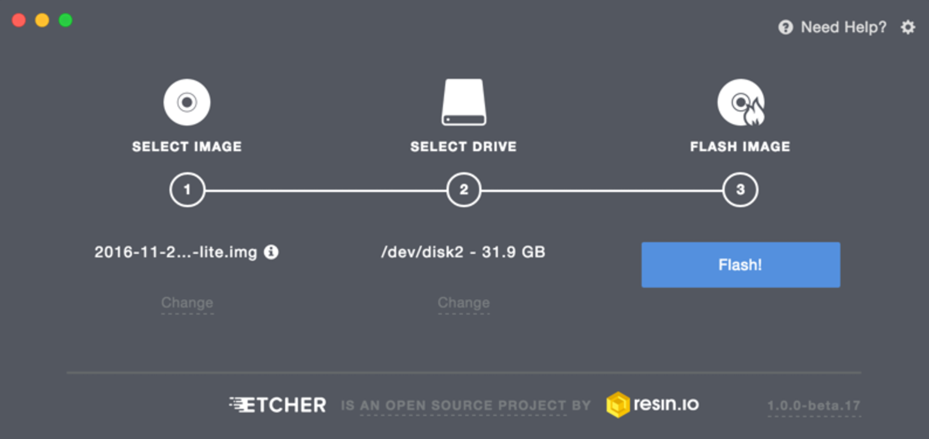

**Figure 25:** Etcher Dashboard to Create a Bootable OS on microSD


**Figure 26:** Flash Complete, Bootable OS Now Created

Once the operation completes, Etcher automatically unmounts the SD card and is safe to eject.

### Approach 2: Create a Bootable Raspbian OS on microSD with CLI (MAC/Linux)

1\. See a list of all devices that are mounted on laptop using command:

```bash
df
```

2\. Note down the device path listed next to the volume, look for the most recent volume added, it'll probably have the path **/Volumes/BOOT** under **Mounted On** column.

3\. Open Disk Utility, select SD card, then press **Unmount**, so we can write to the entire card.


**Figure 27:** MAC Disk Utility to Unmount Device for Writing to it

4\. Head to terminal, in the Downloads folder where the Raspbian OS is located, run the DD command to write a bootable Raspbian OS onto micro SD card:

```
sudo dd bs=1m if=2017-02-16-raspbian-jessie-lite.img of=/dev/rdisk2
```

> Note: Explanation of three arguments used in dd: **bs = block size**, **if = location of raspbian input file**, **of = location of peripheral device output file**. Notice how in the **of=** argument, SD card volume changes from disk2s1 to rdisk2 to ensure the entire SD card is overloaded, not just the partition.

The DD operation will take 1 to 5 minutes until completion.


**Figure 28:** Progress of Creating Bootable OS on microSD

After the dd operation completes, you should see the Raspbian bootable OS successfully transferred over to the SD card.

5\. To setup a headless raspberry pi, ssh can be enabled by placing a file named **ssh** onto the boot partition's base directory, the following is an example of how that would look:

```
boot jmedel$ pwd
boot jmedel$ touch ssh
boot jmedel$ ls
COPYING.linux           bcm2708-rpi-cm.dtb    cmdline.txt   fixup_x.dat   ssh
LICENCE.broadcom        bcm2709-rpi-2-b.dtb   config.txt    issue.txt     start.elf
LICENSE.oracle          bcm2710-rpi-3-b.dtb   fixup.dat     kernel.img    start_cd.elf
bcm2708-rpi-b-plus.dtb  bcm2710-rpi-cm3.dtb   fixup_cd.dat  kernel7.img   start_db.elf
bcm2708-rpi-b.dtb       bootcode.bin          fixup_db.dat  overlays      start_x.elf
```

**Figure 29:** Create SSH file to Enable SSH Access to Raspberry Pi

> Note: the path to the SD card is `/Volumes/boot`. `touch ssh` creates a new file. `ls -ltr` verifies new file was created.

6\. Eject the microSD card Adapter and remove it from your laptop. Insert the microSD card into the micro SD card slot of the Raspberry Pi.


**Figure 30:** MicroSD Inserted into Raspberry Pi

7\. Connect ethernet cable to the Raspberry Pi to give it internet access, connect the 5V for power and the Pi should start up.


**Figure 31:** Raspberry Pi Ethernet Cable Connected for Internet Access

The Pi's default login credentials:

```bash
username/password = pi/raspberry
```

> Note: you will need the password for ssh access to the Raspberry Pi.


---
title: Collect Sense HAT Weather Data via CDA
---

# 3.Collect Sense HAT Weather Data via CDA

## Introduction

You'll learn to create a python program that collects sensor readings from the Raspberry Pi Sense HAT for temperature, humidity and barometric pressure. You'll also run MiNiFi
on top of the Raspberry Pi to ingest the weather readings and route it to the location of
NiFi on HDF sandbox via Site-to-Site protocol. Finally, you'll verify that NiFi can make contact with HDP by storing the data into Hadoop Distributed File System (HDFS).

## Prerequisites

- Deploy IoT Weather Station and Connected Data Architecture

## Outline

- [Step 1: Create a Python Script to Record Sense HAT Weather Data](#step-1-create-a-python-script-to-record-sense-hat-weather-data)
- [Step 2: Build NiFi Flow to Store MiNiFi Data to HDFS](#step-2-build-nifi-flow-to-store-minifi-data-to-hdfs)
- [Step 3: Build MiNiFi Flow to Push Data to NiFi](#step-3-build-minifi-flow-to-push-data-to-nifi)
- [Summary](#summary)
- [Further Reading](#further-reading)
- [Appendix A: Troubleshoot MiNiFi to NiFi Site-to-Site](#appendix-a-troubleshoot-minifi-to-nifi-site-to-site)

### Step 1: Create a Python Script to Record Sense HAT Weather Data

You will learn to create a Python script on the Raspberry Pi that collects
weather readings from the Sense HAT. There are two approaches: **Approach 1**
you learn to implement the Python script step-by-step while **Approach 2** you
download the Python script onto the Raspberry Pi.

### Approach 1: Implement Python Script onto Raspberry Pi

We will explain sections of the code and their significance to the
project in 1.1 - 1.6. In 1.7, the full code for the WeatherStation is provided.

Open the HDF Sandbox Web Shell:

http://sandbox-hdf.hortonworks.com:4200

Create a new file "WeatherStation.py"

```bash
touch WeatherStation.py
vi WeatherStation.py
```

Now you are ready to start adding code to your text file.

### 1.1: Gather Serial Number of Raspberry Pi

Serial number will be used to differentiate each Raspberry Pi Weather Station.

```python
# Attempt to get Raspberry Pi Serial Number
serial = get_serial()
```

The code calls **get_serial()** function and stores the Raspberry Pi's serial
number into variable **serial**..

```python
# Get Raspberry Pi Serial Number
def get_serial():
  # Extract serial from cpuinfo file
  cpuserial = "0000000000000000"
  try:
    f = open('/proc/cpuinfo','r')
    for line in f:
      # Check line characters 0 to 6 match Serial
      if line[0:6]=='Serial':
        # then assign cpuserial with line characters 10 to 26
        cpuserial = line[10:26]
      # loop to next line in cpuinfo file object f
    f.close()
  except:
    cpuserial = "ERROR000000000"
  return cpuserial
```

The **get_serial()** then searches the `/proc/cpuinfo` file for the word
**Serial**. Once that word is found, the cpu's serial number is stored into
variable **cpuserial**.

### 1.2: Gather Timestamp for Sensor Reading

Timestamp tells the time when the sensor readings were taken.

```python
# Get Current Time Preferred by OS
timestamp = get_time()
```

The code above calls the **get_time()** function and stores the current date
time into the variable **timestamp**.

```python
# Get Current Time Preferred by OS
def get_time():
  current_time = datetime.datetime.now().strftime("%Y-%m-%dT%H:%M:%SZ")
  return current_time
```

Inside the **get_time()** function, **datetime.datetime.now()** retrieves the current date and time preferred by the OS,
then **strftime("%Y-%m-%dT%H:%M:%SZ")** formats the date time by year, month,
day, separated by character 'T' to indicate time of date in hours, minutes,
and seconds. This formatted data and time value is returned to **current_time**
as a string.

### 1.3: Gather Weather Readings from Sense HAT

Temperature, humidity and barometric pressure are retrieved from the Sense HAT.
**sense.get_temperature** grabs a temperature reading and stores it into the **temp_c** variable.

```python
# Attempt to get sensor reading.
temp_c = sense.get_temperature()
humidity_prh = sense.get_humidity()
humidity_prh = round(humidity_prh, 2)
pressure_mb = sense.get_pressure()
pressure_mb = round(pressure_mb, 2)
```

### 1.4: Try to Calibrate Sense HAT Temperature Sensor Readings

The Sense HAT Temperature Sensor readings is off from actual temperature due to
the Raspberry Pi's CPU emitting heat around the Sense HAT. The Raspberry Pi's
CPU temperature emits 55.8 Celsius (132.44 Fahrenheit). Thus, for us to be
able to gather useful data from the temperature sensor, we must try to calibrate
the sensor.

```python
# Get Raspberry Pi CPU Core Temperature
cpu_temp_c = get_cpu_temp_c()

# Calibrate Sense HAT Temperature Sensor Reading
temp_c = calibrate_temp_c(cpu_temp_c, temp_c)
temp_c = round(temp_c, 2)
```

In the code above, **get_cpu_temp_c()** function is called to acquire cpu
temperature, then that result is stored into the **cpu_temp_c** variable.

**temp_c** variable is overwritten with the calibrated Sense HAT temperature
reading by calling the **calibrate_temp_c(cpu_temp_c, temp_c)** function.

```python
# Get Raspberry Pi CPU Core Temperature via "vcgencmd" shell command
def get_cpu_temp_c():
  cpu_temp = subprocess.check_output("vcgencmd measure_temp", shell=True)
  # Break up a String and add the data to string array using separator "="
  array = cpu_temp.split("=")
  array2 = array[1].split("'")
  # Grab temperature value from array2 element 0
  cpu_tempc = float(array2[0])
  cpu_tempc = float("{0:.2f}".format(cpu_tempc))
  return cpu_tempc

# Sense HAT Temperature Readings are off due to CPU's temperature heat
# Calibrate temperature reading by using scaling factor: 5.466
# The scaling factor is the amount of degrees the
# Sense HAT is off by from actual temperature
def calibrate_temp_c(cpu_tempc, temp_c):
  temp_c - ((cpu_tempc - temp_c)/5.466)
  return temp_c
```

**get_cpu_temp_c()** function stores the CPU temperature output of
Raspberry Pi shell command "vcgencmd measure_temp" into **cpu_temp** variable.
Since this shell command outputs CPU temperature in form such as "temp=50.5'C",
two array variables (**array**, **array2**) are used to break up the string and
retrieve just the CPU temperature value, such as "50.5". A value is returned
anytime a user calls on this function.

**calibrate_temp_c(cpu_temp_c, temp_c)** takes as parameters: cpu_temp_c and
temp_c, then calculates a more accurate Sense HAT temperature reading while
taking into account the scaling factor: 5.466. The scaling factor is the amount of
degrees the Sense HAT is off by compared to actual temperature in a particular
location. Keep in mind the Sense HAT Temperature will probably still be off
compared to actual temperature because the Sense HAT is still physically close
to CPU heat.

If you're interested in knowing more about calculating the scaling factor,
read the following paragraph, else move to 1.5.

The scaling factor value, such as 5.466, can be retrieved by recording actual
temperature readings (ex: DHT22 sensor) multiple times in a 24 hour period.
In parallel, you would also record temperature readings from the Sense HAT.
Then you would take all your recordings of the actual temperature, find the
average and subtract it from the average recordings of Sense HAT temperature
readings. The scaling factor result should reveal the amount of degrees the
Sense HAT is off by compared to actual temperature.

### 1.5: Gather Public IP Address of Raspberry Pi

The Public IP address of the Raspberry Pi can be used to determine geographic
insights, such as the city and state in which that node is logging weather data.

The code extracts the Public IP address via rest call to IPIFY and then parses
the JSON for **ip** value.

```python
# Attempt to get Public IP
public_ip = get_public_ip()
```

The code above calls the **get_public_ip()** function and stores the Raspberry
Pi's Public IP address into **ip** variable.

```python
# Get Raspberry Pi Public IP via IPIFY Rest Call
def get_public_ip():
  ip = json.load(urllib2.urlopen('https://api.ipify.org/?format=json'))['ip']
  return ip
```

Inside the **get_public_ip()**,
**urllib2.urlopen('https://api.ipify.org/?format=json')** opens the url of
IPIFY HTTP request, which returns the Raspberry Pi's Public IP address in JSON
format as a file-like object. **json.load()** reads the data from the file-like
object, then **['ip']** attached to the end of **json.load()** is a JSONPath
Expression used to extract the ip address value and store it into **ip**
variable. Anytime the user calls **get_public_ip()**, they retrieve the Public
IP address of their Raspberry Pi.


### 1.6: Print Weather Attribute Values to Screen

With print statements, the variable values can be outputted to standard output and displayed on the screen:

```python
print "Serial = " + str(serial)
print "Time = \"" + str(timestamp) + "\""
print "Temperature_F = " + str(temp_f)
print "Humidity_PRH = " + str(humidity_prh)
print "Pressure_In = " + str(pressure_in)
print "Public_IP = " + str(public_ip)
```

### 1.7: Write Python WeatherStation.py Program (Full Code Available)

When "WeatherStation.py" is executed, it outputs weather sensor data for temperature, humidity and pressure to standard output in the console. Additionally, the Raspberry Pi weather station serial number, Public IP address and time of sensor reading are outputted to standard output. We will not use the Sense HAT 8x8 RGB LED Matrix to display the sensor readings.

1\. Open Raspberry Pi Terminal using Pi Finder **Terminal** button.

2\. Create a new file with name `WeatherStation.py`

3\. Type the following code into your favorite text editor.

4\. Save the file.

```Python
#!/usr/bin/python

# libraries
import json
import sys
import time
import datetime
import urllib2
import subprocess
from sense_hat import SenseHat

# Get Raspberry Pi Serial Number
def get_serial():
  # Extract serial from cpuinfo file
  cpuserial = "0000000000000000"
  try:
    f = open('/proc/cpuinfo','r')
    for line in f:
      # Check line characters 0 to 6 match Serial
      if line[0:6]=='Serial':
        # then assign cpuserial with line characters 10 to 26
        cpuserial = line[10:26]
      # loop to next line in cpuinfo file object f
    f.close()
  except:
    cpuserial = "ERROR000000000"
  return cpuserial

# Get Current Time Preferred by OS
def get_time():
  # Assign datetime in format year-month-day-T-hours-min-sec
  current_time = datetime.datetime.now().strftime("%Y-%m-%dT%H:%M:%SZ")
  return current_time

# Get Raspberry Pi Public IP via IPIFY Rest Call
def get_public_ip():
  ip = json.load(urllib2.urlopen('https://api.ipify.org/?format=json'))['ip']
  return ip

# Get Raspberry Pi CPU Core Temperature via "vcgencmd" shell command
def get_cpu_temp_c():
  cpu_temp = subprocess.check_output("vcgencmd measure_temp", shell=True)
  # Break up a String and add the data to string array using separator "="
  array = cpu_temp.split("=")
  array2 = array[1].split("'")
  # Grab temperature value from array2 element 0
  cpu_tempc = float(array2[0])
  cpu_tempc = float("{0:.2f}".format(cpu_tempc))
  return cpu_tempc

# Sense HAT Temperature Readings are off due to CPU's temperature heat
# Calibrate temperature reading by using scaling factor: 5.466
# The scaling factor is the amount of degrees the
# Sense HAT is off by from actual temperature
def calibrate_temp_c(cpu_tempc, temp_c):
  temp_c - ((cpu_tempc - temp_c)/5.466)
  return temp_c

# Convert Temperature Celsius to Fahrenheit
def convert_c_to_f(temp_c):
  temp_f = temp_c * 9.0 / 5.0 + 32.0
  return temp_f

# Convert Pressure Millibars to Inches
def convert_mb_to_in(pressure_mb):
  pressure_in = 0.0295301*(pressure_mb)
  return pressure_in

def main():
  # Initialize SenseHat
  sense = SenseHat()
  sense.clear()
  print 'Weather Logs'

  # Get Raspberry Pi Serial Number
  serial = get_serial()

  # Get Current Time Preferred by OS
  timestamp = get_time()

  # Get Weather Readings from Environmental Sensors
  temp_c = sense.get_temperature()
  humidity_prh = sense.get_humidity()
  humidity_prh = round(humidity_prh, 2)
  pressure_mb = sense.get_pressure()
  pressure_mb = round(pressure_mb, 2)

  # Get Raspberry Pi CPU Core Temperature
  cpu_temp_c = get_cpu_temp_c()

  # Calibrate Sense HAT Temperature Sensor Reading
  temp_c = calibrate_temp_c(cpu_temp_c, temp_c)
  temp_c = round(temp_c, 2)

  # Convert Temperature to Fahrenheit and Pressure to Inches
  temp_f = convert_c_to_f(temp_c)
  temp_f = round(temp_f, 2)
  pressure_in = convert_mb_to_in(pressure_mb)
  pressure_in = round(pressure_in, 2)

  # Get Public IP
  public_ip = get_public_ip()

  # 8x8 RGB
  #sense.clear()
  #info = 'Temperature (C): ' + str(temp) + 'Humidity: ' + str(humidity) + 'Pressure: ' + str(pressure)
  #sense.show_message(info, text_colour=[255, 0, 0])

  # Print Weather Data
  print "Serial = " + str(serial)
  print "Time = \"" + str(timestamp) + "\""
  print "Temperature_F = " + str(temp_f)
  print "Humidity_PRH = " + str(humidity_prh)
  print "Pressure_In = " + str(pressure_in)
  print "Public_IP = " + str(public_ip)

if __name__ == "__main__":
  main()
```

### Approach 2: Download Python Script onto Raspberry Pi

We provide a download link to the WeatherStation.py.

### Download Python weather-station.py

1\. Download the [WeatherStation.py script](assets/WeatherStation.py) on your computer.

2\. Upload **WeatherStation.py** to your Raspberry Pi using Pi Finder's **Upload** button.

### Step 2: Build NiFi Flow to Store MiNiFi Data to HDFS

### 2.1: Build NiFi to HDFS

In this section, you will build a NiFi flow on HDF Sandbox node to transport data ingested from MiNiFi node to HDFS on HDP Sandbox node.

1\. Navigate to NiFi UI at http://sandbox-hdf.hortonworks.com:9090/nifi/

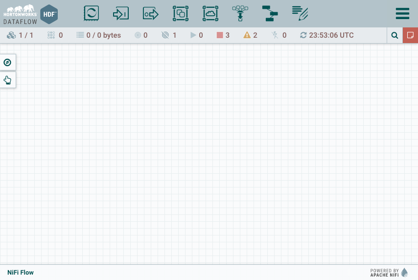

**Figure 1:** NiFi UI Canvas

> Note: If NiFi canvas has a pre-existing flow, delete it and we will build a completely different flow.

2\. In NiFi, add an Input Port  onto the canvas and name it `From_MiNiFi`.


**Figure 2:** Input Port "From_MiNiFi" NiFi listens on for incoming data

3\. Add a **PutHDFS** processor  onto the canvas. Right click on the **PutHDFS** processor to configure its properties by adding the properties specified in **Table 1**:

**Table 1: PutHDFS Property Values**

| Property | Value    |
| :------------- | :------------- |
| Hadoop Configuration Files     | `/etc/hadoop/conf/core-site.xml`  |
| Directory     | `/sandbox/tutorial-files/820/nifi/output/raw-data`  |


**Figure 3:** PutHDFS Properties Tab

**Note:** Open HDP Web Shell Client at http://sandbox-hdp.hortonworks.com:4200. Create the HDFS directory specified in the Properties table above.

```bash
sudo -u hdfs hdfs dfs -mkdir -p /sandbox/tutorial-files/820/nifi/output/raw-data
sudo -u hdfs hdfs dfs -chmod -R 777 /sandbox/tutorial-files/820/nifi/output/raw-data
```

In the **Settings** tab, under Automatically Terminate Relationships, check the **failure** and **success** boxes. This relationship will delete flow files whether or not they have been successfully written to HDFS to clean up extra data once it reaches the end of the flow.

 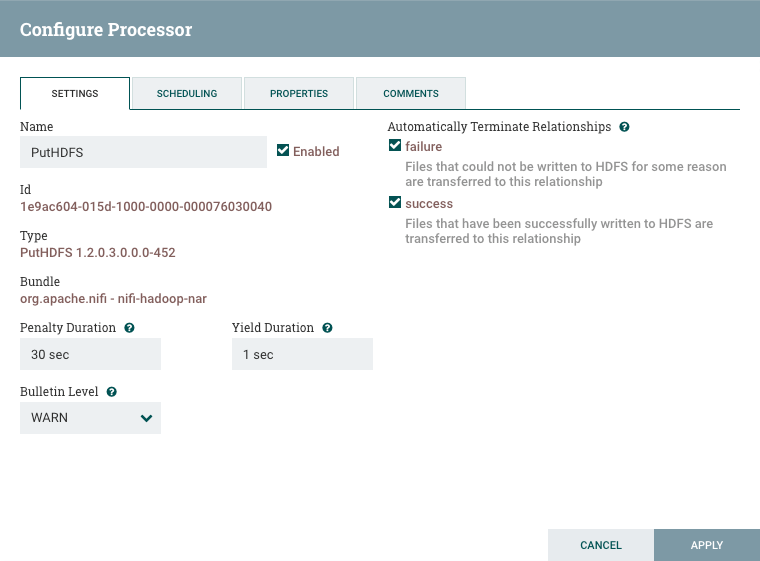

**Figure 4:** PutHDFS Settings Tab

Then click **Apply** to set the change.

4\. Hover over the input port **From_MiNiFi**, an arrow will appear, click on the port and drag to make the connection to **PutHDFS**. A red dotted line will appear and once the mouse is hovering over the PutHDFS processor it will turn green, release the mouse to establish the connection. Then click **ADD**.


**Figure 5:** From_MiNiFi connection to PutHDFS transfers data from edge to HDF to HDP

Now you will build the MiNiFi flow in NiFi.

### Step 3: Build MiNiFi Flow to Push Data to NiFi

You'll build the MiNiFi flow using NiFi, then use MiNiFi toolkit to transform NiFi
flow into a MiNiFi flow. Then you will upload the MiNiFi flow to the Raspberry
Pi using Adafruit's Pi Finder Upload feature. The MiNiFi flow will be collecting
data from the Sense HAT sensor running on the Raspberry Pi.

### 3.1: Build MiNiFi Flow Using NiFi

1\. Drag the Process Group icon  onto the NiFi canvas and name the Process Group: `MiNiFi_WeatherStation`. Click **ADD**.


**Figure 6:** Process Group for MiNiFi dataflow

2\. Double click to enter this new Process Group. Add the **ExecuteProcess** processor onto the NiFi canvas.


**Figure 7:** ExecuteProcess processor runs linux commands

- **ExecuteProcess**: Executes the WeatherStation.py Python Script to bring the raw sensor data into MiNiFi every 5 seconds.

3\. Configure the properties in ExecuteProcess's Property Tab by adding the properties listed in **Table 2**:

**Table 2: ExecuteProcess Property Values**

| Property | Value    |
| :------------- | :------------- |
| Command      | `python`       |
| Command Arguments     | `/home/pi/WeatherStation.py`       |
| Batch Duration     | `5 sec`       |


**Figure 8:** ExecuteProcess Properties Tab

Under the Schedule tab, set **Run Schedule** to `1 sec`, so the task runs for that specific time.

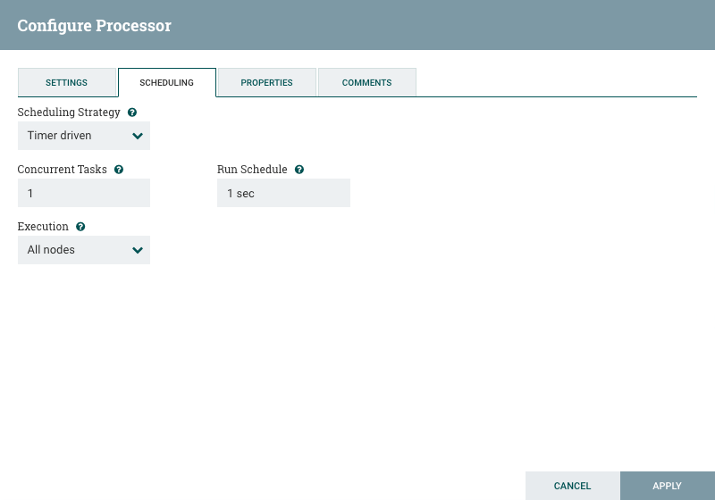

**Figure 9:** ExecuteProcess Schedule Tab

Under the Settings tab, check **Success** box.

Click **Apply**.

4\. Add the **Remote Process Group (RPG)** onto the canvas.

- Remote Process Group (RPG): sends sensor data from one computer (Raspberry Pi) to a remote NiFi instance running on a different computer (HDF Sandbox node)

5\. Configure the properties in RPG's Property Tab by adding the properties listed in **Table 3**:

**Table 3: RPG Property Values**

| Property | Value    |
| :------------- | :------------- |
| URLs     | `http://[host machine ip address]:9090/nifi/`       |

- URLs: MiNiFi uses this value to connect to the location of the remote NiFi instance.

> Note: `[host machine ip address]` for linux/mac, can be found with the terminal command: `ifconfig | grep inet`. For Windows, use the command prompt command as an administrator: `ipconfig`, then under "Wireless LAN adapter Wi-Fi," retrieve the value from "IPv4 Address".


**Figure 10:** Remote Process Group Configuration URL

Click **ADD**.

6\. RPG connects MiNiFi to NiFi by referencing the name of NiFi's input port. Connect the **ExecuteProcess** processor to **RPG**, you will then be asked which input port to connect to, choose **From_MiNiFi**. Click **ADD**.


**Figure 11:** Remote Process Group MiNiFi connection to Remote NiFi Node

### 3.2: Save MiNiFi Flow as a NiFi Template

1\. Now that the flow is built for MiNiFi, go to the Operate Palette. Select the  **Save Template Icon**  Name the new flow: `weather-station-node-sj`.


**Figure 12:** Create Name for NiFi template used for MiNiFi

2\. In the top right corner, open the **Global Menu** , select **Templates**. Choose to download `weather-station-node-sj` by selecting the Download icon. download the template file.

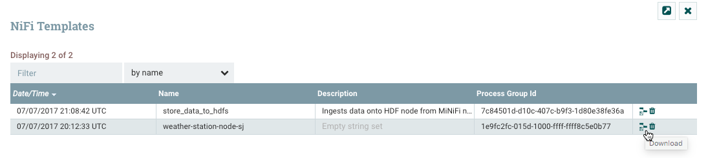

**Figure 13:** Download NiFi template used as MiNiFi flow conversion

### 3.3: Convert NiFi Template to MiNiFi Template

You will use the MiNiFi Toolkit to convert the NiFi flow to a MiNiFi flow.

1\. Go to the location where you downloaded MiNiFi Toolkit Converter. Use the command to convert NiFi xml template to MiNiFi yml template:

### MiNiFi Toolkit Steps for Mac Users

```bash
cd ~/path/to/minifi-toolkit-0.5.0/
./minifi-toolkit-0.5.0/bin/config.sh transform weather-station-node-sj.xml config.yml
```

2\. Validate that there are no issues with the new MiNiFi file:

```bash
./minifi-toolkit-0.5.0/bin/config.sh validate config.yml
```

### MiNiFi Toolkit Steps for Windows Users

Open Windows Power Shell:

```bash
cd .\Downloads\
cd .\minifi-toolkit-0.5.0-bin\
.\minifi-toolkit-0.5.0\bin\config.bat transform ..\weather-station-node-sj.xml config.yml
```

Validate there are no issues with the new MiNifi file:

```bash
.\minifi-toolkit-0.5.0\bin\config.bat validate .\config.yml
```

> Note: You should receive "no errors were found" while parsing the configuration file.

3\. Open **Pi Finder** and use **Upload** button.
Transport the **config.yml** file from your host machine to your Raspberry Pi.

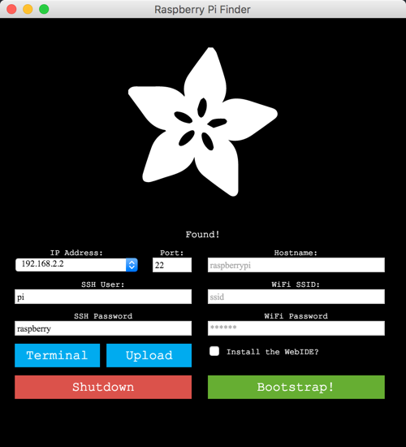

**Figure 14:** Pi Finder Information on Rasbperry Pi on same network


**Figure 15:** Upload MiNiFi config.yml to appropriate MiNiFi directory on Rasbperry Pi

> Note: Windows users, navigate to the directory similar to .\Downloads\minifi-toolkit-0.5.0-bin\ and you should find the config.yml to send to the Raspberry Pi.

4\. Press the **Terminal** button on **Pi Finder**:

5\. Write the following command to move **config.yml** to MiNiFi conf folder and
replace the default config.yml.

```bash
# Replace default config.yml with new config.yml on Raspberry Pi
mv config.yml /home/pi/minifi-[version num]/conf/config.yml
```

> Ex command: mv config.yml /home/pi/minifi-0.2.0/conf/config.yml

6\. In MiNiFi **bin** directory on Raspberry Pi, start MiNiFi program with the command:

```bash
cd minifi-[version num]
./bin/minifi.sh start
```

7\. Navigate back to the NiFi UI, go back into the NiFi Flow level by clicking on NiFi Flow in the bottom left corner.


**Figure 16:** NiFi Flow breadcrumb

8\. Hold shift and hover the mouse over the **From_MiNFi to PutHDFS** flow you built in step 2, then it should be highlighted.


**Figure 17:** shift + pressed mouse + hover over entire NiFi flow


**Figure 18:** NiFi flow selected

 From the Operate Palete, click on the . You should see the MiNiFi data is being received by way of the NiFi input port and that data is being routed to HDFS on HDP.

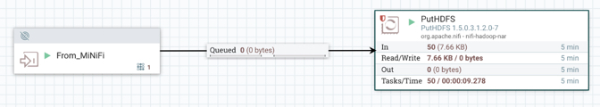

**Figure 19:** NiFi flow activated

### 3.4: Check PutHDFS Status with Data Provenance

1\. Right click on **PutHDFS**, select **Data Provenance**.


**Figure 20:** List Provenance Events of each flowfile

List of all actions occurring on the FlowFiles. As you can see there are FlowFiles being dropped, attributes modified and sent to HDFS. For the FlowFiles sent to HDFS, as far as NiFi running on HDF knows, those FlowFiles are successfully stored into HDFS.

2\. View a random Provenance Event using the view icon . A **Provenance Event Window** will appear, click on the **Content** tab. Select **View** to see the flowfile content:


**Figure 21:** Content of a flowfile from a Provenance Event

### 3.5: Check Data is Stored into HDFS via HDP Files View

1\. Login to Ambari UI at http://sandbox-hdp.hortonworks.com:8080

> Note: user/password is maria_dev/maria_dev

2\. Hover over Ambari Views, choose **Files View**


**Figure 22:** Selecting Files View

3\. Check that path `/sandbox/tutorial-files/820/nifi/output/raw-data` is populated with data.

4\. Select a random file, click **Open**. After a couple seconds the file will load:


**Figure 23:** Viewing Contents of an HDFS file

### Summary

Congratulations! You just learned how to build dataflows for MiNiFi through using NiFi. Additionally, you also built a flow that transports the weather edge node data from MiNiFi to NiFi on HDF to HDFS on HDP using Connected Data Architecture (CDA). Now you have the fundamental knowledge on how to transport data between systems using CDA.

### Further Reading

- Read more about the Sense HAT Functions from [Sense HAT API Reference](https://pythonhosted.org/sense-hat/api/)
- Read more about the SenseHAT Class Methods available in [sense_hat.py](https://github.com/RPi-Distro/python-sense-hat/blob/master/sense_hat/sense_hat.py)
- Read more about the Apache MiNiFi Project [minifi docs](https://nifi.apache.org/minifi/)

### Appendix A: Troubleshoot MiNiFi to NiFi Site-to-Site

### A.1: Check MiNiFi Logs

If you do not see data flowing into NiFi, the first place to check is the MiNiFi logs.

1\. From your Raspberry Pi, navigate to the MiNiFi **logs** directory and open the **minifi-app.log**:

```bash
cd minifi-0.4.0/logs
less minifi-app.log
```

**WARNS, ERRORS, exception** in the logs usually indicate the specific problem related to your dataflow.


---
title: Populate HDP HBase with HDF NiFi Flow
---

# 4.Populate HDP HBase with HDF NiFi Flow

## Introduction

In the previous tutorial, you transported raw sensor data from MiNiFi to HDF NiFi to HDP HDFS. Now you'll further enrich the NiFi flow by adding geographic location attributes to the dataset. You'll then convert the data to JSON format for storing into HBase.

## Prerequisites

- Deploy IoT Weather Station and Connected Data Architecture
- Collect Sense HAT Weather Data via CDA

## Outline

- [Step 1: Create HBase Table](#step-1-create-hbase-table)
- [Step 2: Enhance NiFi Flow to Store Geo Data to HBase](#step-2-enhance-nifi-flow-to-store-geo-data-to-hbase)
- [Step 3: Verify HBase Table Populated](#step-3-verify-hbase-table-populated)
- [Summary](#summary)
- [Further Readings](#further-reading-4)

### Step 1: Create HBase Table

Create the "sense_hat_logs" table

1\. Access HDP Sandbox shell using Web Shell Client at http://sandbox-hdp.hortonworks.com:4200.

> Note: user/password is root and whatever string you set your password to.

2\. Open HBase Shell:

```bash
hbase shell
```

3\. Create HBase Table:

```bash
create 'sense_hat_logs','weather'
```

> Note: table name is 'sense_hat_logs' and column family is 'weather'

Now NiFi will have a place to store the sensor data.

### Step 2: Enhance NiFi Flow to Store Geo Data to HBase

In this section, you will download and import a prebuilt NiFi DataFlow template
to NiFi, but you will need to make some modifications to it. The template is called **WeatherDataMiNiFiToHBase**. You will go through
step-by-step each component within the NiFi flow to see how the flow was built.


1\. Download the [WeatherDataMiNiFiToHbase.xml](assets/tutorial4/WeatherDataMiNiFiToHbase.xml) template file onto your computer.

2\. Head to NiFi UI at http://sandbox-hdf.hortonworks.com:9090/nifi.

3\. Use the template icon  located in the Operate Palette.

3\. **Browse**, find the template file, click **Open** and hit **Import**.

4\. From the **Components Toolbar**, drag the template icon  onto the graph and select the **WeatherDataMiNiFiToHBase** template file.

5\. Remove the queue between **Copy of From_MiNiFi** and **PreProcessDataForHBaseAndHadoop** by right clicking on the queue, then select **Delete**.

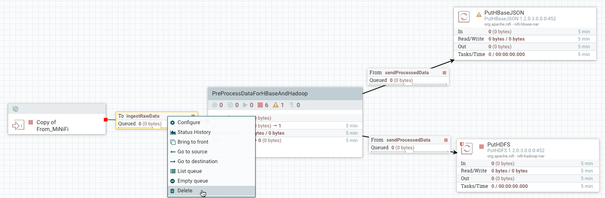

**Figure 1:** Removing Queue and then Input Port

6\. Remove **Copy of From_MiNiFi** input port by right clicking on it, select **Delete**.

7\. Connect **From_MiNiFi** input port to **PreProcessDataForHBaseAndHadoop** Process Group. When the **Create Connection** window appears, select **ADD**.


**Figure 2:** Connected From_MiNiFi input port to Process Group

8\. Enter into **PreProcessDataForHBaseAndHadoop** Process Group by double clicking on it.


**Figure 3:** Examining the processors inside the Process Group

9\. We will need to re-configure the GeoEnrichIP processor. It currently has the **wrong folder path** to the GeoLite Database File.

Get the full pathname to GeoLite DB acquired in **Deploy IoT Weather Station via Connected Data Architecture tutorial** section **3.4: Add GeoLite2 database to HDF Sandbox CentOS**. Update **MaxMind Database File** with `/sandbox/tutorial-files/820/nifi/input/GeoFile/GeoLite2-City_[date-updated]/GeoLite2-City.mmdb` where [date-updated] is the latest date when the GeoLite database file was updated.


**Figure 4:** Specified full path to GeoLit2-City.mmdb

Updated Configuration with Correct Folder Path

Click on the NiFi Flow breadcrumb in the bottom left corner to go back to the root level.


**Figure 5:** NiFi flow breadcrumb

10\. Configure HBase Client Service for **PutHBaseJSON**. Right click on **PutHBaseJSON**, select **Configure**. Head to the **Properties** tab. Click on the **arrow**
to go to the current HBase Client Service configuration, you will enable it.


**Figure 6:** Heading to HBase Client Service from PutHBaseJSON

11\. Enable the HBase Client Service, click on the lighting bolt symbol.


**Figure 7:** Enabling HBase Client Service

12\. An **Enable Controller Service** window appears, click on the **ENABLE**
button.


**Figure 8:** Window to Enable HBase Client Service

Once the HBase Client Service is enabled as in the image below:


**Figure 9:** HBase Client Service Enabled

Click on the **X** button in the top right corner. We will walkthrough the GeoEnriched NiFi flow, then start the portion that just connected to the input port.

13\. Analyze the enhanced GeoEnriched NiFi flow:

- **Input Port**: **From_MiNiFi** ingests sensor data from MiNiFi agent running on the Raspberry Pi. This port name must match the name specified by the input port relationship attribute on the MiNiFi remote process group, else NiFi won’t receive data from MiNiFi. **From_MiNiFi** sends raw weather data to an HDFS folder and to **PreProcessDataForHBaseAndHadoop** Process Group.

- **PutHDFS**: the first PutHDFS processor directory connected to **From_MiNiFi** stores raw weather data into HDP HDFS folder `/sandbox/tutorial-files/820/nifi/output/raw-data`.

| Property | Value    |
| :-------------: | :-------------: |
| Hadoop Configuration Resources | `/etc/hadoop/conf/core-site.xml` |
| Directory | `/sandbox/tutorial-files/820/nifi/output/raw-data` |

- **PreProcessDataForHBaseAndHadoop**: process group is comprised of multiple components (processors, ports, etc) that preprocess the data. An input port(ingestRawData), ExtractText, GeoEnrichIP, RouteOnAttribute, AttributesToJSON, UpdateAttribute, output port(sendProcessedData).

| Components | Description    |
| :-------------: | :-------------: |
| Input Port | IngestRawData port pulls in data from external NiFi level (NiFi Flow) |
| ExtractText | Uses regex expressions to extract weather data values  |
| GeoEnrichIP | Adds Geographic Insights to the flow from an IP address |
| RouteOnAttribute | Routes data if Geo Insights and Weather Readings are valid |
| AttributesToJSON | Takes data and converts the format to JSON |
| UpdateAttribute | Updates every data filename with a unique name |
| Output Port | sendProcessedData outputs data back out to external NiFi level (NiFi Flow) |

- **ExtractText**: Extracts values from text using java regex expression and stores those values into attributes. Sends the data to the rest of the flow only when the regex expressions have matches. **Include Capture Group 0** set to false ensures each regular expression only has a single group to avoid duplicate values with **<attribute-name>.0**.

| Property | Value    |
| :-------------: | :-------------: |
| Include Capture Group 0 | `false`    |
| Humidity | `(?<=Humidity_PRH = )([\w+.-]+)`    |
| Pressure_In     | `(?<=Pressure_In = )([\w+.-]+)`      |
| Public_IP     | `(?<=Public_IP = )([\w+.-]+)`      |
| Serial | `(?<=Serial = )([\w+.-]+)`    |
| Temp_F     | `(?<=Temperature_F = )([\w+.-]+)`      |
| Timestamp     | `(?<=")([^\"]+)`      |


- **GeoEnrichIP**: Takes Public IP from the Raspberry Pi and creates geographic attributes for Latitude, Longitude, City, Country, State (IP.geo.latitude, IP.ge.longitude, IP.geo.city, IP.geo.country and IP.geo.subdivision.isocode.N). GeLite2-City_[date-updated], date-updated represents the last date the database was updated. We changed the path earlier
since every time the GeoLite databases is downloaded the folder name changes.

| Property | Value    |
| :-------------: | :-------------: |
| MaxMind Database File     | `/sandbox/tutorial-files/820/nifi/input/GeoFile/GeoLite2-City_[date-version]/GeoLite2-City.mmdb`      |
| IP Address Attribute     | `Public_IP`      |

> Ex: MaxMind Database File = /sandbox/tutorial-files/820/nifi/input/GeoFile/GeoLite2-City_20170704/GeoLite2-City.mmdb

- **RouteOnAttribute**: Uses NiFi expression language (similar to Java expression language) to route the Attributes to remaining DataFlow based on weather data attributes are within range of an appropriate weather data criteria, such as Pressure standard range being between 1080 and 870.

Here is the NiFi Expressions used to establish the conditions for each FlowFile to move onto the remaining processors:

| Property | Value    |
| :-------------: | :-------------: |
| Check_City     | `${Public_IP.geo.city:isEmpty():not()}`      |
| Check_IP     | `${Public_IP:isEmpty():not()}`      |
| Check_Pressure     | `${Pressure_In:lt(32):and(${Pressure_In:gt(26)})}`      |
| Check_Serial     | `${Serial:isEmpty():not()}`      |
| Check_State     | `${Public_IP.geo.subdivision.isocode.0:isEmpty():not()}`      |
| Check_Temp     | `${Temp_F:lt(190.4)}`      |
| Check_Time     | `${Time:isEmpty():not():and(${Timestamp:isEmpty():not()})}`      |


- **AttributesToJson**: Takes the attributes names and values, then represents them in JSON format

| Property | Value    |
| :-------------: | :-------------: |
| **Attributes List**     | `Time, Timestamp, Public_IP.geo.city, Public_IP.geo.subdivision.isocode.0, Serial, Temp_F, Humidity, Pressure_In`      |


- **UpdateAttribute**: Modifies each flowfile filename to be different.


| Property | Value    |
| :-------------: | :-------------: |
| **Filename**     | `weatherdata-${now():format("yyyy-MM-dd-HHmmssSSS")}-${UUID()}.json`      |

- **Output Port**: sendProcessedData outputs data to external NiFi level (NiFi Flow), which gets routed to PutHBaseJSON and another PutHDFS processor.

- **PutHBaseJSON**: Stores the GeoEnriched Data a row at a time into HBase table ‘sense_hat_logs’ rows.

| Property | Value    |
| :-------------: | :-------------: |
| **Hbase Client Service**     | **HBase_1_1_2_ClientService**       |
| **Table Name**     | **sense_hat_logs**       |
| Row Identifier Field Name     | Timestamp       |
| Row Identifier Encoding Strategy     | String       |
| **Column Family**     | **weather**       |
| **Batch Size**     | **25**       |
| **Complex Field Strategy**     | **Text**       |
| **Field Encoding Strategy**     | **String**       |

- **PutHDFS**: Stores the GeoEnriched Data into HDP HDFS folder `/sandbox/tutorial-files/820/nifi/output/geoenriched-data`.

| Property | Value    |
| :-------------: | :-------------: |
| Hadoop Configuration Resources | `/etc/hadoop/conf/core-site.xml` |
| Directory | `/sandbox/tutorial-files/820/nifi/output/geoenriched-data` |

14\. Hold shift, press on your mouse and hover over PreProcessDataForHBaseAndHadoop Process Group, PutHBaseJSON and PutHDFS then release the mouse. These three components should be highlighted.

15\. Press the **start** button  to activate this section of the flow.


**Figure 10:** Started NiFi flow

### Step 3: Verify HBase Table Populated

1\. Navigate back to HDP Web Shell Client at http://sandbox-hdp.hortonworks.com:4200

> Note: user/password is root and whatever string you set your password to.

If the HBase shell is closed, Open it:

```bash
hbase shell
```

2\. Use the HBase **scan** command to see if table has data:

```bash
scan 'sense_hat_logs'
```

3\. The table should be filled with Weather Data:


**Figure 11:** HBase Table Populated

### Summary

Congratulations! You just enhanced the previous NiFi flow to pull in geographic insights using **GeoEnrichIP** processor based on the Raspberry Pi's public IP address, so you can tell what the city and state the weather readings were drawn from. Additionally, you created an HBase table that allows NiFi to store this data into HDP. In the next tutorial, you will visualize the weather data using Zeppelin's Phoenix interpreter and visualization features.

### Further Reading

- Read more about HBase NoSQL Datastore at [Apache HBase Docs](https://hbase.apache.org/)
- Read more about NiFi at [Apache NiFi Docs](https://nifi.apache.org/)
- Read more about Hortonworks Data Platform - Data At Rest at [HDP Overview](https://hortonworks.com/products/data-center/hdp/)
- Read more about Hortonworks Data Flow - Data In Motion at [HDF Overview](https://hortonworks.com/products/data-center/hdf/)


---
title: Visualize Weather Data with Zeppelin's Phoenix Interpreter
---

# 5.Visualize Weather Data with Zeppelin's Phoenix Interpreter

## Introduction

You'll use Phoenix to perform SQL queries against the HBase table by mapping a Phoenix table to HBase table. You'll visualize your results by running Phoenix in Zeppelin via the Phoenix Interpreter. You'll monitor temperature, humidity and barometric pressure readings via Line Graphs, Bar Graphs, Pie Charts and Map Visualization.

## Prerequisites

- Deploy IoT Weather Station and Connected Data Architecture
- Collect Sense HAT Weather Data via CDA
- Populate HDP HBase with HDF NiFi Flow

## Outline

- [Step 1: Create Zeppelin Notebook](#step-1-create-zeppelin-notebook)
- [Step 2: Create Phoenix Table Mapping to HBase Table](#step-2-create-phoenix-table-mapping-to-hbase-table)
- [Step 3: Monitor Temperature Over Time](#step-3-monitor-temperature-over-time)
- [Step 4: Monitor Humidity Over Time](#step-4-monitor-humidity-over-time)
- [Step 5: Monitor Pressure Over Time](#step-5-monitor-pressure-over-time)
- [Summary](#summary)
- [Further Readings](#further-readings)

### Step 1: Create Zeppelin Notebook

Select notebook next to the Zeppelin icon, and hit “Create new note” to create the Zeppelin Notebook. Name it `Visualize Weather Data with Phoenix SQL`. Choose "Default Interpreter" as **jdbc**.

### Step 2: Create Phoenix Table Mapping to HBase Table

We must create a Phoenix table to map to our HBase table in order to perform SQL queries against HBase. Write or Copy/Paste the following query in the Zeppelin editor.

```SQL
%jdbc(phoenix)
CREATE TABLE IF NOT EXISTS "sense_hat_logs" ("row" VARCHAR primary key,"weather"."Serial" VARCHAR, "weather"."Public_IP.geo.city" VARCHAR, "weather"."Public_IP.geo.subdivision.isocode.0" VARCHAR, "weather"."Temp_F" VARCHAR,
"weather"."Pressure_In" VARCHAR,"weather"."Humidity" VARCHAR)
```


**Figure 1:** Created Phoenix Table

Run a quick test to verify Phoenix table successfully mapped to the HBase table.

Display the first 10 rows of the Phoenix table using Zeppelin's **Table Visualization**.

```SQL
%jdbc(phoenix)
select * from "sense_hat_logs" limit 10
```

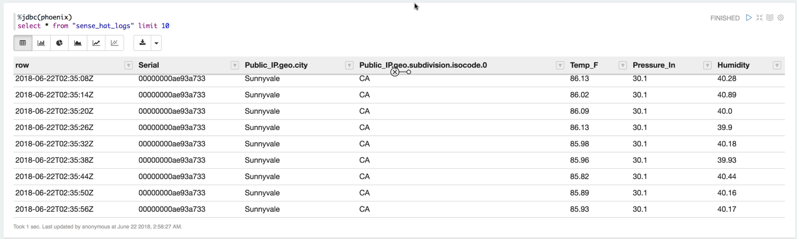

**Figure 2:** Zeppelin's Table Visualization

### Step 3: Monitor Temperature Over Time

```SQL
%jdbc(phoenix)
select "row" AS DATE_TIME,
"Temp_F" AS TEMP_F
from "sense_hat_logs"
```


**Figure 3:** Temperature Line Chart Visualization

The graph reveals the temperature was its highest at 100.72
(July 9, 2017 at 11:51 PM) and lowest at 94.71 (July 9, 2017 at 11:34 PM).

As you will notice even after we tried to calibrate the Sense HAT's temperature
readings, the temperature is still off compared to actual temperature of the
living room. The best solution is to get the Sense HAT away from the Raspberry
Pi, but then that defeats the purpose of the Sense HAT being compact.

### Step 4: Monitor Humidity Over Time

Humidity is the ratio of actual water vapour in the air compared to the actual
amount of water vapour the air is able to hold at a particular temperature.
Relative humidity tells us how close the air is being saturated. The higher
the air temperature, the lower the relative humidity percentage and vise versa.

```SQL
%jdbc(phoenix)
select "row" AS DATE_TIME,
"Humidity" AS HUMIDITY_Percentage_RH
from "sense_hat_logs"
```


**Figure 4:** Humidity Line Chart Visualization

The chart above reveals the Relative Humidity Percentage was at its highest
around 40.8% (July 9, 2017 at 11:00 PM) while its lowest was 33.75%
(July 9, 2017 at 11:52 PM). At 40.8%, the air was more saturated
than 33.75%. Relative Humidity

### Step 5: Monitor Pressure Over Time

Barometric Pressure is the force exerted by the atmosphere at a particular point.
Forecasters monitor the changes in air pressure to predict short-term
changes in the weather.

```SQL
%jdbc(phoenix)
select "row" AS DATE_TIME,
"Pressure_In" AS PRESSURE
from "sense_hat_logs"
```

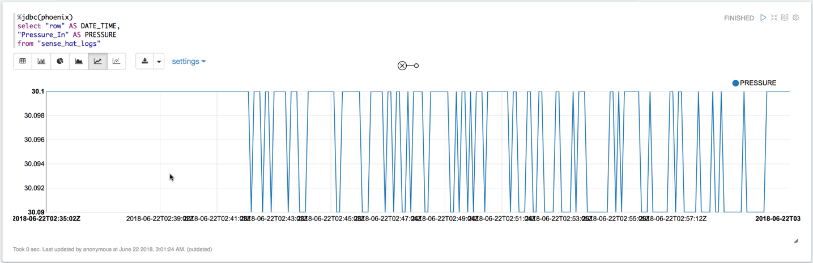

**Figure 5:** Pressure Line Chart Visualization

The chart above shows the barometric pressure stayed stable at around 29.98 and
29.97 over 10:42 PM on July 9, 2017 to 12:22 AM July 10, 2017.

After comparing the pressure for San Jose at "The Weather Channel," the readings
we obtained are within same range. The Weather Channel predicts that pressure
will increase from 29.90 inches. Our graph also supports that prediction.
This **rise in pressure** indicates that the **weather** may soon **clear**, turn **fair** and
**sunny**.

### Summary

Congratulations, now you know how to write Phoenix SQL queries against an HBase table. You performed Phoenix SQL like queries against HBase to monitor temperature, humidity and pressure over time. You also know how to use the Phoenix Interpreter integrated with Zeppelin to visualize the data associated with our weather sensor. Feel free to further explore the different Zeppelin Interpreters and other visualizations for your data analysis journey.

### Further Readings

- Read more about Zeppelin at [Apache Zeppelin Docs](https://zeppelin.apache.org/)
- Read more about Phoenix at [Apache Phoenix Docs](https://phoenix.apache.org/)
