# 0.Building a Sentiment Analysis Application

## Introduction

For this project, you will play the part of a Big Data Application Developer who leverages their skills as a Data Engineer and Data Scientist by using multiple Big Data Technologies provided by Hortonworks Data Flow (HDF) and Hortonworks Data Platform (HDP) to build a Real-Time Sentiment Analysis Application. For the application, you will learn to acquire tweet data from Twitter's Decahose API and send the tweets to the Kafka Topic "tweets" using NiFi. Next you will learn to build Spark Machine Learning Model that classifies the data as happy or sad and export the model to HDFS. However, before building the model, Spark requires the data that builds and trains the model to be in feature array, so you will have to do some data cleansing with SparkSQL. Once the model is built, you will use Spark Structured Streaming to load the model from HDFS, pull in tweets from Kafka topic "tweets", add a sentiment score to the tweet, then stream the data to Kafka topic "tweetsSentiment". Earlier after finishing the NiFi flow, you will build another NiFi flow that ingests data from Kafka topic "tweetsSentiment" and stores the data into HBase. With Hive and HBase integration, you will perform queries to visualize that the data was stored successfully and also show the sentiment score for tweets.

### Big Data Technologies used to develop the Application:

- [Twitter API](https://dev.twitter.com/)
- [HDF Sandbox](https://hortonworks.com/products/data-platforms/hdf/)
    - [Apache Ambari](https://ambari.apache.org/)
    - [Apache NiFi](https://nifi.apache.org/)
    - [Apache Kafka](http://kafka.apache.org/)
- [HDP Sandbox](https://hortonworks.com/products/data-platforms/hdp/)
    - [Apache Ambari](https://ambari.apache.org/)
    - [Apache Hadoop - HDFS](https://hadoop.apache.org/docs/r3.1.1/)
    - [Apache HBase](https://hbase.apache.org/)
    - [Apache Spark](https://spark.apache.org/)
    - [Apache Kafka](http://kafka.apache.org/)
    - [Apache Zeppelin](https://zeppelin.apache.org/)

### Goals and Objectives

- Learn to create a Twitter Application using Twitter's Developer Portal to get KEYS and TOKENS for connecting to Twitter's APIs
- Learn to create a NiFi Dataflow Application that integrates Twitter's Decahose API to ingest tweets, perform some preprocessing, store the data into the Kafka Topic "tweets".
- Learn to create a NiFi Dataflow Application that ingests the Kafka Topic "tweetsSentiment" to stream sentiment tweet data to HBase
- Learn to build a SparkSQL Application to clean the data and get it into a suitable format for building the sentiment classification model
- Learn to build a SparkML Application to train and validate a sentiment classification model using Gradient Boosting
- Learn to build a Spark Structured Streaming Application to stream the sentiment tweet data from Kafka topic "tweets" on HDP to Kafka topic "tweetsSentiment" on HDF while attaching a sentiment score per tweet based on output of the classification model
- Learn to visualize the tweet sentiment score by using Zeppelin's Hive interpreter mapping to the HBase table

### Prerequisites

- Downloaded and deployed the [Hortonworks Data Platform (HDP)](https://www.cloudera.com/downloads/hortonworks-sandbox/hdp.html?utm_source=mktg-tutorial) Sandbox
- Read through [Learning the Ropes of the HDP Sandbox](https://hortonworks.com/tutorial/learning-the-ropes-of-the-hortonworks-sandbox/) to setup hostname mapping to IP address
- If you don't have 32GB of dedicated RAM for HDP Sandbox, then refer to [Deploying Hortonworks Sandbox on Microsoft Azure](https://hortonworks.com/tutorial/sandbox-deployment-and-install-guide/section/4/)
- Enabled Connected Data Architecture:
  - [Enable CDA for VirtualBox](https://hortonworks.com/tutorial/sandbox-deployment-and-install-guide/section/1/#enable-connected-data-architecture-cda---advanced-topic)
  - [Enable CDA for VMware](https://hortonworks.com/tutorial/sandbox-deployment-and-install-guide/section/2/#enable-connected-data-architecture-cda---advanced-topic)
  - [Enable CDA for Docker](https://hortonworks.com/tutorial/sandbox-deployment-and-install-guide/section/3/#enable-connected-data-architecture-cda---advanced-topic)

## Outline

The tutorial series consists of the following tutorial modules:

1\. **[Application Development Concepts](https://hortonworks.com/tutorial/building-a-sentiment-analysis-application/section/1/)** You will be introduced to sentiment fundamentals: sentiment analysis, ways to perform the data analysis and the various use cases.

2\. **[Setting up the Development Environment](https://hortonworks.com/tutorial/building-a-sentiment-analysis-application/section/2/)** You will create a Twitter Application in Twitter's Developer Portal for access to KEYS and TOKENS. You will then write a shell code and perform Ambari REST API Calls to setup a development environment.

3\. **[Acquiring Twitter Data](https://hortonworks.com/tutorial/building-a-sentiment-analysis-application/section/3/)** You will build a NiFi Dataflow to ingest Twitter data, preprocess it and store it into the Kafka Topic "tweets". The second NiFi Dataflow you will build, ingests the enriched sentiment tweet data from Kafka topic "tweetsSentiment" and streams the content of the flowfile to HBase.

4\. **[Cleaning the Raw Twitter Data](https://hortonworks.com/tutorial/building-a-sentiment-analysis-application/section/4/)** You will create a Zeppelin notebook and use Zeppelin's Spark Interpreter to clean the raw twitter data in preparation to create the sentiment classification model.

5\. **[Building a Sentiment Classification Model](https://hortonworks.com/tutorial/building-a-sentiment-analysis-application/section/5/)** You will create a Zeppelin notebook and use Zeppelin's Spark Interpreter to build a sentiment classification model that classifies tweets as Happy or Sad and exports the model to HDFS.

6\. **[Deploying a Sentiment Classification Model](https://hortonworks.com/tutorial/building-a-sentiment-analysis-application/section/6/)** You will create a Scala IntelliJ project in which you develop a Spark Structured Streaming application that streams the data from Kafka topic "tweets" on HDP, processes the tweet JSON data by adding sentiment and streaming the data into Kafka topic "tweetsSentiment" on HDF.

7\. **[Visualizing Sentiment Scores](https://hortonworks.com/tutorial/building-a-sentiment-analysis-application/section/7/)** You will use Zeppelin's JDBC Hive Interpreter to perform SQL queries against the noSQL HBase table "tweets_sentiment" for visual insight into tweet sentiment score.
---
title: Application Development Concepts
---

# 1.Application Development Concepts

## Introduction

Your first objective is to gain background in sentiment analysis, so you have
context when you go into developing the sentiment analysis application. You will
become familiar with what sentiment analysis is, the different types of sentiment
analysis, the importance of sentiment analysis, how sentiment analysis works and
the various sentiment analysis use cases.

## Prerequisites

- Read through "Building a Sentiment Analysis Application" overview

## Outline

- [Sentiment Analysis Fundamentals](#sentiment-analysis-fundamentals)
- [Summary](#summary)
- [Further Reading](#further-reading)

## Sentiment Analysis Fundamentals

### What is Sentiment Analysis?

**Sentiment analysis is identifying and extracting opinions within text and
extracting attributes from expression through using a system that leverages
Natural Language Processing.** An opinion is a subjective expression
describing people's sentiments, appraisals and feelings toward a subject or
topic. Subjective classification can determine whether a sentence or expression
is subjective or objective. Polarity classification can determine the sentiment
from a body of text (complete document, paragraph, single sentence or sub
expression) whether it be positive, negative or neutral. Opinions have two
types: direct and comparative opinions. Direct opinions give a subjective
expression about an entity directly while comparative opinions express
similarities or differences between two or more entities using comparative or
superlative form of an adjective or adverb.

### What are the Different Types of Sentiment Analysis?

There are many types of sentiment analysis systems ranging from focus on
polarity, detection of feelings and emotions or identification of intentions.
The types of sentiment analysis include **fine-grained sentiment analysis**,
**emotion detection**, **aspect-based sentiment analysis**, **intent analysis**,
**multilingual sentiment analysis**. **Fine-grained sentiment analysis** expands
the range of polarity from positive, neutral or negative to _very positive_,
_positive_, _neutral_, _negative_ or _very negative_. **Emotion detection**
usually leverage lexicons or machine learning algorithms to list words or body
of text and analyze the emotion they convey. **Aspect-based sentiment analysis**
dives into analyzing the particular aspects or features of a product or service
people talk about in addition to the polarity level. **Intent analysis** detects
what people would do with a text rather than what people say about that text.
**Multilingual sentiment analysis** detects the language in texts automatically
often using machine learning algorithms and performs analysis on the text
to retrieve the sentiment.

### Why is Sentiment Analysis Important?

**80% of the world's data is unstructured**, most of it comes from text data,
which is difficult, time consuming and expensive to analyze, understand and
sort through. **Sentiment analysis is critical in allowing companies to make
sense of this abundance of unstructured text because they can automate business
processes, obtain actionable insight, save hours of manual data processing and
ultimately make teams more efficient.** Sentiment analysis offers
_scalability_, _real-time analysis_, _consistent criteria_. Can you
imagine the daunting task of sorting through thousands of tweets, customer
support conversations or customer reviews? There's too much data to manually
process, but with assistance from a sentiment analysis system, people can
process data at scale in an efficient way. Sentiment analysis can be used
to identify critical situations in real-time and allow for taking immediate
action. Companies who use a centralized sentiment analysis system can apply
consistent criteria to all of their data reducing the errors and inconsistencies
that come from people judging the sentiment of text. People often time
associate their personal experiences, thoughts and beliefs when performing
sentiment analysis on a piece of text.

### How Does Sentiment Analysis Work?

There are many methods and algorithms used in practice to develop sentiment
analysis systems: ***Rule-Based***, ***Automatic*** and ***Hybrid***.

**Rule-based** systems incorporate a set of manually crafted rules to perform
sentiment analysis. These rules usually use a variety of inputs, classic Natural
Language Processing techniques and lexicons. An example of how to **implement
Rule-based system** is to **first** define a list of polarized words, **second** is to
count the number of positive words and negative words from input, **final** is to
check if the amount of positive word appearances is greater than negative word
appearances, if true, then return positive sentiment else return negative.

**Automatic** systems use a Machine Learning Classifier, feed it text as input
and return the corresponding category: positive, negative or neutral (if
polarity analysis is performed). The Machine Learning Classifier is implemented
in typically two phases:

- The first phase involves **training** our model to associate **input** (text) to
corresponding **output** (label or tag), which are based on test samples used for
training. The pipeline for this process involves sending the input data through
a **feature extractor** that transfers text input into a feature vector. The
feature vectors go through a queue and pairs of both feature vectors and labels
(positive, negative or neutral sentiment) are fed into the machine learning
algorithm to create the model.

<!-- Include picture on the training process -->

- The final phase involves **prediction** of sentiment score for random input.
The data pipeline consists of sending raw input data through a feature extractor
to be transformed into a feature vector, which is then fed to the model to
generate predicted labels, such as positive, negative or neutral.

<!-- Include picture on the prediction process -->

Common Machine Learning Algorithms that can be used in text classification
include **Naive Bayes**, **Linear Regression**, **Support Vector Machines**,
**Deep Learning** and **Gradient Boosted Trees(GBTs)**.

- **Gradient Boosted Trees (GBTs)**: trains a sequence of decision trees to
build the classification model, uses the current group of feature vectors to
predict the polarity of the label, such as positive, negative or neutral of each
training instance and finally compares the prediction against the true label.

- **Deep Learning**: tries to imitate how the human brain
functions by using artificial neural networks to process data. Sentiment
analysis can be implemented to classify text in 2 ways, the first way is to use
supervised learning if there is enough training data, else use unsupervised
training followed by a supervised classifier to train a deep neural network
model. Deep learning neural networks used for building sentiment classification
models include **recursive neural networks, word2vec, paragraph vectors,
recurrent neural networks, etc**

- **Support Vector Machines**: are non-probabilistic models that represent text
examples as points in a multidimensional space. These text examples map to
different categories, such as sentiments: pleased or happy, sad or angry, etc.
These categories belong to distinct regions of that multidimensional space.
New texts are mapped to the same space and predicted to belong to a certain
category.

- **Linear Regression**: is an algorithm used in statistics and machine learning
to predict some value (Y) given the set of features (X).

- **Naive Bayes**: are set of supervised machine learning algorithms that use
Bayes' theorem to predict category of text.

### Sentiment Analysis Use Cases

- Social media monitoring
- Brand monitoring
- Voice of customer (VoC)
- Customer service
- Workforce analytics and voice of employee
- Product analytics
- Market research and analysis

## Summary

Congratulations! You now have familiarity with the fundamentals of sentiment
analysis. You are ready to setup the development environment for the
application.

## Further Reading

- For an in-depth dive into Sentiment Analysis, reference **MonkeyLearn's article** [Sentiment Analysis - nearly everything you need to know](https://monkeylearn.com/sentiment-analysis/)
- [How is deep learning used in sentiment analysis?](https://www.quora.com/How-is-deep-learning-used-in-sentiment-analysis)
---
title: Setting up the Development Environment
---

# 2.Setting up the Development Environment

## Introduction

Now that we have the fundamentals down for Sentiment Analysis, let's setup the
development environment for building the Sentiment Analysis application. First,
we will need to create a Twitter Application through Twitter's Developer portal,
which will allow us to obtain API KEYS and TOKENS needed to connect to Twitter's
API data feed. Lastly, we will setup and configure services for HDF and HDP
Sandbox, so later we can use the tools for processing data.

## Prerequisites

- Enabled Connected Data Architecture

## Outline

- [Create a Twitter Application](#creating-a-twitter-application)
- [Verify Prerequisites Have Been Covered](#verify-prerequisites-have-been-covered)
- [Manually Setup Development Environment](#manually-setup-development-environment)
- [Summary](#summary)
- [Further Reading](#further-readings)

## Create a Twitter Application

After creating and registering the Twitter Application, Twitter will provide you authorized access to pull live data through their API as long as you have the **Consumer API Keys** and **Access Tokens**. First you must apply for developer account, then once Twitter accepts your application, you will be able to create Twitter applications.

### Apply for a Twitter Developer Account

1\. To create new applications, Twitter requires you must go to their website -> [apply for a developer account](https://developer.twitter.com/en/apply-for-access.html)

2\. Click the **purple apply** button.


3\. Select the Twitter account you want to associate as admin of this developer account, then press **blue continue** button.


4\. Fill in the details for your developer account, then press **blue continue** button.


5\. Provide project details, then press the **blue continue** button.


6\. Read and agree to Terms of Service, then press the **blue submit application** button.


7\. Verify you received the verification email to complete the application.

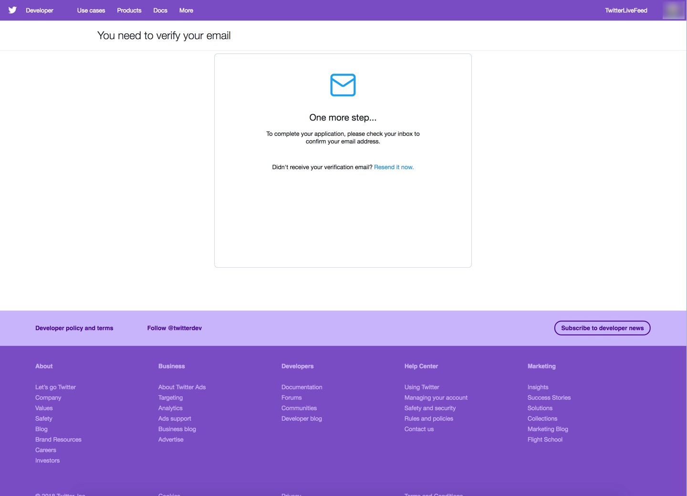

8\. Open your email inbox, select **Verify your Twitter Developer Account**, then press the yellow orange **confirm your email** button.


9\. Welcome to your new Twitter developer account. Press on **Create an app** to go to the Apps page.

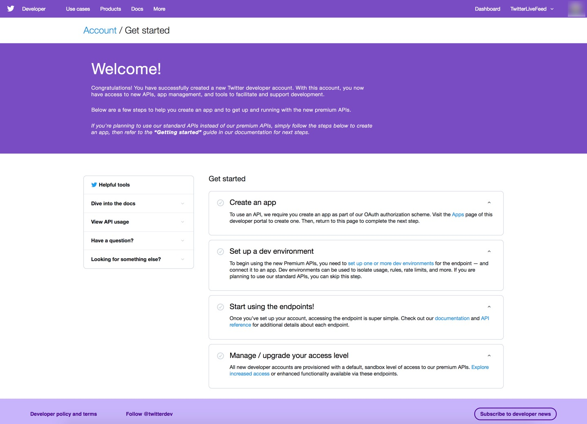

### Create a New Twitter Application

1\. Press the **blue Create an app** button.


2\. Enter your app details. Then press the **blue Create** button.


3\. Review Twitter's Developer Terms, then press the **blue Create** button.


4\. A green checkmark should appear in the top right corner notifying you that the application was created successfully. You will be taken to the page showing summary about your app.


Application at this point was created successfully! Switch to the Permissions tab.

### Change Application's Permissions

Since we are only going to be reading live data, let's check the permissions.

The access permission shows **Read and Write**. Press **Edit**.


The **Edit** button drops down to **Access permission** and **Additional permissions**. Change **Read and Write**
permission to **Read Only**. Then press the **blue Save** button.


A green checkmark should appear in the top corner notifying you that the application was updated successfully.


You will need to regenerate access tokens for the changes to take effect. Switch to the Keys and tokens tab.

### Get Keys & Tokens from Application

In order for you to have authorization access to pull data from your application's live feed, we need to get **Consumer API Keys** and **Access Tokens**.

1\. Initially the Access tokens are not created, so let's create the Access tokens. The changes we made earlier to the permissions will take effect too. Press the **blue Create** button.


2\. The access tokens will be created.


**Save the keys and tokens as they appear on "your" web page**. The following keys and tokens are just examples from a previous application setup and are no longer usable, so you will need to get the keys and tokens from your developer account.

- Example: **Consumer API Key**

```bash
QN1C0nt9MYSgqxAOgLGULXfEu
```

- Example: **Consumer API Secret Key**

```bash
OEXtObh3er8wRzooiJDSOnSJ4ZM9qyiHx3ucodfWKctvZYi5Cu
```

- Example: **Access Token**

```bash
3939922273-j5VJwa0REmOeScxTLsem9JIAzeZ0oYn2dQQ7ep8
```

- Example: **Access Token Secret**

```bash
aFR7HmgMhjB0xSqhP27s4UN7QGCs97OrnIptyTfpSeflB
```

## Verify Prerequisites Have Been Covered

**Map sandbox IP to desired hostname in hosts file**

- If you need help mapping Sandbox IP to hostname, reference **Environment
Setup -> Map Sandbox IP To Your Desired Hostname In The Hosts File** in [Learning the Ropes of HDP Sandbox](https://hortonworks.com/tutorial/learning-the-ropes-of-the-hortonworks-sandbox/)

**Setup Ambari admin password for "HDF" and "HDP"**

If you need help setting the Ambari admin password,

- for HDP, reference **Admin Password Reset** in [Learning the Ropes of HDP Sandbox](https://hortonworks.com/tutorial/learning-the-ropes-of-the-hortonworks-sandbox/)
- for HDF, reference **Admin Password Reset** in [Learning the Ropes of HDF Sandbox](https://hortonworks.com/tutorial/getting-started-with-hdf-sandbox/)

**Started up all required services for "HDF" and "HDP"**

If unsure, login to Ambari **admin** Dashboard

- for HDF at http://sandbox-hdf.hortonworks.com:8080 and verify **NiFi** starts up, else start it.
- for HDP at http://sandbox-hdp.hortonworks.com:8080 and verify **HDFS**, **Spark2**, **HBase** and **Zeppelin** starts up, else start them.

## Manually Setup Development Environment

### Overview of HDF and HDP Sandbox Environment Setup

The first task will be to setup NiFi service on HDF Sandbox since we will need to use it to build a dataflow for acquiring Twitter data. The second task will be to setup Hive, HDFS, Spark and HBase on HDP Sandbox, so we can focus on cleaning, preprocessing and building a machine learning for delivering visual insight to the user on their Twitter data.

### Setting Up HDF Sandbox for Application Development

Open HDF Sandbox Web Shell Client at [http://sandbox-hdf.hortonworks.com:4200](http://sandbox-hdf.hortonworks.com:4200) with login `root/hadoop`. If this login is the first one, then you will be prompted to set a new password, remember it.

### Setup NiFi Service

The following shell code synchronizes CentOS7 System Clock with UTC, which HDF Sandbox runs on and is needed for NiFi's GetTwitter processor. By updating the CentOS7 System Clock, we will avoid running into
authorization errors when connecting to the Twitter API Feed through GetTwitter processor.

The second part of the code cleans up the NiFi flow that is already prebuilt into HDF Sandbox by backing up the flow and removing it. Copy and paste the code line by line into the web shell.

```bash
echo "Synchronizing CentOS7 System Clock with UTC for GetTwitter Processor"
# Install Network Time Protocol
yum install -y ntp
service ntpd stop
# Use the NTPDATE to synchronize CentOS7 sysclock within few ms of UTC
ntpdate pool.ntp.org
service ntpd start

echo "Existing flow on NiFi canvas backed up to flow.xml.gz.bak"
mv /var/lib/nifi/conf/flow.xml.gz /var/lib/nifi/conf/flow.xml.gz.bak
```

For the changes in NiFi to take effect, we need to **restart NiFi**. Open Ambari at http://sandbox-hdf.hortonworks.com:8080 with user `admin` and the password you set.

Click the **NiFi service** from Ambari stack of services, press **Service Actions**
dropdown, select **Restart All**.

A Background Operation Running window will pop up with **Restart all components for NiFi** progress bar loading and turning green once the restart is successful.

### Setup Kafka Service

If Kafka is off, make sure to turn it on from Ambari.

We will need to create a Kafka topic on HDF for Spark to stream data into from HDP.

```bash
/usr/hdf/current/kafka-broker/bin/kafka-topics.sh --create --zookeeper sandbox-hdf.hortonworks.com:2181 --replication-factor 1 --partitions 10 --topic tweetsSentiment
```

### Setting Up HDP Sandbox for Application Development

Open HDP Sandbox Web Shell Client at http://sandbox-hdp.hortonworks.com:4200 with login `root/hadoop`. On first login, you will be prompted to update the password.

### Setup Kafka Service

If Kafka is off, make sure to turn it on from Ambari at http://sandbox-hdp.hortonworks.com:8080 with user `admin` and the password you set.

We will need to enter the HDP sandbox web shell to create a Kafka topic on HDP for NiFi to publish messages to the Kafka queue.

```bash
/usr/hdp/current/kafka-broker/bin/kafka-topics.sh --create --zookeeper sandbox-hdp.hortonworks.com:2181 --replication-factor 1 --partitions 10 --topic tweets
```

### Setup Hive Service

The first set of commands will setup **Hive**, so we can create, read and write to tables built on top of JSON data by installing maven, downloading Hive-JSON-Serde library and compiling that library. Copy and paste the code line by line in the HDP sandbox web shell.

```bash
echo "Setting Up Maven needed for Compiling and Installing Hive JSON-Serde Lib"
wget http://repos.fedorapeople.org/repos/dchen/apache-maven/epel-apache-maven.repo -O /etc/yum.repos.d/epel-apache-maven.repo
yum install -y apache-maven
mvn -version

echo "Setting up Hive JSON-Serde Libary"
git clone https://github.com/rcongiu/Hive-JSON-Serde
cd Hive-JSON-Serde
# Compile JsonSerDe source to create JsonSerDe library jar file
mvn -Phdp23 clean package
# Give JsonSerDe library jar file to Hive and Hive2 library
cp json-serde/target/json-serde-1.3.9-SNAPSHOT-jar-with-dependencies.jar /usr/hdp/3.0.0.0-1634/hive/lib
cd ~/
```

For the updates in **Hive** to take effect, we need to **restart Hive**, so it can access Hive-JSON-Serde library. **Open Ambari** at http://sandbox-hdp.hortonworks.com:8080 with user `admin` and the password you set.

Click the **Hive** service from Ambari stack of services, press **Service Actions**
dropdown, select **Restart All**.

A Background Operation Running window will pop up with **Restart all components for Hive** progress bar loading and turning green once the restart is successful.

### Setup HDFS Service

The next set of commands will setup **HDFS** for holding the Tweet data that will be accessed by Spark. We will create tweets folder that will hold a zipped file. This data will be copied over to HDFS where it will be later loaded by Spark to refine the historical data for creating a machine learning model. Run the code line by line in your HDP sandbox web shell.

```bash
echo "Setting up HDFS for Tweet Data"
HDFS_TWEET_STAGING="/sandbox/tutorial-files/770/tweets_staging"
LFS_TWEETS_PACKAGED_PATH="/sandbox/tutorial-files/770/tweets"
sudo -u hdfs mkdir -p $LFS_TWEETS_PACKAGED_PATH
# Create tweets_staging hdfs directory ahead of time for hive
sudo -u hdfs hdfs dfs -mkdir -p $HDFS_TWEET_STAGING
# Change HDFS ownership of tweets_staging dir to maria_dev
sudo -u hdfs hdfs dfs -chown -R maria_dev $HDFS_TWEET_STAGING
# Change HDFS tweets_staging dir permissions to everyone
sudo -u hdfs hdfs dfs -chmod -R 777 $HDFS_TWEET_STAGING
# give anyone rwe permissions to /sandbox/tutorial-files/770
sudo -u hdfs hdfs dfs -chmod -R 777 /sandbox/tutorial-files/770
sudo -u hdfs wget https://github.com/hortonworks/data-tutorials/raw/master/tutorials/cda/building-a-sentiment-analysis-application/application/setup/data/tweets.zip -O $LFS_TWEETS_PACKAGED_PATH/tweets.zip
sudo -u hdfs unzip $LFS_TWEETS_PACKAGED_PATH/tweets.zip -d $LFS_TWEETS_PACKAGED_PATH
sudo -u hdfs rm -rf $LFS_TWEETS_PACKAGED_PATH/tweets.zip
# Remove existing (if any) copy of data from HDFS. You could do this with Ambari file view.
sudo -u hdfs hdfs dfs -rm -r -f $HDFS_TWEET_STAGING/* -skipTrash
# Move downloaded JSON file from local storage to HDFS
sudo -u hdfs hdfs dfs -put $LFS_TWEETS_PACKAGED_PATH/* $HDFS_TWEET_STAGING
```

### Setup Spark Service

For **Spark** Structured Streaming, we will need to leverage SBT package manager. The commands below install SBT. Run the code line by line in the HDP web shell.

```bash
curl https://bintray.com/sbt/rpm/rpm | sudo tee /etc/yum.repos.d/bintray-sbt-rpm.repo
yum install -y sbt
```

### Setup HBase Service

For **HBase** since we will be storing streams of data into it from NiFi, we will need to create a table ahead of time, so we wont' have to switch between both applications:

```bash
#!/bin/bash
# -e: causes echo to process escape sequences, build confirmation into it
# -n: tells hbase shell this is a non-interactive session
echo -e "create 'tweets_sentiment','social_media_sentiment'" | hbase shell -n
```

## Summary

Congratulations! The development environment is setup and configured, so we can began acquiring the customer sentiment data via NiFi ingesting the Twitter API feed.

## Further Reading

- [NiFi System Administrator's Guide](https://nifi.apache.org/docs/nifi-docs/html/administration-guide.html)
- [Hive SerDe Library Doc](https://cwiki.apache.org/confluence/display/Hive/SerDe)
- [HDFS Commands Guide Doc](https://hadoop.apache.org/docs/r3.0.0/hadoop-project-dist/hadoop-hdfs/HDFSCommands.html)
- [Setting Up a Spark Development Environment with Scala](https://hortonworks.com/tutorial/setting-up-a-spark-development-environment-with-scala/#sbt)
- [Administering Ambari](https://docs.hortonworks.com/HDPDocuments/Ambari-2.7.0.0/administering-ambari/content/amb_introducing_ambari_administration.html)
- [Solr's Banana Installation and Quick Start](https://github.com/lucidworks/banana)
---
title: Acquiring Twitter Data
---

# 3.Acquiring Twitter Data

## Introduction

Our next objective is to acquire sentiment data from Twitter's **[Decahose stream](https://developer.twitter.com/en/docs/tweets/sample-realtime/overview/streaming-likes)** API.

You will build one NiFi flow in a process group that ingests data from Twitter using
your KEYS and TOKENS you obtained from creating your Twitter Developer App.
Next you will massage the data extracting meaningful insight from JSON content
from the Twitter feed. Finally, you will store the data into a Kafka topic "tweets".

You will build the second NiFi flow in another process group to consume data from
Kafka topic "tweetsSentiment", which has a trained sentiment model built with an
external service SparkML and send the data to be stored into HBase.

## Prerequisites

- Enabled Connected Data Architecture
- Setup the Development Environment

## Outline

- [Approach 1: Build a NiFi Flow For Acquisition and Storage](#approach-1-build-a-nifi-flow-for-acquisition-and-storage)
- [Approach 2: Import NiFi Flow For Acquisition and Storage](#approach-2-import-nifi-flow-for-acquisition-and-storage)
- [Summary](#summary)
- [Further Reading](#further-reading)

## Approach 1: Build a NiFi Flow For Acquisition and Storage

After starting your sandbox, open HDF **NiFi UI** at http://sandbox-hdf.hortonworks.com:9090/nifi.

### 1\. Create AcquireTwitterData Process Group

This capture group ingests Twitter's **[Decahose stream](https://developer.twitter.com/en/docs/tweets/sample-realtime/overview/streaming-likes)** through Twitter's [Sentiment Detection API](https://developer.twitter.com/en/use-cases/analyze.html), preprocesses the data and stores it into Kafka later analysis.

Drop the process group icon  onto the NiFi canvas.

Insert the Process Group Name: `AcquireTwitterData` or one of your choice.

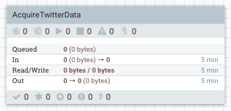

Double click on the process group to dive into it. At the bottom of the canvas, you will see **NiFi Flow >> AcquireTwitterData** breadcrumb. Let's began connecting the processors for data ingestion, preprocessing and storage.

### Ingest Twitter Data Source

Drop the processor icon onto the NiFi canvas. Add the **GetTwitter**.


Hold **control + mouse click** on **GetTwitter** to configure the processor:

**Table 1: Settings Tab**

| Setting | Value     |
| :------------- | :------------- |
| Name | GrabGardenHose |

**Table 2: Scheduling Tab**

| Scheduling     | Value     |
| :------------- | :------------- |
| Run Schedule       | `1 sec`       |

**Table 3: Properties Tab**

| Property     | Value     |
| :------------| :---------|
| **Twitter Endpoint**  | `Filter Endpoint` |
| **Consumer Key**  | `<Your-Consumer-API-Key>` |
| **Consumer Secret**  | `<Your-Consumer-API-Secret-Key>` |
| **Access Token**  | `<Your-Access-Token>` |
| **Access Token Secret**  | `<Your-Access-Token-Secret>` |
| Languages  | `en` |
| Terms to Filter On | `AAPL,ORCL,GOOG,MSFT,DELL` |

Click **APPLY**.

### Pull Key Attributes from JSON Content of FlowFile

Drop the processor icon onto the NiFi canvas. Add the **EvaluateJsonPath**.

Create connection between **GetTwitter** and **EvaluateJsonPath** processors. Hover
over **GetTwitter** to see arrow icon, press on processor and connect it to
**EvaluateJsonPath**.

Configure Create Connection:

| Connection | Value     |
| :------------- | :------------- |
| For Relationships     | success (**checked**) |

Click **ADD**.


Configure **EvaluateJsonPath** processor:

**Table 4: Settings Tab**

| Setting | Value     |
| :------------- | :------------- |
| Name | `PullKeyAttributes` |
| Automatically Terminate Relationships | failure (**checked**) |
| Automatically Terminate Relationships | unmatched (**checked**) |

**Table 5: Scheduling Tab**

| Scheduling | Value     |
| :------------- | :------------- |
| Concurrent Tasks       | `4`       |
| Run Schedule       | `1 sec`       |

**Table 6: Properties Tab**

To add a new user defined property in case one the following properties in the
table isn't defined, press the plus button **+**.

| Property | Value     |
| :------------- | :------------- |
| **Destination**       | `flowfile-attribute` |
| **Return Type**       | `json` |
| twitter.handle       | `$.user.screen_name` |
| twitter.hashtags       | `$.entities.hashtags[0].text` |
| twitter.language       | `$.lang` |
| twitter.location       | `$.user.location` |
| twitter.msg       | `$.text` |
| twitter.time       | `$.created_at` |
| twitter.tweet_id       | `$.id` |
| twitter.unixtime       | `$.timestamp_ms` |
| twitter.user       | `$.user.name` |
| twitter.geo       | `$.geo` |
| twitter.coordinates       | `$.coordinates` |
| twitter.place       | `$.place` |

Click **APPLY**.

### Route FlowFiles Attributes Containing Non-Empty Tweets

Drop the processor icon onto the NiFi canvas. Add the **RouteOnAttribute**.

Create connection between **EvaluateJsonPath** and **RouteOnAttribute** processors. Hover
over **EvaluateJsonPath** to see arrow icon, press on processor and connect it to
**RouteOnAttribute**.

Configure Create Connection:

| Connection | Value     |
| :------------- | :------------- |
| For Relationships     | matched (**checked**) |

Click **ADD**.


Configure **RouteOnAttribute** processor:

**Table 7: Settings Tab**

| Setting | Value     |
| :------------- | :------------- |
| Name | `FindOnlyTweets` |
| Automatically Terminate Relationships | unmatched (**checked**) |

**Table 8: Scheduling Tab**

| Scheduling | Value     |
| :------------- | :------------- |
| Concurrent Tasks       | `2`       |
| Run Schedule       | `1 sec`       |

**Table 9: Properties Tab**

To add a new user defined property in case one the following properties in the
table isn't defined, press the plus button **+**.

| Property | Value     |
| :------------- | :------------- |
| **Routing Strategy**       | `Route to Property name` |
| filterTweetAndLocation       | `${twitter.msg:isEmpty():not():and(${twitter.location:isEmpty():not()})}` |

Click **APPLY**.

### Put FlowFile Contents to Kafka Topic via KafkaProducer API

Drop the processor icon onto the NiFi canvas. Add the **PublishKafka_0_10** processor.

Create connection between **RouteOnAttribute** and both **PublishKafka_0_10** processors. Hover
over **RouteOnAttribute** to see arrow icon, press on processor and connect it to
**PublishKafka_0_10**.

Configure Create Connection:

| Connection | Value     |
| :------------- | :------------- |
| For Relationships     | filterTweetAndLocation (**checked**) |

Click **ADD**.


Configure **PublishKafka_0_10** processor for relationship connection **tweet**:

**Table 10: Settings Tab**

| Setting | Value     |
| :------------- | :------------- |
| Automatically Terminate Relationships | failure (**checked**) |
| Automatically Terminate Relationships | success (**checked**) |

**Table 11: Scheduling Tab**

| Scheduling | Value     |
| :------------- | :------------- |
| Run Schedule       | `1 sec`       |

**Table 12: Properties Tab**

| Property | Value     |
| :------------- | :------------- |
| **Kafka Brokers**       | `sandbox-hdp.hortonworks.com:6667` |
| **Topic Name**       | `tweets` |

Click **APPLY**. The yellow warning sign on **PublishKafka_0_10** should turn to
a red stop symbol. Now you have a completed NiFi flow with no warnings and ready
to acquire data and send to Kafka topic `tweets`.

### Start Process Group Flow to Acquire Data

At the breadcrumb, select **NiFi Flow** level. Hold **control + mouse click** on the **AcquireTwitterData** process group, then click the **start** option.


Once NiFi writes your twitter data to Kafka, which you can check by viewing data provenance, you can turn off the process group by holding **control + mouse click** on the **AcquireTwitterData** process group, then choose **stop** option.

### Verify NiFi Stored Data

Enter the **AcquireTwitterData** process group, press **control + mouse click** on PublishKafka_0_10 processor of your choice, then press **View data provenance**.

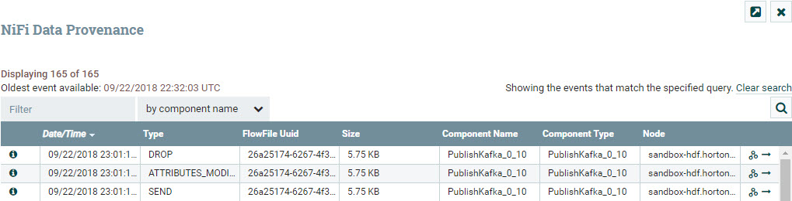

Press on **i** icon on the left row to view details about a provenance event. Choose the event with the type **SEND**. In the Provenance Event window, choose **CONTENT** tab. On **Output Claim**, choose **VIEW**.


You will be able to see the data NiFi sent to the external process Kafka. The data below shows tweets dataset.


### 2\. Create StreamTweetsToHBase Process Group

Make sure to exit the **AcquireTwitterData** process group and head back to **NiFi Flow** level.

This capture group consumes data from Kafka that was brought in by Spark Structured Streaming and streams the contents of the flowfiles to HBase.

Drop the process group icon  onto the NiFi canvas next to **AcquireTwitterData** process group.

Insert the Process Group Name: `StreamTweetsToHBase` or one of your choice.

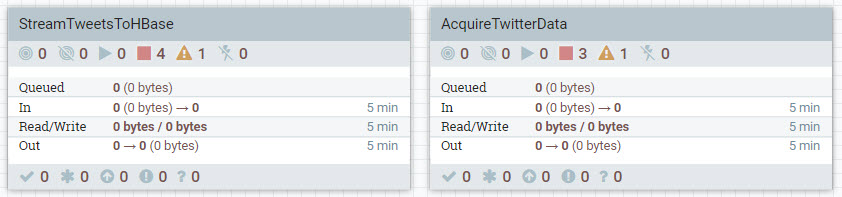

### Create New Controller Service

We are going to create a new controller service that will be needed later when we are configuring PutHBaseJSON processor.

Right click on the **StreamTweetsToHBase** process group, select configure. Click on the **Controller Services**. Click the **+** button to create a new controller service.

Insert into the **Filter** field,  `HBase_1_1_2_ClientService` and then press **ADD**.


Select the **gear** icon on the far right. Click on the **Properties** tab. Configure the properties for the controller service:

**Table 13: Properties Tab**

| Property | Value     |
| :------------- | :------------- |
| Hadoop Configuration Files       | `/etc/hbase/conf/hbase-site.xml,/etc/hadoop/conf/core-site.xml`       |

Click **OK**. Now let's exit the controller services.

Double click on the process group to dive into it. At the bottom of the canvas, you will see **NiFi Flow >> StreamTweetsToHBase** breadcrumb. Let's began connecting the processors for data ingestion, preprocessing and storage.

### Poll Kafka Topic for Data using KafkaConsumer API

Drop the processor icon onto the NiFi canvas. Add the **ConsumeKafka_0_10** processor.


Configure **ConsumeKafka_0_10** processor:

**Table 14: Scheduling Tab**

| Scheduling | Value     |
| :------------- | :------------- |
| Run Schedule       | `1 sec`       |

**Table 15: Properties Tab**

| Property | Value     |
| :------------- | :------------- |
| **Kafka Broker**       | `sandbox-hdf.hortonworks.com:6667` |
| **Topic Name(s)**       | `tweetsSentiment` |
| **Group ID**       | `1` |

Click **APPLY**.

### Pull Key Attributes from JSON Content of FlowFile

Jump to the previous process group **AcquireTwitterData**, copy the EvaluateJsonPath processor named **PullKeyAttributes** by right clicking and press **copy**.

Jump back to the **StreamTweetsToHBase** process group and paste the PullKeyAttributes processor near **ConsumeKafka_0_10** by right clicking on the NiFi canvas and pressing **paste**.

Create connection between **ConsumeKafka_0_10** and **PullKeyAttributes** processors. Hover
over **ConsumeKafka_0_10** to see arrow icon, press on processor and connect it to
**PullKeyAttributes**.

Configure Create Connection:

| Connection | Value     |
| :------------- | :------------- |
| For Relationships     | success (**checked**) |

Click **ADD**.


**PullKeyAttributes** processor is already configured.

### Create JSON From Input FlowFile Attributes and Output JSON FlowFile Content

Drop the processor icon onto the NiFi canvas. Add the **AttributesToJSON**.

Create connection between **PullKeyAttributes** and **AttributesToJSON** processors. Hover
over **PullKeyAttributes** to see arrow icon, press on processor and connect it to
**AttributesToJSON**.

Configure Create Connection:

| Connection | Value     |
| :------------- | :------------- |
| For Relationships     | matched (**checked**) |

Click **ADD**.


Configure **AttributesToJSON** processor:

**Table 16: Settings Tab**

| Setting | Value     |
| :------------- | :------------- |
| Automatically Terminate Relationships | failure (**checked**) |

**Table 17: Scheduling Tab**

| Scheduling | Value     |
| :------------- | :------------- |
| Run Schedule       | `1 sec`       |

**Table 18: Properties Tab**

| Property | Value     |
| :------------- | :------------- |
| **Attributes List**       | `twitter.handle, twitter.language, twitter.location, twitter.tweet_id, twitter.unixtime, twitter.sentiment` |
| **Destination**       | `flowfile-content` |

Click **APPLY**.

### Route FlowFiles Attributes Containing Non-Empty Tweets

Drop the processor icon onto the NiFi canvas. Add the **RouteOnAttribute**.

Create connection between **AttributesToJSON** and **RouteOnAttribute** processors. Hover
over **AttributesToJSON** to see arrow icon, press on processor and connect it to
**RouteOnAttribute**.

Configure Create Connection:

| Connection | Value     |
| :------------- | :------------- |
| For Relationships     | matched (**checked**) |

Click **ADD**.

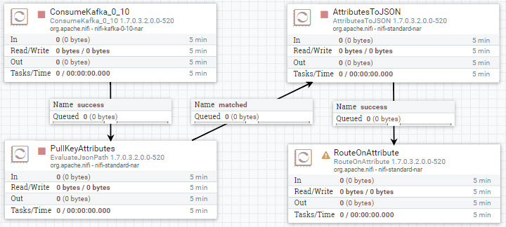

Configure **RouteOnAttribute** processor:

**Table 19: Settings Tab**

| Setting | Value     |
| :------------- | :------------- |
| Name | `IfTweetsHaveSentimentAndTime` |
| Automatically Terminate Relationships | unmatched (**checked**) |

**Table 20: Scheduling Tab**

| Scheduling | Value     |
| :------------- | :------------- |
| Concurrent Tasks       | `2`       |
| Run Schedule       | `1 sec`       |

**Table 21: Properties Tab**

To add a new user defined property in case one the following properties in the
table isn't defined, press the plus button **+**.

| Property | Value     |
| :------------- | :------------- |
| **Routing Strategy**       | `Route to 'matched' if all match` |
| filterTweetAndLocation       | `${twitter.unixtime:isEmpty():not():and(${twitter.sentiment:isEmpty():not()})}` |

Click **APPLY**.

### Stream Contents of FlowFile to HBase Data Table

Drop the processor icon onto the NiFi canvas. Add the **PutHBaseJSON** processor.

Create connection between **RouteOnAttribute** and both **PutHBaseJSON** processors. Hover
over **RouteOnAttribute** to see arrow icon, press on processor and connect it to
**PutHBaseJSON**.

Configure Create Connection:

| Connection | Value     |
| :------------- | :------------- |
| For Relationships     | matched (**checked**) |

Click **ADD**.

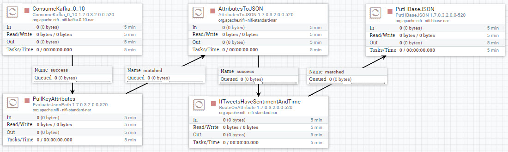

Configure **RouteOnAttribute** processor:

**Table 22: Settings Tab**

| Setting | Value     |
| :------------- | :------------- |
| Automatically Terminate Relationships | failure (**checked**) |
| Automatically Terminate Relationships | success (**checked**) |

**Table 23: Properties Tab**

| Property | Value     |
| :------------- | :------------- |
| **HBase Client Service**       | `HBase_1_1_2_ClientService` |
| **Table Name**       | `tweets_sentiment` |
| Row Identifier Field Name       | `twitter.unixtime` |
| **Column Family**       | `social_media_sentiment` |

Click **APPLY**.

The yellow warning sign on **PutHBaseJSON** should turn to
a red stop symbol. Now you have a completed NiFi flow with no warnings and ready
to consume data from Kafka topic `tweetsSentiment` and stream records to HBase Data Table.

Exit **StreamTweetsToHBase** process group, we will need to use this process group later to pull in data from Kafka on HDF that is coming from Spark Structured Streaming on HDP.

We are done building the NiFi flows, you can head to the summary, then onward to the next area of development for this data pipeline.

## Approach 2: Import NiFi Flow For Acquisition and Storage

Download the NiFi template [AcquireTweetsStreamTweets.xml](https://raw.githubusercontent.com/hortonworks/data-tutorials/master/tutorials/cda/building-a-sentiment-analysis-application/application/development/nifi-template/AcquireTweetsStreamTweets.xml) to your local computer.

After starting your sandbox, open HDF **NiFi UI** at http://sandbox-hdf.hortonworks.com:9090/nifi.

Open the Operate panel if not already open, then press the **Upload Template** icon .

Press on Select Template icon .

The file browser on your local computer will appear, find **AcquireTweetsStreamTweets.xml** template you just downloaded, then press **Open**, then press **UPLOAD**.

You should receive a notification that the **Template successfully imported.** Press OK to acknowledge.

Drop the **Template** icon  onto the NiFi canvas.

Add Template called **AcquireTweetsStreamTweets**.

You will notice on the process group called **AcquireTwitterData**, there is one yellow warning. Double click on that process group to enter it. Zoom in if needed. **GrabGardenHose** processor has the warning. The reason is that we need to update the **Consumer API Key and Consumer API Secret Key** and the **Access Token and Access Token Secret** in the processor's **properties table** for the warning to go away.

**Table 24: Properties Tab**

| Property     | Value     |
| :------------| :---------|
| **Twitter Endpoint**  | `Filter Endpoint` |
| **Consumer Key**  | `<Your-Consumer-API-Key>` |
| **Consumer Secret**  | `<Your-Consumer-API-Secret-Key>` |
| **Access Token**  | `<Your-Access-Token>` |
| **Access Token Secret**  | `<Your-Access-Token-Secret>` |
| Languages  | `en` |
| Terms to Filter On | `AAPL,ORCL,GOOG,MSFT,DELL` |

Start the NiFi flow. Hold **control + mouse click** on each process group, then click the **start** option.


Once NiFi writes tweet data to Kafka on HDP, you can check the provenance events quickly by looking at the PublishKafka_0_10 processor inside the **AcquireTwitterData** process group.

To turn off a process group, you can do so by holding **control + mouse click** on for instance the **AcquireTwitterData** process group, then choose **stop** option.

## Summary

Congratulations! You built two dataflows in their own separate process groups: **AcquireTwitterData** and **StreamTweetsToHBase**. Now using the **AcquireTwitterData** process group, we can acquire Twitter data from Twitter's **[Decahose stream](https://developer.twitter.com/en/docs/tweets/sample-realtime/overview/streaming-likes)** API. The data pipeline filters for tweets before publishing messages into **Kafka topic 'tweets'**, which is picked up by the external service Spark. The data pipeline also updates the flowfile content in JSON with key value pairs to that will help us do a calculation for sentiment score of each tweet in a later part of the demo. The other dataflow **StreamTweetsToHBase** ingests Kafka messages and streams the content to HBase.

## Further Reading

- [NiFi User Guide](https://nifi.apache.org/docs/nifi-docs/html/user-guide.html)
---
title: Cleaning the Raw Twitter Data
---

# 4.Cleaning the Raw Twitter Data

## Introduction

Our next objective is to **load the tweet data** that is currently in HDFS into Spark. We will **clean the records** to prevent bias in the model. We will **label our data**, so later our model that we create in next phase of development will be able to learn between happy and sad. We will **transform the data** into a feature vector (feature array) since Gradient Boosting model expects that format for the input.

## Prerequisites

- Enabled Connected Data Architecture
- Setup the Development Environment
- Acquired Twitter Data

## Outline

- [Approach 1: Write Spark Code to Clean Raw Twitter Data](#approach-1-write-spark-code-to-clean-raw-twitter-data)
- [Approach 2: Import Zeppelin Notebook via Zeppelin UI](#approach-2-import-zeppelin-notebook-via-zeppelin-ui)
- [Summary](#summary)
- [Further Reading](#further-reading)

## Approach 1: Write Spark Code to Clean Raw Twitter Data

You will create a Zeppelin Notebook that uses Scala Spark to clean the raw decahose stream of tweets and refine it to be used in creating the sentiment classification model.

### Create Zeppelin Notebook for Cleansing Data

Open Zeppelin UI at http://sandbox-hdp.hortonworks.com:9995.

1\. Create new note.

Insert note name as `Cleaning-Raw-Twitter-Data`, then press **Create Note**.

Now the notebook is created and we will start writing the code to clean the data.


### Configuration

Before starting this model you should make sure **HDFS** and **Spark2** are started and the shell interpreter is binded to this notebook.

### Load data into Spark

Lets load the tweets into Spark SQL and take a look at them. Copy and paste the Scala Spark code into Zeppelin notebook:

```scala
%spark2
import org.apache.spark._
import org.apache.spark.rdd._
import org.apache.spark.SparkContext._
import org.apache.spark.mllib.feature.HashingTF
import org.apache.spark.{SparkConf, SparkContext}
import org.apache.spark.mllib.regression.LabeledPoint
import org.apache.spark.mllib.tree.GradientBoostedTrees
import org.apache.spark.mllib.tree.configuration.BoostingStrategy
import org.apache.spark._
import org.apache.spark.rdd._
import org.apache.spark.SparkContext._
import scala.util.{Success, Try}

    val sqlContext = new org.apache.spark.sql.SQLContext(sc)

    var tweetDF = sqlContext.read.json("hdfs:///sandbox/tutorial-files/770/tweets_staging/*")
    tweetDF.show()
```

> Note: loading the data sometimes takes 5 to 15 minutes.

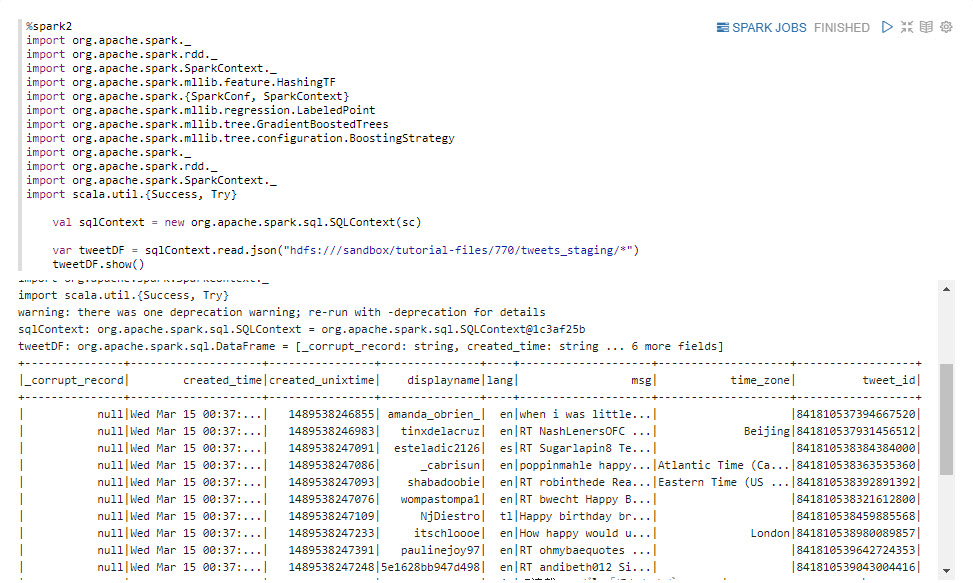

### Clean Records

In the following code we'll **clean-up** the data to **prevent bias in the model**.
We want to remove any tweet that doesnt contain happy or sad. Weve also chosen to select an equal number of happy and sad tweets to prevent bias in the model. Since weve loaded our data into a Spark DataFrame, we can use SQL-like statements to transform and select our data.

```scala
%spark2
var messages = tweetDF.select("msg")
println("Total messages: " + messages.count())

var happyMessages = messages.filter(messages("msg").contains("happy"))
val countHappy = happyMessages.count()
println("Number of happy messages: " +  countHappy)

var unhappyMessages = messages.filter(messages("msg").contains(" sad"))
val countUnhappy = unhappyMessages.count()
println("Unhappy Messages: " + countUnhappy)

val smallest = Math.min(countHappy, countUnhappy).toInt

//Create a dataset with equal parts happy and unhappy messages
var tweets = happyMessages.limit(smallest).unionAll(unhappyMessages.limit(smallest))
```


### Label the Data

**In the following code we label the data and force our model to learn the difference between happy and sad.** Now label each happy tweet as 1 and unhappy tweets as 0. In order to prevent our model from cheating, were going to remove the words happy and sad from the tweets. This will force it to infer whether the user is happy or sad by the presence of other words.

Finally, we also split each tweet into a collection of words. For convenience we convert the Spark Dataframe to an RDD which lets you easily transform data using the map function.

We now have a collection of tuples of the form (Int, Seq[String]), where a 1 for the first term indicates happy and 0 indicates sad. The second term is a sequence of words, including emojis. We removed the words happy and sad from the list of words.

```scala
%spark2
val messagesRDD = tweets.rdd
//We use scala's Try to filter out tweets that couldn't be parsed
val goodBadRecords = messagesRDD.map(
  row =>{
    Try{
      val msg = row(0).toString.toLowerCase()
      var isHappy:Int = 0
      if(msg.contains(" sad")){
        isHappy = 0
      }else if(msg.contains("happy")){
        isHappy = 1
      }
      var msgSanitized = msg.replaceAll("happy", "")
      msgSanitized = msgSanitized.replaceAll("sad","")
      //Return a tuple
      (isHappy, msgSanitized.split(" ").toSeq)
    }
  }
)

//We use this syntax to filter out exceptions
val exceptions = goodBadRecords.filter(_.isFailure)
println("total records with exceptions: " + exceptions.count())
exceptions.take(10).foreach(x => println(x.failed))
var labeledTweets = goodBadRecords.filter((_.isSuccess)).map(_.get)
println("total records with successes: " + labeledTweets.count())
```

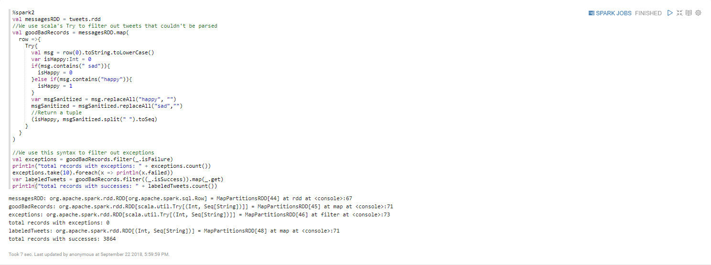

Let's take a look at our progress.

```scala
%spark2
labeledTweets.take(10).foreach(x => println(x))
```


### Transform Data

Gradient Boosting expects as input a vector (feature array) of fixed length, so we need a way to convert our tweets into some numeric vector that represents that tweet. A standard way to do this is to use the [hashing trick](https://en.wikipedia.org/wiki/Feature_hashing), in which we hash each word and index it into a fixed-length array. What we get back is an array that represents the count of each word in the tweet. This approach is called the [bag of words model](https://en.wikipedia.org/wiki/Bag-of-words_model), which means we are representing each sentence or document as a collection of discrete words and ignore grammar or the order in which words appear in a sentence. An alternative approach to bag of words would be to use an algorithm like Doc2Vec or Latent Semantic Indexing, which would use machine learning to build a vector representations of tweets.

In Spark were using HashingTF for feature hashing. Note that were using an array of size 2000. Since this is smaller than the size of the vocabulary well encounter on Twitter, it means two words with different meaning can be hashed to the same location in the array. Although it would seem this would be an issue, in practice this preserves enough information that the model still works. This is actually one of the strengths of feature hashing, that it allows you to represent a large or growing vocabulary in a fixed amount of space.

```scala
%spark2
val hashingTF = new HashingTF(2000)

//Map the input strings to a tuple of labeled point + input text
val input_labeled = (labeledTweets.map(
  t => (t._1, hashingTF.transform(t._2)))
  .map(x => new LabeledPoint((x._1).toDouble, x._2)))
```

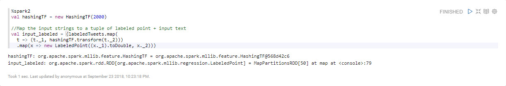

Let's take a look at how our vectors are hashed.

```scala
%spark2
input_labeled.take(10).foreach(println)
```


As you can see, we've converted each tweet into a vector of integers. This will work great for a machine learning model, but we want to preserve some tweets in a form we can read.

```scala
%spark2
//We're keeping the raw text for inspection later
var sample = (labeledTweets.take(1000).map(
  t => (t._1, hashingTF.transform(t._2), t._2))
  .map(x => (new LabeledPoint((x._1).toDouble, x._2), x._3)))
```

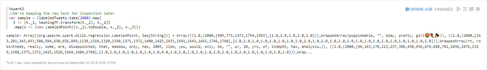

## Approach 2: Import Zeppelin Notebook via Zeppelin UI

Open HDP **Zeppelin UI** at http://sandbox-hdp.hortonworks.com:9995.

1\. Click **Import note**. Select **Add from URL**.

Insert the following URL cause we are going to import **Cleaning-Raw-Twitter-Data** notebook:

```bash
https://raw.githubusercontent.com/hortonworks/data-tutorials/master/tutorials/cda/building-a-sentiment-analysis-application/application/development/zeppelin-notebook/Cleaning-Raw-Twitter-Data.json
```

Click **Import Note**.

Your notebook **Cleaning-Raw-Twitter-Data** should be a part of the list of notebooks now.


Click on notebook **Cleaning-Raw-Twitter-Data**. Then press the **play** button for all paragraphs to be executed. The **play** button is near the title of this notebook at the top of the webpage.

Now we are finished cleaning the Twitter data. We can head to the summary to review how we cleaned the data and prepared it to be ready for visualization.

<!--

## Approach 3: Auto Deploy Zeppelin Notebook via REST Call

Open HDP **sandbox web shell client** at `sandbox-hdp.hortonworks.com:4200`.

We will use the Zeppelin REST Call API to import a notebook that uses SparkSQL or Hive to analyze Tweets.

```bash
NOTEBOOK_NAME="Cleaning-Raw-Twitter-Data"
wget https://github.com/james94/data-tutorials/raw/master/tutorials/cda/building-a-cybersecurity-breach-detection-application/application/development/shell/zeppelin-auto-deploy.sh
bash zeppelin-auto-deploy.sh $NOTEBOOK_NAME
```
 -->

## Summary

Congratulations! Reflecting on the steps we took to refine the data: **loaded the data** from HDFS into Spark, **cleaned the records** that didn't contain happy or sad to prevent a bias in the model, **labeled tweets** as 1 for happy and 0 for sad to teach the model to differentiate between happy versus sad and **transformed the data** into a vector of fixed length since Gradient Boosting expects that format as input. The twitter data has been preprocessed and is ready for the next phase of development, which is building the machine learning model.

## Further Reading

- [Spark SQL, DataFrames and Datasets Guide](https://spark.apache.org/docs/latest/sql-programming-guide.html)
- [RDD Programming Guide](https://spark.apache.org/docs/latest/rdd-programming-guide.html)
---
title: Building a Sentiment Classification Model
---

# 5.Building a Sentiment Classification Model

## Introduction

Our next objective is to build the sentiment classification model using our cleaned twitter dataset. First we must train our machine learning model by separating our data into a training set and validation set. Next we can choose Gradient Boosting to build our model. We will then evaluate our model to see how well it did against training and test set. In the evaluation, we will attempt to adjust the parameters of the model to see if we can increase the model's accuracy at how well it differentiates between happy and sad tweets. Once the model has configured for maximum accuracy, we will export it into HDFS for production use.

## Prerequisites

- Enabled Connected Data Architecture
- Setup the Development Environment
- Acquired Twitter Data
- **Cleaned Raw Twitter Data**

## Outline

- [Approach 1: Implement a Sentiment Classification Model](#approach-1-implement-a-sentiment-classification-model)
- [Approach 2: Import Zeppelin Notebook via Zeppelin UI](#approach-2-import-zeppelin-notebook-via-zeppelin-ui)
- [Summary](#summary)
- [Further Reading](#further-reading)

## Approach 1: Implement a Sentiment Classification Model

### Create Zeppelin Notebook for Building the Model

Open Zeppelin UI at http://sandbox-hdp.hortonworks.com:9995.

1\. Create new note.

Insert note name as `Building-Sentiment-Classification-Model`, then press **Create Note**.

Now the notebook is created and we will start writing the code to build the model for the data.


### Split into Training and Validation Sets

**When training any machine learning model you want to separate your data into a training set and a validation set.** The training set is what you actually use to build the model, whereas the validation set is used to evaluate the models performance afterwards on data that it has never encountered before. This is extremely important, because a model can have very high accuracy when evaluating training data but fail spectacularly when it encounters data it hasnt seen before.

This situation is called **overfitting**. A good predictive model will build a generalized representation of your data in a way that reflects real things going on in your problem domain, and this generalization gives it predictive power. A model that overfits will instead try to predict the exact answer for each piece of your input data, and in doing so it will fail to generalize. The way we know a model is overfitting is when it has high accuracy on the training dataset but poor or no accuracy when tested against the validation set. This is why its important to always test your model against a validation set.

**Fixing overfitting:**

A little overfitting is usually expected and can often be ignored. If you see that your validation accuracy is very low compared to your training accuracy, you can fix this overfitting by either increasing the size of your training data or by decreasing the number of parameters in your model. By decreasing the number of parameters you decrease the models ability to memorize large numbers of patterns. This forces it to build a model of your data in general, which makes it represent your problem domain instead of just memorizing your training data.

 Copy and paste the Scala Spark code into Zeppelin notebook to split your data
 into a training set and a validation set:

```scala
// Split the data into training and validation sets (30% held out for validation testing)
val splits = input_labeled.randomSplit(Array(0.7, 0.3))
val (trainingData, validationData) = (splits(0), splits(1))
```


### Build the Model

This machine learning application uses Gradient Boosting for classification.
The reason we chose Gradient Boosting for classification over some other model is because its easy to use (doesnt require tons of parameter tuning), and it tends to have a high classification accuracy. For this reason it is frequently used in machine learning competitions.

The tuning parameters were using here are:
-number of iterations (passes over the data)
-Max Depth of each decision tree

In practice when building machine learning models you usually have to test different settings and combinations of tuning parameters until you find one that works best. For this reason its usually best to first train the model on a subset of data or with a small number of iterations. This lets you quickly experiment with different tuning parameter combinations.

This step may take a few minutes on a sandbox VM. If youre running on a sandbox and its taking more than five minutes you may want to stop the process and decrease the number of iterations.

```scala
val boostingStrategy = BoostingStrategy.defaultParams("Classification")
boostingStrategy.setNumIterations(20) //number of passes over our training data
boostingStrategy.treeStrategy.setNumClasses(2) //We have two output classes: happy and sad
boostingStrategy.treeStrategy.setMaxDepth(5)
//Depth of each tree. Higher numbers mean more parameters, which can cause overfitting.
//Lower numbers create a simpler model, which can be more accurate.
//In practice you have to tweak this number to find the best value.

val model = GradientBoostedTrees.train(trainingData, boostingStrategy)
```


### Evaluate Model

Let's evaluate the model to see how it performed against our training and test set.

```scala
%spark2
// Evaluate model on test instances and compute test error
var labelAndPredsTrain = trainingData.map { point =>
  val prediction = model.predict(point.features)
  Tuple2(point.label, prediction)
}

var labelAndPredsValid = validationData.map { point =>
  val prediction = model.predict(point.features)
  Tuple2(point.label, prediction)
}

//Since Spark has done the heavy lifting already, lets pull the results back to the driver machine.
//Calling collect() will bring the results to a single machine (the driver) and will convert it to a Scala array.

//Start with the Training Set
val results = labelAndPredsTrain.collect()

var happyTotal = 0
var unhappyTotal = 0
var happyCorrect = 0
var unhappyCorrect = 0
results.foreach(
  r => {
    if (r._1 == 1) {
      happyTotal += 1
    } else if (r._1 == 0) {
      unhappyTotal += 1
    }
    if (r._1 == 1 && r._2 ==1) {
      happyCorrect += 1
    } else if (r._1 == 0 && r._2 == 0) {
      unhappyCorrect += 1
    }
  }
)
println("unhappy messages in Training Set: " + unhappyTotal + " happy messages: " + happyTotal)
println("happy % correct: " + happyCorrect.toDouble/happyTotal)
println("unhappy % correct: " + unhappyCorrect.toDouble/unhappyTotal)

val testErr = labelAndPredsTrain.filter(r => r._1 != r._2).count.toDouble / trainingData.count()
println("Test Error Training Set: " + testErr)


//Compute error for validation Set
val results = labelAndPredsValid.collect()

var happyTotal = 0
var unhappyTotal = 0
var happyCorrect = 0
var unhappyCorrect = 0
results.foreach(
  r => {
    if (r._1 == 1) {
      happyTotal += 1
    } else if (r._1 == 0) {
      unhappyTotal += 1
    }
    if (r._1 == 1 && r._2 ==1) {
      happyCorrect += 1
    } else if (r._1 == 0 && r._2 == 0) {
      unhappyCorrect += 1
    }
  }
)
println("unhappy messages in Validation Set: " + unhappyTotal + " happy messages: " + happyTotal)
println("happy % correct: " + happyCorrect.toDouble/happyTotal)
println("unhappy % correct: " + unhappyCorrect.toDouble/unhappyTotal)

val testErr = labelAndPredsValid.filter(r => r._1 != r._2).count.toDouble / validationData.count()
println("Test Error Validation Set: " + testErr)
```

Lets take some time to reflect on our result back at the **tutorial page (EXTERNAL LINK)**.


Example taken from the output when the code was executed at the time the image
above was taken:

```
unhappy messages in Training Set: 1413 happy messages: 1380
happy % correct: 0.7130434782608696
unhappy % correct: 0.9072894550601557
testErr: Double = 0.1886860007160759
Test Error Training Set: 0.1886860007160759

unhappy messages in Validation Set: 552 happy messages: 519
happy % correct: 0.6454720616570327
unhappy % correct: 0.8641304347826086
testErr: Double = 0.2623716153127918
Test Error Validation Set: 0.2623716153127918
```

The results show that the model is very good at detecting unhappy messages (86% accuracy), and significantly less adept at identifying happy messages (64% accuracy). To improve this we could provide the model more examples of happy messages to learn from.

Also note that our training accuracy is slightly higher than our validation accuracy. This is an example of slightly overfitting the training data. Since the training accuracy is only slightly higher than the validation accuracy, this is normal and not something we should concerned about. However, if the validation accuracy was significantly worse than the training accuracy, it would mean the model had grossly overfit its training data. In that situation, you would want to either increase the amount of data available for training or decrease the number of parameters (the complexity) of the model.

### Taking a closer look

Let's take some time to evaluate how our model did by dissecting the data at the individual tweet level.

```scala
%spark2
//Print some examples and how they scored
val predictions = sample.map { point =>
  val prediction = model.predict(point._1.features)
  (point._1.label, prediction, point._2)
}

//The first entry is the true label. 1 is happy, 0 is unhappy.
//The second entry is the prediction.
predictions.take(100).foreach(x => println("label: " + x._1 + " prediction: " + x._2 + " text: " + x._3.mkString(" ")))
```


Once you've trained your first model, you should go back and tweak the model parameters to see if you can increase model accuracy. In this case, try tweaking the depth of each tree and the number of iterations over the training data. You could also let the model see a greater percentage of happy tweets than unhappy tweets to see if that improves prediction accuracy for happy tweets.

### Exporting the Model

Once your model is as accurate as you can make it, you can export it for production use. Models trained with Spark can be easily loaded back into a Spark Structured
Streaming workflow for use in production.

```scala
%spark2
model.save(sc, "hdfs:///sandbox/tutorial-files/770/tweets/RandomForestModel")
```


You've now seen how to build a sentiment analysis model. The techniques you've seen here can be applied to other text classification models besides sentiment analysis. Try analyzing other keywords besides happy and sad and see what results you get.

```scala
%spark2
println(model.predict(hashingTF.transform("To this cute little happy sunshine who never fails to bright up my day with his sweet lovely smiles ".split(" ").toSeq)))
```

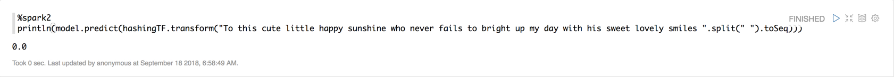

## Approach 2: Import Zeppelin Notebook via Zeppelin UI

Open HDP **Zeppelin UI** at http://sandbox-hdp.hortonworks.com:9995.

1\. Click **Import note**. Select **Add from URL**.

Insert the following URL cause we are going to import **Building-Sentiment-Classification-Model** notebook:

```bash
https://raw.githubusercontent.com/hortonworks/data-tutorials/master/tutorials/cda/building-a-sentiment-analysis-application/application/development/zeppelin-notebook/Building-Sentiment-Classification-Model.json
```

Click **Import Note**.

Your notebook **Building-Sentiment-Classification-Model** should be a part of the list of notebooks now.


Click on notebook **Building-Sentiment-Classification-Model**. Then press the **play** button for all paragraphs to be executed. The **play** button is near the title of this notebook at the top of the webpage.

Now we are finished cleaning the Twitter data. We can head to the summary to review how we cleaned the data and prepared it to be ready for visualization.

<!--

## Approach 3: Auto Deploy Zeppelin Notebook via REST Call

Open HDP **sandbox web shell client** at `sandbox-hdp.hortonworks.com:4200`.

We will use the Zeppelin REST Call API to import a notebook that uses SparkSQL to analyze NASA's server logs for possible breaches.

```bash
NOTEBOOK_NAME="Building-Sentiment-Classification-Model"
wget https://github.com/james94/data-tutorials/raw/master/tutorials/cda/building-a-cybersecurity-breach-detection-application/application/development/shell/zeppelin-auto-deploy.sh
bash zeppelin-auto-deploy.sh $NOTEBOOK_NAME
```
-->


## Summary

Congratulations! You learned how to build a sentiment classification model using SparkML's Gradient Boosting. The techniques youve seen here can be directly applied to other text classification models, such as spam classification. Later on feel free to try running this code with other keywords besides happy and sad and see what models you can build.

Reviewing the process we took to build the model: separated the data into a training set and validation set, evaluated the model for accuracy, configured the model for maximum accuracy and exported it into HDFS for later use with Spark Streaming.

## Further Reading

- [Spark Machine Learning Library (MLlib) Guide](https://spark.apache.org/docs/latest/ml-guide.html)
---
title: Deploying a Sentiment Classification Model
---

# 6.Deploying a Sentiment Classification Model

## Introduction

Our next objective as a Data Engineer is to implement a Spark Structured Streaming application in Scala that pulls in the sentiment model from HDFS running on HDP, then pulls in fresh tweet data from Apache Kafka topic "tweet" running on HDP, does some processing by adding a sentiment score to each tweet based on the trained model output and streams each tweet with the new sentiment score field to Apache Kafka topic "tweetsSentiment" running on HDF.

## Prerequisites

- Enabled Connected Data Architecture
- Setup the Development Environment
- Acquired Twitter Data
- Cleaned Raw Twitter Data
- Built a Sentiment Classification Model
- Go through **[Setting up a Spark Development Environment with Scala](https://hortonworks.com/tutorial/setting-up-a-spark-development-environment-with-scala/)**, it will cover **installing SBT**, **IntelliJ** with Scala Plugin and some basic concepts that will be built upon in this tutorial

## Outline

- [Implement a Spark Streaming App to Deploy the Model](#approach-1-implement-a-spark-streaming-app-to-deploy-the-model)
- [Summary](#summary)
- [Further Reading](#further-reading)

## Approach 1: Implement a Spark Streaming App to Deploy the Model

### Create New IntelliJ Project

**Create New Project**


Select **Scala** with **sbt**, then press next.


Name your project `DeploySentimentModel`

Feel free to use InteliJ's default location for storing the application. The one
in the following picture was a custom location to store the application.

Select appropriate **sbt version 1.2.3** and **Scala version 2.11.12**. Make sure sources are checked to download sources.


Click **finish** to proceed. Open the **Project** folder.

### Project folder

From **project**, we will verify **build.properties** contains the appropriate **sbt** version. Next we will create a plugins.sbt folder to have **sbt** download the plugins needed to import external libraries.

### build.properties

Verify **build.properties** file contains the appropriate **SBT version**.
It should match the version you chose when you created the IntelliJ project.

```scala
sbt.version = 1.2.3
```

By adding the **SBT version**, this allows people with different versions of the SBT launcher to build the same project with consistent results.

### plugins.sbt

**What is a Plugin?**

- A plugin adds new setting, which extension to the build definition. In our case,
we need to add **sbt-assembly** and **sbt-depedency-graph** plugins.

Right click on **project** folder, select **new**, then select **file**.
Name the file `plugins.sbt`, then click **ok**.

Add the following lines to the file:

```scala
logLevel := Level.Warn
addSbtPlugin("com.eed3si9n" % "sbt-assembly" % "0.14.7")
addSbtPlugin("net.virtual-void" % "sbt-dependency-graph" % "0.9.2")
```


If you haven't enabled auto import for sbt projects, you should **Enable-Auto-Import**. Anytime we add more plugins to this file, IntelliJ will allow sbt to auto import them.

What do the keywords in the configuration file for SBT mean?

- **logLevel**: controls the logging level for our project, currently we have enabled debug logging for all tasks in the current project
- **addSbtPlugin**: allows for you to declare plugin dependency, takes as input the following format ("`IvyModuleID`" % "`ArtifactID`" % "`Revision`")
- **sbt-assembly**: this plugin creates a fat JAR of your project with all its dependencies
- **sbt-dependency-graph**: this plugin visualizes your project's dependencies

**plugins.sbt Reference:**

- for more information on **logLevel**, refer to [Configure and use logging](https://www.scala-sbt.org/1.x/docs/Howto-Logging.html)
- for more information on **sbt-assembly** plugin dependency, such as revision used, refer to [sbt-assembly repo - Using Published Plugin](https://github.com/sbt/sbt-assembly)
- for more information on **sbt-dependency-graph** plugin dependency, such as revision used, refer to [sbt-dependency-graph repo](https://github.com/jrudolph/sbt-dependency-graph)

### SBT

We will use SBT to import the **Spark libraries**, **Kafka library**, **Google gson library**, **tyesafe config library** and the **appropriate documentation** into IntelliJ. Thus, IntelliJ can recognize Spark and GSON code. Copy and paste the following lines to the file **build.sbt** to overwrite it:

```scala
name := "DeploySentimentModel"

version := "2.0.0"

scalaVersion := "2.11.12"

libraryDependencies ++= {
  val sparkVer = "2.3.1"
  Seq(
    "org.apache.spark"     %% "spark-core"              % sparkVer % "provided" withSources(),
    "org.apache.spark"     %% "spark-mllib"             % sparkVer % "provided" withSources(),
    "org.apache.spark"     %% "spark-sql"               % sparkVer % "provided" withSources(),
    "org.apache.spark"     %% "spark-streaming"         % sparkVer % "provided" withSources(),
    "org.apache.spark"     %% "spark-streaming-kafka-0-10" % sparkVer withSources(),
    "org.apache.spark"     %% "spark-sql-kafka-0-10" % sparkVer withSources(),
    "org.apache.kafka"     %% "kafka" % "0.10.2.2" withSources(),
    "org.jpmml"            % "pmml-model" % "1.4.6",
    "com.typesafe" % "config" % "1.3.3",
    "com.google.code.gson" % "gson" % "2.8.5"
  )
}


assemblyMergeStrategy in assembly := {
  case PathList("org", "apache", xs @ _*)      => MergeStrategy.first
  case PathList("javax", "xml", xs @ _*)      => MergeStrategy.first
  case PathList("com", "esotericsoftware", xs @ _*)      => MergeStrategy.first
  case PathList("com", "google", xs @ _*)      => MergeStrategy.first
  case x =>
    val oldStrategy = (assemblyMergeStrategy in assembly).value
    oldStrategy(x)
}
```


What do the keywords in the configuration file for SBT mean?

- **name**: specifies project name
- **version**: specifies project version
- **scalaVersion**: specifies Scala version
- **libraryDependencies**: specifies that we want SBT to import the following `Spark libraries` **spark-core, spark-mllib, spark-sql, spark-streaming, spark-streaming-kafka-0-10, spark-sql-kafka-0-10** with associated `sparkVer` **2.3.1**, import the following `Kafka library` **kafka** with associated version **0.10.0**, import the following `typesafe library` **config** with associated version **1.3.1** and import `Google gson library` **gson** with associated version **2.8.0**
- **Group ID**: Ex: org.apache.spark
- **Artficate ID**: Ex: spark-core
- **Revision**: sparkVer = 2.3.1, but you could explicitly write the version number too
- **%%**: Ex: appends **scala version** to **ArtifactID**
- **Seq(...)**: used in combination with **++=** to load multiple library dependencies in SBT
- **assemblyMergeStrategy**: maps `path names` to `merge strategies`, each case pattern uses PathList(...) mapped to MergeStrategy.first, which says pick the first of matching files in the classpath order. Ex: the first case pattern uses `PathList(...)` to pick `org/apache/*` from the first jar.

**SBT Reference:**

- **libraryDependencies** is built-in sbt, for more info look into [libraryDependencies - sbt doc](https://www.scala-sbt.org/1.x/docs/Library-Dependencies.html)
- **assemblyMergeStrategy** is an sbt plugin, for more info look into [sbt-assembly repo](https://github.com/sbt/sbt-assembly)
- [Spark Streaming + Kafka 0.10.0 Integration Guide](https://spark.apache.org/docs/latest/streaming-kafka-0-10-integration.html)
- If you run into unresolved dependency for a module not found indicated by Build log, then you should refer to link **[mvnrepository](http://mvnrepository.com)** and check each libraryDependency to make sure the build definition line is correct

Now that we added the Spark Structured Streaming application dependencies, we are ready to start writing the code.

### Create Spark Structured Streaming Application

### resources folder

In your project, if the **resources** folder or directory does not exist yet, create a directory under **src/main** called `resources`, and create the `application.conf` file there.

### application.conf

**application.conf** holds the configurations about our environment in which we will run the application. We will use the following configuration file and load configurations into **Scala**.

```scala
spark {

  kafkaBrokers {
    kafkaBrokerHDF: "sandbox-hdf.hortonworks.com:6667"
    kafkaBrokerHDP: "sandbox-hdp.hortonworks.com:6667"
  }

  appName = "DeploySentimentModel"
  messageFrequency = 200 //milliseconds
  modelLocation = "hdfs:///sandbox/tutorial-files/770/tweets/RandomForestModel"

  kafkaTopics {
    tweetsRaw: "tweets"
    tweetsWithSentiment: "tweetsSentiment"
  }
}
```

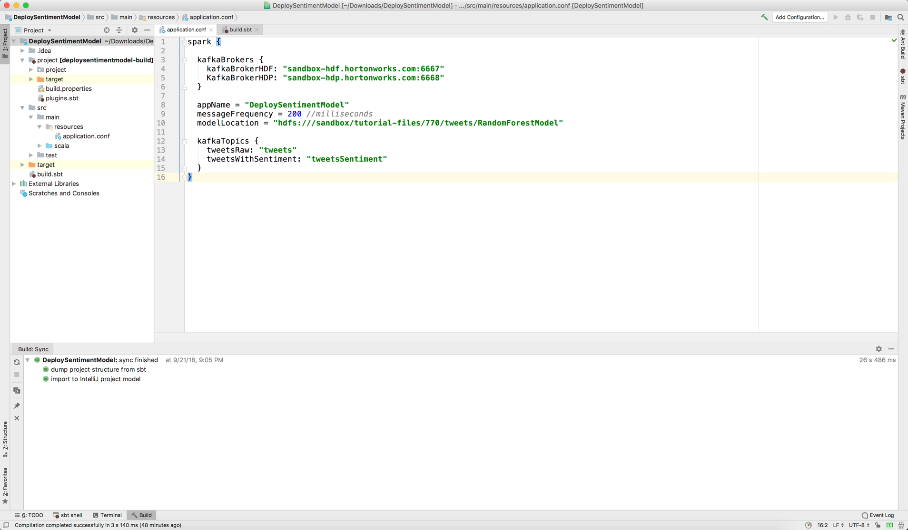

What configurations are we passing to Scala with this file?

- **kafkaBrokers**: specifies the server location in which each Kafka Broker at HDF and HDP used in the application listens in on for packets coming into the application.
- **appName**: specifies application name
- **messageFrequency**: how often to send messages
- **modelLocation**: location our machine learning model resides
- **kafkaTopics**: Kafka topics that will be used in the **Spark Structured Streaming** application

**application.conf Reference:**

- For more information on Scala configuration files, refer to [Loading Configurations in Scala](https://danielasfregola.com/2015/06/01/loading-configurations-in-scala/)

### Collect.scala

Now that we have our **application.conf** file, we will reference it in the **Collect.scala** code file that we will implement. Create a **new file** called `Collect.scala` in **src/main/scala** directory. Copy and paste the following code into the file:

```scala
package main.scala

import java.util.Properties

import scala.util.control.ControlThrowable
import com.google.gson.{Gson, JsonParser}
import com.typesafe.config.ConfigFactory
import org.apache.kafka.clients.producer.{KafkaProducer, ProducerRecord}
import org.apache.spark.mllib.classification.LogisticRegressionModel
import org.apache.spark.mllib.tree.model.GradientBoostedTreesModel
import org.apache.spark.sql.{ForeachWriter, SparkSession}
import org.dmg.pmml.True

import scala.util.Try

case class CollectOptions(
                           kafkaBrokerHDF: String,
                           kafkaBrokerHDP: String,
                           tweetsTopic: String,
                           tweetsWithSentimentTopic: String,
                           appName:String,
                           modelLocation:String
                         )

/** Setup Spark Streaming */
object Collect {
  private implicit val config = ConfigFactory.load()
  def main(args: Array[String]) {

    val options = new CollectOptions(
      config.getString("spark.kafkaBrokers.kafkaBrokerHDF"),
      config.getString("spark.kafkaBrokers.kafkaBrokerHDP"),
      config.getString("spark.kafkaTopics.tweetsRaw"),
      config.getString("spark.kafkaTopics.tweetsWithSentiment"),
      config.getString("spark.appName"),
      config.getString("spark.modelLocation")
    )

    val spark = SparkSession
      .builder
      .appName("DeploySentimentModel")
      .getOrCreate()
    spark.sparkContext.setLogLevel("ERROR")

    var model: GradientBoostedTreesModel = null
    if(options.modelLocation != null) {
      try {
        model = GradientBoostedTreesModel.load(spark.sparkContext, options.modelLocation)
      }catch{
        case unknown : ControlThrowable => println("Couldn't load Gradient Boosted Model. Have you built it with Zeppelin yet?")
          throw unknown
      }
    }
    //Instantiate model. Model should already be trained and exported with associated Zeppelin notebook.

    import spark.implicits._

    // Create DataSet representing the stream of input lines from kafka
    val rawTweets = spark
      .readStream
      .format("kafka")
      .option("kafka.bootstrap.servers", options.kafkaBrokerHDP)
      .option("subscribe", options.tweetsTopic)
      .load()
      .selectExpr("CAST(value AS STRING)")
      .as[String]

    rawTweets.printSchema()
    //Our Predictor class can't be serialized, so we're using mapPartition to create
    // a new model instance for each partition.
    val tweetsWithSentiment = rawTweets.mapPartitions((iter) => {
      val pred = new Predictor(model)//options.modelLocation, context)
      val parser = new JsonParser()
      iter.map(
        tweet =>
          //For error handling, we're mapping to a Scala Try and filtering out records with errors.
          Try {
            val element = parser.parse(tweet).getAsJsonObject
            val msg = element.get("text").getAsString
            val sentiment = pred.predict(msg)
            element.addProperty("sentiment", pred.predict(tweet))
            val json = element.toString
            println(json)
            json
          }
      ).filter(_.isSuccess).map(_.get)
    })

    val query = tweetsWithSentiment.writeStream
      .outputMode("append")
      .format("console")
      .start()

    //Push back to Kafka
    val kafkaProps = new Properties()
    //props.put("metadata.broker.list",  options.kafkaBrokerList)
    kafkaProps.put("bootstrap.servers", options.kafkaBrokerHDF)
    kafkaProps.put("key.serializer", "org.apache.kafka.common.serialization.StringSerializer")
    kafkaProps.put("value.serializer", "org.apache.kafka.common.serialization.StringSerializer")

    tweetsWithSentiment
      .writeStream
      .foreach(
        new ForeachWriter[(String)] {

          //KafkaProducer can't be serialized, so we're creating it locally for each partition.
          var producer:KafkaProducer[String, String] = null

          override def process(value: (String)) = {
            val message = new ProducerRecord[String, String](options.tweetsWithSentimentTopic, null,value)
            println("sending windowed message: " + value)
            producer.send(message)
          }

          override def close(errorOrNull: Throwable) = ()

          override def open(partitionId: Long, version: Long) = {
            producer = new KafkaProducer[String, String](kafkaProps)
            true
          }
        }).start()

    query.awaitTermination()
  }
}
```


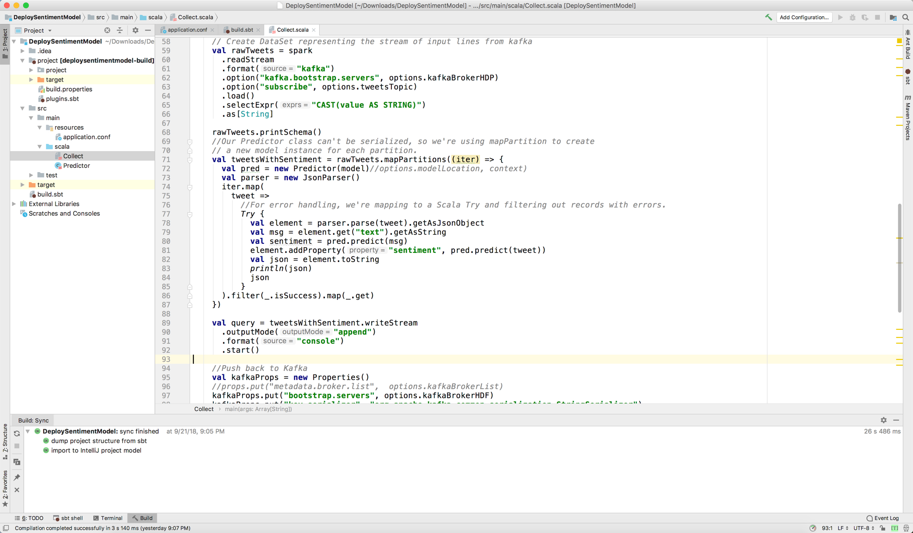

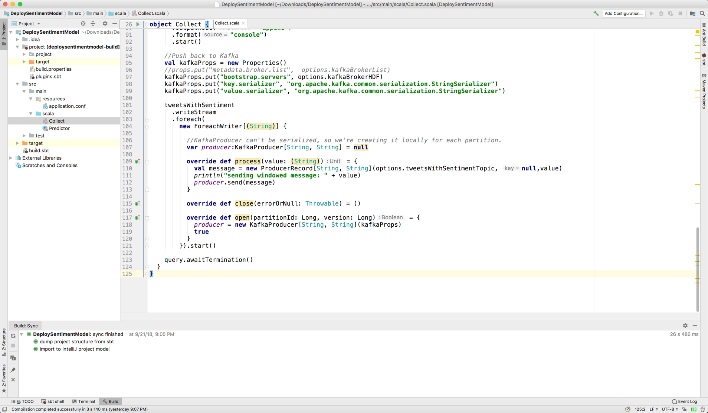

### Predictor.scala

Since we are referencing the Predictor class in **Collect.scala** source file to predict whether the tweet is happy or sad and it hasn't been implemented yet, we will develop **Predictor.scala** source file. Create a new Scala Class file called `Predictor` in **src/main/scala** directory and for **kind**, choose **Class**. Copy and paste the following code into the file

```scala
package main.scala

import org.apache.spark.SparkContext
import org.apache.spark.mllib.tree.GradientBoostedTrees
import org.apache.spark.mllib.tree.model.GradientBoostedTreesModel
import org.apache.spark.mllib.feature.HashingTF
import org.apache.spark.mllib.linalg.{Vector, Vectors}

/**
  * Predict violations
  */
class Predictor(model: GradientBoostedTreesModel){//modelLocation:String, sc:SparkContext) {

  //  var model: GradientBoostedTreesModel = null
  //  if(modelLocation != null)
  //    model = GradientBoostedTreesModel.load(sc, modelLocation)

  /**
    * Returns 1 for happy, 0 for unhappy
    * @param tweet
    * @return
    */
  def predict(tweet:String): Double ={
    if(tweet == null || tweet.length == 0)
      throw new RuntimeException("Tweet is null")
    val features = vectorize(tweet)
    return model.predict(features)
  }

  val hashingTF = new HashingTF(2000)
  def vectorize(tweet:String):Vector={
    hashingTF.transform(tweet.split(" ").toSeq)
  }

}
```


### Overview of Spark Code to Deploy Model

To submit the code to Spark we need to compile it and submit it to Spark. Since our code depends on other libraries (like GSON) to run, we ought to package our code with these dependencies into an assembly that can be submitted to Spark. To do this we're using a dependency manager called SBT, which you'll need to install on your machine, if you haven't done so, refer to the prerequisites. (You'll notice we also added this line of code to the plugins.sbt file, which is also required.) Once you've installed it, you can package your code and dependencies into a single jar. Open your mac/linux terminal or windows git bash on your host machine not virtual machine, then run the following shell code:

```bash
cd ~/IdeaProjects/DeploySentimentModel
sbt clean
sbt assembly
```

This will create a single jar file inside the target folder. You can copy this jar into the HDP sandbox like this:

```scala
scp -P 2222 ./target/scala-2.11/DeploySentimentModel-assembly-1.0.0.jar root@sandbox-hdp.hortonworks.com:/root
```

Once this has been copied to the HDP sandbox, you want to make sure **Kafka** is turned on for both HDP and HDF sandboxes, **Spark2 and HBase** is turned on for HDP sandbox and **NiFi** is turned on for HDF sandbox. Make sure the NiFi flow is turned on and tweets are flowing to Kafka via Spark Structured Streaming.

Open your HDP sandbox web shell at http://sandbox-hdp.hortonworks.com:4200. The login is `root` and the password you set. Then use spark-submit to deploy the jar to Spark:

```scala
/usr/hdp/current/spark2-client/bin/spark-submit --class "main.scala.Collect" --master local[4] ./DeploySentimentModel-assembly-1.0.0.jar
```

Here we're deploying the jar on a single machine only by using --master local[4]. In production you want to change these settings to run on Yarn. Once you submit the job you should see output on the terminal as Spark scores each tweet.


The shell output (running on windows 10 git bash similar for mac/linux terminal)
illustrates that Spark Structured Streaming Application is pulling in data from
HDP Kafka topic "tweets" and streaming the tweets with a sentiment score to HDF
Kafka topic "tweetsSentiment".

## Summary

Congratulations! You implemented a Spark Structured Streaming application that pulls in JSON messages from Kafka topic "tweets", adds a sentiment field to the JSON based on the sentiment model loaded in from HDFS and sends the enriched data back to Kafka topic "tweetsSentiment".

## Further Reading

- [Building a Scala Project With IntelliJ and SBT](https://docs.scala-lang.org/getting-started-intellij-track/building-a-scala-project-with-intellij-and-sbt.html)
- [Apache Spark Structured Streaming](https://spark.apache.org/docs/latest/structured-streaming-programming-guide.html)
- [Apache Spark 2.3.1 + Kafka Integration](https://spark.apache.org/docs/2.3.1/structured-streaming-kafka-integration.html)
- [Google GSON Library](https://github.com/google/gson)
- [Java JPMML API](https://github.com/jpmml)
- [SBT Assembly](https://github.com/sbt/sbt-assembly)
---
title: Visualizing Sentiment Scores
---

# 7.Visualizing Sentiment Scores

## Introduction

You will use Zeppelin's JDBC Hive Interpreter to perform SQL queries against the noSQL HBase table "tweets_sentiment" for the sum of happy and sad tweets and perform visualizations of the results.

## Prerequisites

- Enabled Connected Data Architecture
- Setup the Development Environment
- Acquired Twitter Data
- Cleaned Raw Twitter Data
- Built a Sentiment Classification Model
- Deployed a Sentiment Classification Model

## Outline

- [Implement a Zeppelin Notebook to Visualize Sentiment Scores](#implement-a-zeppelin-notebook-to-visualize-sentiment-scores)
- [Summary](#summary)
- [Further Reading](#further-reading)

## Implement a Zeppelin Notebook to Visualize Sentiment Scores

### Create Hive Table Mapping to HBase Table

To visualize the data stored in HBase, you can use zeppelin's JDBC Hive Interpreter:

```sql
%jdbc(hive)
CREATE EXTERNAL TABLE IF NOT EXISTS tweets_sentiment(`key` BIGINT, `handle` STRING, `language` STRING, `location` STRING, `sentiment` DOUBLE, `tweet_id` BIGINT)
STORED BY 'org.apache.hadoop.hive.hbase.HBaseStorageHandler'
WITH SERDEPROPERTIES("hbase.columns.mapping" = ":key,social_media_sentiment:twitter.handle,social_media_sentiment:twitter.language,social_media_sentiment:twitter.location,social_media_sentiment:twitter.sentiment,social_media_sentiment:twitter.tweet_id")
TBLPROPERTIES("hbase.table.name" = "tweets_sentiment");
```

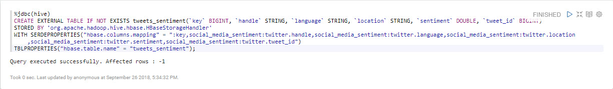

### Load a Sample of the Data

Load data from the Hive table:

```sql
%jdbc(hive)
SELECT * FROM tweets_sentiment;
```


### Visualize Sentiment Score Per Language in Bar Chart

To see each tweet's sentiment score per language, copy and paste the following query.


```sql
%jdbc(hive)
SELECT language, sentiment FROM tweets_sentiment;
```

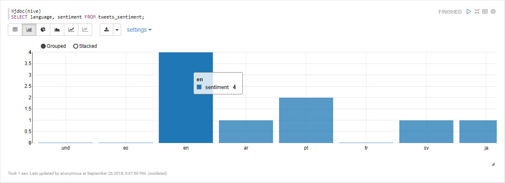

## Summary

Congratulations! You just learned to write Hive code to access an HBase table, query against the table and visualize the data using Zeppelin's JDBC Hive Interpreter.

## Further Reading

- [Hive HBaseIntegration](https://cwiki.apache.org/confluence/display/Hive/HBaseIntegration)
