# 0.Building a Server Log Analysis Application

## Introduction

Security Breaches are common problem for businesses with the question of when it
will happen? One of the first lines of defense for detecting potential
vulnerabilities in the network is to investigate the logs from your server. You
have been brought on to apply your skills in Data Engineering and Data Analysis
to acquire server log data, preprocess the data and store it into reliable
distributed storage HDFS using the dataflow management framework Apache NiFi.
You will need to further clean and refine the data using Apache Spark for
specific insights into what activities are happening on your server, such as
most frequent hosts hitting the server and which country or city causes the
most network traffic with your server. You will then visualize these events
using the data science notebook Apache Zeppelin to be able to tell a story
to about the activities occurring on the server and if there is anything your
team should be cautious about.

## Big Data Technologies used to develop the Application:

- [NASA Server Logs Dataset](http://ita.ee.lbl.gov/html/contrib/NASA-HTTP.html)
- [HDF Sandbox](https://hortonworks.com/products/data-platforms/hdf/)
    - [Apache Ambari](https://ambari.apache.org/)
    - [Apache NiFi](https://nifi.apache.org/)
- [HDP Sandbox](https://hortonworks.com/products/data-platforms/hdp/)
    - [Apache Ambari](https://ambari.apache.org/)
    - [Apache Hadoop - HDFS](https://hadoop.apache.org/docs/r3.1.0/)
    - [Apache Spark](https://spark.apache.org/)
    - [Apache Zeppelin](https://zeppelin.apache.org/)

## Goals and Objectives

- Learn about server log data, log data analysis, how it works, the various use cases
and best practices
- Learn to build a NiFi dataflow to acquire server log data
- Learn to clean the data for filtering down to messages that can tell users
about the activities happening on their servers using Spark
- Learn to visualization your finding after cleaning the data using Zeppelin
visualization

## Prerequisites

- Downloaded and deployed the [Hortonworks Data Platform (HDP)](https://www.cloudera.com/downloads/hortonworks-sandbox/hdp.html?utm_source=mktg-tutorial) Sandbox
- Read through [Learning the Ropes of the HDP Sandbox](https://hortonworks.com/tutorial/learning-the-ropes-of-the-hortonworks-sandbox/) to setup hostname mapping to IP address
- If you don't have at least 20GB of RAM for HDP Sandbox and 4 GB of RAM for your machine, then refer to [Deploying Hortonworks Sandbox on Microsoft Azure](https://hortonworks.com/tutorial/sandbox-deployment-and-install-guide/section/4/)
- Enabled Connected Data Architecture:
  - [Enable CDA for VirtualBox](https://hortonworks.com/tutorial/sandbox-deployment-and-install-guide/section/1/#enable-connected-data-architecture-cda---advanced-topic)
  - [Enable CDA for VMware](https://hortonworks.com/tutorial/sandbox-deployment-and-install-guide/section/2/#enable-connected-data-architecture-cda---advanced-topic)
  - [Enable CDA for Docker](https://hortonworks.com/tutorial/sandbox-deployment-and-install-guide/section/3/#enable-connected-data-architecture-cda---advanced-topic)

## Outline

The tutorial series consists of the following tutorial modules:

1\. **[Application Development Concepts](https://hortonworks.com/tutorial/building-a-server-log-analysis-application/section/1/)**: Covers what is server log data, log data analysis, how log data analysis works, various use cases and some best practices that can be used in server log analysis.

2\. **[Setting up the Development Environment](https://hortonworks.com/tutorial/building-a-server-log-analysis-application/section/2/)**: You will perform any configurations on software services and/or install dependencies for software services that are needed to develop the application.

3\. **[Acquiring NASA Server Log Data](https://hortonworks.com/tutorial/building-a-server-log-analysis-application/section/3/)**: You will learn to build a NiFi dataflow that acquires 2 months worth of NASA log data, preprocesses the data and stores it into HDFS

4\. **[Cleaning the Raw NASA Log Data](https://hortonworks.com/tutorial/building-a-server-log-analysis-application/section/4/)**: You will learn to create a Zeppelin Notebook for cleaning the NASA log data and use Zeppelin's Spark Interpreter to clean the data and gather any valuable insight about the activities going on with the server.

5\. **[Visualizing NASA Log Data](https://hortonworks.com/tutorial/building-a-server-log-analysis-application/section/5/)**: You will create another Zeppelin Notebook whose purpose will be to visualize the key points you found when cleaning the data with Spark. Your data visualization will illustrate from the NASA log data, the _Most Frequent Hosts_ - count per IP address of hosts hitting the server, _Response Codes_ - count per response code in association with the server, _Type of Extensions_ - count of the type of file formats being transferred between devices interacting with the server, _Network Traffic per Location_ - location on where the server hits are coming from.
---
title: Application Development Concepts
---

# 1.Application Development Concepts

## Introduction

Security breaches happen. And when they do, your server logs may be your best
line of defense. Hadoop takes server-log analysis to the next level by speeding
and improving security forensics and providing a low cost platform to show
compliance.

## Prerequisites

- Read overview of tutorial series

## Outline

- [Server Log Data](#server-log-data)
- [NASA Server Logs Dataset](#nasa-server-logs-dataset)
- [What is Log Analysis?](#what-is-log-analysis)
- [How Does Log Analysis Work?](#how-does-log-analysis-work)
- [Use Cases For Log Analysis](#use-cases-for-log-analysis)
- [Best Practices For Log Analysis](#best-practices-for-log-analysis)
- [Summary](#summary)
- [Further Reading](#further-reading)

## Server Log Data

Server logs are computer-generated log files that capture network and server
operations data. They are useful for managing network operations, especially
for security and regulatory compliance.

## NASA Server Logs Dataset

The dataset which we are going to use in this lab is of NASA-HTTP. It has HTTP
requests to the NASA Kennedy Space Center WWW server in Florida. The logs are
an ASCII file with one line per request, with the following columns:

- **host** making the request. A hostname when possible, otherwise the Internet
address if the name could not be looked up.
- **timestamp** in the format "DAY MON DD HH:MM:SS YYYY", where DAY is the day
of the week, MON is the name of the month, DD is the day of the month, HH:MM:SS
is the time of day using a 24-hour clock, and YYYY is the year. The timezone
is -0400.
- **request** given in quotes.
- **HTTP** reply code.
- **bytes** in the reply.

## What is Log Analysis?

Server Log Analysis is an evaluation of records generated by computers,
networks or other IT systems. Log analysis is leveraged by organizations to
decrease a variety of risks and abide by compliance standards.

## How Does Log Analysis Work?

Logs are made up of several messages in chronological order and stored on
disk, files, or an application like a log collector. Data Analyst are
responsible for ensuring the logs contain a range of messages and are
interpreted according to context. Normalization is a procedure often performed
to resolve cases when there are minor inconsistencies between logs, such as one
log file contains WARN and another contains CRITICAL, but maybe in the context
they mean the same idea. After the log data is collected and cleaned, then it
can be analyzed to detect patterns and anomalies like network intrusions.

## Use Cases For Log Analysis

IT organizations use server log analysis to answer questions about:

**Compliance** – Large organizations are bound by regulations such as HIPAA
and Sarbanes-Oxley. How can IT administrators prepare for system audits?
In this demo, we will focus on a network security use case. Specifically,
we will look at how Apache Hadoop can help the administrator of a large
enterprise network diagnose and respond to a distributed denial-of-service
attack.

**Security** – For example, if we suspect a security breach, how can we use
server log data to identify and repair the vulnerability?

**Troubleshoot** - Debug system, computer and network issues

**User Behavior** - Understanding more about your users

**Computer Forensics** - Conducted in the event of investigation  

## Best Practices For Log Analysis

### 1\. Pattern Detection and Recognition

Help detect anomalies by filtering messages through understanding patterns in
the data

### 2\. Normalization

Establish a common format between log elements, such as setting a timestamp
to the same format

### 3\. Tagging and Classification

Filter and adjust the way you want to display your data by tagging log elements
with keywords and categorize them into a set number of classes at which you can
perform filtration

### 4\. Correlation Analysis

Helps discover connections between data not visible in a single log. In the
experience of a recent cyber attack, correlation analysis is able to find
messages relevant to the particular attack by putting together logs
generated by servers, firewalls, network devices and other sources. The data
gathered from correlation analysis can assist in the effort of generating alerts
when certain patterns take place in the logs.

### 5\. Artificial Ignorance

Is a machine learning process that ignores routine log messages that are not
useful and allows for unusual messages to be detected and flagged for
investigation, which may turn out to be anomalies.

## Summary

Congratulations! Now you are familiar with the idea of server log data, log data
analysis, how the data analysis works, some of the use cases for server log
analysis and some suggested practices to apply while analyzing your server logs.
Let's start building the server log analysis application by first setting up the
development environment in the next tutorial.

## Further Reading

- [What is Log Analysis? Use Cases, Best Practices, and More](https://digitalguardian.com/blog/what-log-analysis-use-cases-best-practices-and-more)
- [How to detect a cyber security breach?](https://www.youtube.com/watch?v=RF7O_sNZWNQ)
- [What's the deal with Machine Learning?](https://labsblog.f-secure.com/2016/08/26/whats-the-deal-with-machine-learning/)
- [Lockheed Martin. Defendable Architectures](https://pdfs.semanticscholar.org/6deb/1b07e4d2e63a0df2883fcc4e5b6deb2ff817.pdf)
- [Gartner on Deception](https://www.gartner.com/doc/reprints?id=1-2LSQOX3&ct=150824&st=sb&aliId=87768)
- [Gartner on User and Entity Behavioral Analytics](https://www.gartner.com/doc/3134524/market-guide-user-entity-behavior)
- [Hortonworks Cybersecurity Platform](https://hortonworks.com/products/data-platforms/cybersecurity/)
---
title: Setting up the Development Environment
---

# 2.Setting up the Development Environment

## Introduction

For this portion of the project as a Data Engineer, you have the following responsibilities for setting up the development environment: make sure both HDP and HDF CentOS7 can resolve domain names, on HDF download the GeoLite2 Database File, on HDF download NASA Logs, on HDF cleanup the NiFi canvas in case any pre-existing flows still are there from an old project and on HDP make sure Spark's maintenance mode is turned off. After we complete those items, we will be ready to start building the data pipeline.

## Prerequisites

- Enabled CDA for your appropriate system.

## Outline

- [Verify Prerequisites Have Been Covered](#verify-prerequisites-have-been-covered)
- [Overview of Shell Code Used in Both Approaches](#overview-of-shell-code-used-in-both-approaches)
- [Approach 1: Manually Setup Development Environment](#approach-1-manually-setup-development-environment)
- [Approach 2: Auto Setup Development Environment](#approach-2-auto-setup-development-environment)
- [Summary](#summary)
- [Further Reading](#further-reading)

## Verify Prerequisites Have Been Covered

**Map sandbox IP to desired hostname in hosts file**

- If you need help mapping Sandbox IP to hostname, reference **Environment
Setup -> Map Sandbox IP To Your Desired Hostname In The Hosts File** in [Learning the Ropes of HDP Sandbox](https://hortonworks.com/tutorial/learning-the-ropes-of-the-hortonworks-sandbox/)

**Setup Ambari admin password for "HDF" and "HDP"**

If you need help setting the Ambari admin password,

- for HDP, reference **Admin Password Reset** in [Learning the Ropes of HDP Sandbox](https://hortonworks.com/tutorial/learning-the-ropes-of-the-hortonworks-sandbox/)
- for HDF, reference **Admin Password Reset** in [Learning the Ropes of HDF Sandbox](https://hortonworks.com/tutorial/getting-started-with-hdf-sandbox/)

**Started up all required services for "HDF" and "HDP"**

If unsure, login to Ambari **admin** Dashboard

- for HDF at http://sandbox-hdf.hortonworks.com:8080 and verify **NiFi** starts up, else start it.
- for HDP at http://sandbox-hdp.hortonworks.com:8080 and verify **HDFS**, **Spark2** and **Zeppelin** starts up, else start them.

## Overview of Shell Code Used in Both Approaches

### HDF Shell Code

**setup-hdf.sh**

- wait function waits for service status to be STARTED or INSTALLED(STOPPED)
- add Google Public DNS for resolving domain name servers to IP addresses
- create directories for GeoLite DB and NASA Logs
- download and extract GeoLite DB and NASA Logs to their appropriate directories
- stop NiFi, backup & remove existing NiFi flow, start NiFi for updated changes

### HDP Shell Code

**setup-hdp.sh**

- add Google Public DNS for resolving domain name servers to IP addresses
- turns off Spark's maintenance mode if it is on.

## Approach 1: Manually Setup Development Environment

### Setting up HDF

We will be using shell commands to setup the required services in our data-in-motion and data-at-rest platforms from the sandbox web shell clients.

Open HDF Sandbox Web Shell Client at http://sandbox-hdf.hortonworks.com:4200.

Prior to executing the shell code, replace the following string `"<Your-Ambari-Admin-Password>"` in the following line of code `setup_nifi "admin" "<Your-Ambari-Admin-Password>"` on the last line with the password you created for Ambari admin user.  For example, if our Ambari Admin password was set to `yellowHadoop`, then the line of code would look as follows: `AMBARI_USER_PASSWORD="yellowHadoop"`

Copy and paste the code line by line:

```bash
##
# Sets up HDF Dev Environment, so User can focus on NiFi Flow Dev
# 1. Creates GeoFile directory and download in GeoFile DB
# 2. Backup existing NiFi flow on canvas
# 3. Uploads and Imports New NiFi flow onto canvas via NiFi Rest API
##
DATE=`date '+%Y-%m-%d %H:%M:%S'`
LOG_DIR_BASE="/var/log/cda-sb/200"
mkdir -p $LOG_DIR_BASE/hdf

setup_public_dns()
{
  echo "$DATE INFO: Adding Google Public DNS to /etc/resolve.conf"
  echo "# Google Public DNS" | tee -a /etc/resolve.conf
  echo "nameserver 8.8.8.8" | tee -a /etc/resolve.conf

  echo "$DATE INFO: Checking Google Public DNS added to /etc/resolve.conf"
  cat /etc/resolve.conf

  # Log everything, but also output to stdout
  echo "$DATE INFO: Executing setup_public_dns() bash function, logging to $LOG_DIR_BASE/hdf/setup-public-dns.log"
}
setup_nifi()
{
  echo "$DATE INFO: Setting Up HDF Dev Environment for Server Log Analysis App"
  echo "$DATE INFO: Setting HDF_AMBARI_USER based on user input"
  HDF_AMBARI_USER="$1" # $1: Expects user to pass "Ambari User" into the file
  echo "$DATE INFO: Setting HDF_AMBARI_PASS based on user input"
  HDF_AMBARI_PASS="$2" # $2: Expects user to pass "Ambari Admin Password" into the file
  HDF_CLUSTER_NAME="Sandbox"
  HDF_HOST="sandbox-hdf.hortonworks.com"
  HDF="hdf-sandbox"
  AMBARI_CREDENTIALS=$HDF_AMBARI_USER:$HDF_AMBARI_PASS
  # Ambari REST Call Function: waits on service action completing

  # Start Service in Ambari Stack and wait for it
  # $1: HDF or HDP
  # $2: Service
  # $3: Status - STARTED or INSTALLED, but OFF
  wait()
  {
    if [[ $1 == "hdp-sandbox" ]]
    then
      finished=0
      while [ $finished -ne 1 ]
      do
        echo "$DATE INFO: Waiting for $1 $2 service action to finish"
        ENDPOINT="http://$HDP_HOST:8080/api/v1/clusters/$HDP_CLUSTER_NAME/services/$2"
        AMBARI_CREDENTIALS="$HDP_AMBARI_USER:$HDP_AMBARI_PASS"
        str=$(curl -s -u $AMBARI_CREDENTIALS $ENDPOINT)
        if [[ $str == *"$3"* ]] || [[ $str == *"Service not found"* ]]
        then
          echo "$DATE INFO: $1 $2 service state is now $3"
          finished=1
        fi
          echo "$DATE INFO: Still waiting on $1 $2 service action to finish"
          sleep 3
      done
    elif [[ $1 == "hdf-sandbox" ]]
    then
      finished=0
      while [ $finished -ne 1 ]
      do
        echo "$DATE INFO: Waiting for $1 $2 service action to finish"
        ENDPOINT="http://$HDF_HOST:8080/api/v1/clusters/$HDF_CLUSTER_NAME/services/$2"
        AMBARI_CREDENTIALS="$HDF_AMBARI_USER:$HDF_AMBARI_PASS"
        str=$(curl -s -u $AMBARI_CREDENTIALS $ENDPOINT)
        if [[ $str == *"$3"* ]] || [[ $str == *"Service not found"* ]]
        then
          echo "$DATE INFO: $1 $2 service state is now $3"
          finished=1
        fi
          echo "$DATE INFO: Still waiting on $1 $2 service action to finish"
          sleep 3
      done
    else
      echo "$DATE ERROR: Didn't Wait for Service, need to choose appropriate sandbox HDF or HDP"
    fi
  }

  echo "$DATE INFO: Creating File Path to GeoLite DB and NASALogs for HDF NiFi"
  GEODB_NIFI_DIR="/sandbox/tutorial-files/200/nifi"
  mkdir -p $GEODB_NIFI_DIR/input/GeoFile
  mkdir -p $GEODB_NIFI_DIR/input/NASALogs
  mkdir -p $GEODB_NIFI_DIR/templates
  chmod 777 -R $GEODB_NIFI_DIR
  echo "$DATE INFO: Downloading and Extracting GeoLite DB for NiFi to /sandbox/tutorial-files/200/nifi/input/GeoFile/"
  wget http://geolite.maxmind.com/download/geoip/database/GeoLite2-City.tar.gz \
  -O $GEODB_NIFI_DIR/input/GeoFile/GeoLite2-City.tar.gz
  tar -zxvf $GEODB_NIFI_DIR/input/GeoFile/GeoLite2-City.tar.gz \
  -C $GEODB_NIFI_DIR/input/GeoFile/
  echo "$DATE INFO: Removing GeoLite DB tar.gz file from /sandbox/tutorial-files/200/nifi/input/GeoFile/"
  rm -rf $GEODB_NIFI_DIR/input/GeoFile/GeoLite2-City.tar.gz
  echo "$DATE INFO: Downloading and Extracting NASALogs Aug1995 to /sandbox/tutorial-files/200/nifi/input/NASALogs/"
  wget ftp://ita.ee.lbl.gov/traces/NASA_access_log_Aug95.gz \
  -O $GEODB_NIFI_DIR/input/NASALogs/NASA_access_log_Aug95.gz
  gunzip -c $GEODB_NIFI_DIR/input/NASALogs/NASA_access_log_Aug95.gz \
  > $GEODB_NIFI_DIR/input/NASALogs/NASA_access_log_Aug95
  echo "$DATE INFO: Removing NASALogs gz file from /sandbox/tutorial-files/200/nifi/input/NASALogs/"
  rm -rf $GEODB_NIFI_DIR/input/NASALogs/NASA_access_log_Aug95.gz

  echo "$DATE INFO: Cleaning Up NiFi Canvas for NiFi Developer to build Cybersecurity Breach Analysis Flow..."
  echo "$DATE INFO: Stopping HDF NiFi Service via Ambari REST Call"
  #TODO: Check for status code for 400, then resolve issue
  # List Services in HDF Stack
  # curl -u $AMBARI_CREDENTIALS -H "X-Requested-By: ambari" -X GET http://$HDF_HOST:8080/api/v1/clusters/$HDF_CLUSTER_NAME/services/
  curl -u $AMBARI_CREDENTIALS -H "X-Requested-By: ambari" -X PUT -d '{"RequestInfo":
  {"context": "Stop NiFi"}, "ServiceInfo": {"state": "INSTALLED"}}' \
  http://$HDF_HOST:8080/api/v1/clusters/$HDF_CLUSTER_NAME/services/NIFI
  echo "$DATE INFO: Waiting on HDF NiFi Service to STOP RUNNING via Ambari REST Call"
  wait $HDF NIFI "INSTALLED"
  echo "$DATE INFO: HDF NiFi Service STOPPED via Ambari REST Call"

  echo "$DATE INFO: Prebuilt HDF NiFi Flow removed from NiFi UI, but backed up"
  mv /var/lib/nifi/conf/flow.xml.gz /var/lib/nifi/conf/flow.xml.gz.bak

  echo "$DATE INFO: Starting HDF NiFi Service via Ambari REST Call"
  curl -u $AMBARI_CREDENTIALS -H "X-Requested-By: ambari" -X PUT -d '{"RequestInfo":
  {"context": "Start NiFi"}, "ServiceInfo": {"state": "STARTED"}}' \
  http://$HDF_HOST:8080/api/v1/clusters/$HDF_CLUSTER_NAME/services/NIFI
  echo "$DATE INFO: Waiting on HDF NiFi Service to START RUNNING via Ambari REST Call"
  wait $HDF NIFI "STARTED"
  echo "$DATE INFO: HDF NiFi Service STARTED via Ambari REST Call"

  # Log everything, but also output to stdout
  echo "$DATE INFO: Executing setup_nifi() bash function, logging to $LOG_DIR_BASE/hdf/setup-nifi.log"
}

setup_public_dns | tee -a $LOG_DIR_BASE/hdf/setup-public-dns.log
setup_nifi "admin" "<Your-Ambari-Admin-Password>" | tee -a $LOG_DIR_BASE/hdf/setup-nifi.log
```

### Setup HDP

Open HDF Sandbox Web Shell Client at http://sandbox-hdp.hortonworks.com:4200.

Copy and paste the code line by line:

```bash
##
# Sets up HDP Dev Environment, so User can focus on Spark Data Analysis
# 1. Add Google Public DNS to /etc/resolve.conf
# 2. Created Directory for Zeppelin Notebook, can be referenced later when auto importing Zeppelin Notebooks via Script
# 3. Created HDFS Directory for NiFi to have permission to write data
##

DATE=`date '+%Y-%m-%d %H:%M:%S'`
LOG_DIR_BASE="/var/log/cda-sb/200"
echo "Setting Up HDP Dev Environment for Server Log Analysis App"
mkdir -p $LOG_DIR_BASE/hdp

setup_public_dns()
{
  echo "$DATE INFO: Adding Google Public DNS to /etc/resolve.conf"
  echo "# Google Public DNS" | tee -a /etc/resolve.conf
  echo "nameserver 8.8.8.8" | tee -a /etc/resolve.conf

  echo "$DATE INFO: Checking Google Public DNS added to /etc/resolve.conf"
  cat /etc/resolve.conf

  # Log everything, but also output to stdout
  echo "$DATE INFO: Executing setup_public_dns() bash function, logging to $LOG_DIR_BASE/hdp/setup-public-dns.log"
}

setup_zeppelin()
{
  echo "$DATE INFO: Creating Directory for Zeppelin Notebooks"
  mkdir -p /sandbox/tutorial-files/200/zeppelin/notebooks/
  echo "$DATE INFO: Allowing read-write-execute permissions to any user, for zeppelin REST Call"
  chmod -R 777 /sandbox/tutorial-files/200/zeppelin/notebooks/

  # Log everything, but also output to stdout
  echo "$DATE INFO: Executing setup_zeppelin() bash function, logging to $LOG_DIR_BASE/hdp/setup-zeppelin.log"
}

setup_hdfs()
{
  # Creates /sandbox directory in HDFS
  # allow read-write-execute permissions for the owner, group, and any other users
  echo "$DATE INFO: Creating HDFS dir /sandbox/tutorial-files/200/nifi/ for HDF NiFi to write data"
  sudo -u hdfs hdfs dfs -mkdir -p /sandbox/tutorial-files/200/nifi/
  echo "$DATE INFO: Allowing read-write-execute permissions to any user, so NiFi has write access"
  sudo -u hdfs hdfs dfs -chmod -R 777 /sandbox/tutorial-files/200/nifi/
  echo "$DATE INFO: Checking directory was created and permissions were set"
  sudo -u hdfs hdfs dfs -ls /sandbox/tutorial-files/200/

  # Log everything, but also output to stdout
  echo "$DATE INFO: Executing setup_hdfs() bash function, logging to $LOG_DIR_BASE/hdp/setup-hdfs.log"
}

setup_public_dns | tee -a $LOG_DIR_BASE/hdp/setup-public-dns.log
setup_zeppelin | tee -a $LOG_DIR_BASE/hdp/setup-zeppelin.log
setup_hdfs | tee -a $LOG_DIR_BASE/hdp/setup-hdfs.log
```

## Approach 2: Auto Setup Development Environment

We will download and execute a shell script to automate the setup of our data-in-motion and data-at-rest platforms from the sandbox web shell clients.

### Auto Setup HDF

Open the **HDF web shell client** at http://sandbox-hdf.hortonworks.com:4200.

Prior to executing the shell script, replace the following line of shell code `AMBARI_USER_PASSWORD="<Your-Ambari-Admin-Password>"` with the password you created for Ambari Admin user. For example, if our Ambari Admin password was set to `yellowHadoop`, then the line of code would look as follows: `AMBARI_USER_PASSWORD="yellowHadoop"`

```bash
AMBARI_USER="admin"
AMBARI_USER_PASSWORD="<Your-Ambari-Admin-Password>"
wget https://github.com/hortonworks/data-tutorials/raw/master/tutorials/cda/building-a-server-log-analysis-application/application/setup/shell/setup-hdf.sh
bash setup-hdf.sh $AMBARI_USER $AMBARI_USER_PASSWORD
```

### Auto Setup HDP

Open the **HDP web shell client** at http://sandbox-hdp.hortonworks.com:4200.

```bash
wget https://github.com/hortonworks/data-tutorials/raw/master/tutorials/cda/building-a-server-log-analysis-application/application/setup/shell/setup-hdp.sh
bash setup-hdp.sh
```

## Summary

Congratulations! You made sure that both HDF and HDP CentOS7 can resolve domain names. Thus, you were able to download GeoLite2 DB and NASA Server Log data. The platform dependencies for building the data pipeline have been resolved and we can now move forward with acquiring NASA server log data with NiFi.

## Further Reading

- [Ambari REST API](https://github.com/apache/ambari/blob/trunk/ambari-server/docs/api/v1/index.md)
- [NASA HTTP Server Logs](http://ita.ee.lbl.gov/html/contrib/NASA-HTTP.html)
- [GeoLite2 Free Downloadable Databases](https://dev.maxmind.com/geoip/geoip2/geolite2/)
---
title: Acquiring NASA Server Log Data
---

# 3.Acquiring NASA Server Log Data

## Introduction

You have been brought onto the project as a Data Engineer with the following responsibilities: acquire the NASA Server Log data feed, preprocess the data and store it into a storage.

## Prerequisites

- Enabled CDA for your appropriate system.
- Setup Development Environment

## Outline

- [Approach 1: Build a NiFi Flow to Acquire NASA Server Logs](#approach-1-build-a-nifi-flow-to-acquire-nasa-server-logs)
- [Approach 2: Import NiFi AcquireNASALogs via UI](#approach-2-import-nifi-acquirenasalogs-via-ui)
- [Approach 3: Auto Deploy NiFi Flow via REST Call](#approach-3-auto-deploy-nifi-flow-via-rest-call)
- [Summary](#summary)
- [Further Reading](#further-reading)

## Approach 1: Build a NiFi Flow to Acquire NASA Server Logs

After starting your sandbox, open HDF **NiFi UI** at [http://sandbox-hdf.hortonworks.com:9090/nifi](http://sandbox-hdf.hortonworks.com:9090/nifi).

### 1\. Create AcquireNASALogData Process Group

This capture group ingests NASA's server log data from the month of August 1995, preprocesses the data, stores it into Kafka, HDFS and local file system for later analysis.

Drop the process group icon 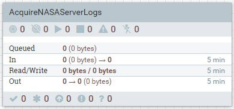 onto the NiFi canvas.

Insert the Process Group Name: `AcquireNASAServerLogs` or one of your choice, then click **ADD**.

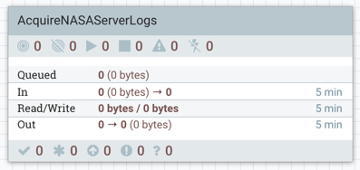

Double click on the process group to dive into it. At the bottom of the canvas, you will see **NiFi Flow >> AcquireNASAServerLogs** breadcrumb. Let's began connecting the processors for data ingestion, preprocessing and storage.

### Ingest NASA Server Log Data Source

Drop the processor icon onto the NiFi canvas. Add the **GetFile**.

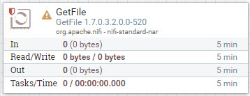

Hold **control + mouse click** on **GetFile** to configure the processor:

**Table 1: Settings Tab**

| Setting | Value     |
| :------------- | :------------- |
| Name | GrabNASALogs |

**Table 2: Scheduling Tab**

| Scheduling     | Value     |
| :------------- | :------------- |
| Run Schedule       | `60 sec`       |

**Table 3: Properties Tab**

| Property     | Value     |
| :------------| :---------|
| **Input Directory**  | `/sandbox/tutorial-files/200/nifi/input/NASALogs` |
| **Keep Source File**  | `true` |

Click **APPLY**.

### Split text file by 100,000 lines each

Drop the processor icon onto the NiFi canvas. Add the **SplitText**.

Create connection between **GetFile** and **SplitText** processors. Hover
over **GetFile** to see arrow icon, press on processor and connect it to
**SplitText**.

Configure Create Connection:

| Connection | Value     |
| :------------- | :------------- |
| For Relationships     | success (**checked**) |

Click **ADD**.

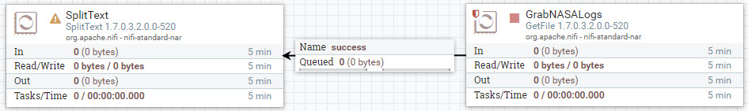

Hold **control + mouse click** on **SplitText** to configure the processor:

**Table 1: Settings Tab**

| Setting | Value     |
| :------------- | :------------- |
| Name | Split100000LinesOfText |
| Automatically Terminate Relationships | failure (**checked**) |
| Automatically Terminate Relationships | original (**checked**) |

**Table 2: Scheduling Tab**

| Scheduling     | Value     |
| :------------- | :------------- |
| Run Schedule       | `60 sec`       |

**Table 3: Properties Tab**

| Property     | Value     |
| :------------| :---------|
| **Line Split Count**  | `100000` |

Click **APPLY**.

### Split text file by 10,000 lines each

Drop the processor icon onto the NiFi canvas. Add the **SplitText**.

Create connection between **Split100000LinesOfText** and **SplitText** processors. Hover
over **Split100000LinesOfText** to see arrow icon, press on processor and connect it to
**SplitText**.

Configure Create Connection:

| Connection | Value     |
| :------------- | :------------- |
| For Relationships     | splits (**checked**) |

Click **ADD**.

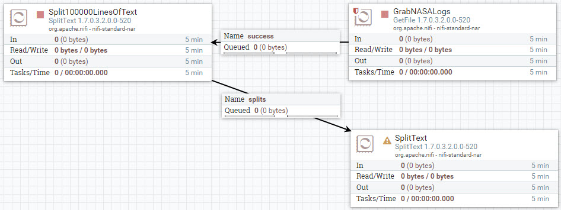

Hold **control + mouse click** on **SplitText** to configure the processor:

**Table 1: Settings Tab**

| Setting | Value     |
| :------------- | :------------- |
| Name | Split10000LinesOfText |
| Automatically Terminate Relationships | failure (**checked**) |
| Automatically Terminate Relationships | original (**checked**) |

**Table 2: Scheduling Tab**

| Scheduling     | Value     |
| :------------- | :------------- |
| Run Schedule       | `60 sec`       |

**Table 3: Properties Tab**

| Property     | Value     |
| :------------| :---------|
| **Line Split Count**  | `10000` |

Click **APPLY**.

### Split text file by 1,000 lines each

Drop the processor icon onto the NiFi canvas. Add the **SplitText**.

Create connection between **Split10000LinesOfText** and **SplitText** processors. Hover
over **Split10000LinesOfText** to see arrow icon, press on processor and connect it to
**SplitText**.

Configure Create Connection:

| Connection | Value     |
| :------------- | :------------- |
| For Relationships     | splits (**checked**) |

Click **ADD**.

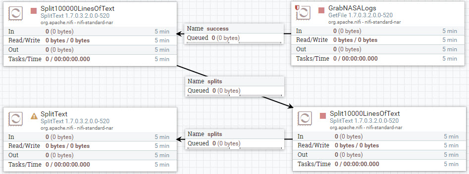

Hold **control + mouse click** on **SplitText** to configure the processor:

**Table 1: Settings Tab**

| Setting | Value     |
| :------------- | :------------- |
| Name | Split1000LinesOfText |
| Automatically Terminate Relationships | failure (**checked**) |
| Automatically Terminate Relationships | original (**checked**) |

**Table 2: Scheduling Tab**

| Scheduling     | Value     |
| :------------- | :------------- |
| Run Schedule       | `10 sec`       |

**Table 3: Properties Tab**

| Property     | Value     |
| :------------| :---------|
| **Line Split Count**  | `1000` |

Click **APPLY**.

### Split text file by 100 lines each

Drop the processor icon onto the NiFi canvas. Add the **SplitText**.

Create connection between **Split1000LinesOfText** and **SplitText** processors. Hover
over **Split1000LinesOfText** to see arrow icon, press on processor and connect it to
**SplitText**.

Configure Create Connection:

| Connection | Value     |
| :------------- | :------------- |
| For Relationships     | splits (**checked**) |

Click **ADD**.

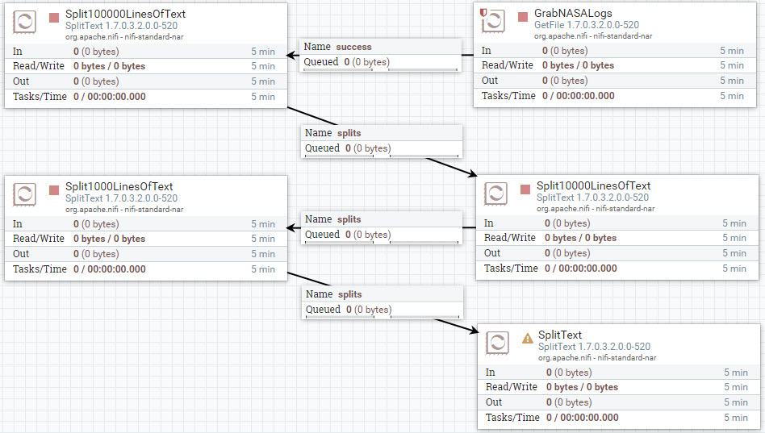

Hold **control + mouse click** on **SplitText** to configure the processor:

**Table 1: Settings Tab**

| Setting | Value     |
| :------------- | :------------- |
| Name | Split100LinesOfText |
| Automatically Terminate Relationships | failure (**checked**) |
| Automatically Terminate Relationships | original (**checked**) |

**Table 2: Scheduling Tab**

> Note: This scheduling strategy is experimental

| Scheduling     | Value     |
| :------------- | :------------- |
| Scheduling Strategy       | `Event Driven`       |

- **Event Driven** means the processor is scheduled to run when triggered by an
event

**Table 3: Properties Tab**

| Property     | Value     |
| :------------| :---------|
| **Line Split Count**  | `100` |

Click **APPLY**.

### Split text file by 10 lines each

Drop the processor icon onto the NiFi canvas. Add the **SplitText**.

Create connection between **Split100LinesOfText** and **SplitText** processors. Hover
over **Split100LinesOfText** to see arrow icon, press on processor and connect it to
**SplitText**.

Configure Create Connection:

| Connection | Value     |
| :------------- | :------------- |
| For Relationships     | splits (**checked**) |

Click **ADD**.

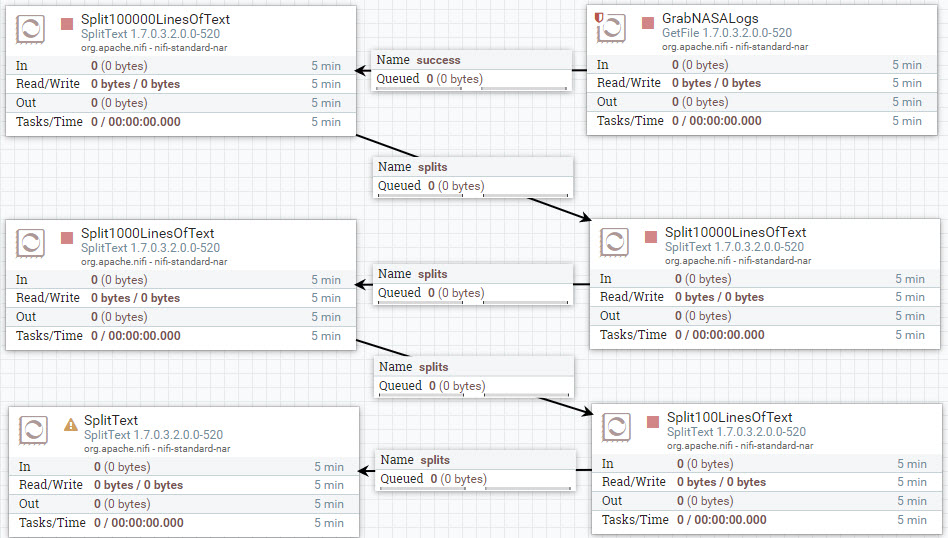

Hold **control + mouse click** on **SplitText** to configure the processor:

**Table 1: Settings Tab**

| Setting | Value     |
| :------------- | :------------- |
| Name | Split10LinesOfText |
| Automatically Terminate Relationships | failure (**checked**) |
| Automatically Terminate Relationships | original (**checked**) |

**Table 2: Scheduling Tab**

> Note: This scheduling strategy is experimental

| Scheduling     | Value     |
| :------------- | :------------- |
| Scheduling Strategy       | `Event Driven`       |

- **Event Driven** means the processor is scheduled to run when triggered by an
event

**Table 3: Properties Tab**

| Property     | Value     |
| :------------| :---------|
| **Line Split Count**  | `10` |

Click **APPLY**.

### Split text file by 1 lines each

Drop the processor icon onto the NiFi canvas. Add the **SplitText**.

Create connection between **Split10LinesOfText** and **SplitText** processors. Hover
over **Split10LinesOfText** to see arrow icon, press on processor and connect it to
**SplitText**.

Configure Create Connection:

| Connection | Value     |
| :------------- | :------------- |
| For Relationships     | splits (**checked**) |

Click **ADD**.

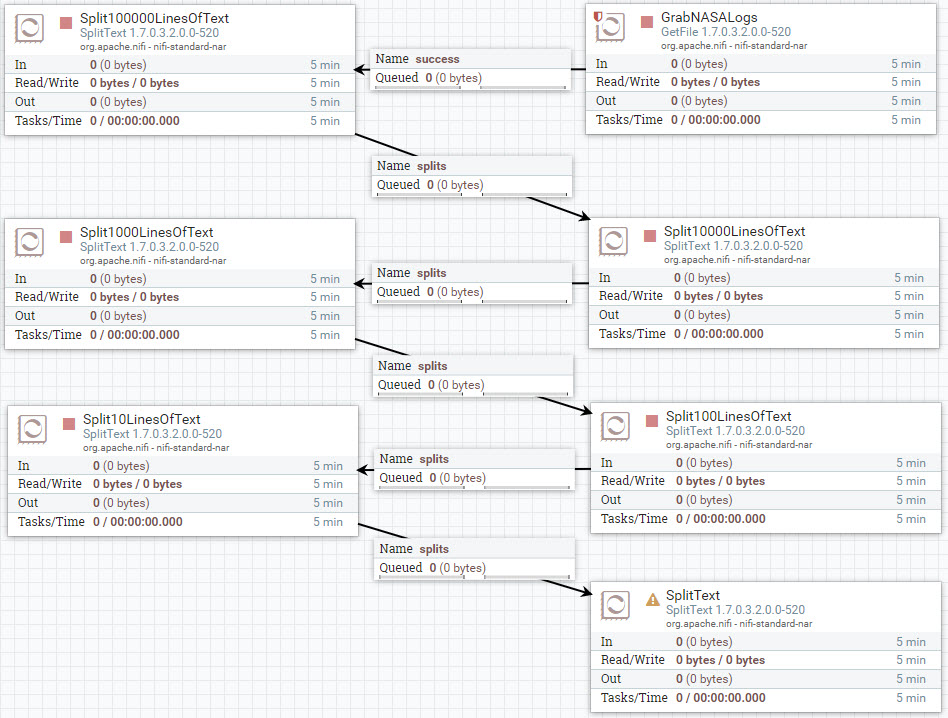

Hold **control + mouse click** on **SplitText** to configure the processor:

**Table 1: Settings Tab**

| Setting | Value     |
| :------------- | :------------- |
| Name | Split1LinesOfText |
| Automatically Terminate Relationships | failure (**checked**) |
| Automatically Terminate Relationships | original (**checked**) |

**Table 2: Scheduling Tab**

> Note: This scheduling strategy is experimental

| Scheduling     | Value     |
| :------------- | :------------- |
| Scheduling Strategy       | `Event Driven`       |

- **Event Driven** means the processor is scheduled to run when triggered by an
event

**Table 3: Properties Tab**

| Property     | Value     |
| :------------| :---------|
| **Line Split Count**  | `1` |

Click **APPLY**.

### Extract Regex Patterns from FlowFile Content into Attributes

Drop the processor icon onto the NiFi canvas. Add the **ExtractText**.

Create connection between **Split1LinesOfText** and **ExtractText** processors. Hover
over **Split1LinesOfText** to see arrow icon, press on processor and connect it to
**ExtractText**.

Configure Create Connection:

| Connection | Value     |
| :------------- | :------------- |
| For Relationships     | splits (**checked**) |

Click **ADD**.

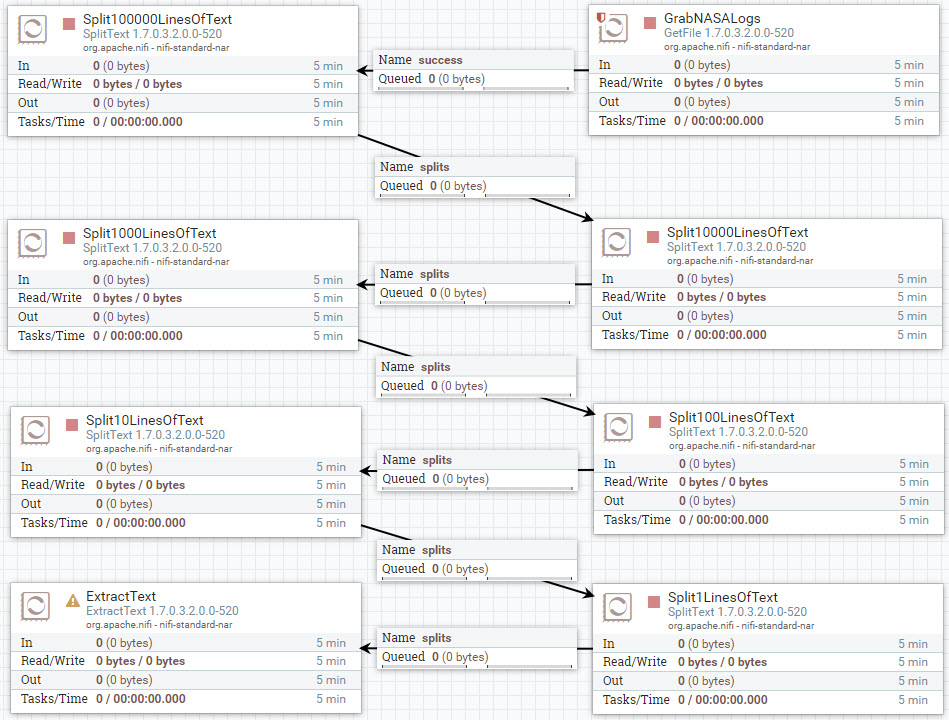

Hold **control + mouse click** on **ExtractText** to configure the processor:

**Table 1: Settings Tab**

| Setting | Value     |
| :------------- | :------------- |
| Automatically Terminate Relationships | unmatched (**checked**) |

**Table 2: Scheduling Tab**

| Scheduling     | Value     |
| :------------- | :------------- |
| Run Schedule       | `0 sec`       |

**Table 3: Properties Tab**

Add a user defined by property by pressing the **+** button.

| Property     | Value     |
| :------------| :---------|
| IP  | `(\b(?:\d{1,3}\.){3}\d{1,3}\b)` |
| Request_Type  | `\"(.*?)\"` |
| Response_Code  | `HTTP\/\d\.\d" (\d{3})` |
| Time | `\[(.*?)\]` |

Click **APPLY**.

### Route FlowFiles Attributes Containing Valid IP Addresses

Drop the processor icon onto the NiFi canvas. Add the **RouteOnAttribute**.

Create connection between **ExtractText** and **RouteOnAttribute** processors. Hover
over **ExtractText** to see arrow icon, press on processor and connect it to
**RouteOnAttribute**.

Configure Create Connection:

| Connection | Value     |
| :------------- | :------------- |
| For Relationships     | matched (**checked**) |

Click **ADD**.

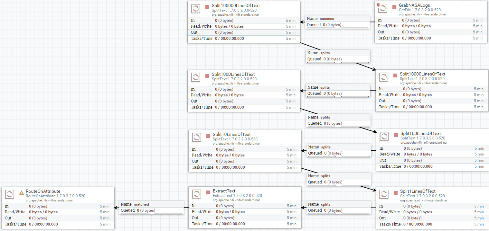

Hold **control + mouse click** on **RouteOnAttribute** to configure the processor:

**Table 1: Settings Tab**

| Setting | Value     |
| :------------- | :------------- |
| Automatically Terminate Relationships | unmatched (**checked**) |

**Table 2: Scheduling Tab**

| Scheduling     | Value     |
| :------------- | :------------- |
| Run Schedule       | `0 sec`       |

**Table 3: Properties Tab**

Add a user defined by property by pressing the **+** button.

| Property     | Value     |
| :------------| :---------|
| **Routing Strategy**  | `Route to 'matched' if all match` |
| Check_requestType  | `${Request_Type:isEmpty():not()}` |
| Check_time  | `${Time:isEmpty():not()}` |
| Check_to_remove_hostname | `${IP:startsWith('1'):or(${IP:startsWith('2')})}` |

Click **APPLY**.

### Add Geo FlowFile Attributes Based on IP Address

Drop the processor icon onto the NiFi canvas. Add the **GeoEnrichIP**.

Create connection between **RouteOnAttribute** and **GeoEnrichIP** processors. Hover
over **RouteOnAttribute** to see arrow icon, press on processor and connect it to
**GeoEnrichIP**.

Configure Create Connection:

| Connection | Value     |
| :------------- | :------------- |
| For Relationships     | matched (**checked**) |

Click **ADD**.

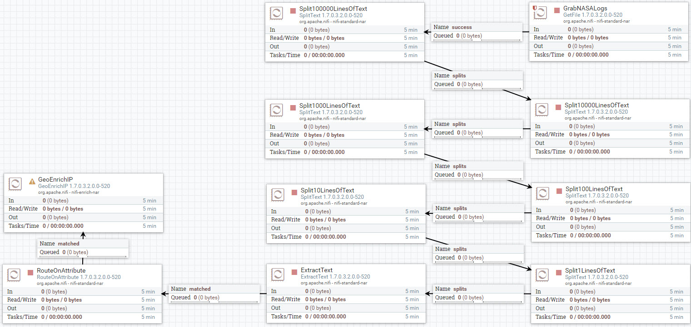

Hold **control + mouse click** on **GeoEnrichIP** to configure the processor:

**Table 1: Settings Tab**

| Setting | Value     |
| :------------- | :------------- |
| Automatically Terminate Relationships | not found (**checked**) |

**Table 2: Scheduling Tab**

| Scheduling     | Value     |
| :------------- | :------------- |
| Run Schedule       | `0 sec`       |

**Table 3: Properties Tab**

Add a user defined by property by pressing the **+** button.

> Note: on your local file system, GeoLite2-City folder will have timestamp attached to it: GeoLite2-City_20180911. Check directory path to folder.

| Property     | Value     |
| :------------| :---------|
| **MaxMind Database File**  | `/sandbox/tutorial-files/200/nifi/input/GeoFile/GeoLite2-City_<timestamp>/GeoLite2-City.mmdb` |
| **IP Address Attribute**  | `IP` |

Click **APPLY**.

### Route FlowFiles Attributes Containing Non-Empty Cities

Drop the processor icon onto the NiFi canvas. Add the **RouteOnAttribute**.

Create connection between **GeoEnrichIP** and **RouteOnAttribute** processors. Hover
over **GeoEnrichIP** to see arrow icon, press on processor and connect it to
**RouteOnAttribute**.

Configure Create Connection:

| Connection | Value     |
| :------------- | :------------- |
| For Relationships     | found (**checked**) |

Click **ADD**.

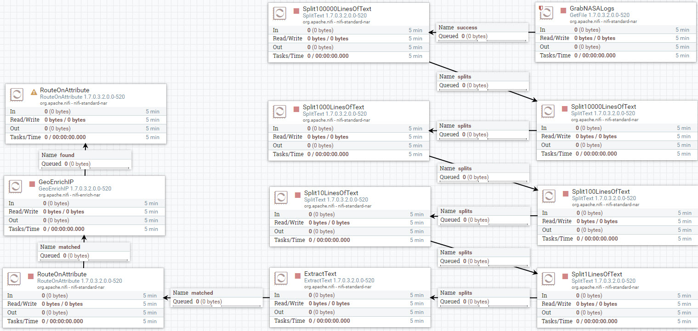

Hold **control + mouse click** on **RouteOnAttribute** to configure the processor:

**Table 1: Settings Tab**

| Setting | Value     |
| :------------- | :------------- |
| Automatically Terminate Relationships | unmatched (**checked**) |

**Table 2: Scheduling Tab**

| Scheduling     | Value     |
| :------------- | :------------- |
| Run Schedule       | `0 sec`       |

**Table 3: Properties Tab**

Add a user defined by property by pressing the **+** button.

| Property     | Value     |
| :------------| :---------|
| **Routing Strategy**  | `Route to 'matched' if all match` |
| Check_city  | `${IP.geo.city:isEmpty():not()}` |

Click **APPLY**.

### Search and Replace Content of FlowFile via Regex

Drop the processor icon onto the NiFi canvas. Add the **ReplaceText**.

Create connection between **RouteOnAttribute** and **ReplaceText** processors. Hover
over **RouteOnAttribute** to see arrow icon, press on processor and connect it to
**ReplaceText**.

Configure Create Connection:

| Connection | Value     |
| :------------- | :------------- |
| For Relationships     | matched (**checked**) |

Click **ADD**.

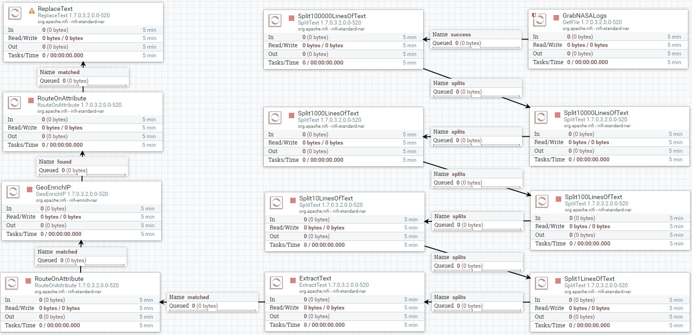

Hold **control + mouse click** on **ReplaceText** to configure the processor:

**Table 1: Settings Tab**

| Setting | Value     |
| :------------- | :------------- |
| Automatically Terminate Relationships | failure (**checked**) |

**Table 2: Scheduling Tab**

| Scheduling     | Value     |
| :------------- | :------------- |
| Run Schedule       | `0 sec`       |

**Table 3: Properties Tab**

Copy and paste the property values in between the double quotes:

```bash
Property = Value
Search Value = "(?s)(^.*$)"
Replacement Value = "${IP}|${Time}|${Request_Type}|${Response_Code}|${IP.geo.city}|${IP.geo.country}|${IP.geo.country.isocode}|${IP.geo.latitude}|${IP.geo.longitude}"
```

Click **APPLY**.

### Merge FlowFiles Once a Set Number Has Accumulated

Drop the processor icon onto the NiFi canvas. Add the **MergeContent**.

Create connection between **ReplaceText** and **MergeContent** processors. Hover
over **ReplaceText** to see arrow icon, press on processor and connect it to
**MergeContent**.

Configure Create Connection:

| Connection | Value     |
| :------------- | :------------- |
| For Relationships     | success (**checked**) |

Click **ADD**.

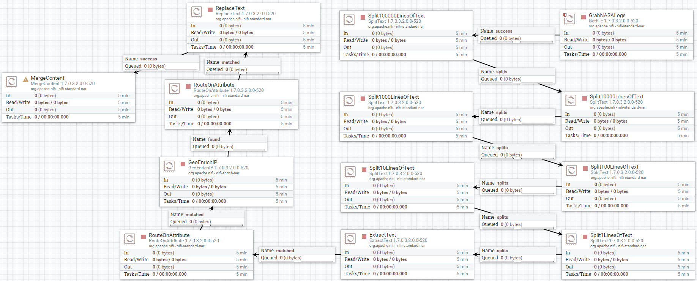

Hold **control + mouse click** on **MergeContent** to configure the processor:

**Table 1: Settings Tab**

| Setting | Value     |
| :------------- | :------------- |
| Automatically Terminate Relationships | failure (**checked**) |
| Automatically Terminate Relationships | original (**checked**) |

**Table 2: Scheduling Tab**

| Scheduling     | Value     |
| :------------- | :------------- |
| Run Schedule       | `0 sec`       |

**Table 3: Properties Tab**

> Note: press shift + enter to next line for demarcator

| Property     | Value     |
| :------------| :---------|
| **Minimum Number of Entries**  | `20` |
| **Maximum Number of Entries**  | `40` |
| **Maximum Number of Bins**  | `100` |
| **Delimiter Strategy**  | `Text` |
| **Demarcator**  | press **{shift + enter}** |

Click **APPLY**.

### Update Merged FlowFile Attribute Name

Drop the processor icon onto the NiFi canvas. Add the **UpdateAttribute**.

Create connection between **MergeContent** and **UpdateAttribute** processors. Hover
over **MergeContent** to see arrow icon, press on processor and connect it to
**UpdateAttribute**.

Configure Create Connection:

| Connection | Value     |
| :------------- | :------------- |
| For Relationships     | merged (**checked**) |

Click **ADD**.

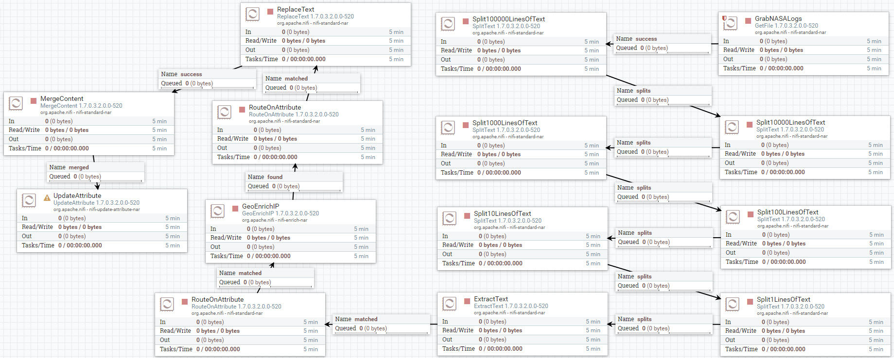

Hold **control + mouse click** on **UpdateAttribute** to configure the processor:

**Table 2: Scheduling Tab**

| Scheduling     | Value     |
| :------------- | :------------- |
| Run Schedule       | `0 sec`       |

**Table 3: Properties Tab**

| Property     | Value     |
| :------------| :---------|
| filename  | `logsample-${now():format("HHmmssSSS")}-${UUID()}-.txt` |

Click **APPLY**.

### Write Contents of FlowFile to Hadooop Distributed File System

Drop the processor icon onto the NiFi canvas. Add the **PutHDFS**.

Create connection between **UpdateAttribute** and **PutHDFS** processors. Hover
over **UpdateAttribute** to see arrow icon, press on processor and connect it to
**PutHDFS**.

Configure Create Connection:

| Connection | Value     |
| :------------- | :------------- |
| For Relationships     | success (**checked**) |

Click **ADD**.

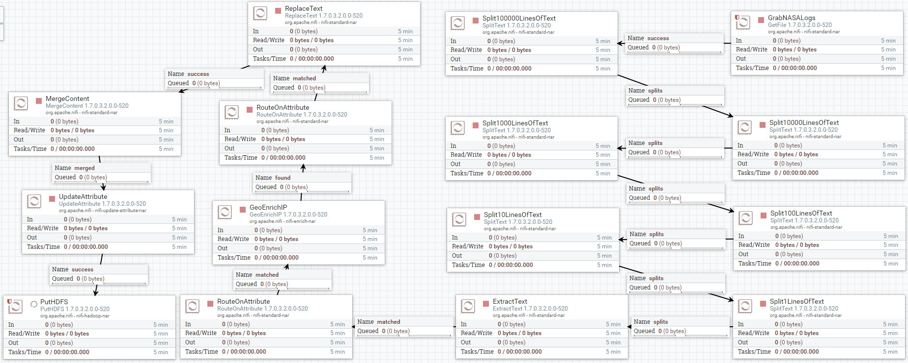

Hold **control + mouse click** on **PutHDFS** to configure the processor:

**Table 1: Settings Tab**

| Setting | Value     |
| :------------- | :------------- |
| Automatically Terminate Relationships | failure (**checked**) |
| Automatically Terminate Relationships | success (**checked**) |

**Table 2: Scheduling Tab**

| Scheduling     | Value     |
| :------------- | :------------- |
| Run Schedule       | `0 sec`       |

**Table 3: Properties Tab**

| Property     | Value     |
| :------------| :---------|
| Hadoop Configuration Resources  | `/etc/hadoop/conf/core-site.xml,/etc/hadoop/conf/hdfs-site.xml` |
| **Directory**  | `/sandbox/tutorial-files/200/nifi/output/NASALogsAug1995` |

Click **APPLY**.

The PutHDFS processor's yellow cone sign should change to a red stop sign.

### Start Process Group Flow to Acquire Data

At the breadcrumb, select **NiFi Flow** level. Hold **control + mouse click** on the **AcquireNASAServerLogs** process group, then click the **start** option.

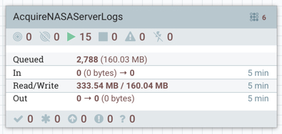

Once NiFi writes your server data to HDFS, which you can check by viewing data provenance, you can turn off the process group by holding **control + mouse click** on the **AcquireNASAServerLogs** process group, then choose **stop** option.

## Approach 2: Import NiFi AcquireNASALogs via UI

Download the NiFi template [AcquireNASAServerLogs.xml](application/development/nifi-template/AcquireNASAServerLogs.xml) to your local computer.

After starting your sandbox, open HDF **NiFi UI** at http://sandbox-hdf.hortonworks.com:9090/nifi.

Open the Operate panel if not already open, then press the **Upload Template** icon .

Press on Select Template icon .

The file browser on your local computer will appear, find **AcquireNASAServerLogs.xml** template you just downloaded, then press **Open**, then press **UPLOAD**.

You should receive a notification that the **Template successfully imported.** Press OK to acknowledge.

Drop the **Template** icon  onto the NiFi canvas.

Add Template called **AcquireNASAServerLogs**.

Start the NiFi flow. Hold **control + mouse click** on the **AcquireNASAServerLogs** process group, then click the **start** option.


Once NiFi writes your server data to HDFS, which you can check by viewing data provenance, you can turn off the process group by holding **control + mouse click** on the **AcquireNASAServerLogs** process group, then choose **stop** option.

## Approach 3: Auto Deploy NiFi Flow via REST Call

Open HDF Sandbox Web Shell Client at http://sandbox-hdf.hortonworks.com:4200. Copy and paste the following shell code:

```bash
NIFI_TEMPLATE="AcquireNASAServerLogs"
wget https://github.com/hortonworks/data-tutorials/raw/master/tutorials/cda/building-a-server-log-analysis-application/application/development/shell/nifi-auto-deploy.sh
bash nifi-auto-deploy.sh $NIFI_TEMPLATE
```

Open HDF **NiFi UI** at http://sandbox-hdf.hortonworks.com:9090/nifi. Your NiFi was just uploaded, imported and started. You just have to make sure to turn on the PutHDFS processor, so NiFi can store data into HDFS.

## Summary

Congratulations! You now know how to build a NiFi flow from scratch that ingests NASA Server Log data, enriches the data with geographic insight and stores the data into HDFS.

## Further Reading

- [NiFi User Guide](https://nifi.apache.org/docs/nifi-docs/html/user-guide.html)
- [NiFi REST API](https://nifi.apache.org/docs/nifi-docs/rest-api/index.html)
---
title: Cleaning the Raw NASA Log Data
---

# 4.Cleaning the Raw NASA Log Data

## Introduction

You have been brought onto the project as a Data Engineer with the following responsibilities: load in HDFS data into Spark DataFrame, analyze the various columns of the data to discover what needs cleansing, each time you hit checkpoints in cleaning up the data, you will register the DataFrame as a temporary table for later visualization in a different notebook and when the cleaning is complete, you will create a Hive table for ability to visualize the data with external visualization tools.

## Prerequisites

- Enabled CDA for your appropriate system.
- Setup Development Environment
- Acquired NASA Server Log Data

## Outline

- [Approach 1: Clean Raw NASA Log Data with Spark Zeppelin Interpreter](#approach-1-clean-raw-nasa-log-data-with-spark-zeppelin-interpreter)
- [Approach 2: Import Zeppelin Notebook to Clean NASA Log Data via UI](#approach-2-import-zeppelin-notebook-to-clean-nasa-log-data-via-ui)
- [Summary](#summary)
- [Further Reading](#further-reading)

<!-- - [Approach 3: Auto Deploy Zeppelin Notebook to Clean NASA Log Data via Script](#approach-3-auto-deploy-zeppelin-notebook-to-clean-nasa-log-data-via-script) -->

## Approach 1: Clean Raw NASA Log Data with Spark Zeppelin Interpreter

Open HDP **Zeppelin UI** at http://sandbox-hdp.hortonworks.com:9995.

1\. Click **Create new note**. Insert **Note Name** `Cleaning-Raw-NASA-Log-Data`, then press **Create Note**.

We are taken to the new Zeppelin Notebook.

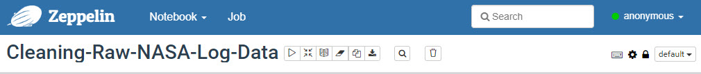

### Loading External Library

We will use Zeppelin's %dep interpreter to import external databricks: spark-csv_2.11:1.4.0 dataset. Copy and paste the following code into the zeppelin notebook note:

```
%dep
z.reset()
z.load("com.databricks:spark-csv_2.11:1.4.0")
```

Press **{shift + enter}** or the **play** button to compile that note in the notebook.

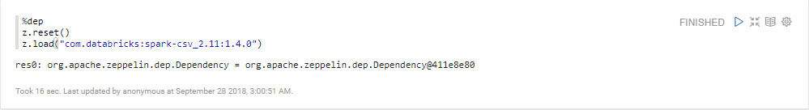

### Loading the DataFrame from HDFS

We will load the dataframe from HDFS directory `/sandbox/tutorial-files/200/nifi/output/NASALogsAug1995`
using PySpark's `sqlContext.read.format()` function. Then we will use `.show()` function to display the
content of the dataframe. Copy and paste the following pyspark code into the next available note in the notebook:

```python
%pyspark
from pyspark.sql.types import StructType, StructField, DoubleType, StringType
schema = StructType([
    # Represents a field in a StructType
    StructField("IP",           StringType()),
    StructField("Time",         StringType()),
    StructField("Request_Type", StringType()),
    StructField("Response_Code",StringType()),
    StructField("City",         StringType()),
    StructField("Country",      StringType()),
    StructField("Isocode",      StringType()),
    StructField("Latitude",     StringType()),
    StructField("Longitude",    StringType())
])

logs_df = sqlContext.read \
                    .format("com.databricks.spark.csv") \
                    .schema(schema) \
                    .option("header", "false") \
                    .option("delimiter", "|") \
                    .load("/sandbox/tutorial-files/200/nifi/output/NASALogsAug1995")
logs_df.show(truncate=False)
```

How many rows are displayed from the dataframe, `logs_df`?
When we tested the demo, there was 20 rows displayed.

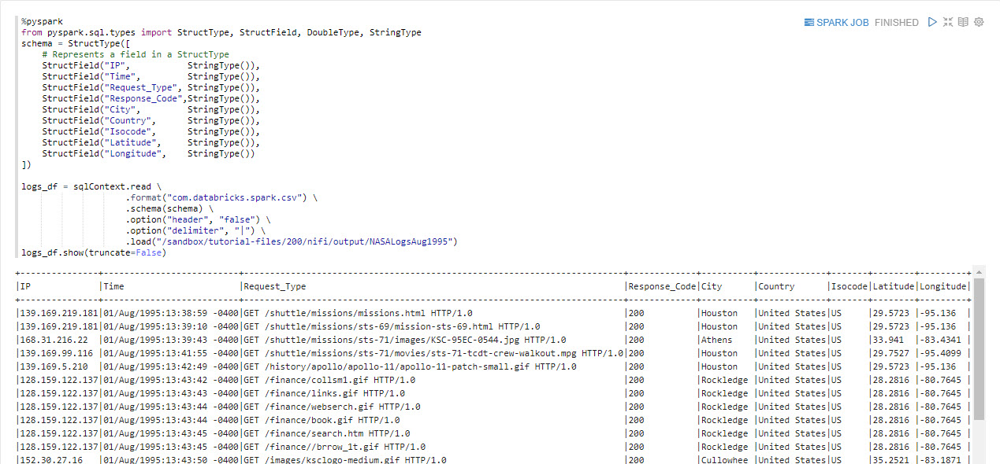

### Parsing the Timestamp

From the **Time** column, we will parse for the timestamp and drop the old **Time** column with the new **Timestamp** column.

```python
%pyspark
from pyspark.sql.functions import udf

months = {
  'Jan': 1, 'Feb': 2, 'Mar':3, 'Apr':4, 'May':5, 'Jun':6, 'Jul':7, 'Aug':8,  'Sep': 9, 'Oct':10, 'Nov': 11, 'Dec': 12
}

def parse_timestamp(time):
    """ This function takes a Time string parameter of logs_df dataframe
    Returns a string suitable for passing to CAST('timestamp') in the format YYYY-MM-DD hh:mm:ss
    """
    return "{0:04d}-{1:02d}-{2:02d} {3:02d}:{4:02d}:{5:02d}".format(
      int(time[7:11]),
      months[time[3:6]],
      int(time[0:2]),
      int(time[12:14]),
      int(time[15:17]),
      int(time[18:20])
    )

udf_parse_timestamp = udf(parse_timestamp)

# Assigning the Timestamp name to the new column and dropping the old Time column
parsed_df = logs_df.select('*',
                udf_parse_timestamp(logs_df['Time'])
                .cast('timestamp')
                .alias('Timestamp')).drop('Time')  
# Stores the dataframe in cache for the future use
parsed_df.cache()                                  
# Displays the results
parsed_df.show()
```

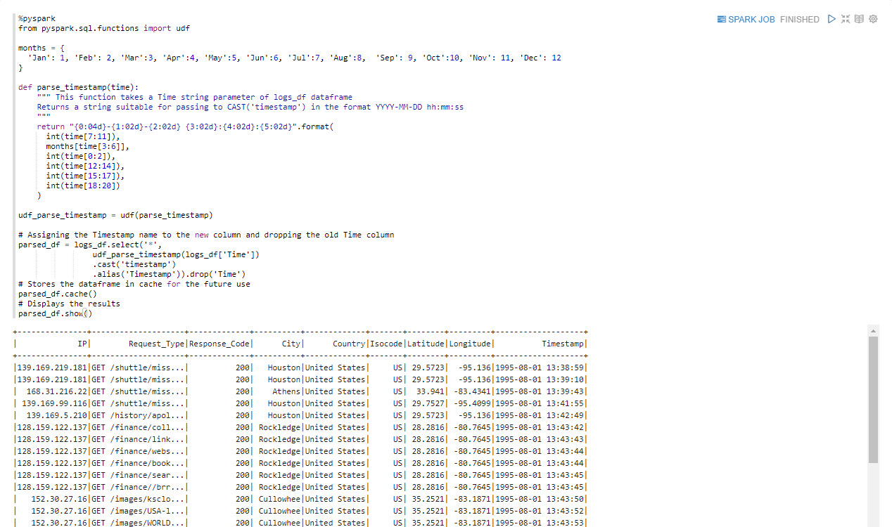

### Cleaning the Request_Type Column

Currently the Request_type has **GET** and **HTTP/1.0** surrounding the actual data being requested,
so we will remove these two from each line.

```python
%pyspark
from pyspark.sql.functions import split, regexp_extract
path_df = parsed_df.select('*', regexp_extract('Request_Type', r'^.*\w+\s+([^\s]+)\s+HTTP.*', 1)
                    .alias('Request_Path')).drop('Request_Type')

# Cache the dataframe
path_df.cache()
# Displays the results
path_df.show(truncate=False)
```

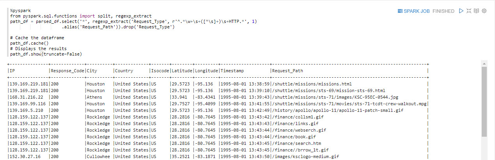

### Filtering for Most Frequent Hosts Hitting NASA Server

We want to filter on which which hosts are most frequently hitting NASA's server and then store the data into a temporary table.

```python
%pyspark
# Group the dataframe by IP column and then counting
most_frequent_hosts = parsed_df.groupBy("IP").count()

# Displays the results
most_frequent_hosts.show()

# Registering most_frequent_hosts variable as a temporary table
most_frequent_hosts.registerTempTable("most_frequent_hosts")
```

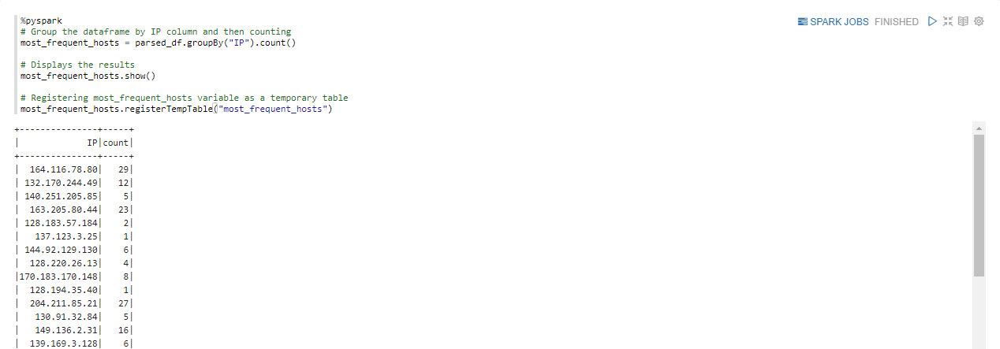

### Filtering for Count of Each Response Code

Our aim is to find the amount of times that each response code has occurred and store the result into a temporary table for later use.

```python
%pyspark
# Groups the dataframe by Response_Code column and then counting
status_count = path_df.groupBy('Response_Code').count()
# Displays the results
status_count.show()
# Registering status_count variable as a temporary table
status_count.registerTempTable("status_count")
```

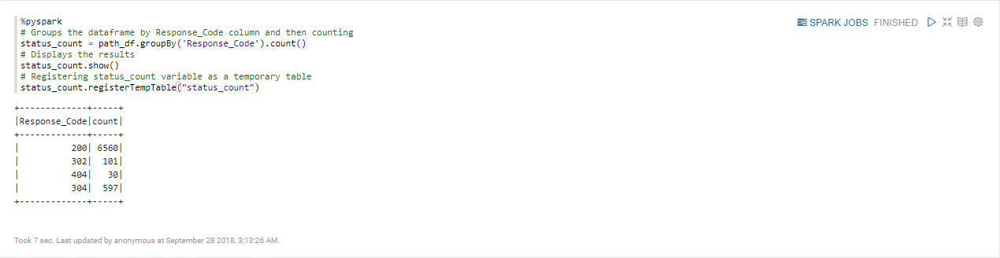

### Filtering Records Where Response Code is 200

Create the dataframe where records with Response Code 200 will be stored, cache the dataframe and display the results.

```python
%pyspark
# Creating dataframe where Response Code is 200
success_logs_df = parsed_df.select('*').filter(path_df['Response_Code'] == 200)
# Cache the dataframe
success_logs_df.cache()
# Displays the results
success_logs_df.show()
```

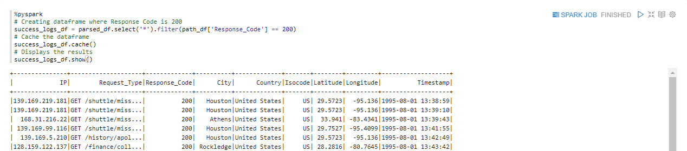

Extract the hour, display the results and register the dataframe as a temporary table for the SQL interpreter to use later.

```python
%pyspark
from pyspark.sql.functions import hour
# Extracting the Hour
success_logs_by_hours_df = success_logs_df.select(hour('Timestamp').alias('Hour')).groupBy('Hour').count()
# Displays the results
success_logs_by_hours_df.show()
# Registering Temporary Table that can be used by SQL interpreter
success_logs_by_hours_df.registerTempTable("success_logs_by_hours_df")
```

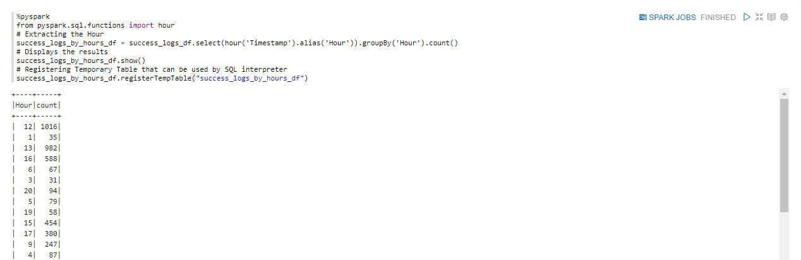

### Cleaning the Request_Path Column for Type Extensions

The Request_Path column contains the type extension. We will first show the current state of the Request_Path column before cleaning is done.

```python
%pyspark
# Show the current Request_Path Column before applying cleansing
from pyspark.sql.functions import split, regexp_extract
extension_df = path_df.select(regexp_extract('Request_Path', '(\\.[^.]+)$',1).alias('Extension'))
extension_df.show(truncate=False)
```

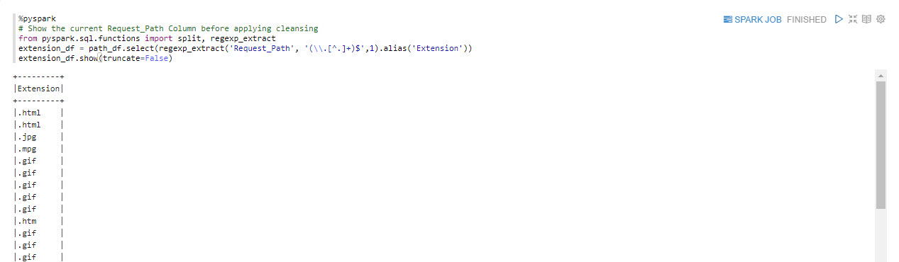

### How Should We Clean this Request_Path Column?

In the column, we see that each extension has a dot (.).
We will replace this character with a blank character.

```python
%pyspark
from pyspark.sql.functions import split, regexp_replace
# Replace the dot character with the blank character
extension_df = extension_df.select(regexp_replace('Extension', '\.','').alias('Extension'))
# Displays the results
extension_df.show(truncate=False)
```

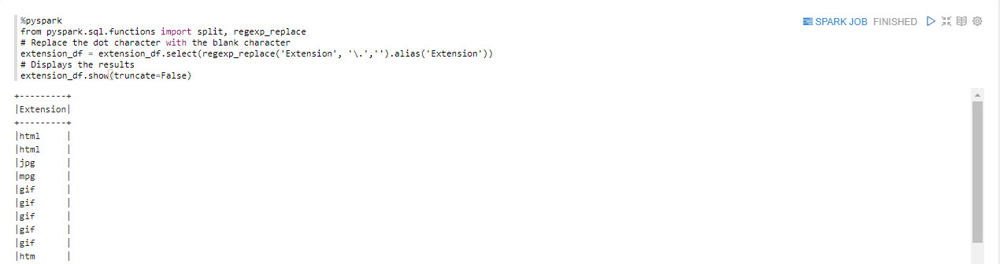

There may also be some rows in the column that are blank, so we will replace a blank row with the word **None**.

```python
%pyspark
from pyspark.sql.functions import *
# Replaces the blank value with the value 'None' in Extension
extension_df = extension_df.replace('', 'None', 'Extension').alias('Extension')
extension_df.cache()
# Shows the results
extension_df.show(truncate=False)
```

Next we will group the dataframe by extension type, count the rows, display the results and register the dataframe in a temporary table.

```python
%pyspark
# Groups the dataframe by Extension and then count the rows
extension_df_count = extension_df.groupBy('Extension').count()
# Displays the results
extension_df_count.show()
# Registers the temporary table
extension_df_count.registerTempTable('extension_df_count')
```

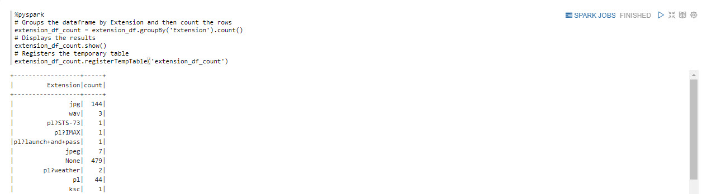

Create a temporary table for DataFrame `path_df`.

```python
%pyspark
path_df.registerTempTable("path_df")
```

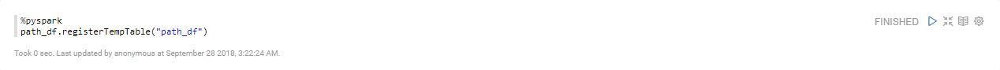

Now that the dataframe is registered as a temporary table.

We can head to the summary to review how we cleaned the data and prepared it to be ready for visualization.

## Approach 2: Import Zeppelin Notebook to Clean NASA Log Data via UI

Open HDP **Zeppelin UI** at [http://sandbox-hdp.hortonworks.com:9995](http://sandbox-hdp.hortonworks.com:9995).

1\. Click **Import note**. Select **Add from URL**.

Insert the following URL cause we are going to import **Cleaning-Raw-NASA-Log-Data** notebook:

```bash
https://raw.githubusercontent.com/hortonworks/data-tutorials/master/tutorials/cda/building-a-server-log-analysis-application/application/development/zeppelin-notebook/Cleaning-Raw-NASA-Log-Data.json
```

Click **Import Note**.

Your notebook **Cleaning-Raw-NASA-Log-Data** should be a part of the list of notebooks now.

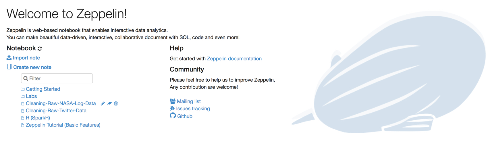

Click on notebook **Cleaning-Raw-NASA-Log-Data**. Then press the **play** button for all paragraphs to be executed. The **play** button is near the title of this notebook at the top of the webpage.

Now we are finished cleaning the NASA Server Log data. We can head to the summary to review how we cleaned the data and prepared it to be ready for visualization.

<!--
## Approach 3: Auto Deploy Zeppelin Notebook to Clean NASA Log Data via Script

Open HDP **sandbox web shell client** at [http://sandbox-hdp.hortonworks.com:4200](http://sandbox-hdp.hortonworks.com:4200).

We will use the Zeppelin REST Call API to import a notebook that uses SparkSQL to analyze NASA's server logs for possible breaches.

```bash
NOTEBOOK_NAME="Cleaning-Raw-NASA-Log-Data"
wget https://github.com/james94/data-tutorials/raw/master/tutorials/cda/building-a-server-log-analysis-application/application/development/shell/zeppelin-auto-deploy.sh
bash zeppelin-auto-deploy.sh $NOTEBOOK_NAME
```

Now we are finished cleaning the NASA Server Log data. We can head to the summary to review how we cleaned the data and prepared it to be ready for visualization.

-->

## Summary

Congratulations! You just discovered which columns needed cleansing after analysis of the dirty data. Now we are ready to visualize the data in another notebook to illustrate our new insight to the data, such as Response Code occurring at 200, network traffic locations by country and city, etc.

## Further Reading

- [Spark SQL, DataFrames and Datasets Guide](https://spark.apache.org/docs/latest/sql-programming-guide.html)
---
title: Visualizing NASA Log Data
---

# 5.Visualizing NASA Log Data

## Introduction

You have been brought onto the project as a Data Analyst with the following responsibilities: visualize most frequent hosts hitting NASA's Server, visualize response code occurrences and records with code 200, visualize the type extension and network traffic location by country and city.

## Prerequisites

- Enabled CDA for your appropriate system.
- Setup Development Environment
- Acquired NASA Server Log Data
- Cleaned the Raw NASA Log Data

## Outline

- [Approach 1: Visualize NASA Log Data with Spark Zeppelin Interpreter](#approach-1-visualize-nasa-log-data-with-spark-zeppelin-interpreter)
- [Approach 2: Import Zeppelin Notebook to Visualize NASA Log Data via UI](#approach-2-import-zeppelin-notebook-to-visualize-nasa-log-data-via-ui)
- [Summary](#summary)
- [Further Reading](#further-reading)

<!-- - [Approach 3: Auto Deploy Zeppelin Notebook to Visualize NASA Log Data via Script](#approach-3-auto-deploy-zeppelin-notebook-to-visualize-nasa-log-data-via-script) -->

## Approach 1: Visualize NASA Log Data with Spark Zeppelin Interpreter

Open HDP **Zeppelin UI** at [http://sandbox-hdp.hortonworks.com:9995](http://sandbox-hdp.hortonworks.com:9995).

1\. Click **Create new note**. Insert **Note Name** `Visualizing-NASA-Log-Data`, then press **Create Note**.

We are taken to the new Zeppelin Notebook.

### Visualizing Hosts Hitting NASA Server via Pie Chart

We will display a count for each hosts hitting NASA's server.
This data will illustrate who are the most frequent hosts connecting to NASA's server.

Run the following SQL code:

```sql
%sql
SELECT * FROM most_frequent_hosts
ORDER BY count
DESC LIMIT 20
```

Then select pie chart.

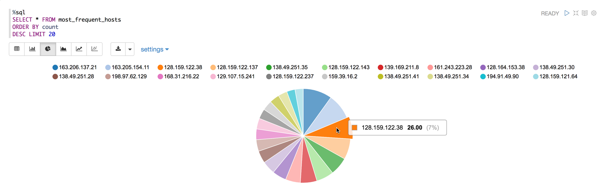

### What Do You See By Hovering in the Pie Chart?

Each pie slice shows a clear count of each host hitting NASA's server. For example,
host at IP 163.206.137.21 hit the server 35 times, 10% of server hits comes from this host.

### Visualizing Response Code Occurrences via Bar Graph

A bar graph will create a nice a clear visual of which response code occurs most often

Run the following SQL code:

```sql
%sql
SELECT * FROM status_count
ORDER BY Response_Code
```

Then select bar chart.

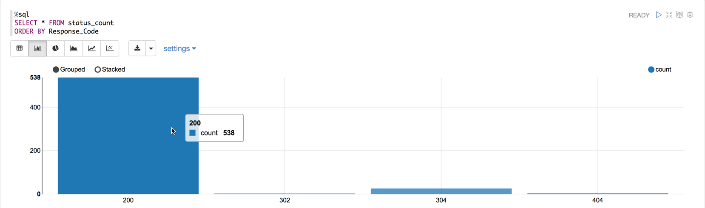

### What Response Code Occurs Most Frequently?

In the bar graph, we can see Response Code 200 occurs 538 times. Response Code 200
means the request was received, understood and being processed.

### Visualizing the Records with Response Code 200

So earlier in cleaning the data, we filtered the records down to ones that only have response code 200.
Now we will visualize the occurences of records with success hits per hour.

Run the following SQL code:

```sql
%sql
SELECT * FROM success_logs_by_hours_df
ORDER BY Hour
```

then select bar chart.

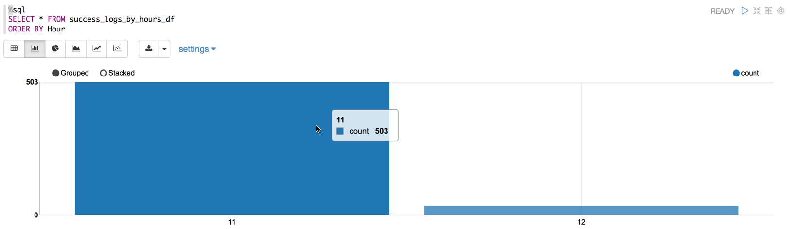

### Visualizing Type Extensions

Our objective is to find the number of different extensions available in our data set.
We will group the column and then count the records in each group.

Run the following SQL code:

```sql
%sql
SELECT * FROM extension_df_count
ORDER BY count DESC
```

then select bar chart.

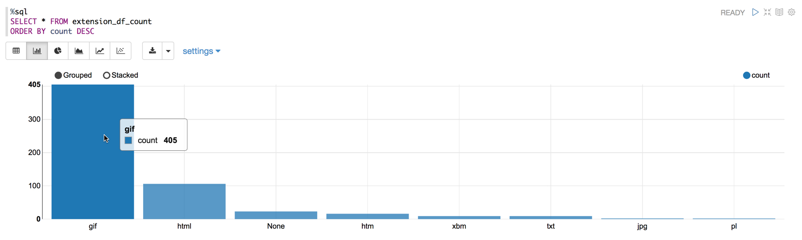


### Visualizing Network Traffic Locations

We will look at the network traffic per country and for cities within the United States

### Network Traffic Locations By Country

Run the following SQL code:

```sql
%sql
SELECT country, count(country) AS count FROM path_df GROUP BY country ORDER BY count
```

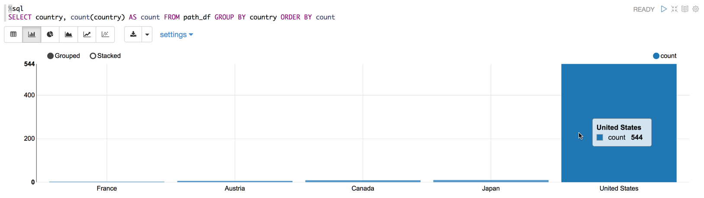

### Network Traffic Locations By City of a Country

Run the following SQL code:

```sql
%sql
SELECT city, count(city) AS count FROM path_df WHERE country='United States' GROUP BY city ORDER BY count
```

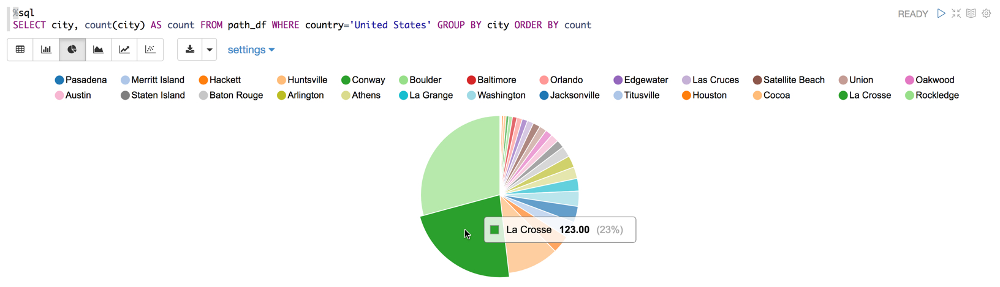

Now we are finished visualizing the NASA Server Log data. We can head to the summary to review how we visualized the data.

## Approach 2: Import Zeppelin Notebook to Visualize NASA Log Data via UI

Open HDP **Zeppelin UI** at [http://sandbox-hdp.hortonworks.com:9995](http://sandbox-hdp.hortonworks.com:9995).

1\. Click **Import note**. Select **Add from URL**.

Insert the following URL cause we are going to import **Visualizing-NASA-Log-Data** notebook:

```bash
https://raw.githubusercontent.com/hortonworks/data-tutorials/master/tutorials/cda/building-a-server-log-analysis-application/application/development/zeppelin-notebook/Visualizing-NASA-Log-Data.json
```

Click **Import Note**.

Your notebook **Visualizing-NASA-Log-Data** should be a part of the list of notebooks now.

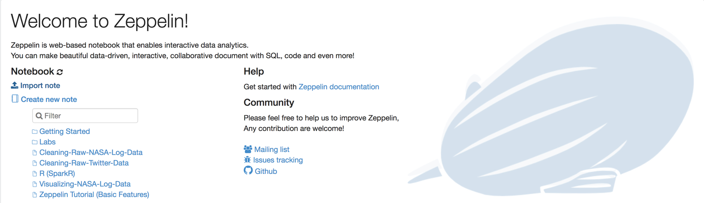

Click on notebook **Visualizing-NASA-Log-Data**. Then press the **play** button for all paragraphs to be executed. The **play** button is near the title of this notebook at the top of the webpage.

Now we are finished visualizing the NASA Server Log data. We can head to the summary to review how we visualized the data.


<!--
## Approach 3: Auto Deploy Zeppelin Notebook to Visualize NASA Log Data via Script

Open HDP **sandbox web shell client** at [http://sandbox-hdp.hortonworks.com:4200](http://sandbox-hdp.hortonworks.com:4200).

We will use the Zeppelin REST Call API to import a notebook that uses SparkSQL to analyze NASA's server logs for possible breaches.

```bash
NOTEBOOK_NAME="Visualizing-NASA-Log-Data"
wget https://github.com/james94/data-tutorials/raw/master/tutorials/cda/building-a-server-log-analysis-application/application/development/shell/zeppelin-auto-deploy.sh
bash zeppelin-auto-deploy.sh $NOTEBOOK_NAME
```

-->

## Summary

Congratulations! You just visualized important aspects of the data from the NASA Server logs, such as how many times particular hosts hit the server, response codes indicating success rate of data transfer and where the network traffic location is the heaviest.

## Further Reading

- [Data Visualization](https://en.wikipedia.org/wiki/Data_visualization)
