# 0.Building an HVAC System Analysis Application

## Introduction

Hortonworks Connected Data Platform can be used to acquire, clean and visualize data from heating, ventilation, and air conditioning (HVAC) machine systems to maintain optimal office building temperatures and minimize expenses.

## Big Data Technologies used to develop the Application:

- Historical HVAC Sensor Data
- [HDF Sandbox](https://hortonworks.com/products/data-platforms/hdf/)
    - [Apache Ambari](https://ambari.apache.org/)
    - [Apache NiFi](https://nifi.apache.org/)
- [HDP Sandbox](https://hortonworks.com/products/data-platforms/hdp/)
    - [Apache Ambari](https://ambari.apache.org/)
    - [Apache Hadoop - HDFS](http://hadoop.apache.org/docs/r2.7.6/)
    - [Apache Hive](https://hive.apache.org/)
    - [Apache Zeppelin](https://zeppelin.apache.org/)

## Goals and Objectives

- Learn to write a shell script to automate development environment setup
- Learn to build a NiFi flow to acquire HVAC machine sensor data
- Learn to write Hive scripts to clean the HVAC machine sensor data and prepare it for visualization
- Learn to visualize HVAC machine sensor data in Zeppelin

## Prerequisites

- Downloaded and Installed the latest [Hortonworks HDP Sandbox](https://www.cloudera.com/downloads/hortonworks-sandbox/hdp.html?utm_source=mktg-tutorial Sandbox
- Read through [Learning the Ropes of the HDP Sandbox](https://hortonworks.com/tutorial/learning-the-ropes-of-the-hortonworks-sandbox/) to setup hostname mapping to IP address
- If you don't have at least 16GB of RAM for HDP Sandbox and 4 GB of RAM for your machine, then refer to [Deploying Hortonworks Sandbox on Microsoft Azure](https://hortonworks.com/tutorial/sandbox-deployment-and-install-guide/section/4/)
- Enabled Connected Data Architecture:
  - [Enable CDA for VirtualBox](https://hortonworks.com/tutorial/sandbox-deployment-and-install-guide/section/1/#enable-connected-data-architecture-cda---advanced-topic)
  - [Enable CDA for VMware](https://hortonworks.com/tutorial/sandbox-deployment-and-install-guide/section/2/#enable-connected-data-architecture-cda---advanced-topic)
  - [Enable CDA for Docker](https://hortonworks.com/tutorial/sandbox-deployment-and-install-guide/section/3/#enable-connected-data-architecture-cda---advanced-topic)

## Outline

The tutorial series consists of the following tutorial modules:

1\. **[Application Development Concepts](https://hortonworks.com/tutorial/building-an-hvac-system-analysis-application/section/1/)**: Focus on HVAC fundamentals, common sensors used in HVAC Systems and ways to analyze data from these sensors to understand the status of the HVAC Systems.

2\. **[Setting up the Development Environment](https://hortonworks.com/tutorial/building-an-hvac-system-analysis-application/section/2/)**: Any Configurations and/or software services that may need to be installed prior to building the data pipeline and visualization notebook.

3\. **[Acquiring HVAC Sensor Data](https://hortonworks.com/tutorial/building-an-hvac-system-analysis-application/section/3/)**: Create a part of the data pipeline using Apache NiFi to ingest, process and store 1 month of Historical HVAC Sensor Data into HDFS.

4\. **[Cleaning Raw HVAC Data](https://hortonworks.com/tutorial/building-an-hvac-system-analysis-application/section/4/)**: Create the next portion of the data pipeline using Apache Hive to upload the data into Hive tables, so the data can be cleaned and queried to capture valuable insight about the status of HVAC Systems regulating temperature in buildings across various countries.

5\. **[Visualizing Sensor Data Related To HVAC Machine Systems](https://hortonworks.com/tutorial/building-an-hvac-system-analysis-application/section/5/)**: Perform data analysis on HVAC sensor data to find the _HVAC Building Temperature Characteristics Per Country_ - keep count of HOT, COLD, NORMAL ranges per country, _Extreme Temperature in Buildings Having HVAC Products_ - building that are experiencing extreme temperature whether it be HOT or COLD even though they have HVAC products.
---
title: Application Development Concepts
---

# 1.Application Development Concepts

## Introduction

The objective for this lesson is to introduce you to some fundamental ideas of
an HVAC System, such as being able to answer what an HVAC System is, why it is
important and what are the goals the system is trying to accomplish. The next
objective is to learn about the sensors that are commonly used in HVAC Systems
and how you can analyze and visualize insight to the health of the HVAC System.
The appendix lists many of the common components that makeup the HVAC System.

## Prerequisites

- Read overview on Building an HVAC System Analysis Application

## Outline

- [HVAC System Analysis Fundamentals](#hvac-system-analysis-fundamentals)
- [Summary](#summary)
- [Further Reading](#further-reading)
- [Appendix A: Components that make up an HVAC System](#appendix-a-components-that-make-up-an-hvac-system)

## HVAC System Analysis Fundamentals

### What is an HVAC System?

**HVAC** is a machine that handles the ***heating, ventilation and air
conditioning*** in a building.

### Why is the HVAC System important in Commercial Buildings?

**HVAC Systems** play a critical role in controlling the building's temperature,
providing fresh air circulation and filtration that if not regularly maintained
will cause productivity, comfort and health of the occupants to suffer.

### What are the Goals of an HVAC System?

1\. Adjust the room's temperature to keep the occupants comfortable.

2\. Supply fresh exterior air circulation to the room and alleviate CO2 buildup,
so occupants will experience better health and better performance gains in the
workplace.

3\. Provide air filtration using filters at various stages for the recirculated
conditioned air since it can carry contaminants and dust, which can cause
respiratory illness.

4\. Be energy efficient and economical due to the spiraling cost of fuel.

### What facilities is the HVAC System's air filtration feature most critical?

- Clean rooms
- Medical facilities
- Hazardous materials

### HVAC Sensor Data

### Where does the Sensor Data Come From?

The sensor data comes from building operations. There are Heating, Ventilation, Air Conditioning (HVAC) systems in 20 large buildings around the world.

### What sensors are used in HVAC Systems?

- **Thermostat**: regulates temperature switching between heat or air conditioning.

- **Pressure Sensor**: monitors air flow, heating and cooling.

- **Duct Smoke Detectors**: prevent HVAC systems from spreading smoke through a
building by moving smoke from one area to another area.

- **Indoor Air Quality Sensor**: carbon sensors measure carbon levels in the air
, which is an indicator of air circulation and when poor air circulation is
relevant, the chances of contaminants in the air increases

For more information on the common sensors used in HVAC Systems, refer to [5 HVAC Sensors You Need To Know About](https://www.primexvents.com/5-hvac-sensors-you-need-to-know-about/)

### Why are the sensors important for HVAC Systems?

The sensors help HVAC Systems run smoothly and safely, improve energy efficiency
and preserve human health.

### HVAC Data Analysis

Through analysis of the HVAC datasets, we can retrieve insight to see which HVAC
System Models are adjusting the temperature in buildings most effectively. We
can also see the country at which these buildings reside. For instance, if you
own a business that has 20 buildings with an HVAC System spread across multiple
countries, the buildings that have extreme temperatures of HOT or COLD may need
to have their HVAC Systems replaced especially the ones that are old. The
visualization of the data would be able to make it easier to locate buildings
from particular countries that have HVAC Systems that need to be replaced.

## Summary

Congratulations! Now you are familiar with the purpose of an HVAC System. You
have an idea of the common sensors that are used in HVAC Systems and how data
from these systems can be analyzed to determine whether a system is in need of
being replaced. With this foundation, you are ready to start building the
application.

## Further Reading

- **HVAC Video**: [2-Fundamentals of HVAC - Basics of HVAC](https://www.youtube.com/watch?v=fqvo7bSr6t8&itct=CAcQpDAYCCITCNuKr4KekdgCFQaXTgodjfoLGDIHcmVsYXRlZEj-1KDlg5K7xNEB&app=desktop)
- **HVAC Article**: [5 HVAC Sensors You Need To Know About](https://www.primexvents.com/5-hvac-sensors-you-need-to-know-about/)
- [Demo Video: Analyzing Sensor Data](https://www.youtube.com/watch?v=Op_5MmG7hIw)

## Appendix A: Components that make up an HVAC System

- **Chiller/Air Conditioner**: utilizes heat exchangers or circulated fluid or
gas to cool the air that is passed through it

- **Air Handler**: is a fan or blower that moves air through a general filter
then moves the air throughout the buildings ductwork

- **Air Filters**: consists of various grades of air filters used in the system
depending on the requirements of the occupants and the activities in the
building

- **HEPA**: sophisticated filters used in the downstreamed ductwork

- **Ductwork**: are round and rectangular duct work, which provides a pass for
the conditioned air from the air handling unit to the environment

- **Damper**: consists of one more blades used to control the amount of air flow
through a duct

- **Manual Damper**: ensures different parts of the building receive
proportional ventilation based on area and demand

- **Automated Damper**: are usually installed at firewall which close in the
case of a fire

- **Terminal Unit**: uses an automated damper controls the amount of air which
is delivered to a room or region

- **Electric Pneumatic or Digital Actuator**: is regulated by a thermostat and
controls the automatic damper that is used by the terminal unit

- **Zones**: are a set of regions or rooms in a building, which have a set of
identical heating and air conditioning needs. It is typical practice to assign
one terminal unit and thermostat to each zone

- **Heating Coils**: provide an efficient way of providing heat for those few
areas that require it and are controlled by the same thermostat system as the
terminal unit

- **Linings/Attenuators**: dampen noise within a duct a short length of line
ductwork

- **Grilles, Registers, Diffusers (GRDS)**: is a way for air from the ductwork to enter
the occupied workspace.

- **Return Inlets**: after air enters the occupied workspace, air will circulate
through the return inlets and returns to the air handling unit

For more information on the components that makeup an HVAC System, refer to **HVAC Video:** [2-Fundamentals of HVAC - Basics of HVAC](https://www.youtube.com/watch?v=fqvo7bSr6t8&itct=CAcQpDAYCCITCNuKr4KekdgCFQaXTgodjfoLGDIHcmVsYXRlZEj-1KDlg5K7xNEB&app=desktop)
---
title: Setting up the Development Environment
---

# 2.Setting up the Development Environment

## Introduction

Our objective in this part of building the HVAC system analysis application is to setup the development environment by shell code, so we can jump to acquiring the data, cleaning it and visualizing keep aspects of it to show insight to our clients. We will clean up the NiFi canvas on HDF, so we start fresh with no pre-existing dataflows.

## Prerequisites

- Enabled CDA for your appropriate system.

## Outline

- [Verify Prerequisites Have Been Covered](#verify-prerequisites-have-been-covered)
- [Overview of Shell Code Used in Both Approaches](#overview-of-shell-code-used-in-both-approaches)
- [Approach 1: Manually Setup Development Environment](#approach-1-manually-setup-development-environment)
- [Approach 2: Automatically Setup Development Environment](#approach-2-automatically-setup-development-environment)
- [Summary](#summary)
- [Further Reading](#further-reading)

## Verify Prerequisites Have Been Covered

**Map sandbox IP to desired hostname in hosts file**

- If you need help mapping Sandbox IP to hostname, reference **Environment
Setup -> Map Sandbox IP To Your Desired Hostname In The Hosts File** in [Learning the Ropes of HDP Sandbox](https://hortonworks.com/tutorial/learning-the-ropes-of-the-hortonworks-sandbox/)

**Setup Ambari admin password for "HDF" and "HDP"**

If you need help setting the Ambari admin password,

- for HDP, reference **Admin Password Reset** in [Learning the Ropes of HDP Sandbox](https://hortonworks.com/tutorial/learning-the-ropes-of-the-hortonworks-sandbox/)
- for HDF, reference **Admin Password Reset** in [Learning the Ropes of HDF Sandbox](https://hortonworks.com/tutorial/getting-started-with-hdf-sandbox/)

**Started up all required services for "HDF" and "HDP"**

If unsure, login to Ambari **admin** Dashboard

- for HDF at http://sandbox-hdf.hortonworks.com:8080 and verify **NiFi** starts up, else start it.
- for HDP at http://sandbox-hdp.hortonworks.com:8080 and verify **HDFS**, **Hive** and **Zeppelin** starts up, else start them.

## Overview of Shell Code Used in Both Approaches

In **approach 1**, you will manually run the code line by line to setup the development environment. Yet in **approach 2**, you will download and execute a shell script to automate development environment setup. The shell code `tee -a <file> << EOF ... EOF` appends Google's Public DNS to `/etc/resolve.conf` to translate a variety of hostnames to IP addresses. The problem that this configuration potentially solves is using Google's Public DNS to translate `s3.amazonaws.com` to an IP address that services in the application can use to get data. The next couple lines of code initialize variables that will be used in the Ambari REST API Calls. The `wait()` function waits for Ambari services on HDF or HDP to stop or start. The two `curl` commands are used for sending JSON data by Ambari REST API Calls to tell the Ambari Server to overwrite the existing NiFi service state to INSTALLED (means STOPPED) or STARTED. First we tell Ambari we want to STOP the NiFi service. Next we backup and remove the pre-existing NiFi flow to clean the NiFi canvas, so we can do development. Lastly, we tell Ambari to START the NiFi service for the changes to take effect.

## Approach 1: Manually Setup Development Environment

### Setting up HDF

We will be using shell commands to setup the required services in our data-in-motion and data-at-rest platforms from the sandbox web shell clients.

Open the **HDF web shell client** located at http://sandbox-hdf.hortonworks.com:4200.

Prior to executing the shell code, replace the following string `"<Your-Ambari-Admin-Password>"` in the following line of code `setup_nifi "admin" "<Your-Ambari-Admin-Password>"` on the last line with the password you created for ambari admin user.  For example, if our Ambari Admin password was set to `yellowHadoop`, then the line of code would look as follows: `AMBARI_USER_PASSWORD="yellowHadoop"`

Copy and paste the following shell code line by line in HDF web shell:

```bash
##
# Script sets up HDF services used in Building an HVAC System Analysis Application
##

DATE=`date '+%Y-%m-%d %H:%M:%S'`
LOG_DIR_BASE="/var/log/cda-sb/310/"
echo "$DATE INFO: Setting Up HDF Dev Environment for HVAC System Analysis App"
mkdir -p $LOG_DIR_BASE/hdf
setup_public_dns()
{
  ##
  # Purpose of the following section of Code:
  # NiFi GetHTTP will run into ERROR cause it can't resolve S3 Domain Name Server (DNS)
  #
  # Potential Solution: Append Google Public DNS to CentOS7 /etc/resolve.conf
  # CentOS7 is the OS of the server NiFi runs on. Google Public DNS is able to
  # resolve S3 DNS. Thus, GetHTTP can download HVAC Sensor Data from S3.
  ##

  # Adding Public DNS to resolve msg: unable to resolv s3.amazonaws.com
  # https://forums.aws.amazon.com/thread.jspa?threadID=125056
  echo "$DATE INFO: Adding Google Public DNS to /etc/resolve.conf"
  echo "# Google Public DNS" | tee -a /etc/resolve.conf
  echo "nameserver 8.8.8.8" | tee -a /etc/resolve.conf

  echo "$DATE INFO: Checking Google Public DNS added to /etc/resolve.conf"
  cat /etc/resolve.conf

  # Log everything, but also output to stdout
  echo "$DATE INFO: Executing setup_nifi bash function, logging to $LOG_DIR_BASE/hdf/setup-public-dns.log"
}

setup_nifi()
{
  ##
  # Purpose of the following section of Code:
  # HDF Sandbox comes with a prebuilt NiFi flow, which causes user to be
  # pulled away from building the HVAC System Analysis Application.
  #
  # Potential Solution: Backup prebuilt NiFi flow and call it a different name.
  ##

  echo "$DATE INFO: Setting HDF_AMBARI_USER based on user input"
  HDF_AMBARI_USER="$1" # $1: Expects user to pass "Ambari User" into the file
  echo "$DATE INFO: Setting HDF_AMBARI_PASS based on user input"
  HDF_AMBARI_PASS="$2" # $2: Expects user to pass "Ambari Admin Password" into the file
  HDF_CLUSTER_NAME="Sandbox"
  HDF_HOST="sandbox-hdf.hortonworks.com"
  HDF="hdf-sandbox"
  AMBARI_CREDENTIALS=$HDF_AMBARI_USER:$HDF_AMBARI_PASS

  # Ambari REST Call Function: waits on service action completing

  # Start Service in Ambari Stack and wait for it
  # $1: HDF or HDP
  # $2: Service
  # $3: Status - STARTED or INSTALLED, but OFF
  wait()
  {
    if [[ $1 == "hdp-sandbox" ]]
    then
      finished=0
      while [ $finished -ne 1 ]
      do
        echo "$DATE INFO: Waiting for $1 $2 service action to finish"
        ENDPOINT="http://$HDP_HOST:8080/api/v1/clusters/$HDP_CLUSTER_NAME/services/$2"
        AMBARI_CREDENTIALS="$HDP_AMBARI_USER:$HDP_AMBARI_PASS"
        str=$(curl -s -u $AMBARI_CREDENTIALS $ENDPOINT)
        if [[ $str == *"$3"* ]] || [[ $str == *"Service not found"* ]]
        then
          echo "$DATE INFO: $1 $2 service state is now $3"
          finished=1
        fi
          echo "$DATE INFO: Still waiting on $1 $2 service action to finish"
          sleep 3
      done
    elif [[ $1 == "hdf-sandbox" ]]
    then
      finished=0
      while [ $finished -ne 1 ]
      do
        echo "$DATE INFO: Waiting for $1 $2 service action to finish"
        ENDPOINT="http://$HDF_HOST:8080/api/v1/clusters/$HDF_CLUSTER_NAME/services/$2"
        AMBARI_CREDENTIALS="$HDF_AMBARI_USER:$HDF_AMBARI_PASS"
        str=$(curl -s -u $AMBARI_CREDENTIALS $ENDPOINT)
        if [[ $str == *"$3"* ]] || [[ $str == *"Service not found"* ]]
        then
          echo "$DATE INFO: $1 $2 service state is now $3"
          finished=1
        fi
          echo "$DATE INFO: Still waiting on $1 $2 service action to finish"
          sleep 3
      done
    else
      echo "$DATE ERROR: Didn't Wait for Service, sandbox chosen not valid"
    fi
  }

  # Stop NiFi first, then backup prebuilt NiFi flow, then start NiFi for
  # changes to take effect
  echo "$DATE INFO: Stopping HDF NiFi Service via Ambari REST Call"
  curl -u $AMBARI_CREDENTIALS -H "X-Requested-By: ambari" -X PUT -d '{"RequestInfo":
  {"context": "Stop NiFi"}, "ServiceInfo": {"state": "INSTALLED"}}' \
  http://$HDF_HOST:8080/api/v1/clusters/$HDF_CLUSTER_NAME/services/NIFI
  echo "$DATE INFO: Waiting on HDF NiFi Service to STOP RUNNING via Ambari REST Call"
  wait $HDF NIFI "INSTALLED"

  echo "$DATE INFO: Prebuilt HDF NiFi Flow removed from NiFi UI, but backed up"
  mv /var/lib/nifi/conf/flow.xml.gz /var/lib/nifi/conf/flow.xml.gz.bak

  echo "$DATE INFO: Starting HDF NiFi Service via Ambari REST Call"
  curl -u $AMBARI_CREDENTIALS -H "X-Requested-By: ambari" -X PUT -d '{"RequestInfo":
  {"context": "Start NiFi"}, "ServiceInfo": {"state": "STARTED"}}' \
  http://$HDF_HOST:8080/api/v1/clusters/$HDF_CLUSTER_NAME/services/NIFI
  echo "$DATE INFO: Waiting on HDF NiFi Service to START RUNNING via Ambari REST Call"
  wait $HDF NIFI "STARTED"

  # Log everything, but also output to stdout
  echo "$DATE INFO: Executing setup_nifi bash function, logging to $LOG_DIR_BASE/hdf/setup-nifi.log"
}

setup_public_dns | tee -a $LOG_DIR_BASE/hdf/setup-public-dns.log
setup_nifi "admin" "<Your-Ambari-Admin-Password>" | tee -a $LOG_DIR_BASE/hdf/setup-nifi.log
```

### Setting up HDP

Open the **HDP web shell client** located at http://sandbox-hdp.hortonworks.com:4200. Copy and paste the following code to HDP web shell line by line.

```bash
##
# Sets up HDP services used in Building an HVAC System Analysis Application
##

DATE=`date '+%Y-%m-%d %H:%M:%S'`
LOG_DIR_BASE="/var/log/cda-sb/310/"
echo "Setting Up HDP Dev Environment for HVAC System Analysis App"

# Creates /sandbox directory in HDFS
# allow read-write-execute permissions for the owner, group, and any other users
mkdir -p $LOG_DIR_BASE/hdp
setup_hdfs()
{
  echo "$DATE INFO: Creating /sandbox/sensor/hvac_building and /sandbox/sensor/hvac_machine"
  sudo -u hdfs hdfs dfs -mkdir -p /sandbox/sensor/hvac_building/
  sudo -u hdfs hdfs dfs -mkdir /sandbox/sensor/hvac_machine
  echo "$DATE INFO: Setting permissions for hvac_buildnig and hvac_machine to 777"
  sudo -u hdfs hdfs dfs -chmod -R 777 /sandbox/sensor/hvac_building/
  sudo -u hdfs hdfs dfs -chmod -R 777 /sandbox/sensor/hvac_machine
  echo "$DATE INFO: Checking both directories were created and permissions were set"
  sudo -u hdfs hdfs dfs -ls /sandbox/sensor
}
# Log everything, but also output to stdout
echo "$DATE INFO: Executing setup_hdfs bash function, logging to /var/log/cda-sb/310/setup-hdp.log"
setup_hdfs | tee -a $LOG_DIR_BASE/hdp/setup-hdp.log
```

Now that the development environment is setup, you can move onto the summary.

## Approach 2: Automatically Setup Development Environment

We will download and execute a shell script to automate the setup of our data-in-motion and data-at-rest platforms from the sandbox web shell clients.

Open **HDF web shell client** located at [http://sandbox-hdf.hortonworks.com:4200](http://sandbox-hdf.hortonworks.com:4200).

Prior to executing the shell script, replace the following line of shell code `AMBARI_USER_PASSWORD="<Your-Ambari-Admin-Password>"` with the password you created for Ambari Admin user. For example, if our Ambari Admin password was set to `yellowHadoop`, then the line of code would look as follows: `AMBARI_USER_PASSWORD="yellowHadoop"`

Copy and paste the following code to HDF web shell with your updated change:

```bash
AMBARI_USER="admin"
AMBARI_USER_PASSWORD="<Your-Ambari-Admin-Password>"
wget https://raw.githubusercontent.com/hortonworks/data-tutorials/master/tutorials/cda/building-an-hvac-system-analysis-application/application/setup/shell/setup-hdf.sh
bash setup-hdf.sh $AMBARI_USER $AMBARI_USER_PASSWORD
```

Open **HDP web shell client** located at [http://sandbox-hdp.hortonworks.com:4200](http://sandbox-hdp.hortonworks.com:4200). Copy and paste the following code to HDP web shell:

```bash
wget https://raw.githubusercontent.com/hortonworks/data-tutorials/master/tutorials/cda/building-an-hvac-system-analysis-application/application/setup/shell/setup-hdp.sh
bash setup-hdp.sh
```

Now that the development environment is setup, you can move onto the summary.

## Summary

Congratulations! You now have the development environment ready to start building the HVAC system analysis application. The services needed for the application development have been setup, so we can began building the data pipeline.

## Further Reading

- [NiFi Rest API](https://nifi.apache.org/docs/nifi-docs/rest-api/index.html)
- [Ambari Rest API](https://github.com/apache/ambari/blob/trunk/ambari-server/docs/api/v1/index.md)
- [Learning the bash Shell: Unix Shell Programming](https://www.amazon.com/Learning-bash-Shell-Programming-Nutshell/dp/0596009658)
---
title: Acquiring HVAC Sensor Data
---

# 3.Acquiring HVAC Sensor Data

## Introduction

You have been brought onto the project as a Data Engineer with the following responsibilities: acquire the HVAC sensor data feed, split the feed into two separate flows and store them into their respective locations in storage. You have been tasked with using [Apache NiFi](https://nifi.apache.org/docs.html) to build this portion of the data pipeline.

## Prerequisites

- Enabled CDA for your appropriate system
- Set up the Development Environment

## Outline

- [Approach 1: Build a NiFi Flow to Acquire HVAC Sensor Data](#approach-1-build-a-nifi-flow-to-acquire-hvac-sensor-data)
- [Approach 2: Import NiFi AcquireHVACData Process Group via UI](#approach-2-import-nifi-acquirehvacdata-process-group-via-ui)
- [Approach 3: Auto Deploy NiFi Flow via REST Call](#approach-3-auto-deploy-nifi-flow-via-rest-call)
- [Summary](#summary)
- [Further Reading](#further-reading)

## Approach 1: Build a NiFi Flow to Acquire HVAC Sensor Data

After starting your sandbox, open HDF **NiFi UI** at `http://sandbox-hdf.hortonworks.com:9090/nifi`.

### Create AcquireHVACData Process Group

Drop the process group icon  onto the NiFi canvas.

Add the Process Group Name: `AcquireHVACData` or one of your choice.

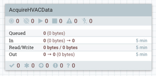

Double click on the process group to dive into it. At the bottom of the canvas, you will see **NiFi Flow >> AcquireHVACData** breadcrumb. Let's began connecting the processors for data ingestion, preprocessing and storage.

### Ingest Sensor Data Source

Drop the processor icon onto the NiFi canvas. Add the **GetHTTP**.

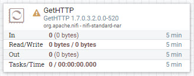

Hold **control + mouse click** on **GetHTTP** to configure the processor:

**Table 1: Scheduling Tab**

| Scheduling     | Value     |
| :------------- | :------------- |
| Run Schedule       | `1 sec`       |

**Table 2: Properties Tab**

| Property     | Value     |
| :------------| :---------|
| **URL**  | `http://s3.amazonaws.com/hw-sandbox/tutorial14/SensorFiles.zip` |
| **Filename**  | `HVACSensorFiles.zip` |

Click **APPLY**.

### Decompress Content of FlowFile

Drop the processor icon onto the NiFi canvas. Add the **UnpackContent**.

Create connection between **GetHTTP** and **UnpackContent** processors. Hover
over **GetHTTP** to see arrow icon, press on processor and connect it to
**UnpackContent**.

Configure Create Connection:

| Connection | Value     |
| :------------- | :------------- |
| For Relationships     | success (**checked**) |

Click **ADD**.

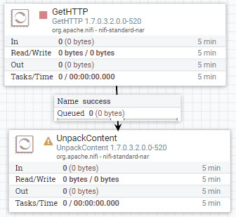

Configure **UnpackContent** processor:

**Table 3: Settings Tab**

| Setting | Value     |
| :------------- | :------------- |
| Automatically Terminate Relationships | failure (**checked**) |
| Automatically Terminate Relationships | original (**checked**) |

**Table 4: Scheduling Tab**

| Scheduling | Value     |
| :------------- | :------------- |
| Run Schedule       | `1 sec`       |

**Table 5: Properties Tab**

| Property | Value     |
| :------------- | :------------- |
| **Packaging Format**       | `zip` |

Click **APPLY**.

### Route the FlowFiles Into Two Flows Based on Their Attributes

Drop the processor icon onto the NiFi canvas. Add the **RouteOnAttribute**.

Create connection between **UnpackContent** and **RouteOnAttribute** processors. Hover
over **UnpackContent** to see arrow icon, press on processor and connect it to
**RouteOnAttribute**.

Configure Create Connection:

| Connection | Value     |
| :------------- | :------------- |
| For Relationships     | success (**checked**) |

Click **ADD**.

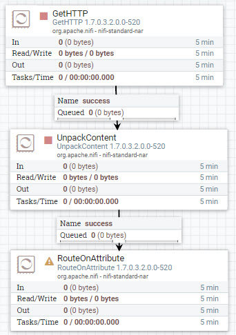

Configure **RouteOnAttribute** processor:

**Table 6: Settings Tab**

| Setting | Value     |
| :------------- | :------------- |
| Automatically Terminate Relationships | unmatched (**checked**) |

**Table 7: Scheduling Tab**

| Scheduling | Value     |
| :------------- | :------------- |
| Run Schedule       | `1 sec`       |

**Table 8: Properties Tab**

Press the **+** button to add a user defined property for routing property name **building** and **hvac**.

| Property | Value     |
| :------------- | :------------- |
| **Routing Strategy**       | `Route to Property name` |
| **building_csv**       | `${filename:equals('building.csv')}` |
| **hvac_csv**       | `${filename:equals('HVAC.csv')}` |

Click **APPLY**.

### Store the Data Into Storage

Drop the processor icon onto the NiFi canvas. Add 2 **PutHDFS** processors.

Create connection between **RouteOnAttribute** and both **PutHDFS** processors. Hover
over **RouteOnAttribute** to see arrow icon, press on processor and connect it to
**PutHDFS**. Repeat the the previous step to connect to the other **PutHDFS** processor.

For one of the **PutHDFS** processors, Configure Create Connection:

| Connection | Value     |
| :------------- | :------------- |
| For Relationships     | building_csv (**checked**) |

Click **ADD**.

For the other **PutHDFS** processor, Configure Create Connection:

| Connection | Value     |
| :------------- | :------------- |
| For Relationships     | hvac_csv (**checked**) |

Click **ADD**.

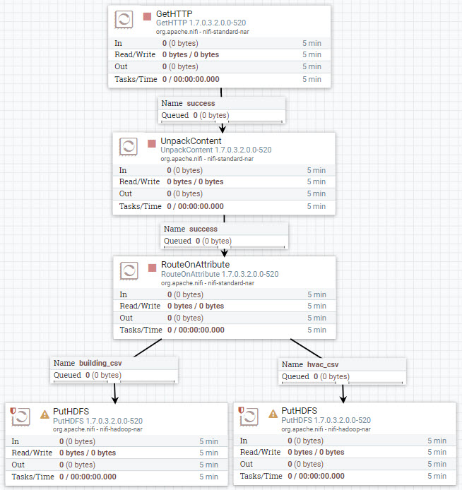

Configure **PutHDFS** processor for relationship connection **building_csv**:

**Table 9: Settings Tab**

| Setting | Value     |
| :------------- | :------------- |
| Automatically Terminate Relationships | failure (**checked**) |
| Automatically Terminate Relationships | success (**checked**) |

**Table 10: Scheduling Tab**

| Scheduling | Value     |
| :------------- | :------------- |
| Run Schedule       | `1 sec`       |

**Table 11: Properties Tab**

Press the **+** button to add a user defined property for routing property name **building** and **hvac**.

| Property | Value     |
| :------------- | :------------- |
| Hadoop Configuration Resources       | `/etc/hadoop/conf/core-site.xml,/etc/hadoop/conf/hdfs-site.xml` |
| **Directory**       | `/sandbox/sensor/hvac_building` |
| **Conflict Resolution Strategy**       | `replace` |

Click **APPLY**.

Configure **PutHDFS** processor for relationship connection **hvac_csv**:

**Table 12: Settings Tab**

| Setting | Value     |
| :------------- | :------------- |
| Automatically Terminate Relationships | failure (**checked**) |
| Automatically Terminate Relationships | success (**checked**) |

**Table 13: Scheduling Tab**

| Scheduling | Value     |
| :------------- | :------------- |
| Run Schedule       | `1 sec`       |

**Table 14: Properties Tab**

Press the **+** button to add a user defined property for routing property name **building** and **hvac**.

| Property | Value     |
| :------------- | :------------- |
| Hadoop Configuration Resources       | `/etc/hadoop/conf/core-site.xml,/etc/hadoop/conf/hdfs-site.xml` |
| **Directory**       | `/sandbox/sensor/hvac_machine` |
| **Conflict Resolution Strategy**       | `replace` |

Click **APPLY**.

### Start Process Group Flow to Acquire Data

At the breadcrumb, select **NiFi Flow** level. Hold **control + mouse click** on the **AcquireHVACData** process group, then click the **start** option.

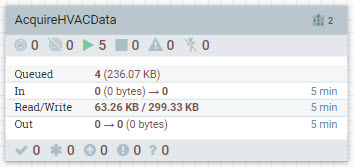

Once NiFi writes your sensor data to HDFS, which you can check by viewing data provenance, you can turn off the process group by holding **control + mouse click** on the **AcquireHVACData** process group, then choose **stop** option.

### Verify NiFi Stored Data

Enter the **AcquireHVACData** process group, press **control + mouse click** on PutHDFS processor of your choice, then press **View data provenance**.

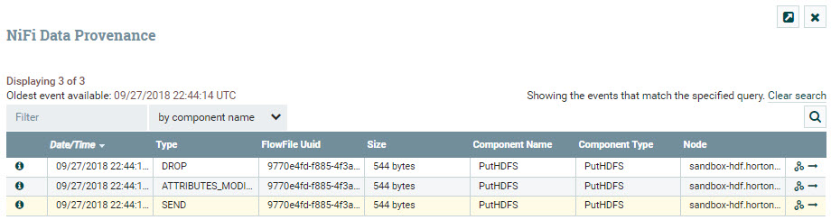

Press on **i** icon on the left row to view details about a provenance event. Choose the event with the type **SEND**. In the Provenance Event window, choose **CONTENT** tab. On **Output Claim**, choose **VIEW**.

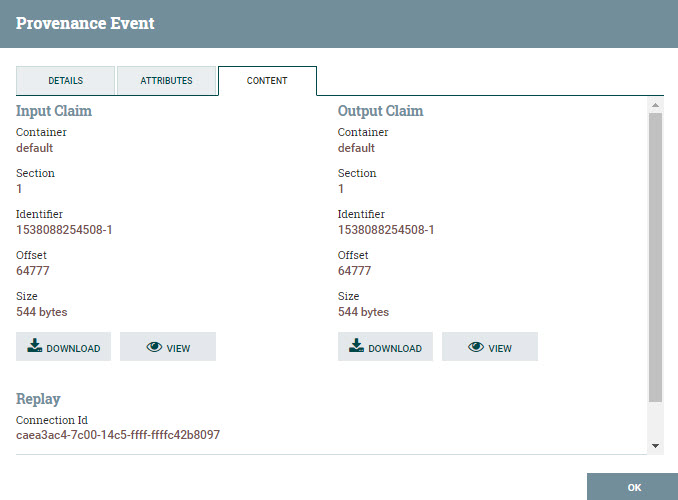

You will be able to see the data NiFi sent to the external process HDFS via NiFi's data provenance. The data below shows hvac dataset.

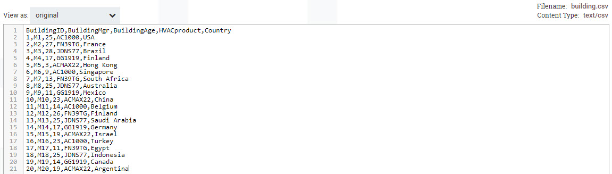

Let's verify that the data is actually present in **HDFS** from Ambari **Files View**. Login to HDP Ambari at http://sandbox-hdp.hortonowrks.com:8080.

Click the Ambari Views selector at the top right corner, then click **Files View**.

By entering the path: `/sandbox/sensor/hvac_building`, you should be able to view the `.csv` data for **building.csv**. The HVAC.csv is in the hvac_temperature folder.

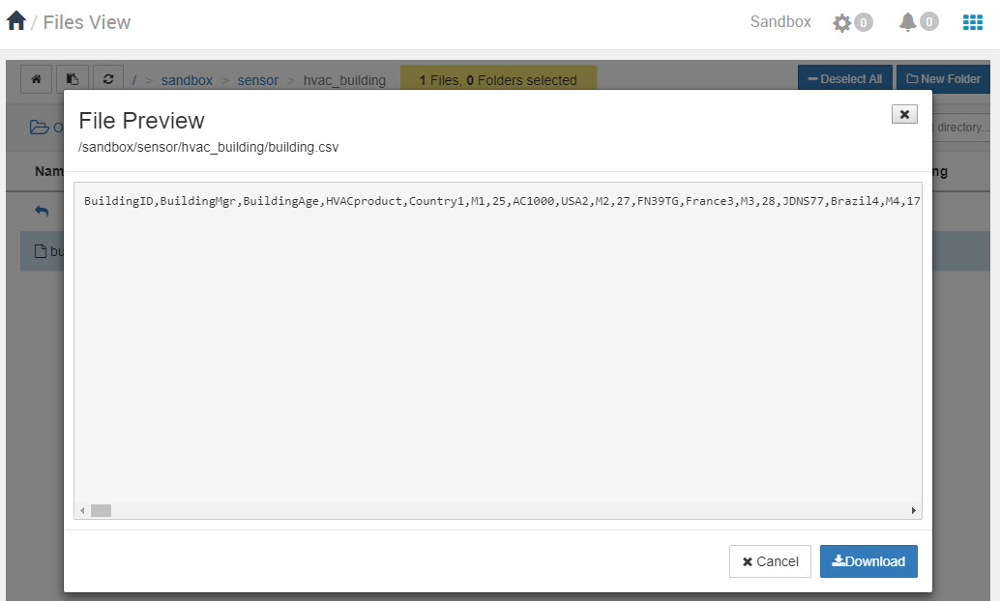

The **building.csv** data does look distorted, but when we clean it further with Apache Hive, it will be formatted appropriately in a table.

## Approach 2: Import NiFi AcquireHVACData Process Group via UI

Head to HDF Ambari at http://sandbox-hdp.hortonowrks.com:8080 with login user `admin` and the password you set, then enter the NiFi UI using Ambari Quick Link and import the NiFi template.

Download the NiFi template [acquire-hvac-data.xml](application/development/nifi-template/acquire-hvac-data.xml) to your local computer.

After starting your sandbox, open HDF **NiFi UI** at `http://sandbox-hdf.hortonworks.com:9090/nifi`.

Open the Operate panel if not already open, then press the **Upload Template** icon .

Press on Select Template icon .

The file browser on your local computer will appear, find **acquire-hvac-data.xml** template you just downloaded, then press **Open**, then press **UPLOAD**.

You should receive a notification that the **Template successfully imported.** Press OK to acknowledge.

Drop the **Template** icon  onto the NiFi canvas.

Add Template called **acquire-hvac-data**.

Start the NiFi flow. Hold **control + mouse click** on the **AcquireHVACData** process group, then click the **start** option.


Once NiFi writes your sensor data to HDFS, which you can check quickly by looking at the PutHDFS processors inside the process group, you can turn off the process group by holding **control + mouse click** on the **AcquireHVACData** process group, then choose **stop** option.

## Approach 3: Auto Deploy NiFi Flow via REST Call

Open HDF Sandbox Web Shell Client at http://sandbox-hdf.hortonworks.com:4200. Copy and paste the following shell code:

```bash
NIFI_TEMPLATE="acquire-hvac-data"
wget https://raw.githubusercontent.com/hortonworks/data-tutorials/master/tutorials/cda/building-an-hvac-system-analysis-application/application/development/shell/nifi-auto-deploy.sh
bash nifi-auto-deploy.sh $NIFI_TEMPLATE
```

Open HDF **NiFi UI** at http://sandbox-hdf.hortonworks.com:9090/nifi. You will see the NiFi template was uploaded, imported and started.


Once NiFi writes your sensor data to HDFS, which you can check quickly by looking at the PutHDFS processors inside the process group, you can turn off the process group by holding **control + mouse click** on the **AcquireHVACData** process group, then choose **stop** option.

## Summary

Congratulations! You have now added a NiFi dataflow to the data pipeline to ingest the data from the sensors embedded on HVAC machine systems, prepared the data to be in a readable format for external services to do data analysis. In the next portion of the data pipeline, you will use Apache Hive to perform cleaning and analysis on the data.

## Further Reading

- [Apache NiFi User Guide](https://nifi.apache.org/docs/nifi-docs/html/user-guide.html)
---
title: Cleaning Raw HVAC Data
---

# 4.Cleaning Raw HVAC Data

## Introduction

Your next objective as a Data Engineer is to use Hive Query Language similar to SQL to clean HVAC sensor data from HVAC machines and HVAC buildings into a useful format using Apache Zeppelin's JDBC Hive Interpreter. You will gain a practical experience with creating Hive tables that run on ORC files for fast and efficient data processing. You will gain insight to writing Hive scripts that enrich our data to reveal to us when temperature is at a cold, normal or hot state. Additionally, you will learn to write Hive queries on the data to determine which particular buildings are associated with these temperature states.

## Prerequisites

- Enabled CDA for your appropriate system
- Set up the Development Environment
- Acquired HVAC Sensor Data

## Outline

- [Upload HVAC Sensor Data into Tables](#upload-hvac-sensor-data-into-tables)
- [Refine the Raw Sensor Data](#refine-the-raw-sensor-data)
- [Summary](#summary)
- [Further Reading](#further-reading)

## Upload HVAC Sensor Data into Tables

Open Ambari UI at http://sandbox-hdp.hortonworks.com:8080 and login with `admin` and the password you set.

Before we can get to cleaning the data with Apache Hive, we need to upload the HVAC sensor data into Hive Tables.

There are a few different ways to import CSV data into Hive Tables. We can use Data Analytics Studio, Zeppelin's JDBC Hive interpreter or Hive shell. We will use Zeppelin's JDBC Hive interpreter to transfer our HVAC sensor data into Hive Tables.

### Open Zeppelin UI from Ambari

Click on **Zeppelin Notebook** service in Ambari stack, in the box on the rightside called **Quick Links**, click on **[Zeppelin UI](http://sandbox-hdp.hortonworks.com:9995/)**.

Click **Create new note**.

Insert **Note Name** as `Cleaning-Raw-HVAC-Data`, select `jdbc` for default interpreter, then click **Create**.

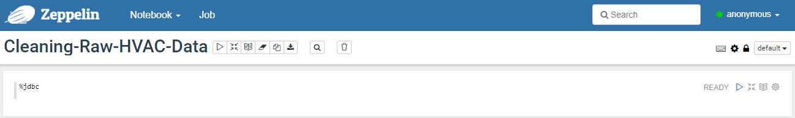

### Create Database HVAC Sensor Data

Copy and paste the following Hive code into Zeppelin:

Create database **hvac_sensors**. Copy and paste the Hive query, press **shift + enter** to execute the code:

```sql
%jdbc(hive)
CREATE DATABASE IF NOT EXISTS hvac_sensors;
```

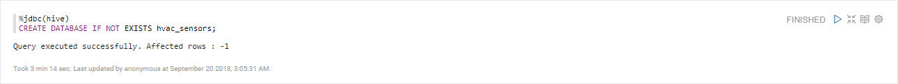

Verify the **hvac_sensors** database was created successfully:

```sql
%jdbc(hive)
SHOW DATABASES;
```

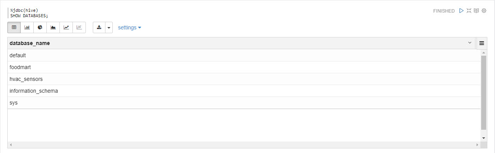

### Upload HVAC Building CSV Data into Hive Table

The process of uploading the building.csv data into Hive requires that we create an external table to verify that Hive has access to the data, but doesn't own the original CSV data to keep it safe from being deleted in case the external table were to be deleted. Next we create an internal table called building, which is in ORC format and we move the data from the external table to the internal table, so data is owned by Hive, but the original CSV data is still safe.

### Create External Hive Table

First we will create an external table referencing the HVAC building CSV data.

```sql
%jdbc(hive)
CREATE EXTERNAL TABLE IF NOT EXISTS hvac_sensors.building_csv (
    `BuildingID` INT,
    `BuildingMgr` STRING,
    `BuildingAge` INT,
    `HVACproduct` STRING,
    `Country` STRING
)
ROW FORMAT DELIMITED
FIELDS TERMINATED BY ','
STORED AS TEXTFILE
LOCATION '/sandbox/sensor/hvac_building'
TBLPROPERTIES("skip.header.line.count"="1");
```

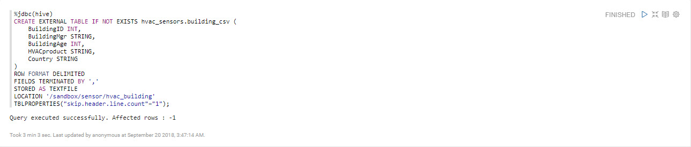

We created an external table **building_csv** into database **hvac_sensors**, we used backticks characters for each attribute to avoid running into reserved keyword issues with Hive, told Hive to store the data in the table as a textfile, and told Hive the original building.csv data is located in directory `/sandbox/sensor/hvac_building`. We first created an external table to keep the original data safe from being deleted if the table were to get deleted.

Next we will verify the import was successful by printing a sample of the first 5 rows:

```sql
%jdbc(hive)
SELECT * FROM hvac_sensors.building_csv LIMIT 5;
```

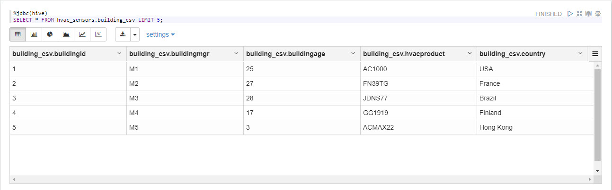

### Create Internal Hive Table to Copy Over External Table Data

Now we will create an internal hive table. We also have more file format options as storage for the data in the table, we will use **Apache ORC format** since it provides great compression and excellent performance.

```sql
%jdbc(hive)
CREATE TABLE IF NOT EXISTS hvac_sensors.building (
  `BuildingID` INT,
  `BuildingMgr` STRING,
  `BuildingAge` INT,
  `HVACproduct` STRING,
  `Country` STRING
)
COMMENT 'Building holds HVAC product'
STORED AS ORC;
```

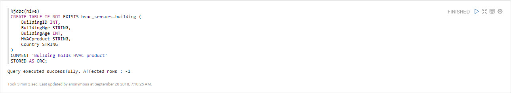

With the internal table created, we can copy the external table data into this internal hive table.

```sql
%jdbc(hive)
INSERT OVERWRITE TABLE hvac_sensors.building SELECT * FROM hvac_sensors.building_csv;
```

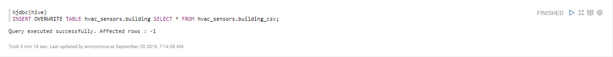

For verification that the data was copied successfully, like we did earlier, we can use **select** query to show us the 5 first rows of the data.

```sql
%jdbc(hive)
SELECT * FROM hvac_sensors.building LIMIT 5;
```

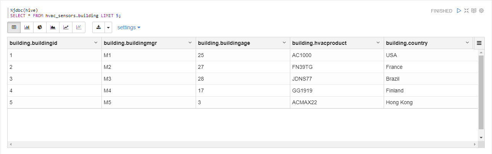

### Upload HVAC Machine CSV Data into Hive Table

The process of uploading the HVAC.csv data into Hive is similar to the process we went through earlier with HVAC building.csv. We will perform the same process for HVAC.csv.

### Create External Hive Table

We will create an external Hive table referencing the HVAC machine csv data.

```sql
%jdbc(hive)
CREATE EXTERNAL TABLE IF NOT EXISTS hvac_sensors.hvac_machine_csv (
  `Date` STRING,
  `Time` STRING,
  `TargetTemp` INT,
  `ActualTemp` INT,
  `System` INT,
  `SystemAge` INT,
  `BuildingID` INT
)
ROW FORMAT DELIMITED
FIELDS TERMINATED BY ','
STORED AS TEXTFILE
LOCATION '/sandbox/sensor/hvac_machine'
TBLPROPERTIES("skip.header.line.count"="1");
```

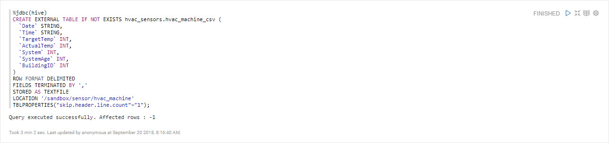

Let's verify the import was successfully by printing a sample of the first 5 rows:

```sql
%jdbc(hive)
SELECT * FROM hvac_sensors.hvac_machine_csv LIMIT 5;
```

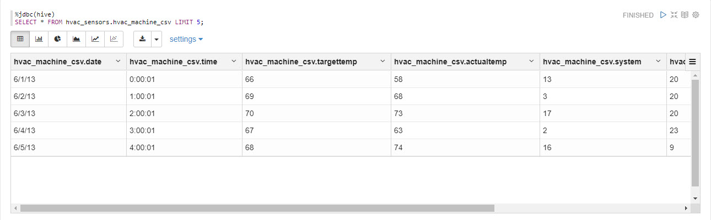

### Create Internal Hive Table to Copy Over External Table Data

Now we will create an internal hive table with table file format stored as **Apache ORC format**.

```sql
%jdbc(hive)
CREATE TABLE IF NOT EXISTS hvac_sensors.hvac_machine (
  `Date` STRING,
  `Time` STRING,
  `TargetTemp` INT,
  `ActualTemp` INT,
  `System` INT,
  `SystemAge` INT,
  `BuildingID` INT
)
COMMENT 'hvac_machine holds data on attributes of the machine'
STORED AS ORC;
```

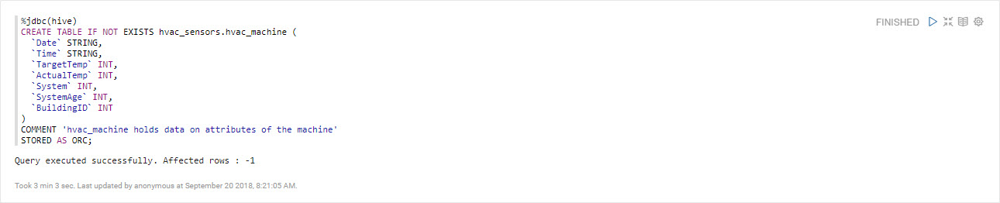

With the internal table created, we can copy the external table data into this internal hive table.

```sql
%jdbc(hive)
INSERT OVERWRITE TABLE hvac_sensors.hvac_machine SELECT * FROM hvac_sensors.hvac_machine_csv;
```


Now let's verify that the data was copied from the external table to the internal table successfully using **select**.

```sql
%jdbc(hive)
SELECT * FROM hvac_sensors.hvac_machine LIMIT 5;
```

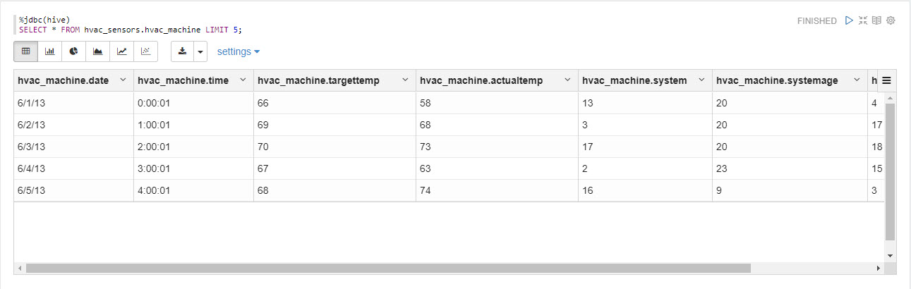

## Refine the Raw Sensor Data

We will write Hive scripts to clean the raw sensor data in effort to acquire these key insights:

- Reduce heating and cooling expenses
- Keep indoor temperatures in a comfortable range between 65-70 degrees
- Identify which HVAC products are reliable

```sql
%jdbc(hive)
CREATE TABLE hvac_sensors.hvac_temperatures AS
SELECT *, targettemp - actualtemp AS temp_diff,
IF((targettemp - actualtemp) > 5, 'COLD',
IF((targettemp - actualtemp) < -5, 'HOT', 'NORMAL'))
AS temprange,
IF((targettemp - actualtemp) > 5, '1',
IF((targettemp - actualtemp) < -5, '1', 0))
AS extremetemp FROM hvac_sensors.hvac_machine;
```

> Note: the above query may take 10 to 15 minutes to complete

What's this query does?

- Creates a new table **hvac_temperatures** and copies data from the **hvac** table
- On the Query Results page, use the slider to scroll to the right. You will notice that two new attributes appear in the **hvac_temperatures** table

What are the two new attributes?

- **temprange** and **extremetemp**

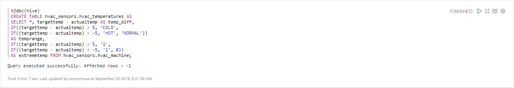

Let's load 10 rows from the **hvac_temperatures** table:

```sql
%jdbc(hive)
SELECT * FROM hvac_sensors.hvac_temperatures LIMIT 10;
```

What does the data in the **temprange** column indicate about the actual temperature?

- **NORMAL** – within 5 degrees of the target temperature.
- **COLD** – more than five degrees colder than the target temperature.
- **HOT** – more than 5 degrees warmer than the target temperature.

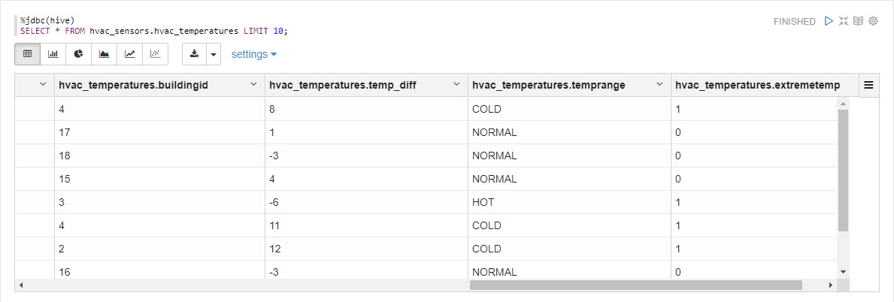

Now we will create a table that combines hvac_temperatures and buildings table.

```sql
%jdbc(hive)
CREATE TABLE IF NOT EXISTS hvac_sensors.hvac_building
AS SELECT h.*, b.country, b.hvacproduct, b.buildingage, b.buildingmgr
FROM hvac_sensors.building b JOIN hvac_sensors.hvac_temperatures h ON b.buildingid = h.buildingid;
```

Which tables is **hvac_sensors.hvac_building** data coming from?

- **hvac_temperature** and **buildings**

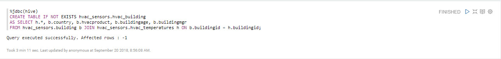

After the query successfully creates the **hvac_sensors.hvac_building**, you will receive the following message: **Query executed successfully. Affected rows : -1.**.

Let's load 10 rows from the data from the new `hvac_sensors.hvac_building`

```sql
%jdbc(hive)
SELECT * FROM hvac_sensors.hvac_building LIMIT 10;
```

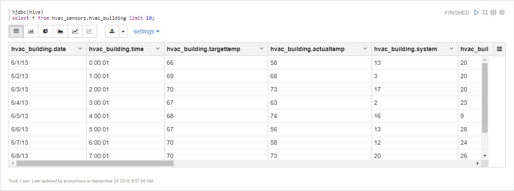

## Summary

You've successfully uploaded the HVAC CSV sensor data to Hive and refined the data into a useful format. You learned to create Hive tables that run on ORC files for fast and efficient data processing. You learned to write Hive scripts to enrich our data to reveal to us when temperature is at a cold, normal or hot state. Additionally, you used the data to bring insight into which particular buildings are associated with these temperature range levels: **NORMAL, HOT OR COLD**. Our next step is to use Zeppelin's other data visualization tools to story tell our the results from the data analysis.

## Further Reading

- [Importing Data from CSV Files into Hive Tables](http://www.informit.com/articles/article.aspx?p=2756471&seqNum=4)
- [How can I upload ORC files to Hive?](https://community.hortonworks.com/questions/47594/how-can-i-upload-ocr-files-to-hive.html)
- [Optimizing Hive queries for ORC formatted tables](https://community.hortonworks.com/articles/68631/optimizing-hive-queries-for-orc-formatted-tables.html)
---
title: Visualizing Sensor Data Related To HVAC Machine Systems
---

# 5.Visualizing Sensor Data Related To HVAC Machine Systems

## Introduction

Your next objective is to act as a Data Analyst and use Apache Zeppelin built-in visualization tools to provide insights on your data, such as illustrating which countries have the most extreme temperature and the amount of **NORMAL** events there are compared to **HOT** and **COLD**. You will also illustrate which HVAC units result in the most `extremetemp` readings.

## Prerequisites

- Enabled CDA for your appropriate system
- Set up the Development Environment
- Acquired HVAC Sensor Data
- Cleaned Raw HVAC Data

## Outline

- [Visualize HVAC Building Temperature Characteristics Per Country](#visualize-hvac-building-temperature-characteristics-per-country)
- [Visualize Extreme Temperature in Buildings Having HVAC Products](#visualize-extreme-temperature-in-buildings-having-hvac-products)

## Visualize HVAC Building Temperature Characteristics Per Country

Click on **Zeppelin Notebook** service in Ambari stack, in the box on the rightside called **Quick Links**, click on **[Zeppelin UI](http://sandbox-hdp.hortonworks.com:9995/)**.

Click **Create new note**.

Insert **Note Name** as `Visualizing-HVAC-Machine-Sensor-Data`, select `jdbc` for default interpreter, then click **Create**.

We will use the JDBC Hive interpreter to run Hive queries and visualize the results.

First we need to select the columns from `hvac_sensors.hvac_building` table that will illustrate hvac_building **country** location, whether **temperature** in a hvac_building is extreme and what the **temprange** level is for an hvac_building. Copy and paste the Hive query:

```sql
%jdbc(hive)
SELECT country, extremetemp, temprange FROM hvac_sensors.hvac_building LIMIT 1000;
```

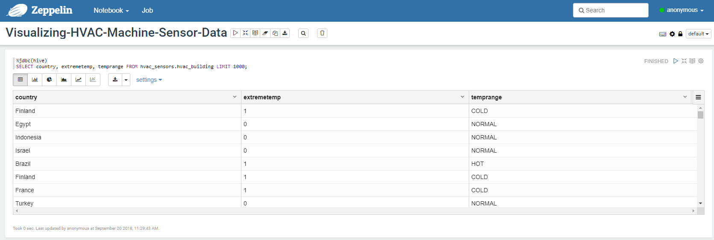

Select the **bar chart** button located just under the query to change the table visualization to bar chart.

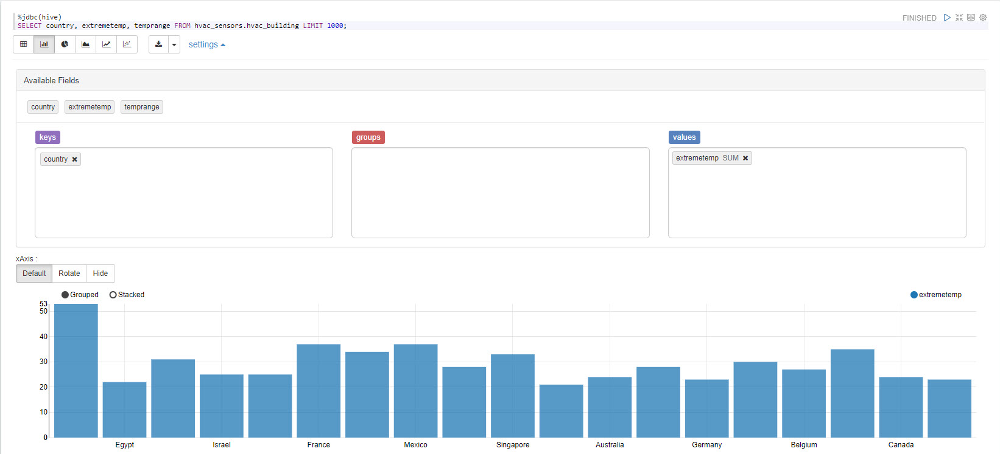

Let's further configure this chart, click **settings** to open up more available fields.

-   Arrange the fields according to the following image.
-   Drag the field `temprange` into the **groups** box.
-   Click **SUM** on `extremetemp` and change it to **COUNT**.
-   Make sure that `country` is the only field under **Keys**.

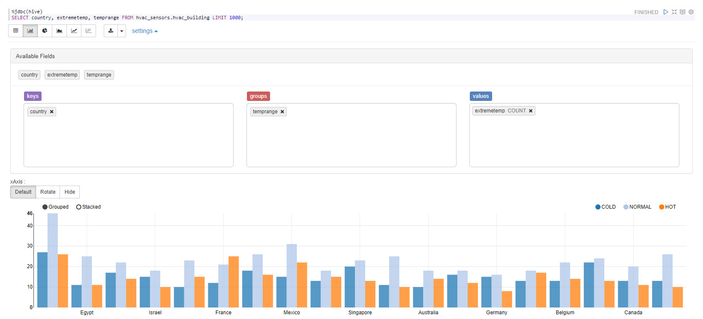

From the chart above we can see the countries that HVAC Buildings come from that have the most extreme temperature indicated by a count for ***extremetemp*** associated with ***temprange level*** for **NORMAL** events there are compared to **HOT** and **COLD**.

## Visualize Extreme Temperature in Buildings Having HVAC Products

Is it possible to figure out which buildings might need HVAC upgrades, and which do not? Let’s determine that answer in the steps ahead...

Let's create one more note to visualize which types of HVAC systems result in the least amount of `extremetemp` readings.

Copy and paste the Hive query into the next Zeppelin note:

```sql
%jdbc(hive)

select hvacproduct, extremetemp from hvac_sensors.hvac_building;
```

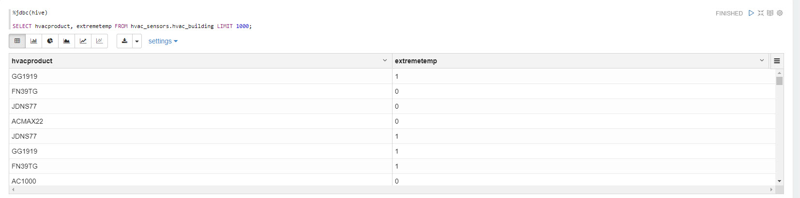

Arrange the fields according to the following image so we can recreate the chart below.

Now choose bar chart, then arrange the fields for `hvacproduct` and `extremetemp`.

-   Make sure that `hvacproduct` is in the **Keys** box.
-   Make sure that `extremetemp` is in the **Values** box and that it is set to **COUNT**.

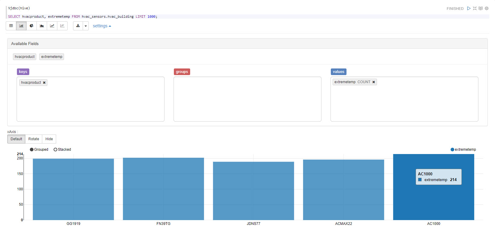

Now we can see which HVAC units result in the most `extremetemp` readings. Thus we can make a more informed decision when purchasing new HVAC systems.

## Summary

We’ve successfully gained more insights on our data by visualizing certain key attributes using Apache Zeppelin. We learned to visualize a graph that shows the countries that have the most extreme temperature and the amount of **NORMAL** events there are compared to **HOT** and **COLD**. We learned to see which HVAC units result in the most `extremetemp` readings.

## Further Reading

-   [How to create Map Visualization in Apache Zeppelin](https://community.hortonworks.com/questions/78430/how-to-create-map-visualization-in-apache-zeppelin.html)
-   [Using Angular within Apache Zeppelin to create custom visualizations](https://community.hortonworks.com/articles/75834/using-angular-within-apache-zeppelin-to-create-cus.html)
