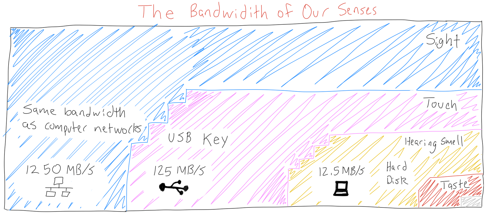
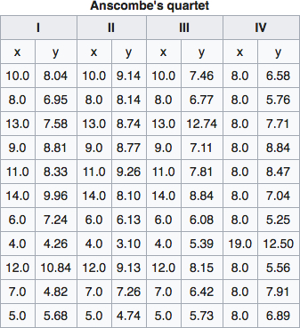
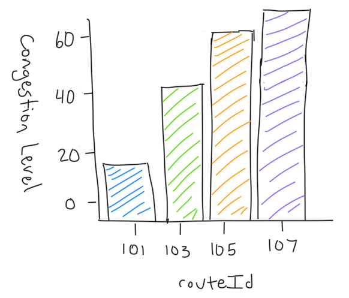
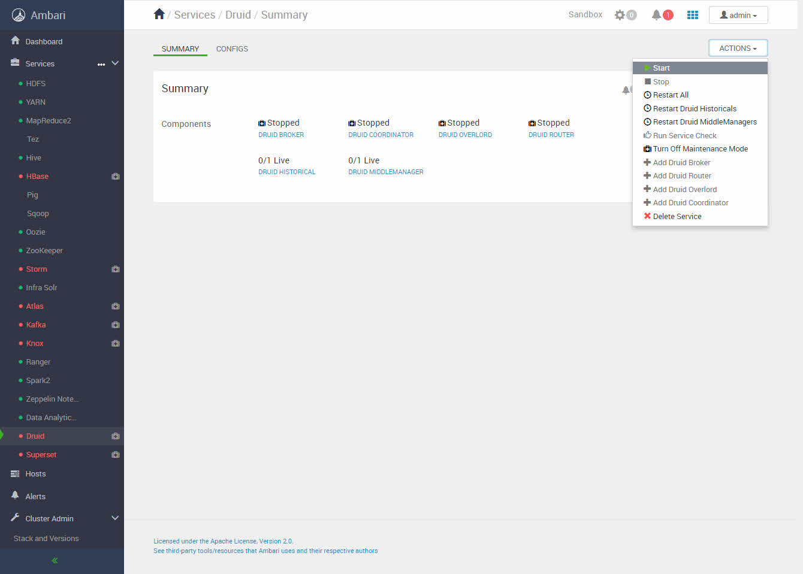
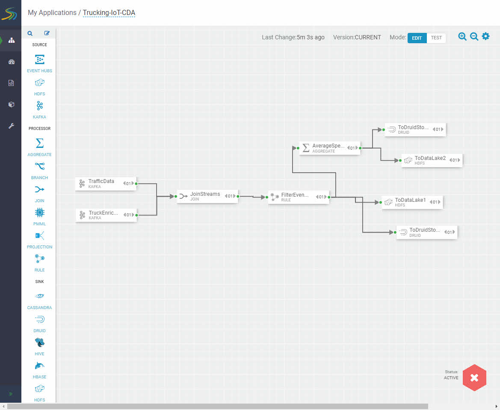
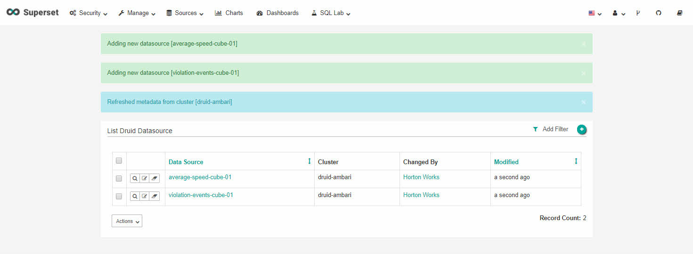
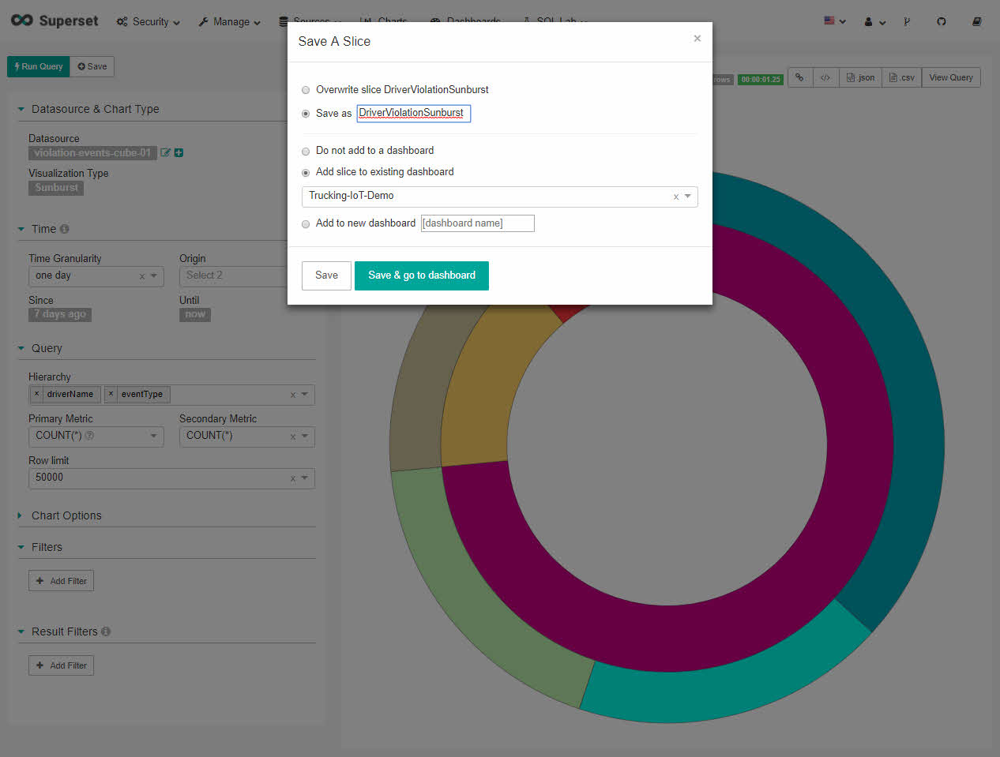

# Superset in Trucking IoT

## Introduction

Superset is a Business Intelligence tool packaged with many features for designing, maintaining and enabling the storytelling of data through meaningful data visualizations. The trucking company you work at has a Trucking IoT Application that processes the truck and traffic data it receives from sensors, but the businesses leaders are not able to make sense of the data. They hired you as a Data Visualization Analyst to tell a story through visualizing this application's data, such as how the traffic congestion levels impact truck driver performance, which ultimately affect the company. Therefore, your communication of your insights to business leaders will influence them to take action based on your recommendations.

## Objective

- Learn Data Visualization Concepts
- Become familiar with Apache Superset
- Learn to Design Visualizations with Superset

## Prerequisites

- Downloaded and deployed the [Hortonworks Data Platform (HDP)](https://www.cloudera.com/downloads/hortonworks-sandbox/hdp.html?utm_source=mktg-tutorial) Sandbox
- If you don't have 32GB of dedicated RAM for HDP Sandbox, then refer to [Deploying Hortonworks Sandbox on Microsoft Azure](https://hortonworks.com/tutorial/sandbox-deployment-and-install-guide/section/4/)
- Enabled Connected Data Architecture:
  - [Enable CDA for VirtualBox](https://hortonworks.com/tutorial/sandbox-deployment-and-install-guide/section/1/#enable-connected-data-architecture-cda---advanced-topic)
  - [Enable CDA for VMware](https://hortonworks.com/tutorial/sandbox-deployment-and-install-guide/section/2/#enable-connected-data-architecture-cda---advanced-topic)
  - [Enable CDA for Docker](https://hortonworks.com/tutorial/sandbox-deployment-and-install-guide/section/3/#enable-connected-data-architecture-cda---advanced-topic)

## Outline

- **[Superset Concepts](https://hortonworks.com/tutorial/superset-in-trucking-iot/section/1/)** - Covers the fundamental concepts of Data Visualization and Superset.
- **[Setting up the Development Environment](https://hortonworks.com/tutorial/superset-in-trucking-iot/section/2/)** - Setup hostname mapping to IP address, setup Ambari admin password, turn on services needed for Superset and turn on Superset.
- **[Visualizing Trucking Data](https://hortonworks.com/tutorial/superset-in-trucking-iot/section/3/)** - Shows how to visualize data using Superset.

## Tutorial Reference Application

This tutorial series uses our **[Trucking IoT Application](https://github.com/orendain/trucking-iot/tree/hadoop-summit-2017)** comprised of multiple sub-projects. You will build the Superset visualization subproject.
---
title: Superset Concepts
---

# Superset Concepts

## Objective

To understand the importance of Data Visualization, began brainstorming on the some visualizations you can use to communicate messages about the trucking data and become familiar with the Superset.

## Outline

-   [Data Visualization Fundamentals](#data-visualization-fundamentals)
-   [History of Data Visualization](#history-of-data-visualization)
-   [Why use Superset?](#why-use-superset)
-   [Superset Terminology](#superset-terminology)
-   [Summary](#summary)
-   [Further Reading](#further-reading)

## Data Visualization Fundamentals

### What is Data Visualization?

~~~
"Data visualization is about conveying a story or an idea as
efficiently as possible. Its often said that a picture is worth
a thousand words. Data visualization works the same way. Data
scientists use data visualization to explore patterns in their
data and ultimately convey results."
 - Ryan Orban (Udacity Instructor - Data Visualization and D3.js,
   Lesson 1: Visualization Fundamentals, 1. What is Data
   Visualization?)
~~~

Many people view it as an art and science, which is has various applications:

- [Infographics](https://en.wikipedia.org/wiki/Infographic)
- [Information Visualization](https://en.wikipedia.org/wiki/Information_visualization)
- [Scientific Visualization](https://en.wikipedia.org/wiki/Scientific_visualization)
- [Exploratory Data Analysis](https://en.wikipedia.org/wiki/Exploratory_data_analysis)
- [Statistical Graphics](https://en.wikipedia.org/wiki/Statistical_graphics)

### Why use Data Visualization?

We should use data visualization rather than representing the data as numbers because humans are more adept at interpreting the relationship in the data when they see it directly as a graph.

**Data Visualization & Human Perception**

Data visualization helps our brain perceive data. According to Physicist Tor Norretrander, _eye sight_ takes up majority of space from the _bandwidth of our senses_ and can process information at the speed of computer networks or ethernet cables illustrated by the following diagram (Udacity Course - Data Visualization with Tableau, Lesson 1: Data Visualization Fundamentals).

`Hand drawn diagram based on "Udacity Course - Data Visualization with Tableau, Lesson 1: Data Visualization Fundamentals, 3. Why use data visualization"`

**Anscombe's Descriptive Statistics vs Graphs**

Statistician Francis Anscombe setup the scenario in which he had 4 datasets with eleven points (x,y) that had the same descriptive statistics: mean, variance, correlation coefficient and line of best fit. Without data visualization, it would appear the datasets have no major differences as indicated by the table.

`Credit: Wikipedia - Anscombe's Quartet Page`

**Anscombe's Quartet** suggests to always plot your data rather than depend on descriptive statistics. In the case of the table above with the 4 datasets, the summary statistics did not differ, but the graphs do.

`Credit: Wikipedia - Anscombe's Quartet Page`

What can we see from the graphs that throw off our summary statistics?

The effect of:

- Curvatures
- Outliers

The above example reinforces why we should use data visualization over displaying numbers. Graphics allow us to clearly see deviations or patterns in the data while tables and summary statistics do not.

### Why mention Data Types?

**Data types** concepts are utilized when creating or recreating visualizations. We must understand the different kinds of data types found in data visualizations:

1\. **Quantitative Data** - are any variables with exact numbers, which can be discrete or continuous variables.
  - _Discrete_ is a variable that is countable
    - Examples of names: units sold, number of languages spoken, number of emails, you received
  - _Continuous_ is a variable that is within a range
    - Examples of names: time, height, weight, money, interest rates, temperature

2\. **Qualitative Data** - are any variables with a label or category, which can be categorical or ordinal variables.
  - _Categorical (Nominal)_ is a variable that labels or categorizes data into groups
    - Examples of names: gender, hair color, country, industry, cat breed
  - _Ordinal (Ordered)_ is a variable that ranks categories
    - Examples of names: rankings, class_difficulty, survey questions like "How do you feel about hedgehogs?"
      - 1\. I love them
      - 2\. negative
      - 3\. neutral
      - 4\. positive

~~~
Credit: Udacity Course - Data Visualization with Tableau, Lesson 1: Data Visualization Fundamentals
~~~

### Characteristics of Effective Visualization

~~~
"Graphical displays should:

1. Show the data
2. Induce the viewer to think about the substance rather than about methodology,
graphic design, the technology of graphic production or something else
3. Avoid distorting what the data has to say
4. Present many numbers in a small space
5. Make large data sets coherent
6. Encourage the eye to compare different pieces of data
7. Reveal the data at several levels of detail, from a broad overview to the
fine structure
8. Serve a reasonably clear purpose: description, exploration, tabulation or
decoration
9. Be closely integrated with the statistical and verbal descriptions of a data
set.

Graphics reveal data." - Wikipedia
~~~

### Common Graphs Used to Communicate Messages about Data

As you experiment with ways to effectively visualize data, graphs you may want to utilize to communicate quantitative **messages** about your use case (Trucking IoT) include:

- 1\. Time Series: Single variable captured over a period of time.
    - _Line Chart_ can show the congestion level on a particular route over the span of weekdays, months, years, etc.

- 2\. Ranking: Categorical subdivisions ranked in ascending or descending order.
    - _Bar Chart_ can rank in ascending order traffic congestion level (the measure) by route (the category) during a single period.

- 3\. Part-to-whole: Categorical subdivisions measured as a ratio to the whole (percentage of 100%).
    - _Pie Chart or Bar Chart_ can show the percentage of violation events by truck drivers: **Lane Departure**, **Unsafe Follow Distance**, **Speeding**, **Unsafe Tail Distance** as a ratio to the whole.

- 4\. Deviation: Categorical subdivisions compared against a reference.
    - _Bar Chart_ can show the actual vs budget expenses for several business departments over a time period.

- 5\. Frequency Distribution: Shows the observations of a variable for a given interval.
    - _Histogram or/and Box Plot_
        - _Histogram_ can show the traffic congestion levels in the data for `Des Moines to Chicago` and `Saint Louis to Chicago` during foggy, windy or rainy day. The following histogram illustrates this information.
        - _Box Plot_ can visualize the statistics about the traffic congestion levels on these routes: median, quartiles, outliers, etc.

- 6\. Correlation: Comparison between two variables (x,y) to determine if they move in the same or opposite directions.
    - _Scatterplot_ can plot unemployment (x) and inflation (y) for a sample of months.

- 7\. Geographical or Geospatial: Comparison of a variable across a map or layout.
    - _Cartogram_ can show the number of persons on various floors of a building.

As you experiment with ways to visualize data to communicate meaningful messages and correlations, you will dabble into **Exploratory Data Analysis**, which is providing insight about the dataset through trial and error.

### Apply Human Perception to Design an Intuitive Graph

Human perception and cognition knowledge is essential for communicating the **message** you want to get across from the graph because all visualizations are created for human consumption. Human perception is the way humans visually process information. Thus, human visual processing involves detecting changes and making comparisons between quantities, sizes, shapes and variations in lightness. As long as **properties of symbolic data** are mapped to **visual properties represented by that data**, humans are able to browse through large volumes of data efficiently. Hence, data visualization allows the user to perform data explorations.

## History of Data Visualization

The first documented trace of data visualization was a **Turin Papyrus Map** and can be tracked back to 1160BC. Maps illustrate information about the location of geological resources and how to extract those resources. Maps also can show a **thematic cartography**, which is a geographical illustration designed to show a theme connected with a specific geographic area. People have also found different forms of data visualization through cave wall drawings and physical artifacts from Mesopotamian, Inca and other indigenous groups.

The invention of paper and parchment was a major breakthrough for allowing further development of visualizations. In the 16th century, techniques and instruments were developed for accurately measuring physical quantities, geographic and celestial positions. With the development of **analytic geometry** and **two-dimensional coordinate system** by Rene Descartes and Pierre de Fermat, they have influenced the methods we use to display and calculate data values.

Fermat teamed up with Blaise Pascal and their work on **statistics and probability theory** laid the foundation for what conceptualize as data. John Tukey and Edward Tufte's work in refining data visualization techniques allowed for this field to be inhabited by more than just the people in the Statistics field. As this technology progressed, hand-drawn visualizations evolve into software visualizations. Software visualization applications have the ability to visualize in 2D, 3D, virtually reality and augmented reality. There are a wide range of programs for visualization that have been developed: Tableau, Zeppelin, AtScale, R, Python, **Superset**.

## Why use Superset?

Superset has an easy to use interface for exploring and visualizing data with integration for various databases (we'll use Druid). Superset has a rich set of visualizations and gives the user the ability to create dashboards to categorize your data tables. Superset also allows users to create visualization slices, which represent the actual visualization of the data table, and select the appropriate dashboard for their slice. Superset is enterprise-ready, extensible and has a high granularity security/permission model that allows intricate rules on who can access individual features and the dataset.

Visually predict truck breakdowns and visually analyze driver habits on separate maps all to prevent drivers from getting into accidents

## Superset Terminology

- 1\. Sources: allows users to view databases, tables, druid clusters, druid datasources and

- 2\. Slices: graphical representations of the druid datasources that deliver a particular message about the data in the table to the customer

- 3\. Dashboards: group visualization slices together into particular categories, such as Trucking IoT, Weather IoT, Agriculture IoT, etc.

## Summary

We're now familiar with how Apache Superset ties into our Trucking IoT Application, let's see Superset in action and create some visualization slices of our data.

## Further Reading

- [Udacity - Data Visualization with Tableau](https://www.udacity.com/course/data-visualization-in-tableau--ud1006)
- [Udacity - Data Visualization and D3.js](https://www.udacity.com/course/data-visualization-and-d3js--ud507)
- [Udacity - Intro to Data Science](https://www.udacity.com/course/intro-to-data-science--ud359)
- [Data Visualization - Wikipedia](https://en.wikipedia.org/wiki/Data_visualization)
- [Apache Superset](https://superset.incubator.apache.org/)
---
title: Setting up the Development Environment
---

# Setting up the Development Environment

## Introduction

In this tutorial, you will verify your sandbox IP is mapped to your desired hostname, your admin password is setup and the services that need to be on are activated.

## Prerequisites

- **Map HDP Sandbox IP to hostname**, if you need help, reference **Learning the Ropes of the HDP Sandbox** tutorial section [ENVIRONMENT SETUP](https://hortonworks.com/tutorial/learning-the-ropes-of-the-hortonworks-sandbox/#environment-setup), go to Map Sandbox IP To Your Desired Hostname In The Hosts File in that tutorial

- **Map HDF Sandbox IP to hostname**, if you need help, reference **Learning the Ropes of the HDF Sandbox** tutorial section [ENVIRONMENT SETUP](https://hortonworks.com/tutorial/getting-started-with-hdf-sandbox/#environment-setup), go to Map Sandbox IP To Your Desired Hostname In The Hosts File in that tutorial

- **Set the Ambari admin password for HDP**, if you need help, reference **Learning the Ropes of the HDP Sandbox** tutorial section [Admin Password Reset](https://hortonworks.com/tutorial/learning-the-ropes-of-the-hdf-sandbox/#admin-password-reset)

- **Set the Ambari admin password for HDF**, if you need help, reference **Learning the Ropes of the HDF Sandbox** tutorial section [Learning the Ropes of HDF Sandbox](https://hortonworks.com/tutorial/getting-started-with-hdf-sandbox/#admin-password-reset)

- **Need to have data present in Druid**, refer to **[Real-Time Event Processing In NiFi, SAM, Schema Registry and SuperSet](https://hortonworks.com/tutorial/real-time-event-processing-in-nifi-sam-schema-registry-and-superset/)** tutorial to setup the SAM data pipeline to store data into Druid. All you need to do is step 1 through 3.

## Outline

- [Started up all required services for HDF and HDP](#started-up-all-required-services-for-hdf-and-hdp)
- [Setup Druid for Superset](#setup-druid-for-superset)
- [Summary](#summary)
- [Further Reading](#further-reading)

### Started up all required services for HDF and HDP

If unsure, login to Ambari **admin** Dashboard

- for HDF at http://sandbox-hdf.hortonworks.com:8080 and verify **Zookeeper**, **Storm**, **Kafka**,  **NiFi**, **Schema Registry**, **Streaming Analytics Manager** starts up, else start them with Maintenance Mode turned off.
- for HDP at http://sandbox-hdp.hortonworks.com:8080 and verify **HDFS**, **YARN**, **Druid** and **Superset** starts up, else start them with Maintenance Mode turned off.

For example, to start Druid, you would do the following.

After starting Druid and Superset, your Background Operations would look similar:

### Setup Druid for Superset

We include reference images of what needs to be started in the data
pipeline to get the data into Druid. You should have already done this step,
which was pointed out in the **prerequisites**.

1\. In the NiFi canvas http://sandbox-hdf.hortonworks.com:9090/nifi, start the
NiFi DataFlow by pressing the green start button in the operate panel.

2\. In the SAM canvas http://sandbox-hdf.hortonworks.com:7777/, start the SAM
topology by pressing the green start button at the bottom right of the canvas.

3\. In the Superset UI http://sandbox-hdp.hortonworks.com:9089, login
with credentials **admin/admin**, wait about **5 – 10 minutes** for Kafka data
to be consumed, then periodically, select the **Sources** dropdown and click on
**Refresh Druid Metadata**. Eventually, the two Druid data sources will appear.

## Summary

Congratulations! Data is now in Druid. We can see the datasources in Superset.
We are ready to start creating visualization representations of the data.

## Further Reading

- [An introduction to Druid](https://www.youtube.com/watch?v=JEhmHsN8jZI)
- [How Superset and Druid Power Real-Time Analytics at Airbnb | DataEngConf SF '17](https://www.youtube.com/watch?v=W_Sp4jo1ACg)
---
title: Visualizing Trucking Data
---

# Visualizing Trucking Data

## Introduction

We know the role data visualization plays in data science applications. Let's use Superset to create some visual representations of the data from the Trucking IoT dataset.

## Prerequisites

- Setting up the Development Environment

## Outline

- [Create Visualization Slices](#create-visualization-slices)
- [Summary](#summary)
- [Further Reading](#further-reading)

## Create Visualization Slices

Superset is being used to visualize the Druid data sources. From the characteristics of an effective visual display from the concepts section, we will apply them now to effectively visualize the **average-speed-cube-01** and **violation-events-cube-01** datasets.

### Average Speed Cube Table to Sunburst Visualization

Click the **average-speed-cube-01** data source. The visualization slice window will appear:

From the above visualization, we get data about the total number of rows for our data source.
Let's modify the query configuration to a sunburst visualization that clearly illustrates the
data:

**Datasource & Chart Type**:

- specifies the type of visualization that will be used for the chosen data source
- Datasource: average-speed-cube-01
- Visualization Type: Table View is the default option, but let's change it to **Sunburst**

**Query**:

- Hierarchy: add **driverId**, **speed_AVG**
- Primary Metric: `COUNT(*)`
- Secondary Metric (optional): none selected (default)
- Row limit: 50000

From the above visualization, when we hover over the sections of the chart, we will see the driverId and their average speed.
For example, the driverId is 3 and their average speed is 8. The percentage of average speed they contribute to the overall average speed is 12.7%.

### Save the Slice

Click the save button. Name the slice **AvgSpeedSunburst**.

Add the slice to the new dashboard **Trucking-IoT-Demo**.

Then click **Save**.

### Switch Datasource to Violation Events Cube

Click Datasource under **Datasource & Chart Type**, a window will appear. Select
**violation-events-cube-01**.

The following visualization now represents the violation events cube data source
and not the average speed cube.

Something to notice is that violation events Query doesn't have **speed_AVG**
field because it isn't in this data source.

Let's improve our visualization, so our client knows this Sunburst represents
a different data source.

Click on the title **AvgSpeedSunburst**, lets change it to
**DriverViolationSunburst**.

Below **Query**:

- For **Hierarchy**, remove **driverId**, add **driverName** and **eventType**
- For **Secondary Metric**, add `COUNT(*)`

Click **Run Query**.

The first layer of the Sunburst shows us **DriverName** and the percentage
they contribute to **violation events**.

The second layer shows the percentage of the violation event type that the driver
is likely to contribute on the road.

### Save the Slice

Click the Save button to save the violation events Sunburst slice. **Save as** name **DriverViolationSunburst**.
**Add to existing dashboard**:

## Summary

Congratulations! You just learned to create visualization slices using Superset. You started with a count for the number of rows in the average speed data source, but then changed the visualization to another representation, the Sunburst to show the client another way to look at the data that would help them interpret and understand it better. You learned to save the visualization slice for that data source. Since your other task was to create a visual slice for the violation events data source, you learned how to switch the data source while still in the visual slice. Then you adjusted the query configurations to allow the client to make sense out of the violation events data source's Sunburst visualization. You also learned to add slices to a common dashboard. Feel free to experiment with Superset's other visualization capabilities, such as trying to generate the charts from the concepts section.

## Further Reading

- [Apache Superset](https://superset.incubator.apache.org/)
