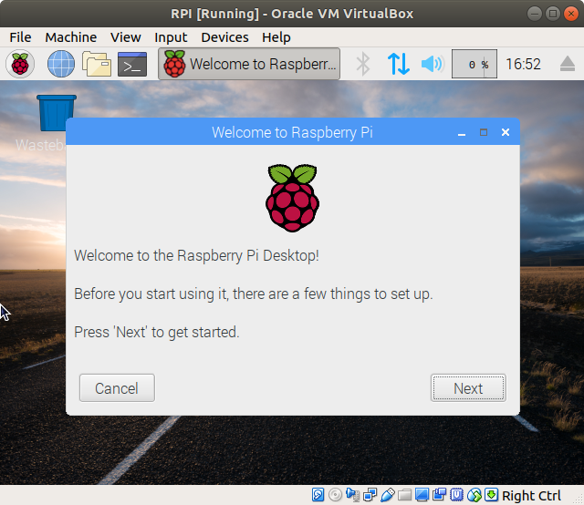

## Download Raspbian image

I think that’s probably the main problem you’ve encountered, where to find an image compatible with the main hypervisors?

Indeed, the default image offered on the official website, which is an .img format, can not work on VirtualBox for example
Looking for this image, I came across a lot of forums that said it was not possible to emulate a Raspberry Pi on PC, because it turns on ARM architecture, unlike a PC …

And finally, I ended up finding this image, directly on the official website, just above the main download
So you can [download the image of Raspian in iso format](https://www.raspberrypi.org/downloads/raspberry-pi-desktop/) before continuing this guide
I advise you to **use a Torrent client to download it. It’s much faster**

## Run Raspberry Pi on VirtualBox

### Introduction

**VirtualBox is an open-source hypervisor**, developed by Oracle
It is available for most operating systems: Windows, Linux, Mac OS, Solaris, …
It allows you to create virtual machines on your computer and supports a large number of operating systems to virtualize

### Installation

You can find download links for Windows, Mac, and Linux on this page: https://www.virtualbox.org/wiki/Downloads

In any case, the installation is straightforward:

- Download the installer corresponding to your environment
- Launch the installer and keep the default options

### Create the virtual machine

Launch Oracle VirtualBox now on your computer, and we will **create the virtual machine**:

- Click on New in the top bar
- Choose a Name
- Type: Linux
- Version: Anyone
- Memory size: 1Gb is enough, but you can set more depending on your computer memory available
- Hard disk: You can keep the default options (10GB)

Our new virtual machine is available, but now you have to tell it to **start on the previously downloaded iso file**

- Click on Settings in the top bar
- Select Storage in the left menu
- Below the first controller, click on Empty
- On the right panel, click on the Disc icon to choose the file
- Select Choose Virtual Optical Disk File
- Browse to the location of the image and validate

Ok, you should have something like this :

Now we can **start the virtual machine and install the Raspberry Pi Desktop** :

- Click on Start in the top bar
- Choose Install in the first menu
- Select your Keyboard layout
- For partition disks, you can keep the default options (use entire disk > all files in one partition > finish > yes)
- Installation starts
- After a few minutes, the installation wizard resumes
- Confirm the bootloader installation to the master boot record
- Select /dev/sda
- Continue to reboot your new operating system

Once the reboot is done, you will come to a first start wizard like this one:

Choose the settings that best suits you
Change the default password
Update your system and reboot one last time

Your **Raspberry Pi Desktop virtual machine running in VirtualBox** is finally operational!