# 1.NiFi in Trucking IoT on HDF

## Introduction

This tutorial covers the core concepts of Apache NiFi and the role it plays in an environment in which Flow Management, Ease of Use, Security, Extensible Architecture and Flexible Scaling Model are important.

We will create a NiFi DataFlow for transferring data from Internet of Things (IoT) devices on the edge to our stream application.

## Prerequisites

- Downloaded and deployed the [Hortonworks DataFlow (HDF)](https://www.cloudera.com/downloads/hortonworks-sandbox/hdf.html?utm_source=mktg-tutorial) Sandbox

## Outline

- [NiFi in Trucking IoT Use Case](https://hortonworks.com/tutorial/nifi-in-trucking-iot-on-hdf/section/1/) - Discuss a real-world use and understand the role NiFi plays within it
- [Run NiFi in the Demo](https://hortonworks.com/tutorial/nifi-in-trucking-iot-on-hdf/section/2/)- Walk through the DataFlow Management portion of the demo and gain an understanding of it in the data pipeline
- [Creating a NiFi DataFlow](https://hortonworks.com/tutorial/nifi-in-trucking-iot-on-hdf/section/3/) - Dive into NiFi internals and build a dataflow from scratch


---
title: NiFi in Trucking IoT Use Case
---

# 2.NiFi in Trucking IoT Use Case

## Outline

- [The IoT Use Case](#the-iot-use-case)
- [What is NiFi?](#what-is-nifi)
- [Architectural Overview](#architectural-overview)
- [Benefits of NiFi](#benefits-of-nifi)
- [Next: NiFi in Action](#next-nifi-in-action)

## The IoT Use Case

Visit the Storm tutorial to learn about the [Trucking IoT Use Case](https://hortonworks.com/tutorial/storm-in-trucking-iot-on-hdf/section/1/#the-iot-use-case).

## What is NiFi?

What is NiFi's role in this Stream Processing Application?

- NiFi acts as the producer that ingests data from the truck and traffic IoT devices, does simple event processing on the data, so that it can be split into TruckData and TrafficData that can be sent as messages to two Kafka topics.

To learn about what NiFi is, visit [What is Apache NiFi?](https://hortonworks.com/tutorial/analyze-transit-patterns-with-apache-nifi/section/1/#what-is-apache-nifi) from our Analyze Transit Patterns with Apache NiFi tutorial.

## Architectural Overview

At a high level, our data pipeline looks as follows:

``` text

MiNiFi Simulator -----> NiFi ----> Kafka

```

There is a data simulator that replicates MiNiFi's place in the data flow on IoT edge, MiNiFi is embedded on the vehicles, so the simulator generates truck and traffic data. NiFi ingests this sensor data. NiFi's flow performs preprocessing on the data to prepare it to be sent to Kafka.

## Benefits of NiFi

**Flow Management**

- _Guaranteed Delivery_: Achieved by persistent write-ahead log and content repository allow for very high transaction rates, effective load-spreading, copy-on-write, and play to the strengths of traditional disk read/writes.

- _Data Buffering with Back Pressure and Pressure Release_: If data being pushed into the queue reaches a specified limit, then NiFi will stop the process send data into that queue. Once data reaches a certain age, NiFi will terminate the data.

- _Prioritized Queuing_: A setting for how data is retrieved from a queue based on largest, smallest, oldest or other custom prioritization scheme.

- _Flow Specific QoS_: Flow specific configuration for critical data that is loss intolerant and whose value becomes of less value based on time sensitivity.

**Ease of Use**

- _Visual Command and Control_: Enables visual establishment of data flow in real-time, so any changes made in the flow will occur immediately. These changes are isolated to only the affected components, so there is not a need to stop an entire flow or set of flows to make a modification.

- _Flow Templates_: A way to build and publish flow designs for benefitting others and collaboration.

- _Data Provenance_: Taking automatic records and indexes of the data as it flows through the system.

- _Recovery/Recording a rolling buffer of fine-grained history_: Provides click to content, download of content and replay all at specific points in an object's life cycle.

**Security**

- _System to System_: Offers secure exchange through use of protocols with encryption and enables the flow to encrypt and decrypt content and use shared-keys on either side of the sender/recipient equation.

- _User to System_: Enables 2-Way SSL authentication and provides pluggable authorization, so it can properly control a user's access and particular levels (read-only, data flow manager, admin).

- _Multi-tenant Authorization_: Allows each team to manage flows with full awareness of the entire flow even parts they do not have access.

**Extensible Architecture**

- _Extension_:  Connects data systems no matter how different data system A is from system B, the data flow processes execute and interact on the data to create a uni-line or bidirectional line of communication.

- _Classloader Isolation_: NiFi provides a custom class loader to guarantee each extension bundle is as independent as possible, so component-based dependency problems do not occur as often. Therefore, extension bundles can be created without worry of conflict occurring with another extension.

- _Site-to-Site Communication Protocol_: Eases transferring of data from one NiFi instance to another easily, efficiently and securely. So devices embedded with NiFi can communicate with each other via S2S, which supports a socket based protocol and HTTP(S) protocol.

**Flexible Scaling Model**

- _Scale-out (Clustering)_: Clustering many nodes together. So if each node is able to handle hundreds of MB per second, then a cluster of nodes could be able to handle GB per second.

- _Scale-up & down_: Increase the number of concurrent tasks on a processor to allow more processes to run concurrently or decrease this number to make NiFi suitable to run on edge devices that have limited hardware resources. View [MiNiFi Subproject](https://cwiki.apache.org/confluence/display/MINIFI) to learn more about solving this small footprint data challenge.

## Next: NiFi in Action

We have become familiar with NiFi's role in the use case, next let's move onto seeing NiFi in action while the demo application runs.


---
title: Run NiFi in the Demo
---

# 3.Run NiFi in the Demo

## Introduction

Let's walk through NiFi's place in the demo.

## Outline

- [Environment Setup](#environment-setup)
- [Deploy the NiFi DataFlow](#deploy-the-nifi-dataflow)
- [Next: Building a NiFi DataFlow](#next-building-a-nifi-dataflow)

## Environment Setup

We will be working on the **trucking-IoT** project. If you have the latest Hortonworks DataFlow (HDF) Sandbox installed, then the demo comes pre-installed.

## Deploy the NiFi DataFlow

Let's activate the NiFi data flow, so it will process the simulated data and push the data into Kafka Topics. Open NiFi at [http://sandbox-hdf.hortonworks.com:9090/nifi/](http://sandbox-hdf.hortonworks.com:9090/nifi/). If not, or you do not already have it setup, then refer to [Setup Demo on existing HDF Sandbox](https://github.com/orendain/trucking-iot/tree/master).

The **Trucking IoT** component template should appear on the NiFi canvas by default as seen below.

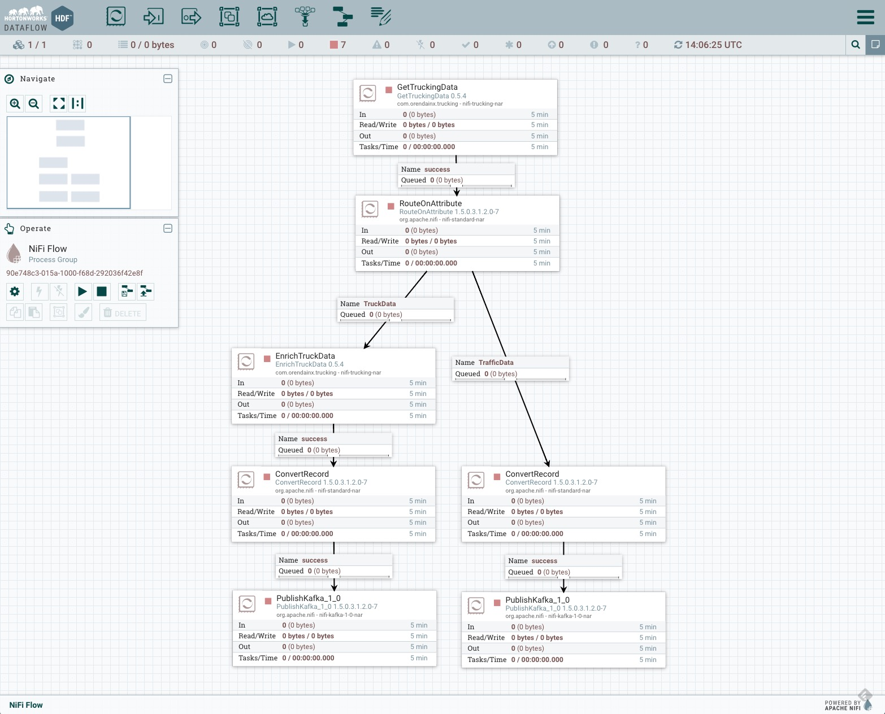

To add the **Trucking IoT** template manually do the following:

1\. Drag and drop the components template icon  onto the NiFi canvas. Select **Trucking IoT**, then click **ADD**. Deselect the data flow by clicking anywhere on the canvas.

2\. In the **Operate Palette** with the hand point upward, expand it if it is closed, click on the gear icon then click on Controller Services gear icon. In Controller Services, check that the state is "Enabled" as seen on the image below.

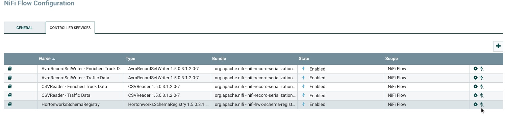

If it is not "Enabled" follow the steps below:

3\. Click on the **Lighting Bolt** to the right of **HortonworksSchemaRegistry**.

4\. For **Scope**, select **Service and referencing componen...**,press **ENABLE** then **CLOSE**.

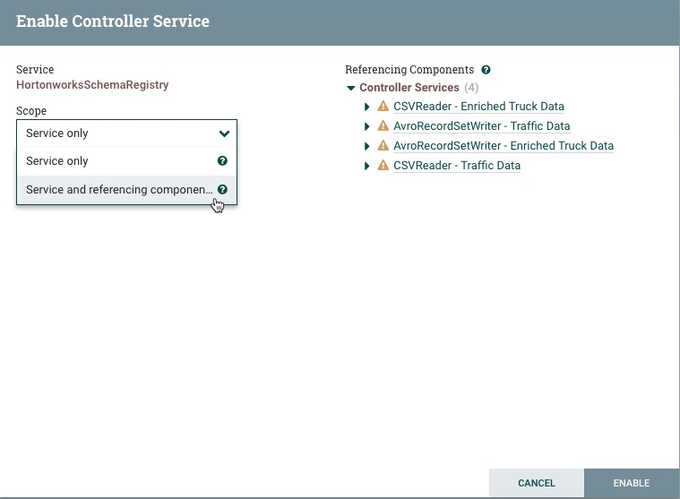

 5\. All the Controller Services should be "Enabled" as seen on step 2.

```text
Note: If any of your services are disabled, you can enable them by clicking on the lightning bolt symbol on the far right of the table. Controller Services are required to be enabled to successfully run the dataflow.
```

Let's select the entire dataflow. Hold **command** or **ctrl** and **A** and the whole dataflow will be selected. In the **Operate Pallete,** click on the start button  and let it run for 1 minute. The red stop symbols  at the corner of each component in the dataflow will turn to a green play symbol . You should see the numbers in the connection queues change from 0 to a higher number indicating that the data is being processed.

You should see an image similar to the one below:

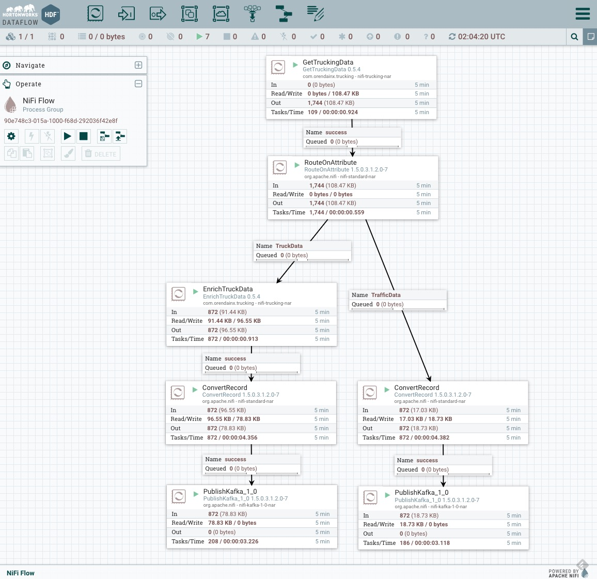

Let's analyze what actions the processors taking on the data via NiFi's Data Provenance:

Unselect the entire dataflow then right click on `GetTruckingData`: Generates data of two types: _TruckData_ and _TrafficData_. Click **View Data Provenance**.

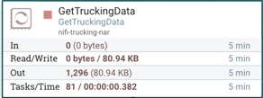

A table with provenance events will appear. An event illustrates what type of action the processor took against the data. For `GetTruckingData`, it is creating sensor data in two categories as one stream. Choose an event with **20 bytes** to see `TrafficData` or greater than or equal to **98 bytes** to see `TruckData`.

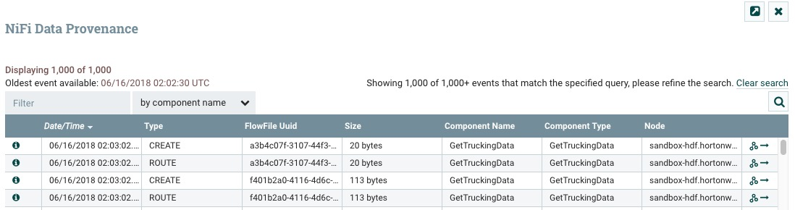

To view `TruckData` or `TrafficData` sensor data select the `i` to the left of the row you want to see. Go to the tab that says **CONTENT**, then **VIEW**.

- `TruckData`: Data simulated by sensors onboard each truck.

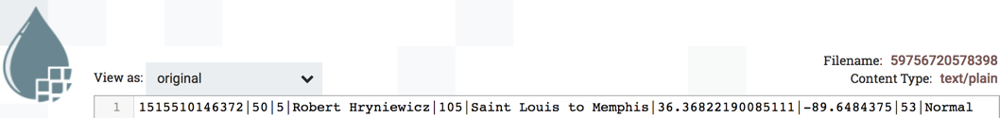

- `TrafficData`: Data simulated from traffic congestion on a particular trucking route.

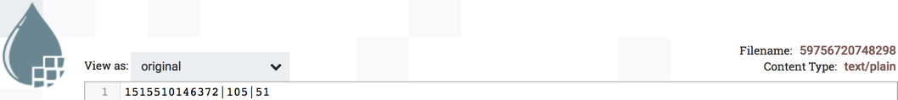

You can check the data provenance at each processor to get a more in-depth look at the steps NiFi is performing to process and transform the two types of simulated data. Here is a flow chart to show the steps:

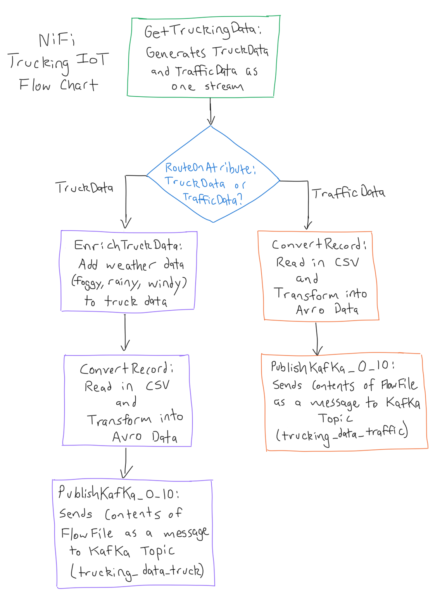

## Next: Building a NiFi DataFlow

Now that we know how NiFi fits into the data pipeline of the demo and what kind of transformations on the data is performing, let's dive into configuring processors to see how the dataflow is constructed.


---
title: Creating a NiFi DataFlow
---

# 4.Creating a NiFi DataFlow

## Introduction

We are aware of the role NiFi plays in this Trucking IoT application. Let's analyze the NiFi DataFlow to learn how it was built. Let's dive into the process behind configuring controller services and configuring processors to learn how to build this NiFi DataFlow.

## Outline

- [NiFi Components](#nifi-components)
- [Starting to Build a NiFi DataFlow](#starting-to-build-a-nifi-dataflow)
- [Setting up Schema Registry Controller Service](#setting-up-schema-registry-controller-service)
- [Building GetTruckingData](#building-gettruckingdata)
- [Configuring RouteOnAttribute](#configuring-routeonattribute)
- [Building EnrichTruckData](#building-enrichtruckdata)
- [Configuring ConvertRecord: TruckData](#configuring-convertrecord-truckdata)
- [Configuring ConvertRecord: TrafficData](#configuring-convertrecord-trafficdata)
- [Configuring PublishKafka_1_0: TruckData](#configuring-publishkafka_1_0-truckdata)
- [Configuring PublishKafka_1_0: TrafficData](#configuring-publishkafka_1_0-trafficdata)
- [Summary](#summary)

## NiFi Components

Check out the [Core Concepts of NiFi](https://hortonworks.com/tutorial/analyze-transit-patterns-with-apache-nifi/section/1/#the-core-concepts-of-nifi) to learn more about the NiFi Components used in creating a NiFi DataFlow.

## Starting to Build a NiFi DataFlow

Before we begin building our NiFi DataFlow, let's make sure we start with a clean canvas.

- Press **CTRL-A** or **COMMAND-A** to select entire canvas
- On the **Operate Palette**, click **DELETE**

```text
Note: You may need to empty queues before deleting DataFlow. Do this by **right-clicking** non-empty queue, then select **Empty queue**.
```

## Setting up Schema Registry Controller Service

As the first step in building the DataFlow, we needed to setup NiFi Controller Service called **HortonworksSchemaRegistry**. Go to the **Operate Palette**, click on the gear icon, then select **Controller Services** tab. To add a new controller service, you would press on the **" + "** icon in the top right of the table. However, since the service has already been created, we will reference it to see how a user would connect NiFi with Schema Registry.

**HortonworksSchemaRegistry** 

_Properties Tab of this Controller Service_

| Property     | Value    |
| :------------- | :------------- |
| **Schema Registry URL** | **http://sandbox-hdf.hortonworks.com:7788/api/v1** |
| **Cache Size** | **1000** |
| **Cache Expiration** | **1 hour** |

A schema is used for categorizing the data into separate categories: TruckData and TrafficData will be applied on the data during the use of the **ConvertRecord** processor.

From the configuration in the table above, we can see the **URL** that allows NiFi to interact with Schema Registry, the amount of **cache** that can be sized from the schemas and the amount of time required until the schema **cache expires** and NiFi has to communicate with Schema Registry again.

## Building GetTruckingData

**NiFi Data Simulator** - Generates data of two types: TruckData and TrafficData as a CSV string.


Keep Configurations across **Setting Tab, Scheduling Tab, Properties Tab** as Default.

## Configuring RouteOnAttribute

**RouteOnAttribute** - Filters TruckData and TrafficData types into two separate flows from _GetTruckingData_.

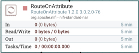

Right click on the processor, press **configure** option to see the different configuration tabs and their parameters. In each tab, you will see the following configurations:

**Setting Tab**

| Setting | Value     |
| :------------- | :------------- |
| Automatically Terminate Relationships | unmatched |

The rest should be kept as default.

**Scheduling Tab**

Keep the default configurations.

**Properties Tab**

| Property | Value     |
| :------------- | :------------- |
| Routing Strategy       | Route to Property name       |
| TrafficData       | ${dataType:equals('TrafficData')}      |
| TruckData       | ${dataType:equals('TruckData')}      |

## Building EnrichTruckData

**EnrichTruckData** - Adds weather data _(fog, wind, rain)_ to the content of each flowfile incoming from RouteOnAttribute's _TruckData_ queue.

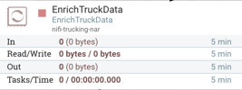

Learn more about building the GetTruckingData processor in the **Coming Soon: "Custom NiFi Processor - Trucking IoT"** tutorial.

## Configuring ConvertRecord: TruckData

**ConvertRecord** - Uses Controller Service to read in incoming CSV TruckData FlowFiles from the _EnrichTruckData_ processor and uses another Controller Service to transform CSV to Avro TruckData FlowFiles.

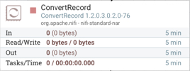

Right click on the processor, press **configure** option to see the different configuration tabs and their parameters. In each tab, you will see the following configurations:

**Setting Tab**

| Setting | Value     |
| :------------- | :------------- |
| Automatically Terminate Relationships | failure |

**Scheduling Tab**

Keep the default configurations.

**Properties Tab**

| Property | Value     |
| :------------- | :------------- |
| Record Reader      | CSVReader - Enriched Truck Data      |
| Record Writer      | AvroRecordWriter - Enriched Truck Data      |

In the operate panel, you can find more information on the controller services used with this processor:

**CSVReader - Enriched Truck Data**

_Properties Tab of this Controller Service_

| Property | Value     |
| :------------- | :------------- |
| Schema Access Strategy | Use 'Schema Name' Property |
| Schema Registry | HortonworksSchemaRegistry |
| Schema Name | trucking_data_truck_enriched |
| Schema Text | ${avro.schema} |
| Date Format | No value set |
| Time Format | No value set |
| Timestamp Format | No value set |
| CSV Format | Custom Format |
| Value Separator | `\|` |
| Treat First Line as Header | false |
| Quote Character | " |
| Escape Character | `\` |
| Comment Marker | No value set |
| Null String | No value set |
| Trim Fields | true |

**AvroRecordWriter - Enriched Truck Data**

| Property | Value     |
| :------------- | :------------- |
| Schema Write Strategy | HWX Content-Encoded Schema Reference |
| Schema Access Strategy | Use 'Schema Name' Property |
| Schema Registry | HortonworksSchemaRegistry |
| Schema Name | trucking_data_truck_enriched |
| Schema Text | ${avro.schema} |

## Configuring ConvertRecord: TrafficData

**ConvertRecord** - Uses Controller Service to read in incoming CSV _TrafficData_ FlowFiles from RouteOnAttribute's _TrafficData_ queue and uses another Controller Service to write Avro _TrafficData_ FlowFiles.

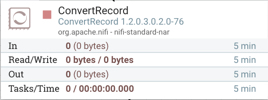

Right click on the processor, press **configure** option to see the different configuration tabs and their parameters. In each tab, you will see the following configurations:

**Setting Tab**

| Setting | Value     |
| :------------- | :------------- |
| Automatically Terminate Relationships | failure |

**Scheduling Tab**

Keep the default configurations.

**Properties Tab**

| Property | Value     |
| :------------- | :------------- |
| Record Reader      | CSVReader - Traffic Data      |
| Record Writer      | AvroRecordWriter - Traffic Data      |

In the operate panel, you can find more information on the controller services used with this processor:

**CSVReader - Traffic Data**

_Properties Tab of this Controller Service_

| Property | Value     |
| :------------- | :------------- |
| Schema Access Strategy | Use 'Schema Name' Property |
| Schema Registry | HortonworksSchemaRegistry |
| Schema Name | trucking_data_traffic |
| Schema Text | ${avro.schema} |
| Date Format | No value set |
| Time Format | No value set |
| Timestamp Format | No value set |
| CSV Format | Custom Format |
| Value Separator | `\|` |
|Treat First Line as Header | false |
| Quote Character | " |
| Escape Character | `\` |
| Comment Marker | No value set |
| Null String | No value set |
| Trim Fields | true |

**AvroRecordWriter - Traffic Data**

| Property | Value |
| :------------- | :------------- |
| Schema Write Strategy | HWX Content-Encoded Schema Reference |
| Schema Access Strategy | Use 'Schema Name' Property |
| Schema Registry | HortonworksSchemaRegistry |
| Schema Name | trucking_data_truck |
| Schema Text | ${avro.schema} |

## Configuring PublishKafka_1_0: TruckData

**PublishKafka_1_0** - Receives flowfiles from _ConvertRecord - TruckData_ processor and sends each flowfile's content as a message to Kafka Topic: _trucking_data_truck_ using the Kafka Producer API.


Right click on the processor, press **configure** option to see the different configuration tabs and their parameters. In each tab, you will see the following configurations:

**Setting Tab**

| Setting | Value     |
| :------------- | :------------- |
| Automatically Terminate Relationships | failure, success |

**Scheduling Tab**

Keep the default configurations.

**Properties Tab**

| Property | Value     |
| :------------- | :------------- |
| **Kafka Brokers**      | **sandbox-hdf.hortonworks.com:6667**   |
| **Security Protocol**      | **PLAINTEXT**      |
| **Topic Name**      | **trucking_data_truck_enriched**      |
| **Delivery Guarantee**      | **Best Effort**      |
| **Key Attribute Encoding**      | **UTF-8 Encoded**      |
| **Max Request Size**      | **1 MB**      |
| **Acknowledgment Wait Time**      | **5 secs**      |
| **Max Metadata Wait Time**      | **30 sec**      |
| Partitioner class      | DefaultPartitioner      |
| **Compression Type**      | **none**      |

## Configuring PublishKafka_1_0: TrafficData

**PublishKafka_1_0** - Receives flowfiles from _ConvertRecord - TrafficData_ processor and sends FlowFile content as a message using the Kafka Producer API to Kafka Topic: _trucking_data_traffic_.

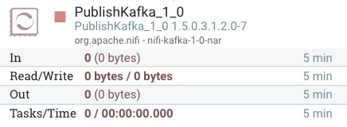

Right click on the processor, press **configure** option to see the different configuration tabs and their parameters. In each tab, you will see the following configurations:

**Setting Tab**

| Setting | Value     |
| :------------- | :------------- |
| Automatically Terminate Relationships | failure, success |

**Scheduling Tab**

Keep the default configurations.

**Properties Tab**

| Property | Value     |
| :------------- | :------------- |
| **Kafka Brokers**      | **sandbox-hdf.hortonworks.com:6667**   |
| **Security Protocol**      | **PLAINTEXT**      |
| **Topic Name**      | **trucking_data_traffic**      |
| **Delivery Guarantee**      | **Best Effort**      |
| **Key Attribute Encoding**      | **UTF-8 Encoded**      |
| **Max Request Size**      | **1 MB**      |
| **Acknowledgment Wait Time**      | **5 secs**      |
| **Max Metadata Wait Time**      | **5 sec**      |
| Partitioner class      | DefaultPartitioner      |
| **Compression Type**      | **none**      |

## Summary

Congratulations!  You now know about the role that NiFi plays in a data pipeline of the Trucking - IoT demo application and how to create and run a dataflow.
