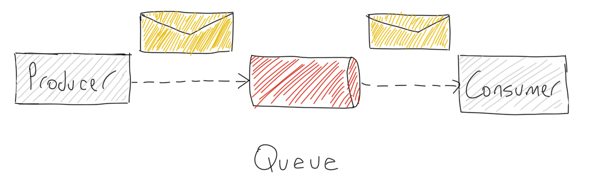
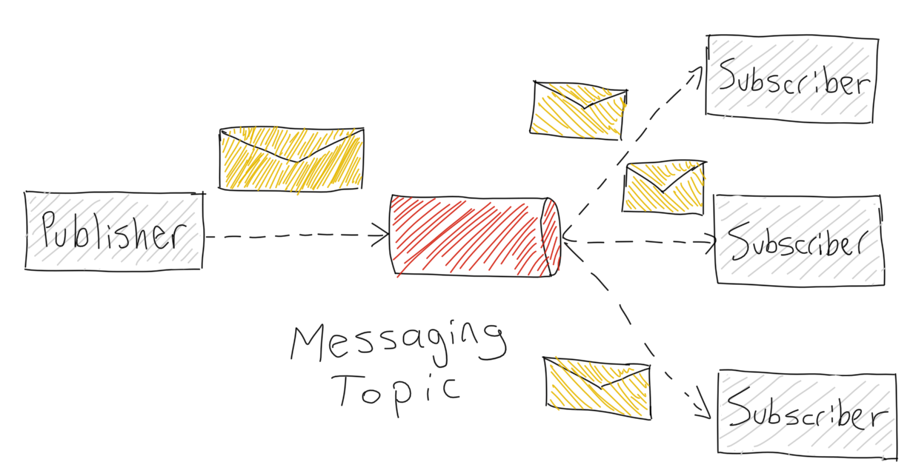
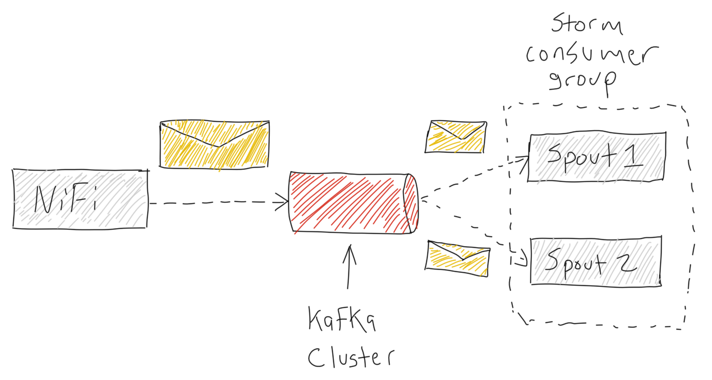
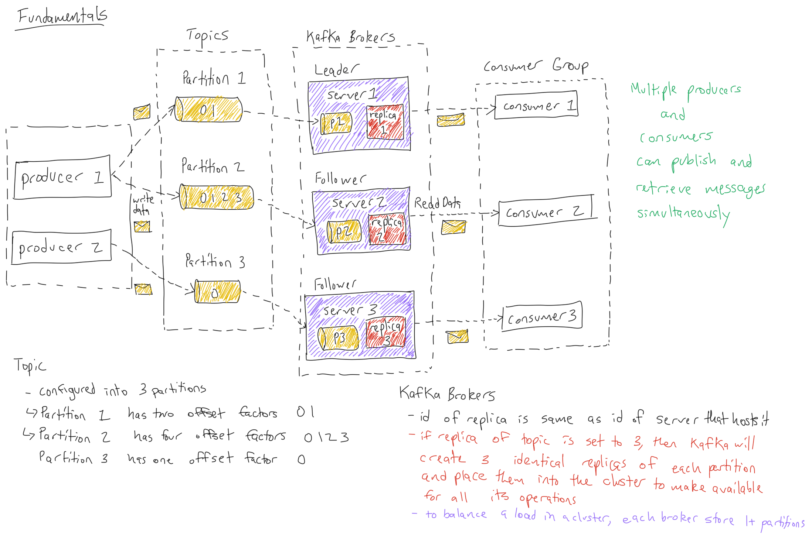

# 0.Kafka in Trucking IoT on Hortonworks DataFlow (HDF)

## Introduction

This tutorial covers the core concepts of Apache Kafka and the role it plays in an environment in which reliability, scalability, durability and performance are important.

We will create Kafka Topics (category queues) for handling large volumes of data in the data pipeline acting as a connection between Internet of Things (IoT) data and Storm topology.

## Prerequisites

- Downloaded and deployed the [Hortonworks DataFlow (HDF)](https://www.cloudera.com/downloads/hortonworks-sandbox/hdf.html?utm_source=mktg-tutorial) Sandbox

## Outline

- [Kafka Messaging System Fundamentals](https://hortonworks.com/tutorial/kafka-in-trucking-iot-on-hdf/section/1/) - Understand the messaging system concepts that apply to Kafka
- [Explore Kafka in the Demo](https://hortonworks.com/tutorial/kafka-in-trucking-iot-on-hdf/section/2/)- Gain an understanding of Kafka Topics used in the demo and explore commands for exploring the data in Kafka
- [Learn Basic Operations of Kafka](https://hortonworks.com/tutorial/kafka-in-trucking-iot-on-hdf/section/3/)- Dive into Kafka and learn basic operations in Kafka


---
title: Kafka Messaging System Fundamentals
---

# 1.Kafka Messaging System Fundamentals

## Objective

To understand the concepts behind **messaging systems** in **distributed systems**, and how to use them to pass on information between the **producer** (publisher, sender) to the **consumer** (subscriber, receiver). In this example, you will learn about **Kafka**.

## Outline

- [What is a Messaging System?](#what-is-a-messaging-system?)
- [Point to Point System](#point-to-point-system)
- [Publish-Subscribe System](#publish-subscribe-system)
- [What is Kafka](#what-is-kafka)
- [Architectural Overview](#architectural-overview)
- [Benefits of Kafka](#benefits-of-kafka)
- [Next: Kafka in Action](#next-kafka-in-action)

## What is a Messaging System?

Messaging systems transfer data between client applications. One application produces the data, such as reading from sensors embedded on vehicles and the other application receives the data, processes it to be ready to be visualized to show the characteristics about the drivers driving behavior who drive those vehicles. As you can see each application developer can focus on writing code to analyze the data and not worry about how to share the data. There are two messaging systems used in this scenario, **point to point** and **publish subscribe**. The system most often used is _publish subscribe_, but we will look at both.

## Point to Point System

**Point to Point** are messages transmitted into a queue



Key Characteristics of generic figure above:

- producer sends messages into the queue, each message is read by only one consumer
- once the message is consumed, it vanishes
- multiple consumers can read messages from the queue

## Publish-Subscribe System

**Publish-Subscribe** are messages transmitted into a topic



- message producers are known as publishers
- message consumers are known as subscribers

How does the **Pub-Sub** messaging system work?

- publisher sends messages into 1 or more topics
- subscribers can arrange to receive 1 or more topics, then consume all the messages

## What is Kafka

Apache Kafka is an open source publish-subscribe based messaging system responsible for transferring data from one application to another.

## Architectural Overview

At a high level, our data pipeline looks as follows:



**NiFi Producer**

Produces a continuous real-time data feed from truck sensors and traffic information that are separately published into two Kafka topics using a NiFi Processor implemented as a Kafka Producer.

To learn more about the Kafka Producer API Sample Code, visit [Developing Kafka Producers](https://docs.hortonworks.com/HDPDocuments/HDP2/HDP-2.6.0/bk_kafka-component-guide/content/ch_kafka-development.html)

**Kafka Cluster**

Has 1 or more topics for supporting 1 or multiple categories of messages that are managed by Kafka brokers, which create replicas of each topic (category queue) for durability.

**Storm Consumer**

Reads messages from Kafka Cluster and emits them into the Apache Storm Topology to be processed.

To learn more about the Kafka Consumer API Sample Code, visit [Developing Kafka Consumers](https://docs.hortonworks.com/HDPDocuments/HDP2/HDP-2.6.0/bk_kafka-component-guide/content/ch_kafka-development.html)

## Benefits of Kafka

**Reliability**

- Distributed, partitioned, replicated and fault tolerant

**Scalability**

- Messaging system scales easily without down time

**Durability**

- "Distributed commit log" which allows messages to continue to exist on disk even after the processes that created that data have ended

**Performance**

- High throughput for publishing and subscribing messages
- Maintains stable performance for many terabytes stored

## Next: Kafka in Action

Now that we've become familiar with how Kafka will be used in our use case, let's move onto seeing Kafka in action when running the demo application.


---
title: Explore Kafka in the Demo
---

# 2.Explore Kafka in the Demo

## Introduction

While the demo application runs, you will gain an understanding of how Kafka receives data from a producer at its particular topics.

## Outline

- [Environment Setup](#environment-setup)
- [Persist Data Into Kafka Topics](#persist-data-into-kafka-topics)
- [List Kafka Topics](#list-kafka-topics)
- [View Data in Kafka Topics](#view-data-in-kafka-topics)
- [Next: Learn Basic Operations of Kafka](#next-learn-basic-operations-of-kafka)

## Environment Setup

If you have the latest Hortonworks DataFlow (HDF) Sandbox installed, then the demo comes pre-installed.

Open a terminal on your local machine and access the sandbox through the shell-in-a-box method. Please visit [Learning the Ropes of the HDP Sandbox](https://hortonworks.com/tutorial/learning-the-ropes-of-the-hortonworks-sandbox/#environment-setup) to review this method.

Before we can perform Kafka operations on the data, we must first have data in Kafka, so let's run the NiFi DataFlow Application. Refer to the steps in this module: **[Run NiFi in the Trucking IoT Demo](https://hortonworks.com/tutorial/nifi-in-trucking-iot-on-hdf/section/2/)**, then you will be ready to explore Kafka.

Turn Kafka component on if it's not already on through Ambari.

## Persist Data Into Kafka Topics

A NiFi simulator generates data of two types: TruckData and TrafficData as a CSV string. There is some preprocessing that happens on the data to prepare it to be split and sent by NiFi's Kafka producers to two separate Kafka Topics: **trucking_data_truck** and **trucking_data_traffic**.

## List Kafka Topics

From the terminal, we can see the two Kafka Topics that have been created:

```bash
/usr/hdf/current/kafka-broker/bin/kafka-topics.sh --list --zookeeper localhost:2181
```

Results:

```bash
Output:
trucking_data_driverstats
trucking_data_joined
trucking_data_traffic
trucking_data_truck_enriched
```

## View Data in Kafka Topics

As messages are persisted into the Kafka Topics from the producer, you can see them appear in each topic by writing the following commands:

View Data for Kafka Topic: **trucking_data_truck_enriched**:

```bash
/usr/hdf/current/kafka-broker/bin/kafka-console-consumer.sh --bootstrap-server sandbox-hdf.hortonworks.com:6667 --topic trucking_data_truck_enriched --from-beginning
```

View Data for Kafka Topic: **trucking_data_traffic**:

```bash
/usr/hdf/current/kafka-broker/bin/kafka-console-consumer.sh --bootstrap-server sandbox-hdf.hortonworks.com:6667 --topic trucking_data_traffic --from-beginning
```

As you can see Kafka acts as a robust queue that receives data and allows for it to be transmitted to other systems.

```text
Note: You may notice the is data encoded in a format we cannot read, this format is necessary for Schema Registry. The reason we are using Schema Registry is because we need it for Stream Analytics Manager to pull data from Kafka.
```

## Next: Learn Basic Operations of Kafka

You have already become familiar with some Kafka operations through the command line, so let's explore basic operations to see how those topics were created, how they can be deleted and how we can use tools to monitor Kafka.


---
title: Learn Basic Operations of Kafka
---

# 3.Learn Basic Operations of Kafka

## Introduction

We now know the role that Kafka plays in this Trucking IoT system. Let's take a step back and see how the Kafka Topics were created.

## Outline

- [Kafka Components](#kafka-components)
- [Creating Two Kafka Topics](#creating-two-kafka-topics)
- [Starting the Producer to Send Messages](#starting-the-producer-to-send-messages)
- [Starting the Consumer to Receive Messages](#starting-the-consumer-to-receive-messages)
- [Summary](#summary)
- [Further Reading](#further-reading)
- [Appendix: Kafka Extra Operations](#appendix-kafka-extra-operations)

## Kafka Components

Now that we have an idea of Kafka's capabilities, let's explore its different components, our building blocks when defining a Kafka process and why they're used.

- **Producer**: A publisher of messages to 1 or more topics. Sends data to brokers.

- **Topics**: A stream of messages belonging to a category, which are split into partitions. A topic must have at least one partition.

- **Partition**: Has messages in an immutable sequence and are implemented as segment files of equal sizes. They can also handle an arbitrary amount of data.

- **Partition Offset**: A unique sequence ID from partition message.

- **Replicas of Partition**: A "Backup" of a partition. They never read or write data and they prevent data loss.

- **Kafka Brokers**: Responsibility is to maintain published data.

- **Lead Broker**: Node responsible for all Read or Write performed on a given partition.

- **Follower Broker**: Node that follows the leaders instructions. It will take the place of the leader if the leader fails. Also pulls in messages like a consumer and updates its data store.

- **Kafka Cluster**: Kafka is considered a Kafka Cluster when more than one broker exist. The main reason for having multiple brokers is to manage persistance and replication of message data and expand without downtown.

- **Consumer Group**: Consumers that come from the same group ID.

- **Consumers**: Read data from brokers by pulling in the data. They subscribe to 1 ore more topics.



## Creating Two Kafka Topics

Initially when building this demo, we verified Zookeeper was running because Kafka uses Zookeeper. If Zookeeper was off, we ran the command or turned on it from Ambari:

```bash
/usr/hdf/current/kafka-broker/bin/zookeeper-server-start.sh config/zookeeper.properties
```

We then started the Kafka Broker via Ambari or command:

```bash
/usr/hdf/current/kafka-broker/bin/kafka-server-start.sh config/server.properties
```

If you wanted to see the daemons that were running, type `jps`

```bash
Example of Output:

2306 drpc
932 AmbariServer
2469 core
2726 logviewer
3848 NiFiRegistry
5201 StreamlineApplication
3602 NiFi
3026 TlsToolkitMain
18194 Jps
1684 Kafka
3829 RunNiFiRegistry
2649 Supervisor
1530 RegistryApplication
4762 LogSearch
4987 LogFeeder
3581 RunNiFi
4383 jar
1375 QuorumPeerMain
```

We created two Kafka Topics: **trucking_data_truck_enriched** and **trucking_data_traffic** using the following commands:

```
/usr/hdf/current/kafka-broker/bin/kafka-topics.sh --create --zookeeper sandbox-hdf.hortonworks.com:2181 --replication-factor 1 --partitions 10 --topic trucking_data_truck_enriched
```

```
/usr/hdf/current/kafka-broker/bin/kafka-topics.sh --create --zookeeper sandbox-hdf.hortonworks.com:2181 --replication-factor 1 --partitions 10 --topic trucking_data_traffic
```

Two Kafka Topics were created with ten partitions and a single partition each. When topics are created, the Kafka broker terminal sends a notification and it can be found in the log for the created topic: "/tmp/kafka-logs/"

## Starting the Producer to Send Messages

In our demo, we utilize a dataflow framework known as Apache NiFi to generate our sensor truck data and online traffic data, process it and integrate Kafka's Producer API, so NiFi can transform the content of its flowfiles into messages that can be sent to Kafka.

Start all the processors in the NiFi flow including the Kafka one and data will be persisted into the two Kafka Topics.

Learn more about NiFi Kafka Producer Integration at [Integrating Apache NiFi and Apache Kafka](https://bryanbende.com/development/2016/09/15/apache-nifi-and-apache-kafka)

## Starting the Consumer to Receive Messages

In our demo, we utilize a stream processing framework known as Apache Storm to consume the messages from Kafka. Storm integrates Kafka's Consumer API to pull in messages from the Kafka brokers and then perform complex processing and send the data to destinations to be stored or visualized.

Submit the Storm topology and messages from the Kafka Topics will be pulled into Storm.

Learn more about Storm Kafka Consumer Integration at [Storm Kafka Integration](http://storm.apache.org/releases/2.0.0-SNAPSHOT/storm-kafka.html)

## Summary

Congratulations! You now know about the role Kafka plays in the demo application, how to create Kafka Topics and transfer data between topics using Kafka's Producer API and Kafka's Consumer API. In our demo, we showed you that NiFi wraps Kafka's Producer API into its framework and Storm does the same for Kafka's Consumer API.

## Further Reading

- To Learn more about Apache Kafka, visit the [Kafka Documentation](https://kafka.apache.org/documentation/)
- To learn more about NiFi Kafka Integration, visit [Integrating Apache NiFi and Apache Kafka](https://bryanbende.com/development/2016/09/15/apache-nifi-and-apache-kafka)
- To learn more about Storm Kafka Integration, visit [Storm Kafka Integration](http://storm.apache.org/releases/2.0.0-SNAPSHOT/storm-kafka.html)

## Appendix: Kafka Extra Operations

**Modify Kafka Topic**

If you need to modify a Kafka Topic, then run the following command:

```bash
/usr/hdf/current/kafka-broker/bin/kafka-topics.sh --zookeeper localhost:2181 --alter --topic topic-name --partitions X
```

Account for your topic-name will be different and the amount of partitions you want to add.

- X represents number of partitions that you want to change the topic to have

If you need to delete a Kafka Topic, run the following command:

```bash
/usr/hdf/current/kafka-broker/bin/kafka-topics.sh --zookeeper localhost:2181 --delete --topic topic_name
```
