# 0.Schema Registry in Trucking IoT on HDF

## Introduction

Schema Registry is a centralized repository for schemas and metadata.  In this tutorial, we cover exactly what that means, and what Schema Registry provides a data pipeline in order to make it more resilient to different shapes and formats of data flowing through a system.


## Prerequisites

- Downloaded and deployed the [Hortonworks DataFlow (HDF)](https://www.cloudera.com/downloads/hortonworks-sandbox/hdf.html?utm_source=mktg-tutorial) Sandbox

## Outline

Outline the different individual tutorials of the series and what the reader will learn in each one.

- [Benefits of a Schema Registry](https://hortonworks.com/tutorial/schema-registry-in-trucking-iot-on-hdf/section/1/)- Go over what Schema Registry is and what benefits it provides a modern data architecture.
- [Schema Registry Architecture](https://hortonworks.com/tutorial/schema-registry-in-trucking-iot-on-hdf/section/2/) - Take a closer look at what components make up this service and what makes up a schema.
- [Using the Schema Registry Web Interface](https://hortonworks.com/tutorial/schema-registry-in-trucking-iot-on-hdf/section/3/)- Go through the task of creating a new, evolving, schema using Schema Registry's web interface.
- [Using the Java API with Scala](https://hortonworks.com/tutorial/schema-registry-in-trucking-iot-on-hdf/section/4/)- Optional: For developers interested in leveraging the service's Java API to program tasks.


---
title: Benefits of a Schema Registry
---

# 1.Schema Registry in Trucking IoT on HDF

## Benefits of a Schema Registry

## Introduction

So what is Schema Registry and what benefits does it provide?  Would using it make a data pipeline more robust and maintainable?  Let us explore exactly what Schema Registry is and how it fits into modern data architectures.

## Prerequisites

- Downloaded and deployed the [Hortonworks DataFlow (HDF)](https://www.cloudera.com/downloads/hortonworks-sandbox/hdf.html?utm_source=mktg-tutorial) Sandbox
- Some understanding of schemas and serialization

## Outline

- [What is Schema Registry?](#what-is-schema-registry)
- [Smaller Payloads](#smaller-payloads)
- [Differing Schemas](#differing-schemas)
- [Schema Evolution](#schema-evolution)
- [Next: A Closer Look At The Architecture](#next-a-closer-look-at-the-architecture)

## What is Schema Registry?


Schema Registry provides a centralized repository for schemas and metadata, allowing services to flexibly interact and exchange data with each other without the challenge of managing and sharing schemas between them.

Schema Registry has support for multiple underlying schema representations (Avro, JSON, etc.) and is able to store a schema's corresponding serializer and deserializer.

## Smaller Payloads

Typically, when serializing data for transmission using schemas, the actual schema (text) needs to be transmitted with the data.  This results in an increase of payload size.

Using Schema Registry, all schemas are registered with a central system.  Data producers no longer need to include the full schema text with the payload, but instead only include the ID of that schema, also resulting in speedier serialization.

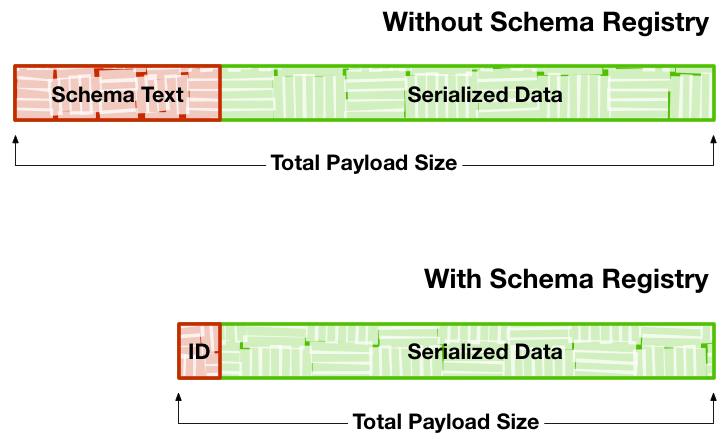

## Differing Schemas

Consider the case where thousands of medical devices are reading the vitals of patients and relaying information back to a server.

The services and applications in your pipeline are expecting data using a specific format and fields that these medical devices use.

What about when medical devices from a different vendor are added to the system?  Data in a different format carrying a different set of fields would typically require updates to the different components of your data pipeline.

**Schema Registry enables generic format conversion and generic routing**, allowing you to build a resilient pipeline able to handle data in different format with varying sets of fields.

## Schema Evolution

Following the use-case above, consider the case when the software in some of the medical devices you are collecting data from is updated.  Some devices now collect new data points, while other devices report to same limited number of fields as before.  Similarly, consider when the processing step in the pipeline is altered to output data with fewer or more fields than its previous version.  Typically, for either of these cases, the rest of your pipeline would need to be updated to handle these changes.

**With Schema Registry, the different components in your architecture (IoT devices, routing logic, processing nodes, etc.) can evolve at different rates.**  Components can change the shape of its data while Schema Registry handles the translation from one schema to another, ensuring compatibility with downstream services.

## Next: A Closer Look At The Architecture

Next, we'll go a bit more in depth and look at what different components make up Schema Registry and what they do for us.


---
title: Schema Registry Architecture
---

# 2.Schema Registry in Trucking IoT on HDF

## Schema Registry Architecture

## Introduction

We should now have some understanding of the benefits that Schema Registry provides a modern data architecture.  Let's take a closer look at the main components that make up the registry.

## Outline

- [Main Components](#main-components)
- [Schema Entities](#schema-entities)
- [Integration with HDF](#integration-with-hdf)
- [Next: Using the Web Interface](#next-using-the-web-interface)

## Main Components

Schema Registry has the following main components:

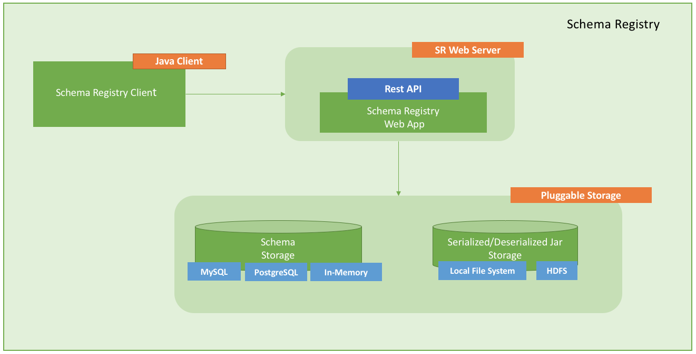

Component | Description
--- | ---
Registry Web Server | Web Application exposing the REST endpoints you can use to manage schema entities. You can use a web proxy and load balancer with multiple Web Servers to provide HA and scalability.
Schema Metadata Storage | Relational store that holds the metadata for the schema entities. In-memory storage and mySQL databases are supported.
Serdes Storage | File storage for the serializer and deserializer jars. Local file system and HDFS storage are supported.
Schema Registry Client | A java client that HDF components can use to interact with the RESTful services.

Below is a graphic outlining how the different components come into play when sending and receiving messages affected by a schema.

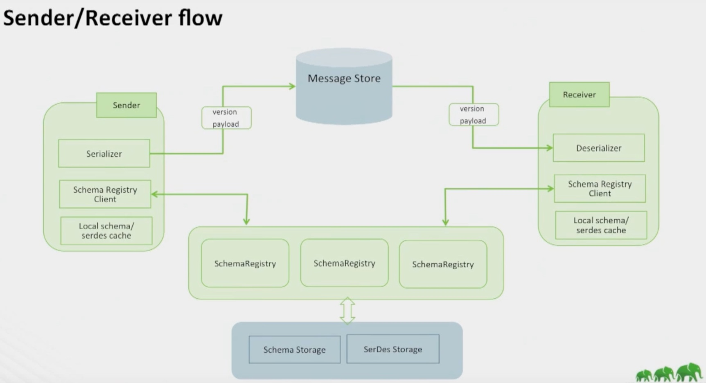

## Schema Entities

Schema Registry can be seen as being made up of different type of metadata entities.

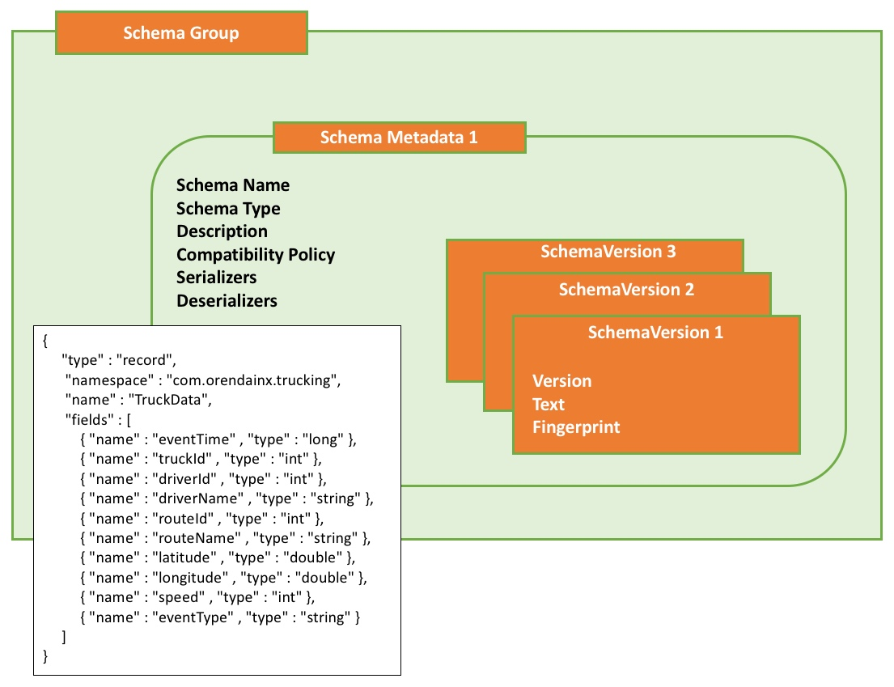

Entity | Description | Example
--- | --- | ---
Schema Group | A logical grouping of similar schemas. A Schema Group can be based on any criteria you have for managing schemas.  Schema Groups can have multiple Schema Metadata definitions. | The group name **trucking_data_truck** or **trucking_data_traffic**
Schema Metadata	| Metadata associated with a named schema. A metadata definition is applied to all the schema versions that are assigned to it. | Key metadata elements include: Schema Name, Schema Type, Description, Compatibility Policy, Serializers/Deserializers
Schema Version | The versioned schema (the actual schema text) associated with a schema metadata definition. | (Schema text example in following sections)

## Integration with HDF

When Schema Registry is paired with other services available as part of the Hortonworks DataFlow (HDF), integration with Schema Registry is baked in.

Component | Schema Registry Integration
--- | ---
NiFi | New processors and controller services in NiFi interact with Schema Registry.  This allows creating flows using drag-and-drop processors that grant the benefits mentioned in the previous section without writing any code.
Kafka | A Kafka serializer and deserializer that uses Schema Registry is included with Kafka, allowing events to be marshalled and unmarshalled automatically.
Streaming Analytics Manager (SAM) | Using a drag-and-drop paradigm to create processing jobs, SAM will automatically infer schema from data sources and sinks, ensuring that data expected by connected services are compatible with one another.

## Next: Using the Web Interface

Now that we have some understanding of what Schema Registry looks like under the hood, let's take it for a ride and poke around its web interface.  The interface makes it easy to create and modify schemas for any application running on our cluster.


---
title: Using the Schema Registry Web Interface
---

# 3.Schema Registry in Trucking IoT on HDF

## Using the Schema Registry Web Interface

## Introduction

Let's dive in to the Schema Registry UI and play around with what it's got to offer.  We'll cover creating new schemas, registering new versions of existing schemas for backward compatibility, and comparing different versions of schemas.

## Outline

- [Accessing the Web Interface](#accessing-the-web-interface)
- [Adding New Schema](#adding-new-schema)
- [Registering a New Schema Version](#registering-a-new-schema-version)
- [Comparing Different Schema Versions](#comparing-different-schema-versions)
- [Next: Using the Schema Registry API](#next-using-the-schema-registry-api)

## Accessing the Web Interface

The URL to the Schema Registry Web UI can by selecting **Schema Registry** then **Schema Registry UI** on the Quick Links Box located to the right of the page.

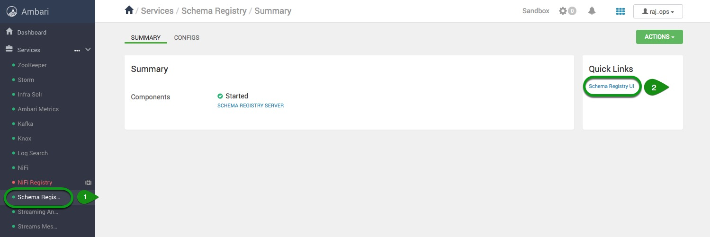

By default, on the HDF sandbox, the Schema Registry web UI can be accessed by navigating to: `http://sandbox-hdf.hortonworks.com:7788`

## Adding New Schema

Now that we have access to the web UI, let's try adding a new schema to the registry.  You may already have a few schemas included with your version of HDF, but follow along and let us add another.

Click on the **+** symbol at the top-right of the interface.

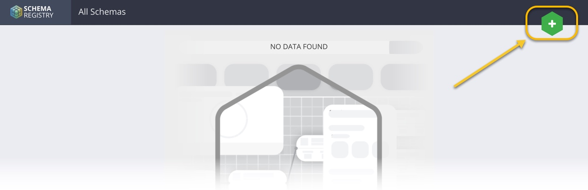

That will open up a window titled "**Add New Schema**" in which we can enter information about our new schema, including the first version of the schema text.  Refer to the following picture and the text below to add a new schema.

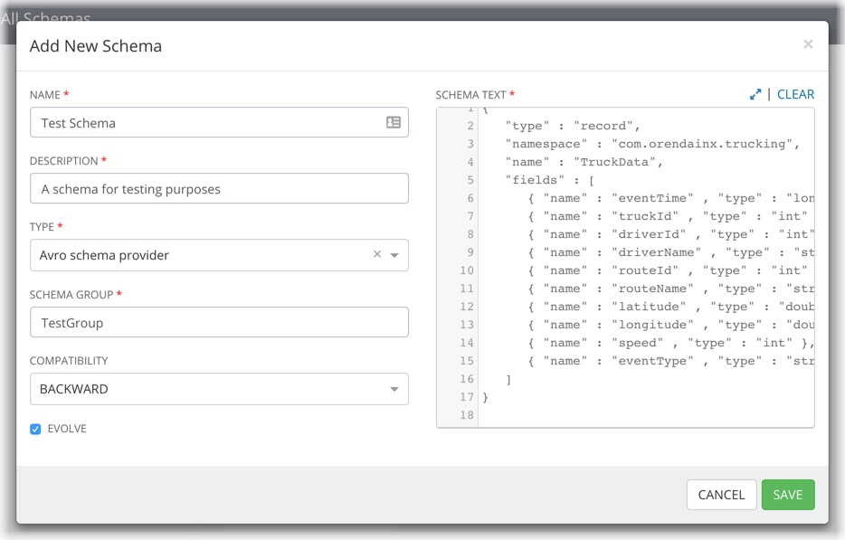

Field | Content | Explanation
--- | --- | ---
Name | Test Schema | The name to give this schema
Description | A schema for testing purposes | Any descriptive blurb will do, this is for your own documentation purposes
Type | Avro schema provider | The type of schema to use (Avro, JSON, Protocol Buffers, Thrift, etc.)
Schema Group | TestGroup | Any name you'd like to use for logical grouping of some schemas
Compatibility | Backward | The type of schema compatibility to provide (backward, forward, both, none)
Evolve | Checked | Whether or not to allow schemas to evolve (take on new versions after this initial definition)
Schema Text | (see below) | The schema text, defining fields the expected data will have.

**Schema Text**

```text
{
   "type" : "record",
   "namespace" : "com.orendainx.trucking",
   "name" : "TruckData",
   "fields" : [
      { "name" : "eventTime" , "type" : "long" },
      { "name" : "truckId" , "type" : "int" },
      { "name" : "driverId" , "type" : "int" },
      { "name" : "driverName" , "type" : "string" },
      { "name" : "routeId" , "type" : "int" },
      { "name" : "routeName" , "type" : "string" },
      { "name" : "latitude" , "type" : "double" },
      { "name" : "longitude" , "type" : "double" },
      { "name" : "speed" , "type" : "int" },
      { "name" : "eventType" , "type" : "string" }
   ]
}
```

Now **Save** the schema and watch it show up on the web interface.

## Registering a New Schema Version

Now that we have a newly defined schema, let's see about registering a new version of this schema.  Registering new schema versions (i.e. _evolving_ the schema) allows services leveraging Schema Registry work with data of either schema, allowing our overall application to be more resilient and robust.

1\. Find the entry of the schema we just created.  Expand the entry by **clicking on the arrow** on the right side of the box.
2\. Click on the **edit** icon, located at the top-right of the schema text box.

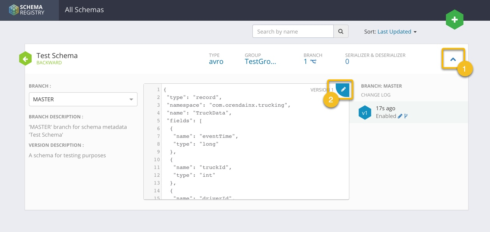

This opens up a window wherein we can add a new version of our schema text.  Add in any description you like in the **Description** textfield, and copy in the following new schema text.

> Note: Notice that this schema text differs from the last one by providing a new "_truckModel_" field.

```text
{
   "type" : "record",
   "namespace" : "com.orendainx.trucking",
   "name" : "TruckData",
   "fields" : [
      { "name" : "eventTime" , "type" : "long" },
      { "name" : "truckId" , "type" : "int" },
      { "name" : "driverId" , "type" : "int" },
      { "name" : "driverName" , "type" : "string" },
      { "name" : "routeId" , "type" : "int" },
      { "name" : "routeName" , "type" : "string" },
      { "name" : "latitude" , "type" : "double" },
      { "name" : "longitude" , "type" : "double" },
      { "name" : "speed" , "type" : "int" },
      { "name" : "eventType" , "type" : "string" },
      { "name" : "truckModel" , "type" : "string" }
   ]
}
```

With the new schema text added in, attempt to **Validate** the schema.  You should get an error message as in the image below.

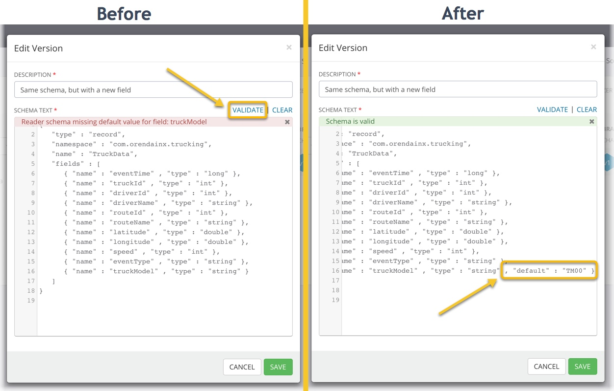

The error message warns us that for a schema to be backward-compatible, any new fields added to a schema should come with a default value.  Let's replace the last field of the schema text with the following, adding a default value.

```text
{ "name" : "truckModel" , "type" : "string" , "default" : "TM00" }
```

Attempt to **Validate** again.  Once everything checks out, **Save** the new version.

## Comparing Different Schema Versions

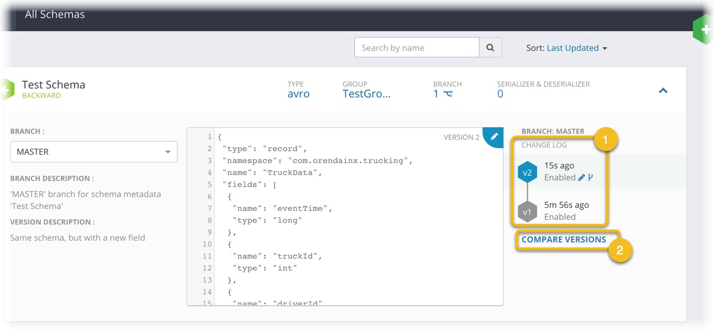

1\. Now that we have added a second, updated, version of our schema, the web interface updates to show us all those that exist.
2\. The Schema Register web interface also allows you to compare any two versions of schemas you have defined.  Click on **Compare Versions** and look around.

## Next: Using the Schema Registry API

Excellent, we just learned how to use Schema Registry's web UI to manage schemas that we can use in our data pipeline.  If you are a developer and are interested in leveraging Schema Registry's API for programmatically registering schemas or marshalling data in code, check out the next section for a sample on using to the Schema Registry's Java API with Scala.


---
title: Using the Java API with Scala
---

# 4.Schema Registry in Trucking IoT on HDF

## Using the Java API with Scala

## Introduction

This is an **optional** section of the Schema Registry tutorial meant for developers interested in leveraging Schema Registry's API.  The API will allow you to programmatically create new schemas, register new schema versions, access a schema's registered serializer/deserializer, and more.

In this tutorial, we'll go over how to programmatically register new schemas using the Schema Registry Java API in the Scala programming language.  We'll also list the necessary dependencies and common endpoint configurations to take note of.

## Prerequisites

- Your favorite IDE set up and ready to go

## Outline

- [Environment Setup](#environment-setup)
- [Dependencies](#dependencies)
- [Schema Text and Configuration](#schema-text-and-configuration)
- [Adding New Schema Metadata](#adding-new-schema-metadata)
- [Registering a New Schema Version](#registering-a-new-schema-version)
- [Running the Application](#running-the-application)
- [Summary](#summary)

## Environment Setup

Download the `schema-registry-with-scala` github project by running the command below.  Then open it with your favorite text editor or IDE.

***UPDATE**
```bash
git clone https://github.com/orendain/schema-registry-with-scala
```

***UPDATE**
~~~text
Alternatively, if you would prefer not to download the code, and simply follow along, you may view this project directly on [GitHub](https://github.com/orendain/schema-registry-with-scala).
~~~

### Dependencies

Open the file `build.sbt`, located in the root of the project.

To use Schema Registry's API, we need to bring in a couple of dependencies, and specify the repository in which they are found.

```scala
// Specify the repository in which we can find the Schema Registry libraries
resolvers += "Hortonworks Nexus" at "http://repo.hortonworks.com/content/repositories/releases"
```

```scala
// Dependencies required for using the Schema Registry API
"com.hortonworks.registries" % "schema-registry-serdes" % "0.3.0.3.0.1.1-5",
"javax.xml.bind" % "jaxb-api" % "2.3.0",
```

## Schema Text and Configuration

Let's take a look at where we save the schema texts for two schemas we will be registering.

`src/main/resources/schema/truck-data.avsc` and `src/main/resources/schema/traffic-data.avsc`

The text for `truck-data.avsc` is pasted below for your convenience.  Recognize this from the previous section on using the interface to register new schemas.  This text defines the fields that make up data of a certain schema.

```scala
{
   "type" : "record",
   "namespace" : "com.orendainx.trucking",
   "name" : "TruckData",
   "fields" : [
      { "name" : "eventTime" , "type" : "long" },
      { "name" : "truckId" , "type" : "int" },
      { "name" : "driverId" , "type" : "int" },
      { "name" : "driverName" , "type" : "string" },
      { "name" : "routeId" , "type" : "int" },
      { "name" : "routeName" , "type" : "string" },
      { "name" : "latitude" , "type" : "double" },
      { "name" : "longitude" , "type" : "double" },
      { "name" : "speed" , "type" : "int" },
      { "name" : "eventType" , "type" : "string" }
   ]
}
```

Open up `src/main/resources/application.conf` and take a look at the properties we specify.

One of the most important tasks is to point to Schema Registry's correct API endpoint, which by default on the HDF sandbox is `http://sandbox-hdf.hortonworks.com:7788/api/v1`.

Notice some of the properties for the two schemas `demo_trucking_data_truck` and `demo_trucking_data_traffic` and recognize some of the fields from the previous exercise.

## Adding New Schema Metadata

Now let's take a look at the code actually doing work with schemas.

Check out `src/main/scala/com/orendainx/trucking/schemaregistry/SchemaRegistrar.scala`.

One of the very first things we do is to instantiate a SchemaRegistryClient, an object that allows us to interact with a remote schema registry.

```scala
private val schemaRegistryClient = new SchemaRegistryClient(clientConfig.asJava)
```

Remember the graphic from an earlier section where each **schema version** was part of a larger **schema metadata**.

Before we can specify what fields a given schema has, we need to create metadata for it.

```scala
// Build a new metadata for a schema using the properties extracted above
val schemaMetadata = new SchemaMetadata.Builder(schemaName)
  .`type`(schemaType).schemaGroup(schemaGroupName)
  .description(schemaDescription)
  .compatibility(schemaTypeCompatibility)
  .build()
```

We continue by registering this metadata with Schema Registry by way of using the client.

```scala
// Register the new schema metadata using an instance of a Schema Registry Client
val metadataRegistrationResult = schemaRegistryClient.registerSchemaMetadata(schemaMetadata)
log.info(s"Schema metadata was registered with ID: $metadataRegistrationResult")
```

## Registering a New Schema Version

Now that we have a metadata created, we can use schema text to create a schema version.

The following block of code will read all of the content from a filepath.

```scala
// Get the filepath where we will find the schema text and read the entire file containing the Avro schema text
val filepath = config.getString("avro.filepath")
val scanner = new Scanner(getClass.getResourceAsStream(filepath)).useDelimiter("\\A")
val avroSchemaContent = if (scanner.hasNext) scanner.next() else ""
```

With this text in hand, we create a `SchemaVersion` object and register it under the schema metadata we created above.

```scala
// Create a SchemaVersion object out of the Avro schema text we read in, then register it to Schema Registry using the client
val schemaVersion = new SchemaVersion(avroSchemaContent, "Initial schema")
val schemaVersionId = schemaRegistryClient.addSchemaVersion(schemaName, schemaVersion)

log.info(s"Schema content: $avroSchemaContent")
log.info(s"Schema version was registered with ID: $schemaVersionId")
```

## Running The Application

Run this SBT application using your preferred method.  If you download this project onto the HDF Sandbox or if your host machine is using a distribution with the Yum package manager, there is a helper script included to run the application for you.

``` scala
./run.sh
```

Once the application runs, you should be able to navigate to the Schema Registry Web UI and see our two new schemas.

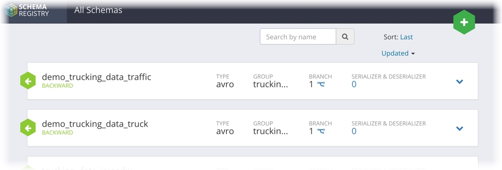

## Summary

We've just successfully built an application leveraging Schema Registry's Java API for creating new schemas!

Efforts for developing Schema Registry are open source.  For more information, check out the GitHub project at: `https://github.com/hortonworks/registry`
