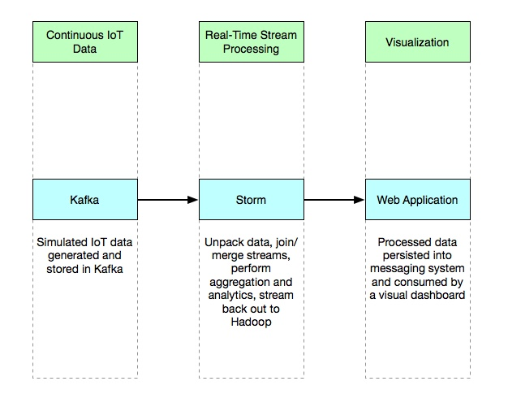
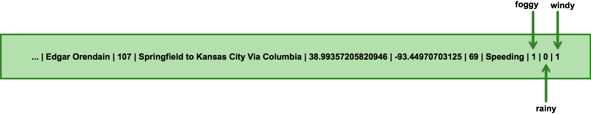
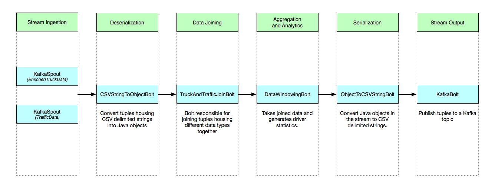
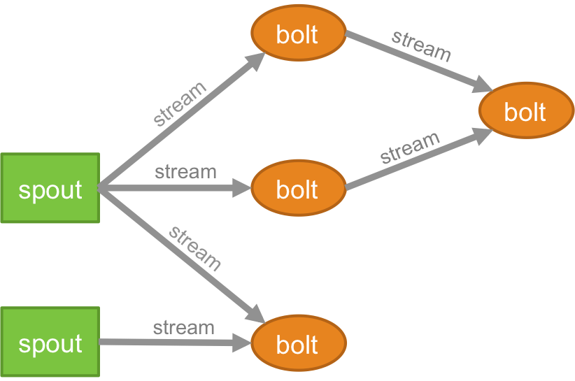

# 0.Storm in Trucking IoT on HDF

## Introduction

This tutorial will cover the core concepts of Storm and the role it plays in an environment where real-time, low-latency and distributed data processing is important.

We will build a Storm topology from the ground up and demonstrate a full data pipeline, from Internet of Things (IoT) data ingestion from the edge, to data processing with Storm, to persisting this data and viewing it in a visualization web application.

## Prerequisites

- Downloaded and deployed the [Hortonworks DataFlow (HDF)](https://www.cloudera.com/downloads/hortonworks-sandbox/hdf.html?utm_source=mktg-tutorial) Sandbox

## Outline

- [Trucking IoT Use Case](https://hortonworks.com/tutorial/storm-in-trucking-iot-on-hdf/section/1/) - Discuss a real-world use case and understand the role Storm plays within in.
- [Running the Demo](https://hortonworks.com/tutorial/storm-in-trucking-iot-on-hdf/section/2/) - Walk through the demo and first gain an understanding of the data pipeline.
- [Building a Storm Topology](https://hortonworks.com/tutorial/storm-in-trucking-iot-on-hdf/section/3/) - Dive into Storm internals and build a topology from scratch.
- [Deploying the Topology](https://hortonworks.com/tutorial/storm-in-trucking-iot-on-hdf/section/4/) - Package the Storm code and deploy onto your cluster.


---
title: Trucking IoT Use Case
---

# 1.Storm in Trucking IoT on HDF

## Trucking IoT Use Case

## Outline

- [The IoT Use Case](#the-iot-use-case)
- [Architectural Overview](#architectural-overview)
- [What is Storm?](#what-is-storm)
- [Benefits of Storm](#benefits-of-storm)
- [Next: Storm in Action](#next-storm-in-action)

## The IoT Use Case

Imagine a trucking company that dispatches trucks across the country.  The trucks are outfitted with sensors that collect data - data like the name of the driver, the route the truck is bound for, the speed of the truck, and even what event recently occurred (speeding, the truck weaving out of its lane, following too closely, etc).  Data like this is generated very often, say once per second and is streamed back to the company's servers.

Additionally, the company is also polling an internet service for information about traffic congestion on the different trucking routes.

The company needs a way to process both of these streams of data and combine them in such a way that data from the truck is combined with the most up-to-date congestion data.  Additionally, they want to run some analysis on the data so that it can make sure trucks are traveling on time but also keeping cargo safe.  Oh, and this also needs to be done in real-time!

Why real-time?  The trucking company benefits by having a system in place that ingests data from multiple sources, correlates these independent sources of data, runs analysis and intelligently reports on important events going on and even actions that the company can do to immediately improve the situation.  This even includes catching imminent truck breakdowns before they occur and analyzing driving habits to predict accidents before the driver gets into one!

Sounds like an important task - this is where Storm comes in.


## Architectural Overview

At a high level, our data pipeline requirement looks like the following.



In the first section, continuous and real-time data from sensors onboard each truck is streamed to the system in real-time by NiFi and published to Kafka topics.  A separate, second, stream carrying traffic congestion information about trucking routes is also streamed into the system and stored in a Kafka topic.

The second section represents the biggest requirement.  We need something capable of: unpacking the compressed and serialized sensor data, merging independent streams together, performing aggregation and analytics, reserializing the transformed data, and sending streams back out for persistence and visualization.  All this should be done in real-time and in distributed fashion while guaranteeing message processing and low-latency.

For these critical tasks we use Apache Storm.

The third section represents this case's post-processing step: visualizing the processed data by a web application.

## What is Storm?

[Apache Storm](https://hortonworks.com/apache/storm) is a free and open source data processing engine.  It can process and act on massive volumes of data in real-time, performing virtually any type of operation or computation as data flows through its components.

Storm exposes a set of components for doing real-time computation. Like how MapReduce greatly eases the writing of parallel batch processing, Storm's components greatly ease the writing of parallel, real-time computation.

Storm can be used for processing messages and updating databases (stream processing), doing a continuous query on data streams and streaming the results into clients (continuous computation), parallelizing an intense query like a search query on the fly (distributed RPC), and more.

## Benefits of Storm

- **Broad set of use cases**:  Storm's small set of primitives satisfy a stunning number of use cases.  From processing messages and updating databases to doing continuous query and computation on datastreams to parallelizing a traditionally resource-intensive job like search queries.
- **Scalable**: Storm scales to handle massive numbers of messages per second.  To scale a topology, one can add machines to the cluster or increase the number of parallel threads spawned by Storm.
- **Guarantee no data loss**: Real-time systems must have strong guarantees about data being processed successfully and not allow data to be lost.  Storm guarantees processing of every message.
- **Robust**: It is an explicit goal of the Storm project to make the user experience of managing Storm clusters as painless as possible.  This is in contract to other systems that are difficult to manage and deploy, especially in secured environments.
- **Fault-tolerant**: Storm makes sure that a computation can run forever, reassigning tasks as necessary if something in the system fails.
- **Development language agnostic**: Storm jobs and components can be defined in any language, making Storm accessible to nearly any developer.

## Next: Storm in Action

Now that we've got a high-level overview of what our use case looks like, let's move on to seeing this use case and our solution in an actual running demo application.


---
title: Running the Demo
---

# 2.Storm in Trucking IoT on HDF

## Running the Demo

## Introduction

Let's walk through the demo and get an understanding for the data pipeline before we dive deeper into Storm internals.


## Outline

- [Environment Setup](#environment-setup)
- [Generate Sensor Data](#generate-sensor-data)
- [Deploy the Storm Topology](#deploy-the-storm-topology)
- [Verify the Processed Data](#verify-the-processed-data)
- [Next: Building a Storm Topology](#next-building-a-storm-topology)

## Environment Setup

SSH into your Hortonworks DataFlow (HDF) environment and download the corresponding demo project.

```bash
git clone https://github.com/orendain/trucking-iot-demo-storm-on-scala
cd trucking-iot-demo-storm-on-scala
```

## Generate Sensor Data

The demo application leverages a very robust data simulator, which generates data of two types and publishes them to Kafka topics as a CSV string.

`EnrichedTruckData`: Data simulated by sensors onboard each truck.  For the purposes of this demo, this data has been pre-enriched with data from a weather service.

```scala
1488767711734|26|1|Edgar Orendain|107|Springfield to Kansas City Via Columbia|38.95940879245423|-92.21923828125|65|Speeding|1|0|1|60
```



`TrafficData`: Data simulated from an online traffic service, which reports on traffic congestion on any particular trucking route.

```scala
1488767711734|107|60
```


Start the data generator by executing the appropriate script:

```scala
scripts/run-simulator.sh
```

Let's wait for the simulator to finish generating data.  Once that's done, we can look at the data that was generated and stored in Kafka:

> Note: "Ctrl + c" to exit out from the Kafka command.

```bash
/usr/hdf/current/kafka-broker/bin/kafka-console-consumer.sh --bootstrap-server sandbox-hdf.hortonworks.com:6667 --from-beginning --topic trucking_data_truck_enriched
```

and

```bash
/usr/hdf/current/kafka-broker/bin/kafka-console-consumer.sh --bootstrap-server sandbox-hdf.hortonworks.com:6667 --from-beginning --topic trucking_data_traffic
```

## Deploy the Storm Topology

With simulated data now being pumped into Kafka topics, we power up Storm and process this data.  In a separate terminal window, run the following command:

```bash
scripts/deploy-prebuilt-topology.sh
```

> Note: We'll cover what exactly a "topology" is in the next section.

Here is a slightly more in-depth look at the steps Storm is taking in processing and transforming the two types of simulated data from above.



## Verify the Processed Data

With the data now fully processed by Storm and published back into accessible Kafka topics, it's time to verify our handiwork.  Run the following command to list the joined set of data.

```bash
/usr/hdf/current/kafka-broker/bin/kafka-console-consumer.sh --bootstrap-server sandbox-hdf.hortonworks.com:6667 --from-beginning --topic trucking_data_joined
```

Nice!  Our topology joined data from two separate streams of data.

## Next: Building a Storm Topology

Now that we know how Storm fits into this data pipeline and what type of work it is performing, let's dive into the actual code and see exactly how it is built.


---
title: Building a Storm Topology
---

# 3.Storm in Trucking IoT on HDF

## Building a Storm Topology

## Introduction

We now know the role that Storm plays in this Trucking IoT system.  Let's dive into the code and dissect what the code is doing and also learn how to build this topology.

## Outline

- [Storm Components](#storm-components)
- [Environment Setup](#environment-setup)
- [Topology Build and Submit Overview](#topology-build-and-submit-overview)
- [Starting to Build a Storm Topology](#starting-to-build-a-storm-topology)
- [Building a Kafka Spout](#building-a-kafka-spout)
- [Building a Custom Bolt](#building-a-custom-bolt)
- [Building a Tumbling Windowed Bolt](#building-a-tumbling-windowed-bolt)
- [Building a Sliding Windowed Bolt](#building-a-sliding-windowed-bolt)
- [Building Another Custom Bolt](#building-another-custom-bolt)
- [Building a Kafka Bolt](#building-a-kafka-bolt)
- [Creating the Topology](#creating-the-topology)
- [Next: Deploying the Storm topology](#next-deploying-the-storm-topology)

## Storm Components

Now that we have a general idea of the power of Storm, let's look at its different components, our building blocks when defining a Storm process, and what they're used for.

- **Tuple**: A list of values.  The main data structure in Storm.
- **Stream**: An unbounded sequence of tuples.
- **Spout**: A source of streams.  Spouts will read tuples in from an external source and emit them into streams for the rest of the system to process.
- **Bolt**: Processes the tuples from an input stream and produces an output stream of results.  This process is also called stream transformation.  Bolts can do filtering, run custom functions, aggregations, joins, database operations, and much more.
- **Topology**: A network of spouts and bolts that are connected together by streams.  In other words, the overall process for Storm to perform.



## Environment Setup

We will be working with the `trucking-iot-demo-storm-on-scala` project that you downloaded in previous sections.  Feel free to download the project again on your local environment so you can open it with your favorite text editor or IDE.

```bash
git clone https://github.com/orendain/trucking-iot-demo-storm-on-scala
```

> Alternatively, if you would prefer not to download the code, and simply follow along, you may view this project directly on [GitHub](https://github.com/orendain/trucking-iot-demo-storm-on-scala/tree/master/src/main/scala/com/orendainx/trucking/storm).

## Topology Build and Submit Overview

Look inside the `KafkaToKafka.scala` class and you'll find a companion object with our standard entry point, `main`, and a `KafkaToKafka` class with a method named `buildTopology` which handles the building of our Storm topology.

The primary purpose of our `main` method is to configure and build our topology and then submit it for deployment onto our cluster.  Let's take a closer look at what's inside:

```scala
// Set up configuration for the Storm Topology
val stormConfig = new Config()
stormConfig.setDebug(config.getBoolean(Config.TOPOLOGY_DEBUG))
stormConfig.setMessageTimeoutSecs(config.getInt(Config.TOPOLOGY_MESSAGE_TIMEOUT_SECS))
stormConfig.setNumWorkers(config.getInt(Config.TOPOLOGY_WORKERS))
```

The `org.apache.storm.Config` class provides a convenient way to create a topology config by providing setter methods for all the configs that can be set.  It also makes it easier to do things like add serializations.

Following the creation of a Config instance, our `main` method continues with:

```scala
// Build and submit the Storm config and topology
val topology = new KafkaToKafka(config).buildTopology()
StormSubmitter.submitTopologyWithProgressBar("KafkaToKafka", stormConfig, topology)
```

Here, we invoke the `buildTopology` method of our class, which is responsible for building a StormTopology.  With the topology that is returned, we use the `StormSubmitter` class to submit topologies to run on the Storm cluster.

## Starting to Build a Storm Topology

Let's dive into the `buildTopology` method to see exactly how to build a topology from the ground up.

```scala
// Builder to perform the construction of the topology.
implicit val builder = new TopologyBuilder()
```

We start by creating an instance of `TopologyBuilder`, which exposes an easy-to-use Java API for putting together a topology.  Next, we pull in some values from our configuration file (`application.conf`).

## Building a Kafka Spout

```scala
/* Construct a record translator that defines how to extract and turn a Kafka ConsumerRecord into a list of objects to be emitted
 */
lazy val truckRecordTranslator = new Func[ConsumerRecord[String, String], java.util.List[AnyRef]] {
  def apply(record: ConsumerRecord[String, String]) = new Values("EnrichedTruckData", record.value())
}

/* In order, the following snippet of code does the following:
 *
 * Configure a KafkaSpout to connect to a particular set of bootstrap servers, naming the spout "trucking_data_traffic"
 *
 * Set the record translator to the one defined above.  The two values that the record translator outputs we are naming "dataType" and "data", respectively.
 *
 * Configure the spout to poll the Kafka topic starting from the earliest (i.e. oldest) possible data available.  In other words, ingests the entire Kafka topic.
 *
 * Set the groupID to the character "g"
 *
 * Build the KafkaSpoutConfig object following these configurations.
 */
val truckSpoutConfig: KafkaSpoutConfig[String, String] = KafkaSpoutConfig.builder(config.getString("kafka.bootstrap-servers"), "trucking_data_truck_enriched")
  .setRecordTranslator(truckRecordTranslator, new Fields("dataType", "data"))
  .setFirstPollOffsetStrategy(KafkaSpoutConfig.FirstPollOffsetStrategy.EARLIEST)
  .setGroupId("g")
  .build()
```

In order to build a `KafkaSpout`, we first need to decide what Kafka topic will be read from, where it exists, and exactly how we want to ingest that data in our topology.  This is where the above `KafkaSpoutConfig` comes in handy.

Now that we have a KafkaSpoutConfig, we use it to build a KafkaSpout and place it in the topology.

```scala
// Create a spout with the specified configuration, with only 1 instance of this bolt running in parallel, and place it in the topology blueprint
builder.setSpout("enrichedTruckData", new KafkaSpout(truckSpoutConfig), 1)
```

Remember that `builder` refers to the `TopologyBuilder`.  We're creating a new `KafkaSpout` with a parallelism_hint of `1` (how many tasks, or instances, of the component to run on the cluster).  We place the spout in the topology blueprint with the name "enrichedTruckData".

## Building a Custom Bolt

Great, we now have a way to ingest our CSV-delimited strings from Kafka topics and into our Storm topology.  We now need a way to unpackage these strings into Java objects so we can more easily interact with them.

Let's go ahead and build a custom Storm Bolt for this purpose.  We'll call it `CSVStringToObjectBolt`.  But first, let's see how this new custom bolt will fit into our topology blueprint.

```scala
/* Build a bolt for creating JVM objects from the ingested strings
 *
 * Our custom bolt, CSVStringToObjectBolt, is given the bolt id of "unpackagedData".  Storm is told to assign only
 * a single task for this bolt (i.e. create only 1 instance of this bolt in the cluster).
 *
 * ShuffleGrouping shuffles data flowing in from the specified spouts evenly across all instances of the newly
 * created bolt (which is only 1 in this example)
 */
builder.setBolt("unpackagedData", new CSVStringToObjectBolt(), 1)
  .shuffleGrouping("enrichedTruckData")
  .shuffleGrouping("trafficData")
```

We create a new CSVStringToObjectBolt bolt, and tell Storm to assign only a single task for this bolt (i.e. create only 1 instance of this bolt in the cluster).  We name it "unpackagedData".

`ShuffleGrouping` shuffles data flowing in from the specified spouts evenly across all instances of the newly created bolt.

Let's dig in and see how we create this bolt from scratch: check out the `CSVStringToObjectBolt.java` file.

```scala
class CSVStringToObjectBolt extends BaseRichBolt {
```

Rather than creating a Storm bolt __entirely__ from scratch, we leverage one of Storm's base classes and simply extend `BaseRichBolt`.  BaseRichBolt takes care of a lot of the lower-level implementation for us.

```scala
private var outputCollector: OutputCollector = _

override def prepare(stormConf: util.Map[_, _], context: TopologyContext, collector: OutputCollector): Unit = {
  outputCollector = collector
}
```

The prepare method provides the bolt with an OutputCollector that is used for emitting tuples from this bolt. Tuples can be emitted at anytime from the bolt -- in the prepare, execute, or cleanup methods, or even asynchronously in another thread. This prepare implementation simply saves the OutputCollector as an instance variable to be used later on in the execute method.

```scala
override def execute(tuple: Tuple): Unit = {
  // Convert each string into its proper case class instance (e.g. EnrichedTruckData or TrafficData)
  val (dataType, data) = tuple.getStringByField("dataType") match {
    case typ @ "EnrichedTruckData" => (typ, EnrichedTruckData.fromCSV(tuple.getStringByField("data")))
    case typ @ "TrafficData" => (typ, TrafficData.fromCSV(tuple.getStringByField("data")))
  }

  outputCollector.emit(new Values(dataType, data))
  outputCollector.ack(tuple)
}
```

The `execute` method receives a tuple from one of the bolt's inputs.  For each tuple that this bolt processes, the `execute` method is called.

We start by extracting the value of the tuple stored under the name "dataType", which we know is either "EnrichedTruckData" or "TrafficData".  Depending on which it is, we call the `fromCSV` method of the appropriate object, which returns a JVM object based on this CSV string.

Next, we use the `outputCollector` to emit a Tuple onto this bolt's outbound stream.
Finally, we `ack` (acknowledge) that the bolt has processed this tuple.  This is part of Storm's reliability API for guaranteeing no data loss.

The last method in this bolt is a short one:
```scala
override def declareOutputFields(declarer: OutputFieldsDeclarer): Unit = declarer.declare(new Fields("dataType", "data"))
```

The declareOutputFields method declares that this bolt emits 2-tuples with fields called "dataType" and "data".

That's it!  We've just seen how to build a custom Storm bolt from scratch.

## Building a Tumbling Windowed Bolt

Let's get back to our KafkaToKafka class and look at what other components we're adding downstream of the CSVStringToObjectBolt.

We now have KafkaSpouts ingesting in CSV strings from Kafka topics and a bolt that creating Java objects from these CSV strings.  The next step in our process is to join these two types of Java objects into one.

```scala
 /* Create a tumbling windowed bolt using our custom TruckAndTrafficJoinBolt, which houses the logic for how to
  * merge the different Tuples.
  *
  * A tumbling window with a duration means the stream of incoming Tuples are partitioned based on the time
  * they were processed (think of a traffic light, allowing all vehicles to pass but only the ones that get there
  * by the time the light turns red).  All tuples that made it within the window are then processed all at once
  * in the TruckAndTrafficJoinBolt.
  */
 val joinBolt = new TruckAndTrafficJoinBolt().withTumblingWindow(new BaseWindowedBolt.Duration(20, SECONDS))

 // GlobalGrouping suggests all data from "unpackagedData" component go to a single one of the bolt's tasks
 builder.setBolt("joinedData", joinBolt, 1).globalGrouping("unpackagedData")
```

Here, we create a tumbling windowed bolt using our custom TruckAndTrafficJoinBolt, which houses the logic for how to merge the different Tuples.  This bolt processes both `EnrichedTruckData` and `TrafficData` and joins them to emit instances of `EnrichedTruckAndTrafficData`.

A tumbling window with a duration means the stream of incoming Tuples are partitioned based on the time they were processed.  Think of a traffic light, allowing all vehicles to pass but only the ones that get there by the time the light turns red.  All tuples that made it within the window are then processed all at once in the TruckAndTrafficJoinBolt.

We'll take a look at how to build a custom windowed bolt in the next section.

## Building a Sliding Windowed Bolt

Now that we have successfully joined data coming in from two streams, let's perform some windowed analytics on this data.

```scala
/*
 * Build a bolt to generate driver stats from the Tuples in the stream.
 */

/* Creates a sliding windowed bolt using our custom DataWindowindBolt, which is responsible for reducing a list
 * of recent Tuples(data) for a particular driver into a single datatype.  This data is used for machine learning.
 *
 * This sliding windowed bolt with a tuple count of 10 means we always process the last 10 tuples in the
 * specified bolt.  The window slides over by one, dropping the oldest, every time a new tuple is processed.
 */
val statsBolt = new DataWindowingBolt().withWindow(new BaseWindowedBolt.Count(10))
```

Creates a sliding windowed bolt using our custom DataWindowingBolt, which is responsible for reducing a list of recent Tuples(data) for a particular driver into a single datatype.  This data is used for machine learning.

This sliding windowed bolt with a tuple count as a length means we always process the last 'N' tuples in the specified bolt.  The window slides over by one, dropping the oldest, each time a new tuple is processed.

The next step is to build a bolt and then place in the topology blueprint connected to the "joinedData" stream.

```scala
builder.setBolt("windowedDriverStats", statsBolt, 1).shuffleGrouping("joinedData")
```

## Building Another Custom Bolt

Before we push our Storm-processed data back out to Kafka, we want to serialize the Java objects we've been working with into string form.

```scala
/* Build bolts to serialize data into a CSV string.
 *
 * The first bolt ingests tuples from the "joinedData" bolt, which streams instances of EnrichedTruckAndTrafficData.
 * The second bolt ingests tuples from the "joinedData" bolt, which streams instances of WindowedDriverStats.
 */
builder.setBolt("serializedJoinedData", new ObjectToCSVStringBolt()).shuffleGrouping("joinedData")
builder.setBolt("serializedDriverStats", new ObjectToCSVStringBolt()).shuffleGrouping("windowedDriverStats")
```

These bolts, `ObjectToCSVStringBolt` are inverse to our previous custom bolt, `CSVStringToObjectBolt`.  They expect tuples with Java objects and emit a CSV string representation of them.  Check out the source code if you're interested in their inner-workings.

Now, we have two streams emitting string data: "serializedJoinedData" which is the result of the two joined streams, and "serializedDriverStats", which is the result of windowed analytics we performed.

## Building a Kafka Bolt

We now build KafkaBolts to push data from these streams into Kafka topics.  We start by defining some Kafka properties:

```scala
val kafkaBoltProps = new Properties()
kafkaBoltProps.setProperty(ProducerConfig.BOOTSTRAP_SERVERS_CONFIG, config.getString("kafka.bootstrap-servers"))
kafkaBoltProps.setProperty(ProducerConfig.KEY_SERIALIZER_CLASS_CONFIG, config.getString("kafka.key-serializer"))
kafkaBoltProps.setProperty(ProducerConfig.VALUE_SERIALIZER_CLASS_CONFIG, config.getString("kafka.value-serializer"))
```

Next, we build a KafkaBolt:

```scala
val truckingKafkaBolt = new KafkaBolt()
  .withTopicSelector(new DefaultTopicSelector("trucking_data_joined"))
  .withTupleToKafkaMapper(new FieldNameBasedTupleToKafkaMapper("key", "data"))
  .withProducerProperties(kafkaBoltProps)
```

`withTopicSelector` specifies the Kafka topic to drop entries into.

`withTupleToKafkaMapper` is passed an instance of `FieldNameBasedTupleToKafkaMapper`, which tells the bolt which fields of a Tuple the data to pass in is stored as.

`withProducerProperties` takes in properties to set itself up with.

Finally, we drop this bolt into the rest of the topology.

```scala
builder.setBolt("joinedDataToKafka", truckingKafkaBolt, 1).shuffleGrouping("serializedJoinedData")
```

## Creating the Topology

Now that we have specified the entire Storm topology by adding components into our `TopologyBuilder`, we create an actual topology using the builder's blueprint and return it.

```scala
// Now that the entire topology blueprint has been built, we create an actual topology from it
builder.createTopology()
```

## Next: Deploying the Storm topology

Phew!  We've now learned about how a Storm topology is developed.  In the next section, we'll package this project up into a portable JAR file and run a quick command that will deploy this code onto a cluster.


---
title: Deploying the Topology
---

# 4.Storm in Trucking IoT on HDF

## Deploying the Topology

## Introduction

Now that we know how to develop a Storm topology, let's go over how to package it up into a JAR file and deploy it onto a cluster.

## Outline

- [Packaging a JAR](#packaging-a-jar)
- [Deploying to Storm](#deploying-to-storm)
- [Summary](#summary)

## Packaging a JAR

In a terminal, navigate to the trucking-iot-demo-storm-on-scala directory and run:

```scala
scripts/rebuild-and-deploy-topology.sh
```

After installing some dependencies, this script runs the command `sbt assembly` under the hood in order to produce an **uber jar**, housing your topology and all of the dependencies.  The jar is saved to `target/scala-2.12/trucking-iot-demo-storm-on-scala-assembly-1.1.0.jar`.

## Deploying to Storm

If you ran the command in the previous section, then the topology was build **and then also deployed**.

```scala
scripts/rebuild-and-deploy-topology.sh
```

Feel free to open that script to see what it is doing.  Notice that under the hood, it runs a command that looks like the following.

```scala
storm jar trucking-iot-demo-storm-on-scala/target/scala-2.12/trucking-iot-demo-storm-on-scala-assembly-1.1.0.jar com.orendainx.trucking.storm.topologies.KafkaToKafka
```

`storm` will submit the jar to the cluster.  After uploading the jar, `storm` calls the main function of the class we specified (_com.orendainx.trucking.storm.topologies.KafkaToKafka_), which deploys the topology by way of the `StormSubmitter` class.

## Summary

Congratulations!  You now know about the role that Storm plays in a real-time data pipeline and how to create and deploy a topology from scratch.
